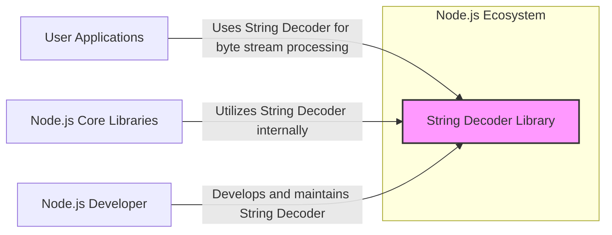
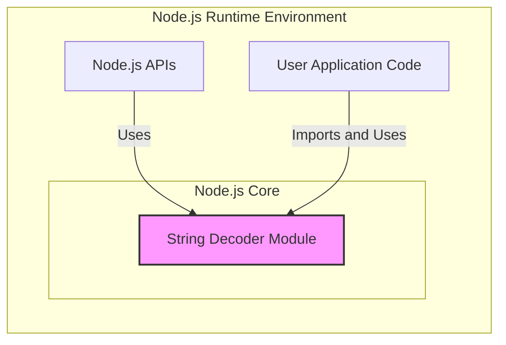
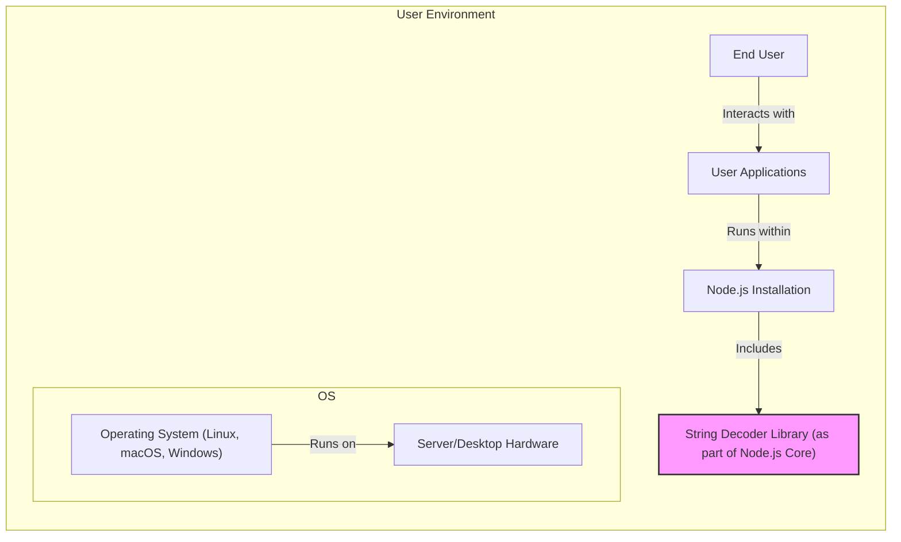
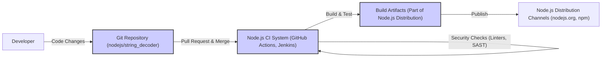

# BUSINESS POSTURE

- Business Priorities and Goals:
 - The primary business priority is to provide a reliable and performant string decoding utility for Node.js applications.
 - The goal is to ensure accurate and efficient conversion of byte streams into strings, supporting various character encodings.
 - This library is a fundamental building block for Node.js, contributing to the overall stability and functionality of the Node.js ecosystem.

- Business Risks:
 - Incorrect string decoding could lead to data corruption or misinterpretation in applications relying on this library.
 - Performance bottlenecks in string decoding could negatively impact the performance of Node.js applications.
 - Security vulnerabilities in the decoding process, although less likely in this specific library, could potentially be exploited if not handled correctly (e.g., denial of service through malformed input).
 - Dependency on this library means any issues here can have a wide impact on the Node.js ecosystem.

# SECURITY POSTURE

- Existing Security Controls:
 - security control: Code review process within the Node.js project. (Implemented in: GitHub repository pull request review process)
 - security control: Unit and integration testing. (Implemented in: Test suite within the repository)
 - security control: Static analysis and linters as part of Node.js project's development practices. (Implemented in: Node.js project's CI/CD pipeline, though specific tools are not detailed in this repository)
 - accepted risk: Limited dedicated security testing specifically for this small utility library, relying on broader Node.js security practices.

- Recommended Security Controls:
 - security control: Dependency scanning to ensure no vulnerable dependencies are introduced (though this library likely has minimal dependencies).
 - security control: Fuzz testing to identify potential edge cases and vulnerabilities in the decoding logic.
 - security control: Regular updates to address any newly discovered vulnerabilities or performance issues.

- Security Requirements:
 - Authentication: Not applicable for this library as it is a utility library and does not handle authentication directly. Authentication is handled by applications using this library.
 - Authorization: Not applicable for this library as it is a utility library and does not handle authorization directly. Authorization is handled by applications using this library.
 - Input Validation:
  - The library must handle various types of byte stream inputs gracefully, including potentially malformed or unexpected inputs.
  - Validation should be performed to ensure the input encoding is supported and the byte stream is within expected limits to prevent potential denial-of-service attacks.
 - Cryptography: Not directly applicable for this library as it is focused on string decoding, not encryption or decryption. However, it's important to ensure that the decoding process itself does not introduce any vulnerabilities that could be exploited in cryptographic contexts if the decoded strings are used in such operations later in the application.

# DESIGN

## C4 CONTEXT

- C4 Context Elements:
 - - Name: String Decoder Library
   - Type: Software System
   - Description: A Node.js core library responsible for decoding byte streams into strings, supporting various character encodings.
   - Responsibilities:
    - Accurately decode byte streams into strings based on specified or detected encoding.
    - Handle different character encodings (e.g., UTF-8, ASCII, Latin-1).
    - Provide a streaming interface for efficient decoding of large byte streams.
   - Security controls:
    - Input validation to handle malformed or unexpected byte streams.
    - Code review and testing to ensure correct decoding logic and prevent vulnerabilities.

 - - Name: User Applications
   - Type: Software System
   - Description: Node.js applications developed by users that rely on the String Decoder library to process text data from various sources (e.g., network requests, file systems).
   - Responsibilities:
    - Utilize the String Decoder library to convert byte streams into strings for processing and display.
    - Handle different character encodings based on application requirements.
    - Ensure proper error handling when dealing with potentially invalid or unsupported encodings.
   - Security controls:
    - Application-level input validation and sanitization of decoded strings.
    - Secure handling of text data within the application logic.

 - - Name: Node.js Core Libraries
   - Type: Software System
   - Description: Other core Node.js libraries that internally use the String Decoder library for text processing tasks.
   - Responsibilities:
    - Leverage the String Decoder library for consistent and reliable string decoding within Node.js core functionalities.
    - Ensure compatibility and proper integration with the String Decoder library.
   - Security controls:
    - Internal security controls within Node.js core development processes.
    - Reliance on the security and stability of the String Decoder library.

 - - Name: Node.js Developer
   - Type: Person
   - Description: Developers who contribute to the Node.js project, including the String Decoder library, through code contributions, bug fixes, and maintenance.
   - Responsibilities:
    - Develop, maintain, and improve the String Decoder library.
    - Address bug reports and security vulnerabilities.
    - Ensure the library meets the needs of the Node.js community.
   - Security controls:
    - Secure coding practices.
    - Code review process.
    - Adherence to Node.js security guidelines.

## C4 CONTAINER

- C4 Container Elements:
 - - Name: String Decoder Module
   - Type: Library/Module
   - Description:  A JavaScript module within the Node.js core libraries that provides the functionality for decoding byte streams into strings. It is implemented in JavaScript and potentially leverages native Node.js APIs for performance.
   - Responsibilities:
    - Implement the core logic for string decoding algorithms.
    - Expose APIs for Node.js core libraries and user applications to utilize string decoding functionality.
    - Manage different encoding types and handle encoding conversions.
   - Security controls:
    - Input validation within the module's functions.
    - Memory safety considerations in the decoding implementation.
    - Regular security audits and code reviews of the module.

 - - Name: Node.js APIs
   - Type: Runtime Environment APIs
   - Description:  Node.js built-in APIs (e.g., `Buffer`, `stream`) that may use the String Decoder module internally for handling string encoding and decoding.
   - Responsibilities:
    - Provide higher-level abstractions for I/O operations and data manipulation that rely on string decoding.
    - Ensure seamless integration with the String Decoder module.
   - Security controls:
    - Security controls inherent in the Node.js runtime environment.
    - Proper usage of the String Decoder module's APIs.

 - - Name: User Application Code
   - Type: Application Code
   - Description: JavaScript code written by Node.js application developers that imports and uses the String Decoder module directly or indirectly through other Node.js APIs.
   - Responsibilities:
    - Utilize the String Decoder module to process byte streams in user applications.
    - Handle encoding considerations in application logic.
   - Security controls:
    - Application-level security controls, including input validation and secure data handling.
    - Proper usage of the String Decoder module's APIs to avoid misuse or vulnerabilities.

## DEPLOYMENT

- Deployment Options:
 - Option 1: Included within Node.js Runtime Distribution (Standard Deployment) - The String Decoder library is distributed as part of the standard Node.js runtime environment. Users install Node.js, and the library is readily available.
 - Option 2: Bundled with User Applications (Less Common) - In some scenarios, a user application might bundle a specific version of the String Decoder library, although this is less common as it is a core Node.js module.

- Detailed Deployment (Option 1: Included within Node.js Runtime Distribution):

- Deployment Elements:
 - - Name: String Decoder Library (as part of Node.js Core)
   - Type: Software Library
   - Description: The String Decoder library is deployed as an integral part of the Node.js runtime environment. It resides within the Node.js installation directory and is loaded into memory when Node.js applications are executed.
   - Responsibilities:
    - Provide string decoding functionality within the Node.js runtime environment.
    - Be readily available for use by Node.js core libraries and user applications.
   - Security controls:
    - Security is managed through the Node.js runtime environment's security posture.
    - Updates and patches to the String Decoder library are distributed as part of Node.js updates.

 - - Name: Node.js Installation
   - Type: Software Runtime Environment
   - Description: The complete Node.js runtime environment installed on a user's operating system. It includes the JavaScript engine (V8), core libraries (including String Decoder), and npm package manager.
   - Responsibilities:
    - Execute Node.js applications.
    - Provide the runtime environment for Node.js core libraries and user applications.
    - Manage dependencies and modules.
   - Security controls:
    - Operating system-level security controls.
    - Node.js security updates and patches.
    - Permissions and access controls for the Node.js installation directory.

 - - Name: Operating System (Linux, macOS, Windows)
   - Type: Operating System
   - Description: The underlying operating system on which Node.js is installed and runs.
   - Responsibilities:
    - Provide system-level resources and services for Node.js.
    - Manage hardware resources.
    - Enforce operating system-level security policies.
   - Security controls:
    - Operating system-level security features (firewall, user permissions, etc.).
    - Regular OS security updates and patches.

 - - Name: Server/Desktop Hardware
   - Type: Hardware
   - Description: The physical or virtual hardware infrastructure on which the operating system and Node.js are running.
   - Responsibilities:
    - Provide computing resources for Node.js and applications.
    - Ensure hardware security and availability.
   - Security controls:
    - Physical security of the hardware.
    - Hardware-level security features (BIOS security, etc.).

 - - Name: User Applications
   - Type: Software Application
   - Description: Node.js applications deployed and running within the Node.js runtime environment.
   - Responsibilities:
    - Provide specific functionalities to end users.
    - Utilize Node.js and its core libraries, including String Decoder.
   - Security controls:
    - Application-level security controls.
    - Input validation, authorization, authentication within the application.

 - - Name: End User
   - Type: Person
   - Description: Users who interact with the Node.js applications.
   - Responsibilities:
    - Use the applications for their intended purpose.
   - Security controls:
    - User authentication and authorization within applications.
    - User awareness of security best practices.

## BUILD

- Build Elements:
 - - Name: Git Repository (nodejs/string_decoder)
   - Type: Source Code Repository
   - Description: The GitHub repository where the source code for the String Decoder library is hosted and version controlled.
   - Responsibilities:
    - Store and manage the source code of the String Decoder library.
    - Track changes and facilitate collaboration among developers.
   - Security controls:
    - Access control to the repository (who can commit, merge, etc.).
    - Branch protection policies.
    - Audit logs of repository activities.

 - - Name: Node.js CI System (GitHub Actions, Jenkins)
   - Type: Continuous Integration System
   - Description: The automated CI system used by the Node.js project to build, test, and perform security checks on code changes to the String Decoder library. This likely includes GitHub Actions and potentially other systems like Jenkins.
   - Responsibilities:
    - Automate the build process for the String Decoder library.
    - Run unit and integration tests.
    - Perform static analysis and security scans (linters, SAST).
    - Generate build artifacts.
   - Security controls:
    - Secure configuration of the CI pipeline.
    - Access control to the CI system.
    - Security scanning tools integrated into the pipeline.
    - Supply chain security measures for build dependencies.

 - - Name: Build Artifacts (Part of Node.js Distribution)
   - Type: Software Artifacts
   - Description: The compiled and packaged output of the build process, which includes the String Decoder library as part of the larger Node.js distribution.
   - Responsibilities:
    - Represent the distributable form of the String Decoder library.
    - Be included in Node.js releases.
   - Security controls:
    - Integrity checks (checksums, signatures) for build artifacts.
    - Secure storage and distribution of artifacts.

 - - Name: Node.js Distribution Channels (nodejs.org, npm)
   - Type: Distribution Platform
   - Description: The channels through which Node.js, including the String Decoder library, is distributed to end users (e.g., the official Node.js website, npm registry).
   - Responsibilities:
    - Make Node.js releases available to the public.
    - Ensure the integrity and authenticity of distributed packages.
   - Security controls:
    - Secure distribution infrastructure.
    - Signing of releases to verify authenticity.
    - Vulnerability scanning and response for published packages.

 - - Name: Developer
   - Type: Person
   - Description: Developers contributing code changes to the String Decoder library.
   - Responsibilities:
    - Write and test code for the String Decoder library.
    - Submit code changes through pull requests.
    - Participate in code reviews.
   - Security controls:
    - Secure development practices.
    - Authentication and authorization for accessing the Git repository and CI system.

# RISK ASSESSMENT

- Critical Business Processes:
 - Core functionality of Node.js applications that rely on string processing and text manipulation.
 - Handling of text-based data in network communication, file I/O, and user interfaces within Node.js applications.
 - Correct interpretation of text data across different character encodings in the Node.js ecosystem.

- Data to Protect and Sensitivity:
 - Data being processed by the String Decoder library is primarily text data represented as byte streams.
 - Sensitivity of the data depends on the context of the application using the library. It can range from publicly available text to sensitive personal or financial information if the application processes such data.
 - The integrity and correctness of the decoded text data are crucial to maintain the functionality and security of applications. Incorrect decoding could lead to data corruption or misinterpretation, potentially causing security vulnerabilities or application errors.

# QUESTIONS & ASSUMPTIONS

- BUSINESS POSTURE:
 - Assumption: The primary business goal is to maintain the stability and reliability of the Node.js platform.
 - Question: Are there specific performance benchmarks or SLAs for string decoding within Node.js that this library must adhere to?

- SECURITY POSTURE:
 - Assumption: Security is a high priority for the Node.js project, and core libraries like String Decoder benefit from the overall Node.js security practices.
 - Question: Are there specific security testing procedures (e.g., fuzzing, penetration testing) regularly performed on Node.js core libraries, including String Decoder?
 - Question: What are the specific static analysis and dependency scanning tools used in the Node.js CI pipeline?

- DESIGN:
 - Assumption: The design of String Decoder is relatively simple and focused on efficient string decoding algorithms.
 - Question: Are there any plans to extend the functionality of String Decoder to support new character encodings or decoding features?
 - Question: What are the performance considerations that drove the current design choices in String Decoder?
 - Assumption: Deployment is standard as part of Node.js distribution.
 - Question: Are there any specific deployment considerations or variations for String Decoder beyond the standard Node.js distribution?
 - Assumption: Build process is integrated into Node.js CI.
 - Question: Are there specific security measures in place to protect the build pipeline for Node.js core libraries from supply chain attacks?