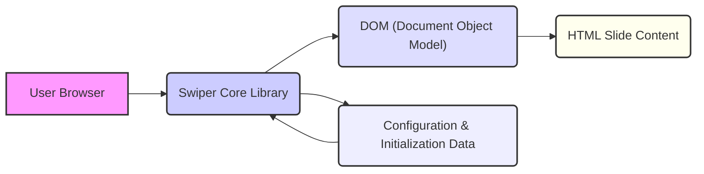
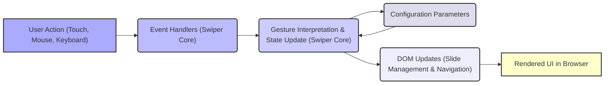

# Project Design Document: Swiper - The Most Modern Mobile Touch Slider

**Version:** 1.1
**Date:** October 26, 2023
**Author:** AI Software Architect

## 1. Introduction

This document provides a refined design overview of the Swiper library (as represented by the GitHub repository: [https://github.com/nolimits4web/swiper](https://github.com/nolimits4web/swiper)). It details the system's architecture, core components, data flow, and crucial security considerations, specifically tailored for subsequent threat modeling activities.

## 2. Goals and Objectives

The primary goal of Swiper is to deliver a high-performance, accessible, and extensively customizable touch slider component for modern web applications. Key objectives include:

* **Fluid Touch Interactions:**  Providing smooth and responsive touch gesture handling for intuitive navigation.
* **Broad Compatibility:** Ensuring consistent functionality across a wide range of modern web browsers and devices.
* **Extensive Customization:** Offering a rich set of configuration options to precisely tailor the slider's behavior and visual presentation.
* **Accessibility Compliance:** Adhering to established accessibility standards to guarantee usability for all users, including those with disabilities.
* **Modular Design:** Enabling developers to import and utilize only the specific modules required for their implementation, reducing bundle size.
* **Optimized Performance:** Minimizing resource consumption and ensuring smooth, jank-free animations, even on less powerful devices.

## 3. Scope

This design document specifically focuses on the client-side JavaScript library and its direct interactions within a web browser environment. The scope explicitly excludes:

* Server-side logic, backend integrations, or data persistence mechanisms.
* Implementations within specific front-end frameworks (e.g., React, Vue, Angular), although Swiper provides dedicated integration layers for these.
* The internal development, build processes, and testing methodologies of the Swiper library itself.

## 4. High-Level Architecture

Swiper operates entirely within the user's web browser. It leverages JavaScript to interact with the Document Object Model (DOM), dynamically manipulating and animating HTML elements based on user input and the defined configuration.

**Components:**

* **User Browser:** The client-side environment where the Swiper library is executed, interpreting JavaScript code and rendering HTML and CSS.
* **Swiper Core Library:** The central JavaScript codebase responsible for managing slider state, handling touch events and other user interactions, and orchestrating DOM updates.
* **DOM (Document Object Model):** The browser's representation of the HTML structure of the web page, which Swiper directly manipulates to display and animate the slider.
* **Configuration & Initialization Data:** The set of parameters and initial settings provided by the developer to customize Swiper's behavior and appearance upon initialization.
* **HTML Slide Content:** The actual HTML elements (images, text, videos, etc.) that constitute the individual slides within the slider.

## 5. Component Details

The Swiper library is logically structured into several key functional components:

* **Core Functionality:**
    * **State Management:**  Manages the internal state of the slider, including the current active slide index, transition status, and overall dimensions.
    * **Event Handling:**  Attaches and manages event listeners for touch, mouse, and keyboard interactions.
    * **Gesture Recognition:**  Interprets raw input events to recognize user gestures like swipes, drags, and clicks.
    * **Transition Logic:** Implements the core algorithms for smoothly transitioning between slides based on user input and configuration.
    * **API Methods:** Provides a public API for developers to programmatically control the slider's behavior (e.g., `slideNext()`, `slideTo()`).
* **Slide Management:**
    * **Slides Collection:** Maintains an internal representation of the individual slide elements within the slider.
    * **DOM Manipulation (Slides):**  Dynamically creates, updates, and removes slide elements within the DOM as needed.
    * **Visibility Control:** Manages the visibility and positioning of slides, ensuring only the relevant slides are displayed.
* **Navigation Elements:**
    * **Pagination Module:** Generates and manages visual indicators (e.g., dots, bullets) representing the slider's progress.
    * **Navigation Arrows Module:** Implements interactive buttons for navigating to the previous or next slide.
    * **Scrollbar Module:** Provides a draggable scrollbar for visual navigation through the slides.
* **Enhancements & Utilities:**
    * **Autoplay Module:** Enables automatic transitioning between slides at configurable intervals.
    * **Lazy Loading Module:** Defers the loading of slide content (especially images) until they are about to become visible, improving initial page load time.
    * **Effects Modules:**  Offers a variety of visual transition effects (e.g., fade, slide, cube, coverflow) to enhance the user experience.
    * **Zoom Module:** Allows users to zoom in on individual slides for closer inspection.
    * **Keyboard Control Module:** Enables navigation using the keyboard arrow keys for improved accessibility.
    * **Mousewheel Control Module:** Facilitates navigation using the mousewheel.
    * **Observer Module:** Monitors changes in the DOM structure or viewport size and dynamically adjusts the slider's layout accordingly.
    * **Accessibility Module:** Implements ARIA attributes and keyboard navigation to improve accessibility for users with disabilities.

## 6. Data Flow

The primary data flow within Swiper involves user interactions and initial configuration settings driving the dynamic manipulation of the DOM to present the slider.

**Detailed Data Flow:**

1. **User Action:** A user interacts with the slider through touch gestures on a mobile device or mouse/keyboard input on a desktop.
2. **Event Handlers:** Swiper's core library has event listeners attached to the slider container, capturing these user actions.
3. **Gesture Interpretation & State Update:** The core engine analyzes the captured events, recognizes specific gestures (like swipe or drag), and updates the internal state of the slider (e.g., current slide index, scroll position). The configuration parameters influence how these gestures are interpreted.
4. **Configuration Parameters:** The initial configuration options provided by the developer at the time of Swiper initialization dictate how the slider behaves and responds to user interactions. These parameters are accessed and utilized by the core engine.
5. **DOM Updates:** Based on the updated internal state and the configuration parameters, Swiper manipulates the DOM. This involves actions like:
    *  Translating the slide container to bring the next slide into view.
    *  Updating the active class on pagination indicators.
    *  Enabling or disabling navigation arrows.
6. **Rendered UI in Browser:** The browser re-renders the affected parts of the web page based on the DOM manipulations performed by Swiper, providing visual feedback to the user and reflecting the updated state of the slider.

## 7. Security Considerations

While Swiper is a client-side library, security must be considered, particularly in how it's used within a larger application:

* **Cross-Site Scripting (XSS) Vulnerabilities:**
    * **Threat:** If dynamically generated or user-provided content is directly injected into the slider's HTML without proper sanitization, it can create XSS vulnerabilities, allowing attackers to inject malicious scripts.
    * **Mitigation:** Developers must ensure all dynamic content added to slides is properly encoded or sanitized using browser APIs or dedicated sanitization libraries before being rendered by Swiper.
* **Configuration Injection Attacks:**
    * **Threat:** If an attacker can influence the configuration options passed to Swiper (e.g., through URL parameters or compromised data sources), they might be able to alter the slider's behavior in unintended ways, potentially leading to UI manipulation or other issues.
    * **Mitigation:**  Validate and sanitize any user-provided data that influences Swiper's configuration. Avoid directly using unsanitized user input for configuration.
* **Dependency Chain Vulnerabilities:**
    * **Threat:** Swiper, like any JavaScript library, might have dependencies on other libraries. Vulnerabilities in these dependencies could indirectly affect Swiper's security.
    * **Mitigation:** Regularly update Swiper and its dependencies to the latest versions to patch known vulnerabilities. Utilize tools that scan project dependencies for security flaws.
* **Client-Side Denial of Service (DoS):**
    * **Threat:** While less critical than server-side DoS, a large number of slides, excessively complex configurations, or resource-intensive content within slides could potentially degrade performance on the user's browser, leading to a form of client-side DoS.
    * **Mitigation:** Optimize the number of slides and the complexity of their content. Utilize Swiper's lazy loading features for images and other heavy assets.
* **Accessibility as a Security Consideration (Indirect):**
    * **Threat:** While not a direct technical vulnerability, neglecting accessibility can lead to exclusion and potential legal or reputational risks, which can be viewed as a form of security failure in a broader sense.
    * **Mitigation:** Ensure Swiper is implemented in an accessible manner, utilizing ARIA attributes and following accessibility best practices.
* **Third-Party Module Risks:**
    * **Threat:** Using untrusted or outdated third-party modules or extensions with Swiper can introduce security vulnerabilities.
    * **Mitigation:**  Only use reputable third-party modules and keep them updated. Review the code of third-party modules if possible.

## 8. Deployment

Swiper is typically deployed as a set of static assets (JavaScript and CSS files) alongside other website resources. Integration into a web project can be achieved through various methods:

* **Direct Inclusion:** Downloading the Swiper files and including them directly within the HTML structure using `<script>` and `<link>` tags.
* **Content Delivery Network (CDN):** Linking to Swiper files hosted on a public CDN, leveraging browser caching for potentially faster load times.
* **Package Managers:** Installing Swiper as a project dependency using package managers like npm or yarn, which is common in modern JavaScript development workflows.

## 9. Technologies Used

* **JavaScript (ECMAScript Standard):** The core programming language for Swiper's functionality.
* **HTML (HyperText Markup Language):** Used to structure the content of the slider and its individual slides.
* **CSS (Cascading Style Sheets):**  Used for styling the visual appearance of the slider and its components.
* **DOM API (Document Object Model API):** The browser's API that Swiper uses to dynamically manipulate the structure and content of the web page.
* **Touch Events API:** Browser API for handling touch interactions on touch-enabled devices.
* **Modern Browser APIs:**  Leverages various modern browser APIs for features like animations, transitions, and performance optimizations.

## 10. Future Considerations

* **Enhanced Modularity:** Further refine the modular architecture to allow for even more granular inclusion of specific features, reducing bundle sizes for minimal implementations.
* **Advanced Accessibility Features:** Continuously improve accessibility support based on evolving standards and user feedback, potentially including more robust keyboard navigation patterns and screen reader compatibility.
* **Performance Optimizations:**  Explore and implement new techniques for optimizing performance, particularly on low-powered devices and with large numbers of slides or complex content.
* **Web Components Implementation:** Investigate the feasibility and benefits of creating a native Web Component version of Swiper for improved interoperability and encapsulation.
