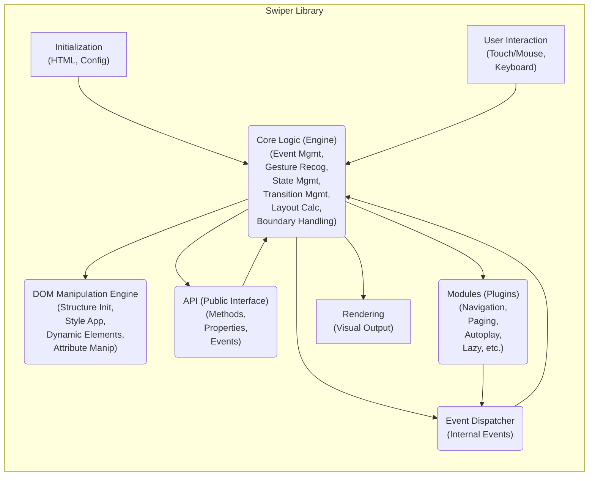

# Project Design Document: Swiper

**Version:** 1.1
**Date:** October 26, 2023
**Author:** AI Software Architect

## 1. Introduction

This document provides an enhanced architectural design of the Swiper JavaScript library (as found on [https://github.com/nolimits4web/swiper](https://github.com/nolimits4web/swiper)). This revised document aims to offer a more detailed and nuanced understanding of Swiper's internal workings, specifically tailored for a comprehensive threat modeling exercise. It builds upon the previous version by providing greater depth in component descriptions, data flow analysis, and security considerations.

## 2. Goals

*   Provide a highly detailed and clear architectural overview of the Swiper library, suitable for in-depth security analysis.
*   Elucidate the responsibilities and interactions of each key component with greater specificity.
*   Offer a granular description of the data flow, including data transformations and control flow.
*   Identify potential security vulnerabilities and attack vectors with concrete examples, facilitating a more effective threat modeling process.
*   Serve as a refined and comprehensive reference document for security architects and developers involved in assessing the security posture of applications using Swiper.

## 3. Overview of Swiper

Swiper is a widely adopted, performant, and feature-rich JavaScript library for creating touch-enabled sliders and carousels. Its mobile-first design and hardware-accelerated transitions contribute to a smooth user experience across various devices. Key functionalities include:

*   Intuitive touch and mouse drag navigation with configurable resistance and snap points.
*   Flexible slide arrangement and layout options.
*   Extensive support for navigation elements like pagination dots, navigation arrows, and scrollbars.
*   Optional autoplay functionality with customizable timing and behavior.
*   Efficient lazy loading of images to optimize initial page load times.
*   Comprehensive support for right-to-left (RTL) languages and layouts.
*   Virtual slide rendering for handling a large number of slides efficiently.
*   A variety of transition effects to enhance visual appeal.
*   A well-defined and extensible API for programmatic control and customization.
*   A modular architecture allowing developers to include only the necessary features.

## 4. Architectural Design

Swiper's architecture is designed around a core engine with extensible modules, enabling a flexible and feature-rich slider implementation.

### 4.1. Core Components

*   **Core Logic (Engine):** This is the central processing unit of Swiper. It manages the slider's state, interprets user interactions, and orchestrates the behavior of other components. Key responsibilities include:
    *   **Event Management:**  Attaching and managing event listeners for touch, mouse, and keyboard interactions on the slider container and slides. It normalizes touch and mouse events for cross-browser compatibility.
    *   **Gesture Recognition:**  Analyzing touch and mouse movements to determine the user's intent (e.g., swipe left, swipe right, drag). It calculates the distance, velocity, and direction of gestures.
    *   **State Management:** Maintaining the internal state of the slider, including the current active slide index, progress of transitions, touch/drag state, and configuration settings.
    *   **Transition Management:**  Controlling the animation and timing of slide transitions. It utilizes CSS transitions and requestAnimationFrame for smooth animations.
    *   **Layout Calculation:** Determining the position and dimensions of slides based on the slider's orientation (horizontal or vertical), spacing, and other configuration options.
    *   **Boundary Handling:**  Managing the behavior when reaching the beginning or end of the slides (e.g., loop mode, resistance).
*   **DOM Manipulation Engine:** This component is responsible for directly interacting with the DOM to visually represent the slider's state. It performs actions such as:
    *   **Structure Initialization:**  Creating and arranging the necessary DOM elements for the slider wrapper and slides based on the provided HTML structure.
    *   **Style Application:**  Dynamically applying CSS classes and inline styles to control the visibility, position, and transformations of slides. This includes applying `transform: translate3d()` for hardware-accelerated transitions.
    *   **Dynamic Element Creation/Removal:**  Adding or removing elements based on the configuration (e.g., creating pagination bullets, navigation arrows).
    *   **Attribute Manipulation:**  Updating attributes of DOM elements (e.g., `aria-` attributes for accessibility).
*   **API (Public Interface):** Swiper exposes a comprehensive API that allows developers to programmatically interact with and control the slider. This API provides methods for:
    *   **Initialization and Destruction:**  `new Swiper()`, `swiper.destroy()`.
    *   **Navigation Control:** `swiper.slideTo()`, `swiper.slideNext()`, `swiper.slidePrev()`, `swiper.slideReset()`.
    *   **Autoplay Management:** `swiper.autoplay.start()`, `swiper.autoplay.stop()`, `swiper.autoplay.pause()`, `swiper.autoplay.resume()`.
    *   **State Access:**  Accessing properties like `swiper.activeIndex`, `swiper.realIndex`, `swiper.isBeginning`, `swiper.isEnd`.
    *   **Dynamic Updates:** `swiper.update()`, `swiper.changeDirection()`, `swiper.setBreakpoint()`.
    *   **Event Emitting:**  Triggering custom events.
*   **Modules (Plugins):** Swiper's functionality is extended through a modular architecture, where each module encapsulates specific features. Key modules include:
    *   **Navigation Module:** Implements the logic and DOM manipulation for navigation arrows, allowing users to manually navigate between slides.
    *   **Pagination Module:** Creates and manages visual indicators (dots, bullets, progress bars) representing the current slide and allowing direct navigation.
    *   **Scrollbar Module:** Adds a draggable scrollbar that reflects the slider's position and allows for navigation.
    *   **Autoplay Module:**  Handles the automatic transition between slides at specified intervals.
    *   **Lazy Loading Module:**  Optimizes performance by loading images within slides only when they are about to become visible.
    *   **Zoom Module:** Enables pinch-to-zoom functionality on slide content.
    *   **Thumbs Module:** Creates a linked thumbnail slider for navigation.
    *   **Virtual Slides Module:**  Renders only a subset of slides visible in the viewport, improving performance for sliders with a large number of slides.
    *   **Effect Modules (Fade, Cube, Flip, Coverflow, Creative):** Implement various visual transition effects between slides by manipulating CSS properties.
*   **Event Dispatcher:** Swiper utilizes an internal event dispatcher to manage and broadcast events within the library. This allows different components and modules to communicate and react to changes in the slider's state. Key events include:
    *   `init`:  Triggered when the Swiper instance is initialized.
    *   `slideChange`: Emitted after the active slide has changed.
    *   `slideChangeTransitionStart`:  Triggered at the beginning of a slide transition.
    *   `slideChangeTransitionEnd`: Triggered when a slide transition completes.
    *   `touchStart`, `touchMove`, `touchEnd`:  Events related to user touch interactions.
    *   `resize`:  Triggered when the browser window is resized.

### 4.2. Data Flow

The data flow within Swiper involves a series of interactions between components, driven by user actions, API calls, and internal logic.

1. **Initialization Phase:**
    *   The developer instantiates a `Swiper` object, providing the target HTML element and configuration options.
    *   The **Core Logic** receives the configuration and initializes its internal state.
    *   The **DOM Manipulation Engine** parses the HTML structure and creates the necessary internal representation of the slides.
    *   Enabled **Modules** are initialized and register their event listeners with the **Event Dispatcher**.
2. **User Interaction Flow:**
    *   The user interacts with the slider (touch, mouse).
    *   The browser dispatches native touch or mouse events.
    *   The **Core Logic's Event Management** captures these events.
    *   **Gesture Recognition** analyzes the event data to determine the user's intent (swipe, drag).
    *   The **Core Logic** updates its internal **State Management** based on the recognized gesture.
    *   The **Core Logic** instructs the **DOM Manipulation Engine** to update the visual position of the slides using CSS transformations.
    *   The **Event Dispatcher** emits relevant events (e.g., `touchStart`, `touchMove`, `touchEnd`).
    *   **Modules** listen for these events and update their UI accordingly (e.g., Pagination module updating active dot).
3. **API Call Flow:**
    *   The developer calls a method on the Swiper API (e.g., `swiper.slideNext()`).
    *   The **API** method interacts with the **Core Logic**.
    *   The **Core Logic** updates its internal **State Management** to reflect the requested action.
    *   The **Core Logic** instructs the **DOM Manipulation Engine** to update the visual position of the slides.
    *   The **Event Dispatcher** emits relevant events (e.g., `slideChangeTransitionStart`, `slideChangeTransitionEnd`).
    *   **Modules** react to these events as needed.
4. **Autoplay Flow (if enabled):**
    *   The **Autoplay Module** uses `setInterval` or `requestAnimationFrame` to trigger automatic slide transitions.
    *   The **Autoplay Module** interacts with the **Core Logic** to initiate the transition to the next slide.
    *   The subsequent steps are similar to the API Call Flow.
5. **Lazy Loading Flow (if enabled):**
    *   The **Lazy Loading Module** monitors the visibility of slides.
    *   When a slide with a lazy-loaded image is about to become visible, the module updates the `src` attribute of the image, triggering the browser to load it.

### 4.3. High-Level Architecture Diagram

## 5. Security Considerations (For Threat Modeling)

This section provides a more detailed analysis of potential security considerations for threat modeling.

*   **Cross-Site Scripting (XSS) Vulnerabilities:**
    *   **Configuration Injection:** If Swiper's configuration options allow for the injection of arbitrary HTML or JavaScript (e.g., through dynamically generated configuration based on user input without proper sanitization), attackers could inject malicious scripts. **Example:** A website allows users to customize slider captions, and this caption is directly passed to Swiper's configuration without sanitization. An attacker could inject `` in the caption.
    *   **Dynamic Content Injection:** If slide content is loaded dynamically from untrusted sources and directly rendered by Swiper without sanitization, it could lead to XSS. **Example:**  Fetching slide content from a user-generated content API and displaying it directly within Swiper slides.
    *   **Event Handler Injection:** While less common, if there are mechanisms to dynamically attach event handlers using user-provided data, this could be an attack vector.
*   **DOM-Based Vulnerabilities:**
    *   **DOM Clobbering:**  If Swiper's internal logic relies on accessing global variables or DOM elements with predictable IDs, attackers might be able to "clobber" these by defining their own elements with the same IDs, potentially disrupting Swiper's functionality or leading to unexpected behavior.
    *   **Mutation XSS (mXSS):**  If Swiper manipulates the DOM in a way that introduces vulnerabilities when the DOM is later processed by the browser (e.g., through browser parsing quirks or other JavaScript code), it could lead to mXSS. This requires careful analysis of Swiper's DOM manipulation logic.
    *   **Insecure Event Handling:** If event listeners are attached to elements in a way that makes them susceptible to manipulation or hijacking by malicious scripts, it could lead to vulnerabilities.
*   **Configuration Vulnerabilities:**
    *   **Insecure Defaults:**  If default configuration options are insecure (e.g., allowing autoplay with potentially malicious content), this could be a vulnerability.
    *   **Lack of Input Validation:**  Insufficient validation of configuration options could allow attackers to provide unexpected or malicious values, potentially leading to errors or unexpected behavior. **Example:** Providing a negative value for the `speed` option could cause issues.
*   **Third-Party Dependency Considerations (Indirect):**
    *   While Swiper is generally standalone, its integration into larger applications means vulnerabilities in other parts of the application could indirectly affect Swiper's security. For example, a vulnerable library used for fetching dynamic content could be exploited to inject malicious content into Swiper.
*   **Event Handling Vulnerabilities:**
    *   **Lack of Namespacing:** If custom event handlers attached to Swiper events don't use proper namespacing, they might conflict with Swiper's internal event handling or other third-party libraries. While not directly a security vulnerability in Swiper itself, it can lead to unexpected behavior.
*   **Denial of Service (DoS):**
    *   **Resource Exhaustion:**  While client-side, excessive API calls or manipulation of configuration options could potentially consume excessive client-side resources, leading to performance issues or browser crashes. **Example:** Rapidly calling `slideTo()` in a loop.
    *   **Malicious Configuration:**  Setting extremely high values for certain configuration options (e.g., a very short autoplay delay with a large number of slides) could potentially strain the client's resources.
*   **Logic Flaws:**
    *   **Race Conditions:**  If Swiper's internal logic has race conditions, it could lead to unpredictable behavior or security vulnerabilities under certain timing conditions.
    *   **Integer Overflows/Underflows:**  While less likely in JavaScript, if calculations involving slide indices or positions are not handled carefully, potential integer overflow or underflow issues could arise.

## 6. Deployment Considerations

Swiper is typically deployed as a client-side JavaScript library integrated into web pages or applications.

*   **Inclusion Methods:**
    *   Direct inclusion via `<script>` tag referencing a local file.
    *   Inclusion via a Content Delivery Network (CDN).
    *   Installation via package managers (npm, yarn) and inclusion through module bundlers (Webpack, Parcel, Rollup).
*   **Initialization Context:** Swiper instances are typically initialized within `<script>` tags in the HTML or within JavaScript modules.
*   **Configuration Management:** Configuration options are usually provided as an object literal during Swiper instantiation.
*   **Integration with Frameworks:** Swiper can be integrated with various JavaScript frameworks (React, Angular, Vue.js) using wrapper components or direct DOM manipulation.

## 7. Future Considerations

*   Enhanced input sanitization for configuration options and dynamically loaded content.
*   Implementation of Content Security Policy (CSP) directives to further mitigate XSS risks.
*   Regular security audits and penetration testing.
*   Improved documentation on secure usage patterns and potential pitfalls.
*   Consideration of Subresource Integrity (SRI) for CDN deployments.

## 8. Conclusion

This improved design document provides a more in-depth architectural overview of the Swiper JavaScript library, offering a detailed understanding of its components, data flow, and potential security considerations. This enhanced information is crucial for conducting thorough threat modeling and security assessments, ultimately contributing to the development of more secure and robust web applications utilizing Swiper.