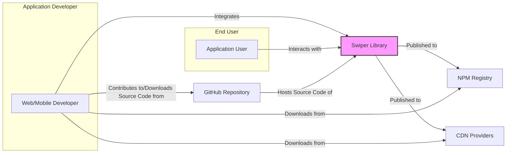
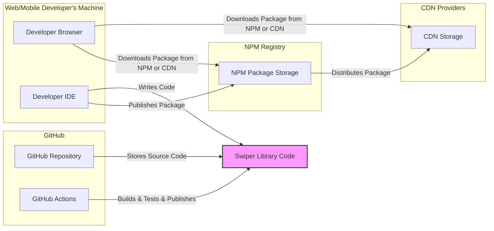

# BUSINESS POSTURE

This project, "swiper", provides a mobile touch slider component for web and mobile applications.

- Business Priorities:
  - Provide a reusable, performant, and easy-to-integrate touch slider library for web and mobile developers.
  - Ensure wide compatibility across different browsers and devices.
  - Maintain a stable and reliable library to minimize integration issues for users.
  - Foster a strong community and provide good documentation to encourage adoption and contribution.

- Business Goals:
  - Become a widely adopted and recognized touch slider library in the web and mobile development ecosystem.
  - Enable developers to easily create engaging and user-friendly interfaces.
  - Continuously improve the library based on community feedback and evolving web standards.

- Business Risks:
  - Security vulnerabilities in "swiper" could be exploited in numerous applications that depend on it, potentially leading to various security issues in those applications (e.g., Cross-Site Scripting, UI manipulation, denial of service).
  - Supply chain risks if the library's build or distribution process is compromised, leading to the distribution of malicious code to users.
  - Performance issues or bugs in "swiper" could negatively impact the user experience of applications that integrate it, potentially damaging the reputation of both "swiper" and the applications using it.
  - Lack of maintenance or community support could lead to stagnation and decreased adoption over time.

# SECURITY POSTURE

- Existing Security Controls:
  - security control: GitHub repository with standard access controls for contributors. Implemented in: GitHub repository settings.
  - security control: Dependency scanning provided by GitHub Dependabot. Implemented in: GitHub Dependabot configuration.
  - security control: Issue tracking for reporting bugs and potential security vulnerabilities. Implemented in: GitHub Issues.

- Accepted Risks:
  - accepted risk: Reliance on community contributions for security vulnerability identification and patching.
  - accepted risk: Potential for vulnerabilities to be present in dependencies used by the library.
  - accepted risk: Limited dedicated security resources for in-depth security audits and penetration testing.

- Recommended Security Controls:
  - security control: Implement automated Static Application Security Testing (SAST) in the CI/CD pipeline to identify potential code-level vulnerabilities.
  - security control: Conduct regular security code reviews, especially for critical components and contributions from external developers.
  - security control: Establish a clear process for reporting and handling security vulnerabilities, including a security policy and contact information.
  - security control: Implement Software Composition Analysis (SCA) to continuously monitor dependencies for known vulnerabilities and ensure timely updates.
  - security control: Consider signing release artifacts to enhance supply chain security and verify the integrity of distributed packages.

- Security Requirements:
  - Authentication: Not directly applicable to the "swiper" library itself, as it is a client-side component. Authentication is the responsibility of the applications that integrate "swiper".
  - Authorization: Not directly applicable to the "swiper" library itself. Authorization is the responsibility of the applications that integrate "swiper".
  - Input Validation:
    - security requirement: Validate configuration options provided by developers to prevent unexpected behavior or errors.
    - security requirement: Sanitize or validate user-provided content that might be dynamically rendered within the slider to prevent Cross-Site Scripting (XSS) vulnerabilities in applications using "swiper".
    - security requirement: Ensure proper handling of touch events and user interactions to prevent unexpected states or security issues.
  - Cryptography: Not directly applicable to the core functionality of the "swiper" library. Cryptographic operations are the responsibility of the applications that integrate "swiper" if needed.

# DESIGN

## C4 CONTEXT



- Context Diagram Elements:
  - - Name: Swiper Library
    - Type: Software System
    - Description: A JavaScript library providing touch slider functionality for web and mobile applications.
    - Responsibilities:
      - Provide a configurable and customizable touch slider component.
      - Handle user touch interactions and gestures.
      - Render slider UI elements.
      - Expose an API for developers to integrate and control the slider.
    - Security controls:
      - security control: Input validation of configuration options.
      - security control: Output sanitization for dynamically rendered content (if applicable).
      - security control: Regular security updates and patching process.

  - - Name: Web/Mobile Developer
    - Type: Person
    - Description: Developers who integrate the "swiper" library into their web and mobile applications.
    - Responsibilities:
      - Integrate "swiper" into their projects using provided APIs and documentation.
      - Configure "swiper" to meet the specific needs of their applications.
      - Ensure proper handling of user data and application security when using "swiper".
    - Security controls:
      - security control: Secure coding practices when integrating third-party libraries.
      - security control: Input validation and output encoding in their own applications.
      - security control: Regular dependency updates and vulnerability monitoring for their projects.

  - - Name: Application User
    - Type: Person
    - Description: End users who interact with web and mobile applications that utilize the "swiper" library.
    - Responsibilities:
      - Interact with the slider component within applications.
    - Security controls:
      - security control: Standard browser security controls.
      - security control: Operating system security controls.

  - - Name: NPM Registry
    - Type: Software System
    - Description: A public registry for Node.js packages, used to distribute the "swiper" library as an npm package.
    - Responsibilities:
      - Host and distribute the "swiper" npm package.
      - Provide package management functionalities for developers.
    - Security controls:
      - security control: Package integrity checks.
      - security control: Malware scanning of published packages.
      - security control: Access controls for package publishing.

  - - Name: CDN Providers
    - Type: Software System
    - Description: Content Delivery Networks that may host and distribute "swiper" library files for faster content delivery to end users.
    - Responsibilities:
      - Host and distribute "swiper" library files globally.
      - Provide fast and reliable content delivery.
    - Security controls:
      - security control: Infrastructure security controls.
      - security control: DDoS protection.
      - security control: Content integrity checks.

  - - Name: GitHub Repository
    - Type: Software System
    - Description: The GitHub repository hosting the source code of the "swiper" library.
    - Responsibilities:
      - Store and manage the source code of "swiper".
      - Facilitate collaboration among developers.
      - Provide issue tracking and version control.
    - Security controls:
      - security control: Access controls for repository access and code contributions.
      - security control: Branch protection rules.
      - security control: Audit logs.
      - security control: Vulnerability scanning (Dependabot).

## C4 CONTAINER



- Container Diagram Elements:
  - - Name: Swiper Library Code
    - Type: Container (JavaScript Library)
    - Description: The core JavaScript code of the "swiper" library, including modules for slider functionality, UI rendering, and API exposure.
    - Responsibilities:
      - Implement touch slider logic and functionality.
      - Provide a JavaScript API for developers to interact with the slider.
      - Render slider UI components in web browsers and mobile environments.
    - Security controls:
      - security control: Input validation within the library code.
      - security control: Output sanitization within the library code.
      - security control: Secure coding practices followed during development.
      - security control: Static Application Security Testing (SAST) during build process.
      - security control: Regular security code reviews.

  - - Name: Developer IDE
    - Type: Container (Software Application)
    - Description: Integrated Development Environment used by developers to write and test code for applications using "swiper" and potentially contribute to "swiper" itself.
    - Responsibilities:
      - Code editing and development.
      - Local testing and debugging of applications using "swiper".
      - Package management (npm, yarn).
    - Security controls:
      - security control: Local security controls on developer machines (OS security, antivirus).
      - security control: Code analysis tools within IDEs.

  - - Name: Developer Browser
    - Type: Container (Software Application)
    - Description: Web browser used by developers to test and preview applications integrating "swiper".
    - Responsibilities:
      - Rendering and testing web applications.
      - Simulating user interactions with the slider.
    - Security controls:
      - security control: Browser security features (sandboxing, XSS protection).
      - security control: Browser extensions for security testing.

  - - Name: NPM Package Storage
    - Type: Container (Data Store)
    - Description: Storage within the NPM Registry that holds the "swiper" npm package files.
    - Responsibilities:
      - Securely store npm package files.
      - Provide access to package files for download.
    - Security controls:
      - security control: Access controls to package storage.
      - security control: Data integrity checks.
      - security control: Malware scanning.

  - - Name: CDN Storage
    - Type: Container (Data Store)
    - Description: Storage within CDN providers that caches and serves "swiper" library files.
    - Responsibilities:
      - Cache and serve static files of the "swiper" library.
      - Ensure fast and reliable delivery of files.
    - Security controls:
      - security control: Infrastructure security of CDN storage.
      - security control: Content integrity checks.
      - security control: Access controls to CDN storage.

  - - Name: GitHub Repository
    - Type: Container (Code Repository)
    - Description: Git repository on GitHub hosting the source code of "swiper".
    - Responsibilities:
      - Version control for "swiper" source code.
      - Collaboration platform for developers.
    - Security controls:
      - security control: Access controls to the repository.
      - security control: Branch protection.
      - security control: Audit logging.

  - - Name: GitHub Actions
    - Type: Container (CI/CD System)
    - Description: GitHub Actions workflows used for building, testing, and publishing the "swiper" library.
    - Responsibilities:
      - Automate the build process.
      - Run automated tests.
      - Publish the library to NPM and potentially CDNs.
    - Security controls:
      - security control: Secure configuration of CI/CD pipelines.
      - security control: Access controls to CI/CD workflows and secrets.
      - security control: Security scanning within CI/CD pipeline (SAST, SCA).

## DEPLOYMENT

Deployment of the "swiper" library itself is primarily about distribution to developers, not deployment in the traditional application sense. Developers then deploy applications that *use* "swiper".  The deployment context here is how the library is made available to developers.

Deployment Architecture Option: Public Package Distribution via NPM and CDN

```mermaid
flowchart LR
    subgraph "Developer Environment"
        A[Developer Machine]
    end
    subgraph "NPM Registry"
        B[NPM Registry Server]
    end
    subgraph "CDN Provider"
        C[CDN Edge Server]
        D[CDN Origin Server]
    end
    E[End User Browser]

    A -->|Publishes Package| B
    B -->|Mirrors/Replicates| D
    D -->|Distributes & Caches| C
    E -->|Downloads Library from CDN| C
    E -->|Downloads Library from NPM (less common for frontend)| B
    style B fill:#ccf,stroke:#333,stroke-width:1px
    style C fill:#ccf,stroke:#333,stroke-width:1px
    style D fill:#ccf,stroke:#333,stroke-width:1px
```

- Deployment Diagram Elements:
  - - Name: Developer Machine
    - Type: Infrastructure (Physical/Virtual Machine)
    - Description: Developer's local computer used for development, building, and publishing the "swiper" library.
    - Responsibilities:
      - Development environment for "swiper".
      - Building and packaging the library.
      - Publishing the library to NPM.
    - Security controls:
      - security control: Operating system security controls.
      - security control: Local firewalls.
      - security control: Antivirus software.
      - security control: Access controls to development tools and credentials.

  - - Name: NPM Registry Server
    - Type: Infrastructure (Server)
    - Description: Servers hosting the NPM Registry, responsible for storing and distributing npm packages.
    - Responsibilities:
      - Host the "swiper" npm package.
      - Manage package metadata and versions.
      - Provide download access to developers.
    - Security controls:
      - security control: Infrastructure security of NPM servers.
      - security control: Access controls to registry data.
      - security control: Package integrity checks.
      - security control: Malware scanning.

  - - Name: CDN Origin Server
    - Type: Infrastructure (Server)
    - Description: CDN provider's origin server that stores the original files of the "swiper" library and serves them to CDN edge servers.
    - Responsibilities:
      - Store the authoritative copy of "swiper" library files for CDN distribution.
      - Serve files to CDN edge servers for caching.
    - Security controls:
      - security control: Infrastructure security of CDN origin servers.
      - security control: Access controls to origin server data.
      - security control: Content integrity checks.

  - - Name: CDN Edge Server
    - Type: Infrastructure (Server)
    - Description: Geographically distributed servers in a CDN that cache "swiper" library files and serve them to end users with low latency.
    - Responsibilities:
      - Cache "swiper" library files.
      - Serve files to end users based on proximity and availability.
      - Provide fast content delivery.
    - Security controls:
      - security control: Infrastructure security of CDN edge servers.
      - security control: DDoS protection.
      - security control: Content integrity checks.

  - - Name: End User Browser
    - Type: Infrastructure (Software Application)
    - Description: Web browser running on an end user's device that downloads and executes the "swiper" library as part of a web application.
    - Responsibilities:
      - Download and execute JavaScript code.
      - Render web pages and applications.
      - Interact with web applications including "swiper" components.
    - Security controls:
      - security control: Browser security features (sandboxing, XSS protection, Content Security Policy).
      - security control: Browser extensions for security.
      - security control: Operating system security controls on the end user's device.

## BUILD

```mermaid
flowchart LR
    A[Developer] --> B{Code Commit}
    B --> C[GitHub Repository]
    C --> D[GitHub Actions Workflow]
    D --> E{Build Process}
    E --> F{Unit Tests}
    F --> G{Linters & SAST}
    G --> H{Build Artifacts (JS, CSS)}
    H --> I[NPM Registry]
    H --> J[CDN Distribution]
    style E fill:#ffe,stroke:#333,stroke-width:1px
    style F fill:#ffe,stroke:#333,stroke-width:1px
    style G fill:#ffe,stroke:#333,stroke-width:1px
    style H fill:#ffe,stroke:#333,stroke-width:1px
```

- Build Process Description:
  1. Developer commits code changes to the GitHub repository.
  2. GitHub Actions workflow is triggered automatically on code commit (e.g., push to main branch, pull request).
  3. GitHub Actions executes the build process, which typically includes:
     - Installing dependencies (using npm install or similar).
     - Compiling or bundling JavaScript and CSS code.
     - Running unit tests to ensure code quality and functionality.
     - Performing static analysis security testing (SAST) to identify potential vulnerabilities in the code.
     - Running linters to enforce code style and quality standards.
  4. If all checks pass, build artifacts (JavaScript and CSS files, npm package) are created.
  5. Build artifacts are published to the NPM Registry, making the new version of "swiper" available to developers.
  6. Build artifacts are also distributed to CDN providers for faster global delivery.

- Build Process Security Controls:
  - security control: Automated build process using GitHub Actions to ensure consistency and reduce manual errors.
  - security control: Source code version control using Git and GitHub to track changes and facilitate collaboration.
  - security control: Unit tests to verify code functionality and prevent regressions.
  - security control: Static Application Security Testing (SAST) integrated into the build pipeline to detect potential code-level vulnerabilities early in the development cycle.
  - security control: Linters to enforce code style and quality, reducing the likelihood of certain types of errors.
  - security control: Dependency scanning (GitHub Dependabot) to identify vulnerable dependencies.
  - security control: Access controls to GitHub Actions workflows and secrets to prevent unauthorized modifications to the build process.
  - security control: Consider signing release artifacts to ensure integrity and authenticity of distributed packages.

# RISK ASSESSMENT

- Critical Business Processes:
  - Reliable and secure delivery of the "swiper" library to developers.
  - Correct and secure functioning of the "swiper" library in applications that integrate it.
  - Maintaining the reputation and trust in the "swiper" library within the developer community.

- Data We Are Trying to Protect and Sensitivity:
  - Source code of the "swiper" library: High sensitivity - Confidentiality and integrity are important to prevent unauthorized modifications or exposure of vulnerabilities.
  - Build artifacts (JavaScript, CSS files, npm package): Medium sensitivity - Integrity is crucial to ensure that developers and end users receive unmodified and safe code.
  - Developer and contributor credentials for GitHub and NPM: High sensitivity - Confidentiality is essential to prevent unauthorized access and malicious activities.
  - Usage data and metrics (download counts, etc.): Low sensitivity - Primarily for understanding usage patterns and trends, less critical from a direct security perspective.

# QUESTIONS & ASSUMPTIONS

- Questions:
  - What is the process for handling security vulnerability reports? Is there a security contact or security policy documented?
  - Are there any existing security audits or penetration testing reports for the "swiper" library?
  - What is the policy for updating dependencies, especially in response to security vulnerabilities?
  - Are there any specific coding standards or security guidelines followed by contributors?
  - Is there a process for verifying the identity and trustworthiness of contributors?

- Assumptions:
  - The primary distribution channels for "swiper" are NPM and CDNs.
  - Security is considered important but might not be the absolute top priority compared to functionality and ease of use.
  - The target audience is primarily web and mobile developers integrating the library into their projects.
  - The project relies heavily on community contributions and open-source principles.
  - The current security posture is based on standard GitHub and NPM security features, with room for improvement in proactive security measures.