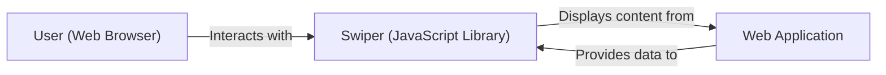
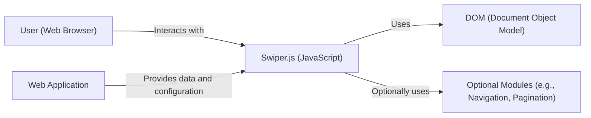
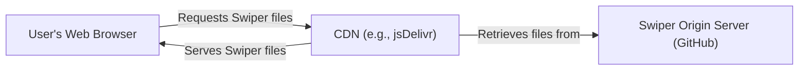
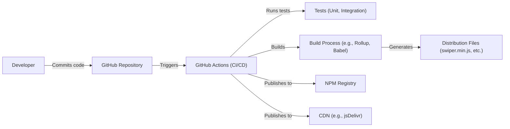

Okay, let's create a design document for the Swiper project.

# BUSINESS POSTURE

Swiper is a popular open-source JavaScript library for creating touch-enabled sliders and carousels. It's widely used in web development to enhance user interfaces.

Priorities and Goals:

-   Provide a free, open-source, and easy-to-use solution for creating interactive sliders.
-   Maintain high performance and compatibility across various browsers and devices (including mobile).
-   Offer extensive customization options to fit diverse design needs.
-   Foster a strong community for support, contributions, and continuous improvement.
-   Ensure the library remains lightweight and doesn't introduce unnecessary dependencies.

Business Risks:

-   Reputational Damage: Vulnerabilities or bugs in Swiper could negatively impact the websites and applications that use it, leading to reputational damage for both Swiper and its users.
-   Loss of User Trust: Security issues or performance problems could erode user trust in the library, causing developers to switch to alternatives.
-   Maintenance Overhead: As an open-source project, maintaining the library and addressing issues relies heavily on the core contributors and the community.  Lack of active maintenance could lead to the project becoming obsolete.
-   Compatibility Issues:  The rapidly evolving web landscape (new browsers, devices, frameworks) requires constant updates to ensure compatibility. Failure to keep up could limit Swiper's usability.
-   Competition: Other slider libraries exist, so Swiper needs to continuously improve to remain competitive.

# SECURITY POSTURE

Existing Security Controls:

-   security control: Code Reviews: The GitHub repository indicates a collaborative development process, suggesting that code reviews are likely performed before merging changes. (Inferred from the pull request process on GitHub).
-   security control: Community Scrutiny: Being open-source, the codebase is subject to scrutiny by a large community of developers, increasing the chances of identifying and reporting vulnerabilities. (Inherent to open-source projects).
-   security control: Issue Tracking: The GitHub Issues section allows users to report bugs and security concerns, providing a mechanism for tracking and addressing problems. (Visible on the GitHub repository).
-   security control: Regular Updates: The project's release history shows frequent updates, suggesting that bug fixes and security patches are regularly incorporated. (Observed from the release history on GitHub).

Accepted Risks:

-   accepted risk: Third-Party Dependencies: While Swiper aims to be dependency-free, certain features or build tools might introduce indirect dependencies, which could have their own vulnerabilities. (Acknowledged as a general risk for JavaScript projects).
-   accepted risk: User-Implemented Customizations: Swiper provides extensive customization options, and users might introduce vulnerabilities through their own custom code or configurations. (Acknowledged as a risk inherent in flexible libraries).
-   accepted risk: Cross-Site Scripting (XSS): If user-provided content is not properly sanitized before being displayed within a Swiper instance, XSS attacks might be possible. (Acknowledged as a potential risk, mitigated by user responsibility for sanitization).
-   accepted risk: Denial of Service (DoS): Extremely large or malformed configurations could potentially lead to performance issues or even denial of service, although this is likely a low-impact risk. (Acknowledged as a low-probability risk).

Recommended Security Controls:

-   security control: Content Security Policy (CSP): Provide guidance and examples in the documentation on how to implement CSP to mitigate XSS risks when using Swiper.
-   security control: Input Sanitization: Emphasize the importance of sanitizing user-provided content in the documentation and provide examples of best practices.
-   security control: Automated Security Scanning: Integrate static code analysis tools (e.g., ESLint with security plugins, Snyk) into the build process to automatically detect potential vulnerabilities.
-   security control: Security.md file: Add security.md file to the repository to provide clear instructions on how to report security vulnerabilities.

Security Requirements:

-   Authentication: Not directly applicable, as Swiper is a client-side library and doesn't handle user authentication.
-   Authorization: Not directly applicable, as Swiper doesn't manage user roles or permissions.
-   Input Validation: Swiper should internally validate its own configuration options to prevent unexpected behavior or errors. User-provided content displayed within Swiper *must* be validated and sanitized by the user's application code. This is crucial to prevent XSS.
-   Cryptography: Not directly applicable, as Swiper doesn't handle sensitive data requiring encryption.

# DESIGN

## C4 CONTEXT

Element Descriptions:

-   Element:
    -   Name: User
    -   Type: Person
    -   Description: A person interacting with a web application that utilizes Swiper.
    -   Responsibilities: Views and interacts with the Swiper slider (e.g., swiping, clicking).
    -   Security controls: Browser security settings, user awareness of phishing and social engineering.

-   Element:
    -   Name: Swiper
    -   Type: Software System
    -   Description: The Swiper JavaScript library, running within the user's web browser.
    -   Responsibilities: Renders the slider interface, handles user interactions, manages animations.
    -   Security controls: Internal input validation, adherence to secure coding practices.

-   Element:
    -   Name: Web Application
    -   Type: Software System
    -   Description: The web application that integrates Swiper to display content.
    -   Responsibilities: Provides the content and configuration for Swiper, handles user authentication and authorization (if applicable), sanitizes user input.
    -   Security controls: Input validation, output encoding, XSS prevention, CSRF protection, secure session management, authentication and authorization mechanisms.

## C4 CONTAINER

Element Descriptions:

-   Element:
    -   Name: User
    -   Type: Person
    -   Description: A person interacting with a web application that utilizes Swiper.
    -   Responsibilities: Views and interacts with the Swiper slider.
    -   Security controls: Browser security settings.

-   Element:
    -   Name: Swiper.js
    -   Type: JavaScript Library
    -   Description: The core Swiper library code.
    -   Responsibilities: Handles slider initialization, event handling, animation logic.
    -   Security controls: Internal input validation, secure coding practices.

-   Element:
    -   Name: DOM
    -   Type: Browser API
    -   Description: The Document Object Model, representing the structure of the web page.
    -   Responsibilities: Provides the interface for Swiper to manipulate the page elements.
    -   Security controls: Browser's built-in security mechanisms.

-   Element:
    -   Name: Optional Modules
    -   Type: JavaScript Modules
    -   Description: Optional Swiper modules (e.g., Navigation, Pagination, Autoplay).
    -   Responsibilities: Provide additional functionality to the slider.
    -   Security controls: Internal input validation, secure coding practices.

-   Element:
    -   Name: Web Application
    -   Type: Software System
    -   Description: The web application that integrates Swiper to display content.
    -   Responsibilities: Provides the content and configuration for Swiper, handles user authentication and authorization (if applicable), sanitizes user input.
    -   Security controls: Input validation, output encoding, XSS prevention, CSRF protection, secure session management, authentication and authorization mechanisms.

## DEPLOYMENT

Deployment Solutions:

1.  **CDN (Content Delivery Network):** Swiper is commonly included in web projects via a CDN (e.g., jsDelivr, unpkg). This is the simplest and often recommended approach for most users.
2.  **NPM/Yarn Package:** Swiper can be installed as a package using npm or yarn, allowing for integration into build processes and module bundlers (e.g., Webpack, Parcel).
3.  **Direct Download:** Users can download the Swiper files directly from the GitHub repository and include them in their project.

Chosen Solution (CDN):

Element Descriptions:

-   Element:
    -   Name: User's Web Browser
    -   Type: Web Browser
    -   Description: The user's browser, where the web application and Swiper are running.
    -   Responsibilities: Requests and executes Swiper's JavaScript files.
    -   Security controls: Browser security settings, HTTPS.

-   Element:
    -   Name: CDN
    -   Type: Content Delivery Network
    -   Description: A distributed network of servers that delivers Swiper's files to users.
    -   Responsibilities: Caches and serves Swiper files, reducing latency and improving performance.
    -   Security controls: HTTPS, CDN provider's security measures.

-   Element:
    -   Name: Swiper Origin Server
    -   Type: Server
    -   Description: The server hosting the original Swiper files (GitHub in this case).
    -   Responsibilities: Stores the source code and releases of Swiper.
    -   Security controls: GitHub's security infrastructure.

## BUILD

Build Process Description:

1.  **Code Commit:** Developers commit code changes to the Swiper GitHub repository.
2.  **CI/CD Trigger:** GitHub Actions (or a similar CI/CD system) is triggered by the commit.
3.  **Testing:** The CI/CD pipeline runs automated tests (unit tests, integration tests) to ensure code quality.
4.  **Build:** The build process uses tools like Rollup (for bundling) and Babel (for transpilation) to create optimized distribution files (e.g., `swiper.min.js`, CSS files).
5.  **Security Checks:**
    -   security control: Static Analysis:  Linters (e.g., ESLint with security plugins) are used to identify potential code style issues and security vulnerabilities.
    -   security control: Dependency Analysis: Tools like `npm audit` or Snyk can be integrated to check for known vulnerabilities in dependencies.
6.  **Publish:** The built distribution files are published to:
    -   The NPM registry, making Swiper available as an npm package.
    -   A CDN (e.g., jsDelivr), providing easy access for direct inclusion in web pages.

# RISK ASSESSMENT

Critical Business Processes:

-   Providing a reliable and functional slider library for web developers.
-   Maintaining a positive reputation within the web development community.
-   Ensuring the continued development and maintenance of the project.

Data Protection:

-   Swiper itself does not handle sensitive user data directly.  It primarily deals with presentation logic.
-   The primary data security concern is related to *user-provided content* displayed within Swiper instances.  If this content is not properly sanitized by the integrating web application, it could lead to XSS vulnerabilities.  This is *not* a direct vulnerability of Swiper itself, but a responsibility of the application using Swiper.
-   Data Sensitivity:  The sensitivity of the data displayed within Swiper depends entirely on the web application using it.  Swiper itself does not define data sensitivity.

# QUESTIONS & ASSUMPTIONS

Questions:

-   Are there any specific compliance requirements (e.g., accessibility standards) that Swiper needs to adhere to?
-   What is the expected level of support for older browsers?
-   Are there any plans to introduce features that might handle user data directly (e.g., form submissions within a slide)?
-   What is the process for handling security vulnerability reports? (This should be documented in a SECURITY.md file).

Assumptions:

-   BUSINESS POSTURE: The primary goal is to provide a free, high-quality, and widely used slider library.
-   SECURITY POSTURE: Developers using Swiper are responsible for sanitizing user-provided content to prevent XSS.
-   DESIGN: Swiper is primarily a client-side library and does not have server-side components. The build process utilizes GitHub Actions. The primary deployment method is via CDN.