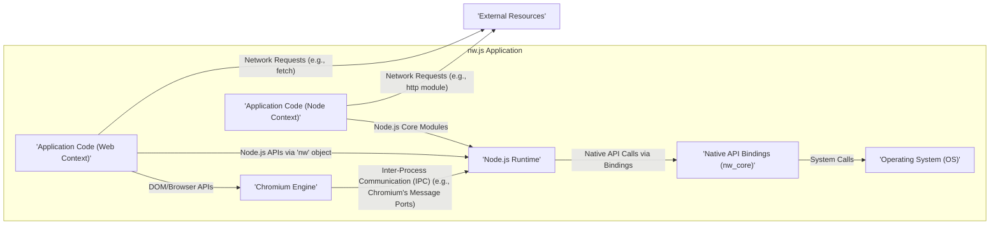
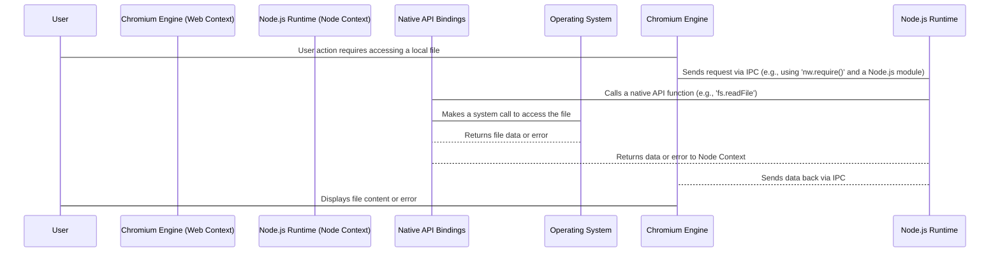

# Project Design Document: nw.js

**Version:** 1.1
**Date:** October 26, 2023
**Prepared By:** AI Software Architect

## 1. Introduction

This document provides an enhanced architectural design of the nw.js project, building upon the information available at [https://github.com/nwjs/nw.js](https://github.com/nwjs/nw.js). This revised document aims to provide a more detailed and nuanced understanding of the system's architecture, specifically tailored for subsequent threat modeling activities. It elaborates on the key components, their interactions, and the intricate data flow within the nw.js framework, with a stronger focus on security implications.

### 1.1. Purpose

The primary purpose of this document is to furnish a highly detailed and comprehensive understanding of the nw.js architecture specifically for security analysis and threat modeling. It will serve as the foundational resource for identifying potential vulnerabilities, attack vectors, and security weaknesses within the system's design and implementation.

### 1.2. Scope

This document encompasses the core architectural components of nw.js, including a deeper dive into the Chromium and Node.js integration mechanisms, the nuances of the application execution environment, and a more detailed examination of interactions with the underlying operating system. The focus remains on logical and physical components directly relevant to security considerations, with expanded explanations of their functionalities.

### 1.3. Target Audience

This document is intended for a more specialized audience involved in the security aspects of nw.js applications:

*   Security engineers and analysts responsible for in-depth threat modeling, penetration testing, and security audits.
*   Developers with a security focus working on or with nw.js, requiring a detailed understanding of potential security pitfalls.
*   Architects designing secure applications using nw.js, needing a comprehensive view of the framework's security landscape.

## 2. Overview of nw.js

nw.js (formerly known as node-webkit) is a sophisticated open-source framework enabling the development of desktop applications using standard web technologies: HTML, CSS, and JavaScript. Its core innovation lies in embedding both Chromium (the robust rendering engine powering Google Chrome) and Node.js (a versatile JavaScript runtime environment) within a unified application runtime. This powerful combination allows developers to harness the rich user interface capabilities of web technologies alongside the extensive backend functionalities offered by Node.js, all within the context of a native desktop application.

### 2.1. Key Features

*   **Seamless Integration of Web Technologies for Desktop Apps:** Facilitates the creation of visually appealing and interactive desktop applications using familiar HTML, CSS, and JavaScript.
*   **Deep Node.js Integration:** Provides direct access to the complete suite of Node.js APIs and modules within the application's JavaScript environment, enabling powerful backend operations.
*   **Robust Chromium Rendering Engine:** Leverages the mature and feature-rich Chromium browser engine to ensure consistent and high-performance rendering of the user interface across different platforms.
*   **Extensive Native API Access:** Offers a comprehensive set of APIs to interact directly with the underlying operating system, granting access to functionalities such as file system manipulation, window management, system notifications, and more.
*   **Simplified Packaging and Distribution:** Streamlines the process of packaging web application code and associated resources into standalone executable files tailored for various desktop operating systems (Windows, macOS, Linux).

## 3. Architectural Design

The nw.js architecture comprises several interconnected key components, each playing a crucial role in the application's functionality and security profile:

*   **Chromium Engine:** The foundational rendering engine responsible for interpreting and displaying the user interface, executing client-side JavaScript, and managing the browser environment.
*   **Node.js Runtime:** The JavaScript runtime environment that executes server-side JavaScript code, provides access to system-level APIs, and manages backend logic.
*   **Native API Bindings (nw_core):** The critical bridge facilitating seamless communication and interaction between the Chromium engine and the Node.js runtime. This also encompasses the mechanisms for accessing native operating system functionalities.
*   **Application Code (Web Context & Node Context):** The developer-written HTML, CSS, and JavaScript code, logically separated into the "Web Context" (running within Chromium) and the "Node Context" (running within Node.js).
*   **Operating System (OS):** The underlying platform providing the necessary resources and services for the nw.js application to execute.
*   **External Resources:** Any external services, APIs, or data sources that the application interacts with over a network, representing potential external dependencies and attack surfaces.

### 3.1. Component Diagram

### 3.2. Component Descriptions

*   **Chromium Engine:**
    *   The core rendering engine, responsible for parsing HTML, CSS, and JavaScript to render the user interface.
    *   Provides the Document Object Model (DOM) and a wide range of browser APIs (e.g., Web Storage, WebSockets).
    *   Manages the execution of client-side JavaScript code within a sandboxed environment (though less strict in nw.js).
    *   Handles user interactions, input events, and the overall visual presentation of the application.
    *   Security implications include potential vulnerabilities within the Chromium codebase itself and the handling of untrusted web content.
*   **Node.js Runtime:**
    *   Executes server-side JavaScript code, providing access to Node.js core modules (e.g., `fs`, `net`, `child_process`).
    *   Manages the event loop, non-blocking I/O operations, and the execution of asynchronous code.
    *   Offers capabilities for file system access, network communication, process management, and more.
    *   Security considerations involve vulnerabilities in Node.js itself, the security of used modules, and the potential for insecure system-level operations.
*   **Native API Bindings (nw_core):**
    *   A crucial set of interfaces and libraries (often implemented in C++) that enable communication and data exchange between the Chromium and Node.js processes.
    *   Provides JavaScript APIs (accessible via the `nw` global object) to interact with native operating system functionalities.
    *   Handles the marshaling of data and function calls between the different runtime environments.
    *   Security is paramount here, as vulnerabilities in these bindings could allow malicious code to bypass security boundaries and directly interact with the OS.
*   **Application Code (Web Context):**
    *   The HTML, CSS, and JavaScript code responsible for the user interface and client-side logic, running within the Chromium rendering engine.
    *   Has access to standard browser APIs and a subset of nw.js-specific APIs.
    *   Subject to typical web application security concerns like XSS and insecure client-side logic.
*   **Application Code (Node Context):**
    *   JavaScript code executed within the Node.js runtime, typically handling backend logic, system interactions, and more privileged operations.
    *   Has full access to Node.js core modules and the `nw` object for native API access.
    *   Requires careful security considerations due to its elevated privileges and direct access to system resources.
*   **Operating System (OS):**
    *   The underlying operating system (e.g., Windows, macOS, Linux) provides the foundation for the nw.js application.
    *   Manages system resources, process execution, memory allocation, and file system access.
    *   The security posture of the OS directly impacts the security of the nw.js application.
*   **External Resources:**
    *   External services, APIs, databases, or other resources that the nw.js application interacts with over a network.
    *   Communication with these resources introduces potential security risks related to network security, authentication, and data integrity.

## 4. Data Flow

The data flow within an nw.js application involves intricate interactions between its components. Understanding these flows is crucial for identifying potential points of vulnerability:

*   **Application Initialization:**
    *   The operating system launches the nw.js executable.
    *   The Chromium engine and Node.js runtime are initialized as separate processes.
    *   The application's main HTML file (specified in `package.json`) is loaded into the Chromium engine.
*   **User Interface Rendering and Interaction:**
    *   Chromium parses the HTML, CSS, and JavaScript of the Web Context.
    *   The DOM is constructed, and the user interface is rendered.
    *   User interactions within the Chromium window trigger events that are handled by JavaScript in the Web Context.
*   **Communication between Web Context and Node Context:**
    *   JavaScript in the Web Context can communicate with the Node Context using mechanisms like:
        *   The `nw.require()` function to load Node.js modules directly into the Web Context (with security implications).
        *   Inter-Process Communication (IPC) mechanisms provided by Chromium (e.g., Message Ports) to send messages to the Node.js process.
    *   Data exchanged between these contexts needs careful scrutiny for potential injection vulnerabilities.
*   **Node.js API Calls and Native Interactions:**
    *   JavaScript code in the Node Context can directly call Node.js core modules and the `nw` object's APIs.
    *   Calls to `nw` APIs translate into calls to the Native API Bindings (nw_core).
    *   nw_core interacts with the underlying operating system through system calls.
    *   Data passed to native APIs must be validated to prevent exploitation.
*   **Network Communication:**
    *   Both the Web Context (using browser APIs like `fetch`, `XMLHttpRequest`, WebSockets) and the Node Context (using Node.js modules like `http`, `https`, `net`) can initiate network requests.
    *   Data transmitted over the network should be secured using protocols like HTTPS.
*   **Local Data Storage:**
    *   The Web Context can utilize browser storage mechanisms (Local Storage, Session Storage, IndexedDB).
    *   The Node Context can directly interact with the file system using the `fs` module or access local databases.
    *   Data stored locally needs appropriate protection against unauthorized access.

### 4.1. Data Flow Diagram (Example: Accessing a Local File)

## 5. Security Considerations

The architecture of nw.js presents a unique set of security considerations due to the tight integration of web technologies and a powerful backend runtime:

*   **Cross-Site Scripting (XSS) in a Desktop Context:** While traditionally a web vulnerability, XSS can have more severe consequences in nw.js due to the access to native APIs. Malicious scripts could potentially interact with the file system or execute arbitrary commands.
*   **Remote Code Execution (RCE) via Node.js:** Vulnerabilities in the Node.js runtime, insecurely used Node.js modules, or flaws in the application's Node.js code can lead to RCE, allowing attackers to execute arbitrary code on the user's machine.
*   **Insecure Use of `nw.require()`:**  Allowing the Web Context to directly load Node.js modules using `nw.require()` blurs security boundaries and can introduce significant risks if not carefully managed.
*   **Node.js Dependency Vulnerabilities:**  The application's reliance on third-party Node.js modules introduces the risk of inheriting vulnerabilities present in those dependencies. Regular security audits and updates are crucial.
*   **Abuse of Native APIs:**  Improper use or vulnerabilities within the native API bindings can allow malicious code to perform privileged operations, potentially compromising the entire system. Input validation for native API calls is critical.
*   **Chromium Security Vulnerabilities:**  As nw.js embeds Chromium, it is susceptible to security vulnerabilities discovered in the Chromium project. Keeping nw.js updated to the latest stable version is essential for patching these flaws.
*   **Insecure Inter-Process Communication (IPC):**  Vulnerabilities in the IPC mechanisms between the Chromium and Node.js processes could allow attackers to intercept or manipulate communication, potentially leading to privilege escalation.
*   **Local Data Storage Security:**  Sensitive data stored using browser storage or the file system needs to be protected with appropriate permissions and encryption to prevent unauthorized access.
*   **Network Security and Trust Boundaries:**  Interactions with external resources should adhere to secure communication protocols (HTTPS) and carefully validate data received from untrusted sources.
*   **Packaging and Distribution Integrity:**  The application packaging and distribution process should be secure to prevent tampering and the introduction of malicious code. Code signing is a recommended practice.

## 6. Technologies Used

*   **Chromium:**  The open-source web browser engine providing rendering and browser functionalities.
*   **Node.js:**  The JavaScript runtime environment enabling server-side JavaScript execution and access to system APIs.
*   **JavaScript:**  The primary programming language used for both client-side (Web Context) and server-side (Node Context) logic.
*   **HTML:**  The markup language used to structure the user interface of the application.
*   **CSS:**  The stylesheet language used to style the visual presentation of the application.
*   **C++:**  The primary programming language used for developing the core components of Chromium, Node.js, and the native API bindings (nw_core).
*   **Operating System Specific APIs:**  The native APIs provided by the underlying operating system that are accessed through the nw.js native bindings.

## 7. Conclusion

This enhanced design document provides a more granular and security-focused understanding of the nw.js architecture. By detailing the interactions between Chromium and Node.js, the role of native API bindings, and the various data flow paths, it serves as a robust foundation for comprehensive threat modeling. The identified security considerations highlight the unique challenges and potential vulnerabilities inherent in this hybrid application framework. A thorough threat modeling exercise, informed by this document, is crucial for developing secure and resilient nw.js applications.