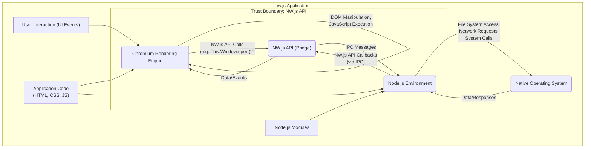

# Project Design Document: nw.js for Threat Modeling (Improved)

**Version:** 1.1
**Date:** October 26, 2023
**Author:** Gemini (AI Language Model)

## 1. Introduction

This document provides an enhanced architectural overview of the nw.js project, specifically designed to facilitate comprehensive threat modeling. It details the key components, interactions, and data flows within the system, with a heightened focus on identifying potential security vulnerabilities and attack vectors. This improved document aims for greater clarity, detail, and actionable insights for security analysis.

## 2. Goals and Objectives

The primary goal remains to provide a clear and accurate representation of the nw.js architecture tailored for effective threat modeling. The enhanced objectives include:

*   Clearly delineating the major components of the nw.js runtime environment and their specific responsibilities.
*   Providing a more granular description of the interactions and data flows between these components, including specific communication channels.
*   Explicitly identifying potential trust boundaries and sensitive operations within the architecture.
*   Establishing a robust foundation for understanding the attack surface and potential threat actors targeting nw.js applications.
*   Highlighting specific areas requiring deeper security scrutiny during threat modeling exercises.

## 3. System Overview

nw.js is an application runtime environment that uniquely combines the Chromium rendering engine with a Node.js backend. This allows developers to create desktop applications using web technologies (HTML, CSS, JavaScript) while leveraging the power and flexibility of Node.js for system-level interactions. Essentially, it packages a complete Chromium browser instance alongside a Node.js environment, enabling web applications to access native operating system capabilities through Node.js APIs.

Key characteristics of nw.js applications include:

*   **Unified Runtime:**  A single process integrates both the Chromium rendering engine and the Node.js environment.
*   **Web Standard Compliance:** Applications are built using standard web technologies, promoting cross-platform development.
*   **Direct Node.js Access:**  JavaScript code within the application has direct access to the full suite of Node.js modules and APIs.
*   **Native OS Integration:**  Enables rich interaction with the underlying operating system's file system, network interfaces, hardware, and other system resources.
*   **Standalone Packaging:** Applications are typically packaged as platform-specific, standalone executables, simplifying distribution.
*   **Multiple Contexts:**  While unified, it's important to understand the distinct execution contexts of the Chromium renderer and the Node.js backend.

## 4. Key Components

The nw.js architecture can be further detailed into the following key components, highlighting their specific roles:

*   **Chromium Engine (Renderer Process):**
    *   **Rendering Engine (Blink):**  Responsible for parsing HTML and CSS, layout, and rendering the user interface.
    *   **JavaScript Engine (V8):** Executes JavaScript code within the web page context.
    *   **Browser Core:** Manages navigation, networking (handling web requests), and browser-specific functionalities.
    *   **Security Sandbox:** Implements security boundaries to isolate web content and limit access to system resources from the rendering context (with exceptions granted by nw.js APIs).
*   **Node.js Environment (Backend Process):**
    *   **JavaScript Runtime:** Executes server-side JavaScript code and manages the event loop.
    *   **Core Modules:** Provides access to built-in Node.js modules for file system operations, networking, process management, etc.
    *   **npm Package Manager:** Enables the inclusion of third-party libraries and modules, expanding functionality.
*   **NW.js API (Bridge - `nw` object):**
    *   **JavaScript Bindings:** A set of JavaScript APIs exposed to the application's JavaScript code running in both the Chromium and Node.js contexts.
    *   **Inter-Process Communication (IPC):**  Facilitates communication and data exchange between the Chromium rendering process and the Node.js backend process. This is a critical trust boundary.
    *   **Native Function Wrappers:** Provides access to nw.js specific functionalities like:
        *   Window management (creating, manipulating browser windows).
        *   Menu creation and management.
        *   System tray integration.
        *   Clipboard access.
        *   Shell operations (opening files, URLs).
*   **Packaged Application Contents:**
    *   **Application Code:**  HTML, CSS, and JavaScript files forming the application's logic and user interface.
    *   **`package.json`:**  Defines application metadata, dependencies (including Node.js modules), and the main entry point.
    *   **Node.js Modules (`node_modules`):**  Third-party libraries and modules used by the application.
    *   **Native Binaries (Optional):**  Pre-compiled native code that can be loaded and executed by Node.js.
    *   **nw.js Runtime Binaries:** The core nw.js executable and supporting libraries.
*   **Native Operating System (Host OS):**
    *   **Kernel and System Calls:** Provides the underlying system resources and APIs that Node.js interacts with.
    *   **File System:**  Manages file storage and access.
    *   **Network Stack:** Handles network communication.
    *   **Hardware Resources:**  Access to devices and peripherals.

## 5. Data Flow Diagram with Trust Boundaries

**Data Flow Description (Enhanced):**

*   **User Interaction:** The user interacts with the application's graphical user interface, generating events (e.g., mouse clicks, keyboard input).
*   **Chromium Rendering Engine:** The Chromium rendering engine processes these events, updates the DOM, and executes JavaScript code within the web page context.
*   **NW.js API Calls (Crossing Trust Boundary):** When the application needs to perform actions requiring elevated privileges or access native functionalities (e.g., opening a new window, accessing the file system), JavaScript code calls functions exposed by the `nw` object (the NW.js API). This initiates communication across a critical trust boundary.
*   **NW.js API (Bridge):** This component acts as a secure bridge, handling the communication between the relatively sandboxed Chromium rendering process and the privileged Node.js process. Inter-Process Communication (IPC) mechanisms are used for this exchange. Security vulnerabilities in this bridge can have significant consequences.
*   **Node.js Environment:** The Node.js environment receives requests from the NW.js API via IPC. It has full access to the operating system's resources and can execute privileged operations.
*   **Native Operating System Interaction:** Node.js utilizes its standard APIs to interact with the underlying operating system, performing actions like file system access, network communication, and system calls.
*   **Data and Responses:** The Native Operating System returns data or responses to the Node.js environment.
*   **NW.js API Callbacks (Crossing Trust Boundary):** Node.js sends results or notifications back to the Chromium process via the NW.js API, again using IPC.
*   **UI Updates:** Chromium updates the user interface based on the data received from the Node.js backend.
*   **Application Code:** The application's core logic, written in HTML, CSS, and JavaScript, is loaded and executed by both the Chromium rendering engine and the Node.js environment.
*   **Node.js Modules:** The Node.js environment can leverage a vast ecosystem of third-party modules to extend its capabilities. The security of these modules is a crucial consideration.

## 6. Security Considerations (Detailed)

Given the architecture, the following security considerations are paramount for threat modeling:

*   **Chromium Security Vulnerabilities:**
    *   Exploits in the Blink rendering engine or V8 JavaScript engine could allow attackers to execute arbitrary code within the rendering process.
    *   Cross-Site Scripting (XSS) vulnerabilities within the application's web content can be particularly dangerous due to the tight integration with Node.js.
    *   Bypass of the Chromium security sandbox could grant malicious web content access to system resources.
*   **Node.js Security Vulnerabilities:**
    *   Vulnerabilities in the Node.js runtime itself could allow for remote code execution.
    *   Exploitable vulnerabilities in third-party Node.js modules (dependencies) are a significant risk. Supply chain attacks targeting npm are a concern.
    *   Insecure handling of user input within Node.js code can lead to command injection or other vulnerabilities.
*   **NW.js API Security (Critical Trust Boundary):**
    *   Vulnerabilities in the NW.js API itself could allow malicious code in the rendering process to execute arbitrary code in the Node.js context (privilege escalation).
    *   Improperly designed or implemented API functions could expose sensitive system functionalities without adequate authorization checks.
    *   The IPC mechanisms used by the NW.js API must be robust against tampering and eavesdropping.
*   **Inter-Process Communication (IPC) Security:**
    *   If IPC channels are not properly secured, malicious processes could potentially intercept or manipulate messages between the Chromium and Node.js processes.
    *   Lack of proper authentication or authorization on IPC channels could lead to unauthorized access.
*   **Application Packaging and Distribution Security:**
    *   Tampering with the packaged application (e.g., inserting malicious code) could compromise users' systems. Code signing and integrity checks are essential.
    *   Insecure update mechanisms could be exploited to deliver malicious payloads.
*   **Native API Access Risks:**
    *   Uncontrolled or improperly validated access to native operating system APIs through Node.js can lead to serious security vulnerabilities (e.g., arbitrary file read/write, command execution).
    *   Insufficient input validation before making system calls can be exploited.
*   **Context Isolation Weaknesses:**
    *   While Chromium provides a sandbox, the tight integration with Node.js can blur the lines of isolation. Vulnerabilities could allow attackers to break out of the rendering sandbox and gain Node.js privileges.
*   **Third-Party Dependency Risks:**
    *   The security posture of all third-party libraries and frameworks used within the application (both in the rendering and Node.js contexts) must be carefully evaluated.
    *   Regularly updating dependencies to patch known vulnerabilities is crucial.
*   **Developer Security Practices:**
    *   Insecure coding practices by application developers (e.g., hardcoding secrets, improper error handling) can introduce vulnerabilities.

## 7. Assumptions and Constraints

The following assumptions and constraints remain relevant:

*   This document focuses on the core nw.js runtime environment architecture. Application-specific security considerations are outside this scope.
*   We assume the use of a relatively current and patched version of nw.js, benefiting from recent security updates in both Chromium and Node.js.
*   The security of the host operating system is considered a separate but related concern. nw.js application security can be impacted by OS-level vulnerabilities.

## 8. Out of Scope

This document explicitly excludes:

*   Detailed analysis of the source code of the nw.js runtime itself.
*   Specific penetration testing methodologies or vulnerability exploitation techniques.
*   Detailed deployment and infrastructure security considerations for nw.js applications.
*   Application-specific business logic and its potential vulnerabilities.

## 9. Future Considerations

Future enhancements to this document and subsequent threat modeling activities should include:

*   A more granular analysis of the specific NW.js API functions and their potential security implications.
*   Detailed examination of the specific IPC mechanisms employed by nw.js and their security properties.
*   Identification of common attack patterns and security misconfigurations observed in nw.js applications.
*   Assessment of the impact of new features and updates in Chromium and Node.js on the nw.js security landscape.
*   Consideration of specific mitigation strategies for the identified threats.

This improved design document provides a more detailed and security-focused understanding of the nw.js architecture, serving as a more effective foundation for comprehensive threat modeling efforts.