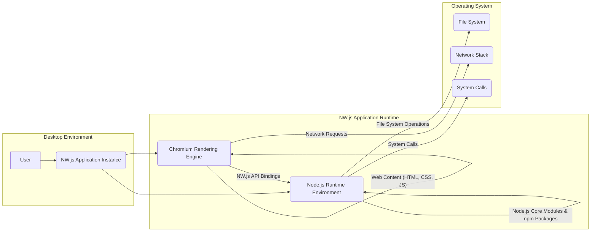
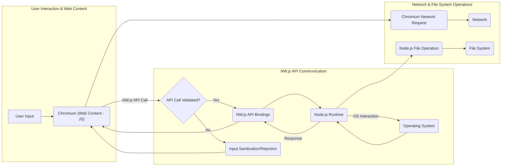

## Project Design Document: NW.js (Improved)

**Document Version:** 1.1
**Date:** October 26, 2023
**Author:** AI Software Architect

### 1. Introduction

This document provides an enhanced architectural design of the NW.js project (formerly Node-Webkit), based on the information available at [https://github.com/nwjs/nw.js](https://github.com/nwjs/nw.js). This improved design document aims to provide a more detailed and nuanced understanding of the project's architecture, specifically tailored for effective threat modeling. It elaborates on key components, their interactions, data flow with a security focus, and potential security considerations with more specific examples.

### 2. Project Overview

NW.js is a mature open-source framework enabling the development of desktop applications using web technologies (HTML, CSS, JavaScript). It achieves this by tightly integrating the Chromium rendering engine and the Node.js runtime within a single application context. This unique architecture grants developers the power of web development alongside access to native operating system capabilities, fostering the creation of cross-platform desktop applications.

### 3. Goals and Objectives

* **Empower web developers for desktop application creation:** Offer a familiar and efficient development paradigm for web developers to build native-like desktop applications.
* **Bridge web technologies with native OS functionalities:** Provide a robust set of APIs to interact with the underlying operating system, including file system manipulation, system notifications, window management, and more.
* **Facilitate flexible application packaging and distribution:**  Enable developers to package their applications seamlessly for various desktop operating systems (Windows, macOS, Linux).
* **Maintain adherence to modern web standards:** Ensure compatibility and leverage the latest advancements in web technologies through the embedded Chromium engine's continuous updates.
* **Deliver a stable and performant runtime environment:** Guarantee the reliability and efficiency of applications built upon the NW.js framework.

### 4. Architectural Design

The architecture of NW.js comprises several interconnected components, each playing a crucial role in the application's functionality and security profile:

* **Chromium Rendering Engine:**
    * The core component responsible for parsing and rendering web content (HTML, CSS, JavaScript).
    * Manages the Document Object Model (DOM) and executes JavaScript code within a sandboxed environment.
    * Handles network requests initiated by web content, enforcing browser security policies.
    * Provides essential browser functionalities like navigation, history management, and developer tools.
* **Node.js Runtime Environment:**
    * A server-side JavaScript runtime built on Chrome's V8 JavaScript engine.
    * Provides access to operating system functionalities through its core modules (e.g., `fs`, `net`, `os`).
    * Enables the use of a vast ecosystem of third-party libraries available through npm.
    * Operates outside the Chromium sandbox but interacts with it through defined interfaces.
* **NW.js API Bindings (Internal Communication Bridge):**
    * A critical layer facilitating bidirectional communication and interaction between the Chromium engine and the Node.js runtime.
    * Exposes Node.js functionalities and custom NW.js APIs to the JavaScript context running within Chromium.
    * Handles the marshaling and unmarshaling of data between the two environments.
    * This bridge is a key area for security considerations due to its privileged nature.
* **Native Operating System Interface:**
    * The underlying operating system providing essential services and resources to the NW.js application.
    * Includes the file system, network stack, process management, and system call interface.
    * Interactions with the OS are primarily mediated through the Node.js runtime and its modules.
* **Application Code (Developer's Logic):**
    * The HTML, CSS, and JavaScript code authored by the developer to define the application's behavior and user interface.
    * This code resides within the Chromium rendering context and can interact with Node.js functionalities via the NW.js APIs.
* **Packaging and Distribution System:**
    * Tools and processes for bundling the application code, the NW.js runtime, and necessary dependencies into platform-specific distributable packages.

#### 4.1. High-Level Architecture Diagram

#### 4.2. Component Descriptions (Enhanced)

* **User:** The individual interacting with the deployed NW.js application. Their actions initiate data flow and trigger application logic.
* **NW.js Application Instance:** A running instance of the packaged desktop application, encompassing both the Chromium and Node.js runtimes.
* **Chromium Rendering Engine:**  A sophisticated browser engine responsible for rendering the user interface, executing client-side JavaScript, and enforcing web security policies within its sandbox.
* **Node.js Runtime Environment:**  Provides a server-side JavaScript execution environment, granting access to OS-level functionalities and enabling the use of a vast library ecosystem.
* **NW.js API Bindings (Internal Communication Bridge):** A crucial, potentially privileged interface that allows secure (or insecure, if misused) communication and feature sharing between the sandboxed Chromium environment and the more privileged Node.js environment. This is a prime target for security scrutiny.
* **Web Content (HTML, CSS, JS):** The developer-authored code defining the application's UI and client-side logic, operating within the security constraints of the Chromium sandbox.
* **Node.js Core Modules & npm Packages:**  Built-in modules and third-party libraries extending the capabilities of the Node.js runtime, potentially introducing security vulnerabilities if not carefully managed.
* **File System:** The operating system's hierarchical file storage system, accessed by the Node.js runtime for reading, writing, and manipulating files. Access permissions are critical here.
* **Network Stack:** The operating system's network subsystem, utilized by both Chromium for web requests and Node.js for various network operations.
* **System Calls:** Direct requests from the Node.js runtime to the operating system kernel for low-level operations, requiring careful handling to prevent security breaches.

#### 4.3. Data Flow (Security Focused)

The flow of data within an NW.js application is a critical aspect for threat modeling. Understanding how data moves between components helps identify potential points of vulnerability:

* **User Interaction and Web Content:**
    * The user interacts with the application's UI rendered by Chromium.
    * User input (e.g., text, clicks) is captured by JavaScript within the web content.
    * **Security Consideration:**  Unsanitized user input can lead to XSS vulnerabilities if directly rendered or used in DOM manipulation.
* **Communication via NW.js API Bindings:**
    * JavaScript in the web content can invoke NW.js APIs to access Node.js functionalities.
    * Data passed through these APIs needs careful validation and sanitization on both sides to prevent injection attacks.
    * **Security Consideration:**  Improperly secured API calls can allow malicious web content to execute arbitrary code in the Node.js context, bypassing the Chromium sandbox.
* **Node.js Processing and OS Interaction:**
    * The Node.js runtime receives requests from the Chromium environment via the API bindings.
    * Node.js code can interact with the operating system (file system, network, etc.) based on these requests.
    * **Security Consideration:**  Vulnerabilities in Node.js modules or insecure coding practices can lead to unauthorized file access, network attacks, or even system compromise.
* **Data Retrieval and Response:**
    * Data retrieved or processed by Node.js is passed back through the NW.js API bindings to the Chromium environment.
    * This data is then used to update the UI or trigger further actions in the web content.
    * **Security Consideration:**  Sensitive data transmitted through the API bindings should be protected against eavesdropping or tampering.
* **Network Communication (Chromium):**
    * Chromium handles standard web requests initiated by the web content.
    * **Security Consideration:**  Standard web security practices (HTTPS, Content Security Policy) are crucial to mitigate risks associated with network communication.
* **Network Communication (Node.js):**
    * Node.js can initiate network requests independently of the Chromium context.
    * **Security Consideration:**  Insecure network configurations or vulnerabilities in Node.js networking libraries can expose the application to attacks.
* **File System Access (Node.js):**
    * Node.js has direct access to the file system.
    * **Security Consideration:**  Improperly validated file paths or insecure file handling can lead to LFI/RFI vulnerabilities or unauthorized data access.

### 5. Security Considerations (Detailed)

Given the tight integration of web technologies and native capabilities, NW.js applications present a unique set of security challenges. Threat modeling should focus on the following areas:

* **Cross-Site Scripting (XSS) Exploitation:**
    * **Threat:** Malicious JavaScript injected into the web content can execute within the Chromium context, potentially accessing sensitive data or leveraging NW.js APIs to interact with the underlying OS.
    * **Example:** An attacker could inject a script that reads local files via a vulnerable NW.js API if proper input sanitization is lacking.
* **Remote Code Execution (RCE) Vulnerabilities:**
    * **Threat:** Exploits in the Chromium engine or Node.js runtime could allow attackers to execute arbitrary code on the user's machine with the privileges of the application.
    * **Example:** A vulnerability in the V8 JavaScript engine (used by both Chromium and Node.js) could be exploited to gain code execution.
* **Supply Chain Attacks via Malicious Node.js Modules:**
    * **Threat:**  Dependencies on compromised or malicious Node.js modules can introduce vulnerabilities or backdoors into the application.
    * **Example:** A seemingly harmless npm package could contain malicious code that exfiltrates data or compromises the system.
* **Insecure Usage of NW.js APIs:**
    * **Threat:**  Improper or insecure use of NW.js APIs that grant access to sensitive OS functionalities can be exploited by malicious web content.
    * **Example:**  Using the `nw.Shell.openItem()` API with unsanitized user input could allow an attacker to open arbitrary files or directories.
* **Protocol Handler Vulnerabilities:**
    * **Threat:**  Custom protocol handlers registered by the application can be vulnerable to injection attacks if not properly validated.
    * **Example:** A custom protocol handler could be exploited to execute arbitrary commands if it doesn't sanitize the input it receives.
* **Local File Inclusion (LFI) and Path Traversal:**
    * **Threat:**  If the application handles file paths insecurely, attackers might be able to access or execute arbitrary files on the user's system.
    * **Example:**  Using user-provided file paths directly in Node.js's `fs.readFile()` without proper validation could allow access to sensitive system files.
* **Insecure Inter-Process Communication (IPC):**
    * **Threat:**  The communication channel between Chromium and Node.js could be targeted to inject malicious commands or data, potentially bypassing security boundaries.
    * **Example:**  If the API bindings don't properly validate data passed between the two processes, an attacker might be able to manipulate Node.js into performing unintended actions.
* **Vulnerabilities in the Update Mechanism:**
    * **Threat:**  A compromised update mechanism could allow attackers to distribute malicious updates, effectively gaining control over user machines.
    * **Example:**  If the update process doesn't verify the authenticity of updates, an attacker could push a fake update containing malware.
* **Third-Party Library Vulnerabilities (Both Web and Node.js):**
    * **Threat:**  Vulnerabilities in any third-party libraries used by the application (both in the web content and Node.js parts) can be exploited.
    * **Example:**  A vulnerable JavaScript library used for UI rendering could be exploited to inject malicious code.
* **Data Exposure and Information Leaks:**
    * **Threat:**  Sensitive data handled by the application could be exposed due to insecure storage, transmission, or logging practices.
    * **Example:**  Storing API keys or user credentials in local storage without proper encryption.
* **Denial of Service (DoS) Attacks:**
    * **Threat:**  The application could be vulnerable to DoS attacks targeting either the Chromium rendering engine or the Node.js runtime, making the application unresponsive.
    * **Example:**  Sending a large number of requests to a specific endpoint could overwhelm the Node.js server.

### 6. Deployment

Deployment of NW.js applications typically involves packaging the application and its dependencies into platform-specific bundles:

* **Packaging Process:**
    * Bundling the application's HTML, CSS, and JavaScript files.
    * Including the necessary NW.js runtime binaries for the target operating system.
    * Packaging any required Node.js modules and native dependencies.
    * Creating platform-specific installers or application bundles (e.g., `.exe`, `.app`, `.deb`).
* **Distribution Methods:**
    * Direct download from the developer's website.
    * Distribution through application stores (e.g., Microsoft Store, macOS App Store).
    * Deployment via enterprise software distribution systems.
* **Installation Procedure:**
    * Users download the application package.
    * The installer extracts the application files to the user's system.
    * Shortcuts and menu entries are created for easy access.
* **Auto-Update Mechanisms (Implementation Dependent):**
    * Some applications implement auto-update features to deliver new versions and security patches.
    * This often involves checking for updates on a remote server and downloading/installing them in the background.

### 7. Technologies Used

* **Core Components:**
    * Chromium: The open-source browser engine providing rendering and web functionalities.
    * Node.js: The JavaScript runtime environment enabling server-side capabilities.
* **Programming Languages:**
    * JavaScript: The primary language for application logic in both the web content and Node.js environments.
    * HTML: Used for structuring the user interface.
    * CSS: Used for styling the user interface.
    * C/C++: The languages in which Chromium and Node.js are primarily implemented.
* **Key Libraries and Frameworks:**
    * npm (Node Package Manager): For managing Node.js dependencies.
    * Potentially various JavaScript frameworks and libraries for UI development (e.g., React, Angular, Vue.js).
* **Operating System Specific APIs:**
    * Utilized through Node.js modules for native integration.

### 8. Future Considerations

* **Enhanced Security Measures:**
    * Continuous monitoring for and patching of vulnerabilities in Chromium, Node.js, and NW.js itself.
    * Exploring and implementing stricter security policies and sandboxing techniques.
    * Providing developers with better tools and guidance for building secure NW.js applications.
* **Performance Improvements:**
    * Optimizing the runtime performance of both Chromium and Node.js within the NW.js context.
    * Exploring ways to reduce the application's footprint and resource consumption.
* **API Expansion and Refinement:**
    * Adding new APIs to expose more native functionalities to developers.
    * Revisiting existing APIs to improve their security and usability.
* **Streamlined Packaging and Distribution:**
    * Simplifying the process of packaging and distributing applications across different platforms.
    * Potentially integrating with modern application deployment technologies.
* **Adoption of Modern Web Standards:**
    * Ensuring compatibility with the latest web standards and browser features as they evolve.

This improved design document provides a more detailed and security-focused perspective on the NW.js architecture. It highlights potential threat vectors and emphasizes the importance of secure development practices when building applications with this framework. This document serves as a valuable resource for conducting thorough threat modeling and implementing appropriate security mitigations.