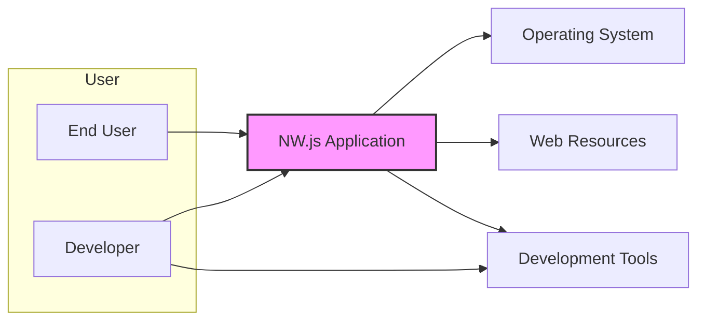
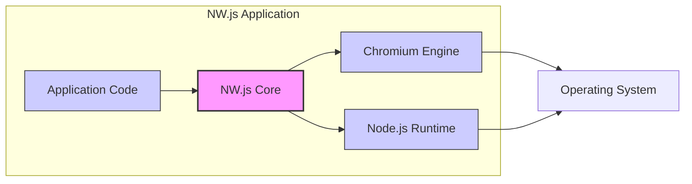
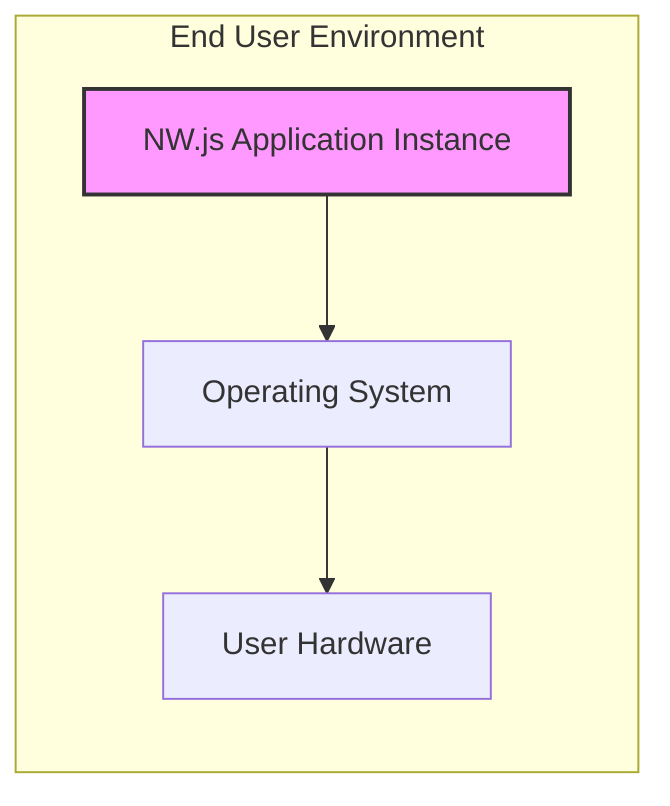

# BUSINESS POSTURE

- Business Priorities and Goals:
  - Enable developers to build cross-platform desktop applications using web technologies (HTML, CSS, JavaScript).
  - Provide a runtime environment that bridges web application capabilities with native desktop functionalities.
  - Offer a faster development cycle for desktop applications by leveraging web development skills and ecosystems.
  - Support a wide range of operating systems (Windows, macOS, Linux) with a single codebase.
  - Allow web applications to access native system resources and APIs through Node.js integration.

- Business Risks:
  - Security vulnerabilities inherent in web technologies (e.g., XSS, CSRF) can be introduced into desktop applications.
  - Compatibility issues across different operating systems and hardware configurations.
  - Performance limitations compared to native desktop applications, especially for resource-intensive tasks.
  - Dependency on Chromium and Node.js projects, including their release cycles and security updates.
  - Potential for misuse of Node.js APIs to create applications with excessive system privileges or malicious functionalities.
  - Open source project sustainability and community support impacting long-term project viability.

# SECURITY POSTURE

- Existing Security Controls:
  - security control: Chromium Security Model: nw.js leverages the security features of the embedded Chromium browser, including sandboxing and process isolation for web content. (Implemented within Chromium engine)
  - security control: Node.js Security Features: nw.js integrates Node.js, which has its own set of security considerations and best practices. (Implemented within Node.js runtime)
  - security control: Regular Updates: nw.js project aims to keep Chromium and Node.js components updated to address known security vulnerabilities. (Described in project release notes and update mechanisms)
  - accepted risk: Web Application Security Risks: Applications built with nw.js are susceptible to common web application vulnerabilities if not developed securely.
  - accepted risk: Node.js API Security Risks: Uncontrolled access to Node.js APIs from web content can introduce security risks if not managed properly by application developers.
  - accepted risk: Dependency Vulnerabilities: Vulnerabilities in Chromium, Node.js, or other dependencies can affect nw.js applications.

- Recommended Security Controls:
  - security control: Secure Development Guidelines: Provide comprehensive guidelines and best practices for developers to build secure nw.js applications, covering topics like input validation, output encoding, and secure API usage.
  - security control: Security Audits: Conduct regular security audits of the nw.js codebase and its dependencies to identify and address potential vulnerabilities.
  - security control: Vulnerability Scanning: Integrate automated vulnerability scanning tools into the development and build process to detect known vulnerabilities in dependencies and application code.
  - security control: Content Security Policy (CSP): Encourage and provide guidance for developers to implement Content Security Policy in their nw.js applications to mitigate XSS attacks.
  - security control: Subresource Integrity (SRI): Promote the use of Subresource Integrity for external resources loaded by nw.js applications to prevent tampering.
  - security control: Secure Update Mechanism: Implement a secure and reliable mechanism for updating nw.js runtime and applications to patch security vulnerabilities and deliver new features.

- Security Requirements:
  - Authentication:
    - Requirement: Applications may need to implement their own authentication mechanisms if user identity verification is required. nw.js itself does not enforce specific authentication methods.
    - Implementation: Application-level implementation using web technologies (e.g., forms-based authentication, OAuth) or Node.js modules for native authentication.
  - Authorization:
    - Requirement: Applications must implement authorization controls to manage user access to resources and functionalities within the application.
    - Implementation: Application-level implementation based on user roles, permissions, or policies, potentially leveraging Node.js for backend authorization logic.
  - Input Validation:
    - Requirement: All user inputs and external data must be validated to prevent injection attacks (e.g., XSS, SQL injection if using databases within the application).
    - Implementation: Input validation should be performed both on the client-side (JavaScript) and server-side (Node.js) where applicable. Utilize input sanitization and validation libraries.
  - Cryptography:
    - Requirement: Applications that handle sensitive data must use appropriate cryptographic measures to protect data in transit and at rest.
    - Implementation: Leverage Web Crypto API for client-side cryptography and Node.js crypto module for server-side or application-level cryptography. Ensure proper key management and secure storage of cryptographic keys.

# DESIGN

## C4 CONTEXT



- Context Diagram Elements:
  - - Name: End User
    - Type: Person
    - Description: Users who run applications built with NW.js.
    - Responsibilities: Use and interact with desktop applications created using NW.js.
    - Security controls: Operating System level security controls, application-level authorization within NW.js applications.
  - - Name: Developer
    - Type: Person
    - Description: Software developers who use NW.js to build desktop applications.
    - Responsibilities: Develop, test, and deploy desktop applications using NW.js, adhering to secure coding practices.
    - Security controls: Secure Development Lifecycle practices, code reviews, vulnerability scanning of developed applications.
  - - Name: NW.js Application
    - Type: Software System
    - Description: Desktop applications built using NW.js, embedding web technologies and Node.js.
    - Responsibilities: Provide desktop application functionalities, render user interfaces using web technologies, access system resources via Node.js APIs.
    - Security controls: Chromium security model, Node.js security features, application-level security controls (authentication, authorization, input validation, cryptography).
  - - Name: Operating System
    - Type: Software System
    - Description: Underlying operating system (Windows, macOS, Linux) on which NW.js applications run.
    - Responsibilities: Provide system resources and APIs to NW.js applications, enforce operating system level security policies.
    - Security controls: OS-level access controls, firewalls, anti-malware software, kernel-level security features.
  - - Name: Web Resources
    - Type: External System
    - Description: External web servers and services that NW.js applications may interact with (e.g., for data fetching, updates).
    - Responsibilities: Provide data, content, or services to NW.js applications over the internet.
    - Security controls: HTTPS for secure communication, server-side security controls, API authentication and authorization.
  - - Name: Development Tools
    - Type: Software System
    - Description: Tools used by developers to build NW.js applications (e.g., IDEs, code editors, build tools, package managers).
    - Responsibilities: Facilitate the development, testing, and packaging of NW.js applications.
    - Security controls: Secure software development tools, access controls to development environments, code repository security.

## C4 CONTAINER



- Container Diagram Elements:
  - - Name: NW.js Core
    - Type: Application
    - Description: The core component of NW.js that bridges Chromium and Node.js, providing APIs and functionalities to combine web and native capabilities.
    - Responsibilities: Manage the lifecycle of Chromium and Node.js instances, expose NW.js specific APIs, handle inter-process communication between web content and Node.js.
    - Security controls: API access control, process isolation, integration with Chromium and Node.js security features.
  - - Name: Chromium Engine
    - Type: Container
    - Description: The embedded Chromium browser engine responsible for rendering web content and executing JavaScript code within the application.
    - Responsibilities: Rendering HTML, CSS, and JavaScript, enforcing web security policies (e.g., same-origin policy, CSP), handling network requests for web content.
    - Security controls: Chromium's sandboxing, process isolation, site isolation, security updates from Chromium project.
  - - Name: Node.js Runtime
    - Type: Container
    - Description: The embedded Node.js runtime environment that allows access to native system APIs and functionalities from JavaScript code within the application.
    - Responsibilities: Execute JavaScript code in a Node.js environment, provide access to Node.js core modules and npm packages, handle system-level operations.
    - Security controls: Node.js security features, module security audits, access control to Node.js APIs within the application context.
  - - Name: Application Code
    - Type: Container
    - Description: The JavaScript, HTML, and CSS code developed by application developers that defines the application's logic and user interface.
    - Responsibilities: Implement application functionalities, handle user interactions, manage application data, interact with NW.js APIs and Node.js modules.
    - Security controls: Application-level security controls (authentication, authorization, input validation, cryptography), secure coding practices, vulnerability scanning of application code.

## DEPLOYMENT

- Deployment Architecture:
  - NW.js applications are typically deployed as standalone executables packaged for specific operating systems (Windows, macOS, Linux). Each executable contains the NW.js runtime, Chromium engine, Node.js runtime, and the application code.



- Deployment Diagram Elements:
  - - Name: End User Environment
    - Type: Deployment Environment
    - Description: The target environment where the NW.js application is deployed and executed, typically a user's personal computer.
    - Responsibilities: Provide the runtime environment for the NW.js application, including operating system and hardware resources.
    - Security controls: End-user's responsibility to maintain a secure operating system and hardware, potentially using OS-level security controls and anti-malware software.
  - - Name: Operating System
    - Type: Infrastructure
    - Description: The operating system (Windows, macOS, Linux) installed on the end-user's machine.
    - Responsibilities: Provide system-level services and resources to the NW.js application.
    - Security controls: OS-level access controls, firewalls, security updates, user account management.
  - - Name: User Hardware
    - Type: Infrastructure
    - Description: The physical hardware (computer, laptop) on which the operating system and NW.js application are running.
    - Responsibilities: Provide physical resources for the application to run.
    - Security controls: Physical security of the hardware, hardware-level security features (e.g., TPM).
  - - Name: NW.js Application Instance
    - Type: Software Instance
    - Description: A running instance of the packaged NW.js application on the end-user's machine.
    - Responsibilities: Execute the application logic, render the user interface, interact with the operating system and user.
    - Security controls: Application-level security controls, leveraging NW.js runtime and OS security features.

## BUILD

```mermaid
graph LR
    DEV[Developer] --> VCS[Version Control System (e.g., GitHub)]
    VCS --> BUILD_SYS[Build System (e.g., GitHub Actions, Local Build)]
    BUILD_SYS --> SAST[SAST Scanners & Linters]
    BUILD_SYS --> PACKAGE[Package/Artifact Creation]
    PACKAGE --> DIST[Distribution Repository]

    style BUILD_SYS fill:#f9f,stroke:#333,stroke-width:2px
```

- Build Process Elements:
  - - Name: Developer
    - Type: Person
    - Description: Software developer writing and committing code for the NW.js application.
    - Responsibilities: Write secure code, perform local testing, commit code changes to the version control system.
    - Security controls: Secure coding practices, local development environment security, code review before committing.
  - - Name: Version Control System (e.g., GitHub)
    - Type: Software System
    - Description: Repository for storing and managing the application's source code.
    - Responsibilities: Source code management, version control, access control to the codebase.
    - Security controls: Access control lists, branch protection, audit logs, vulnerability scanning of dependencies in the repository.
  - - Name: Build System (e.g., GitHub Actions, Local Build)
    - Type: Software System
    - Description: Automated or manual system responsible for compiling, building, and packaging the NW.js application.
    - Responsibilities: Automate the build process, compile code, run tests, package application artifacts, perform security checks.
    - Security controls: Secure build environment, access control to build system, build process integrity, dependency management, security scanning integration.
  - - Name: SAST Scanners & Linters
    - Type: Software System
    - Description: Static Application Security Testing tools and code linters integrated into the build process to identify potential security vulnerabilities and code quality issues.
    - Responsibilities: Automatically analyze source code for security flaws and coding standard violations.
    - Security controls: Regularly updated rule sets, integration into the build pipeline, reporting of identified issues.
  - - Name: Package/Artifact Creation
    - Type: Process
    - Description: The step in the build process where the application is packaged into distributable artifacts (e.g., executables for different platforms).
    - Responsibilities: Create platform-specific packages, sign artifacts (code signing), ensure package integrity.
    - Security controls: Secure packaging process, code signing with valid certificates, integrity checks (e.g., checksums) for distribution packages.
  - - Name: Distribution Repository
    - Type: Software System
    - Description: Repository or platform used to distribute the packaged NW.js application to end-users (e.g., website, app store).
    - Responsibilities: Host and distribute application packages, manage application updates, provide download access to users.
    - Security controls: Access control to distribution repository, secure distribution channels (HTTPS), integrity checks for downloaded packages, update mechanism security.

# RISK ASSESSMENT

- Critical Business Processes:
  - Development and distribution of cross-platform desktop applications using web technologies.
  - Enabling developers to leverage web development skills for desktop application creation.
  - Providing a runtime environment for executing web-based desktop applications.

- Data to Protect and Sensitivity:
  - Application Code: High sensitivity. Intellectual property, source of application functionality, vulnerabilities in code can be exploited.
  - User Data within Applications: Sensitivity depends on the application. Could range from low (application settings) to high (personal identifiable information, financial data). Sensitivity is defined by the purpose and functionality of each application built with NW.js.
  - Build Artifacts (Executables): Medium sensitivity. Integrity is crucial to prevent distribution of compromised applications.
  - Development Environment: Medium sensitivity. Access to development environment can lead to unauthorized code changes or data breaches.

# QUESTIONS & ASSUMPTIONS

- Questions:
  - What is the intended audience and use cases for applications built with NW.js? (e.g., internal tools, public-facing applications, specific industries).
  - What are the typical data sensitivity levels handled by applications built with NW.js?
  - What is the current level of security awareness and secure development practices among developers using NW.js?
  - Are there any specific regulatory compliance requirements for applications built with NW.js (e.g., GDPR, HIPAA)?
  - What is the process for reporting and addressing security vulnerabilities in NW.js and applications built with it?
  - What are the typical update frequencies for NW.js runtime and applications?

- Assumptions:
  - BUSINESS POSTURE: The primary business goal is to facilitate cross-platform desktop application development using web technologies, prioritizing developer productivity and platform compatibility. Security is a secondary but important consideration.
  - SECURITY POSTURE: Existing security controls rely heavily on the security features of Chromium and Node.js. Application developers are responsible for implementing application-level security controls. There is an accepted risk of web application vulnerabilities being introduced into desktop applications.
  - DESIGN: NW.js architecture is based on embedding Chromium and Node.js. Deployment is typically as standalone executables. Build process involves standard software development practices, but the level of security automation and checks may vary.