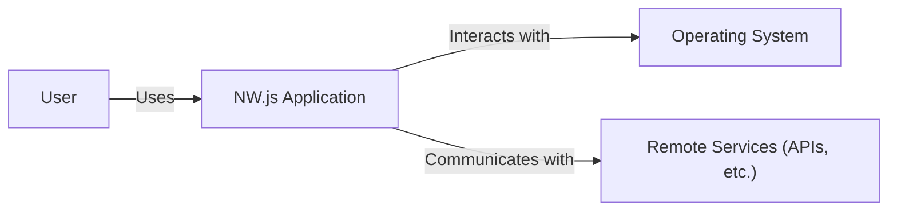
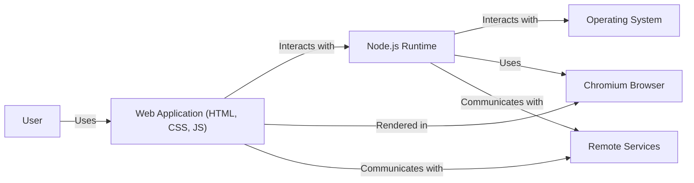
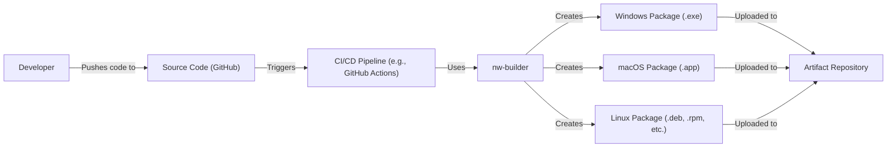
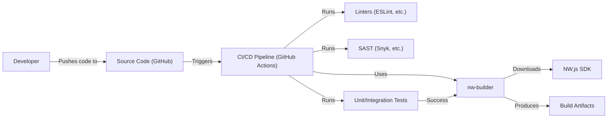

# Project Design Document: NW.js

## BUSINESS POSTURE

NW.js (previously known as node-webkit) allows developers to build cross-platform desktop applications using web technologies (HTML, CSS, JavaScript). It combines Node.js and Chromium, enabling applications to access native system APIs and resources directly from JavaScript. This approach simplifies desktop application development for web developers.

Business Priorities:

*   Enable rapid development of cross-platform desktop applications.
*   Leverage existing web development skills and tools.
*   Provide access to native system resources and APIs.
*   Maintain a consistent user experience across different operating systems.
*   Minimize the learning curve for developers familiar with web technologies.
*   Support a wide range of desktop application use cases.

Business Goals:

*   Become a leading framework for building desktop applications with web technologies.
*   Attract a large and active community of developers.
*   Provide a stable and reliable platform for building mission-critical applications.
*   Continuously improve performance and security.

Most Important Business Risks:

*   Security vulnerabilities in Chromium or Node.js could expose applications to attacks.
*   The complexity of integrating Chromium and Node.js could lead to stability issues.
*   Maintaining compatibility with different operating systems and versions could be challenging.
*   The project's reliance on open-source components introduces supply chain risks.
*   Competition from other desktop application development frameworks.
*   Failure to keep up with advancements in web technologies and security best practices.

## SECURITY POSTURE

Existing Security Controls:

*   security control: NW.js inherits security features from Chromium, including sandboxing, same-origin policy, and content security policy (CSP). (Implemented in Chromium)
*   security control: Node.js security updates are regularly integrated into NW.js. (Implemented in Node.js integration)
*   security control: NW.js provides mechanisms for controlling access to native APIs. (Described in NW.js documentation)
*   security control: The project uses GitHub for issue tracking and vulnerability reporting. (Implemented in GitHub repository)

Accepted Risks:

*   accepted risk: Applications built with NW.js are potentially vulnerable to the same types of attacks as web applications, such as cross-site scripting (XSS) and injection attacks.
*   accepted risk: The use of native APIs introduces potential security risks if not handled carefully.
*   accepted risk: The project's reliance on third-party libraries and dependencies introduces supply chain risks.

Recommended Security Controls:

*   security control: Implement a robust code signing process for NW.js releases.
*   security control: Conduct regular security audits and penetration testing of NW.js.
*   security control: Provide clear security guidelines and best practices for developers building applications with NW.js.
*   security control: Implement a vulnerability disclosure program with clear reporting procedures and timely response.
*   security control: Integrate automated security scanning tools into the build process (SAST, DAST, SCA).

Security Requirements:

*   Authentication:
    *   NW.js itself does not provide built-in authentication mechanisms. Authentication is the responsibility of the application built using NW.js. Applications should use secure authentication methods, such as OAuth 2.0 or OpenID Connect, where appropriate.
*   Authorization:
    *   Applications should implement appropriate authorization controls to restrict access to sensitive resources and functionality based on user roles and permissions. NW.js's access to native APIs should be carefully controlled and limited to the minimum necessary privileges.
*   Input Validation:
    *   Applications must validate all user inputs to prevent injection attacks, such as XSS and SQL injection. This is particularly important when interacting with native APIs.
*   Cryptography:
    *   Applications should use strong cryptographic algorithms and libraries for secure communication (HTTPS), data storage, and password hashing. NW.js applications can leverage Node.js's crypto module or other cryptographic libraries.

## DESIGN

### C4 CONTEXT

Element Descriptions:

*   Element:
    *   Name: User
    *   Type: Person
    *   Description: A person who interacts with the NW.js application.
    *   Responsibilities: Interacts with the application's user interface, provides input, and receives output.
    *   Security controls: None (external to the system).

*   Element:
    *   Name: NW.js Application
    *   Type: Software System
    *   Description: A desktop application built using NW.js.
    *   Responsibilities: Provides application functionality, interacts with the operating system, and potentially communicates with remote services.
    *   Security controls: Inherits security features from Chromium and Node.js, application-specific security controls (authentication, authorization, input validation, etc.).

*   Element:
    *   Name: Operating System
    *   Type: Software System
    *   Description: The underlying operating system (Windows, macOS, Linux).
    *   Responsibilities: Provides system resources and APIs to the NW.js application.
    *   Security controls: Operating system-level security controls (user accounts, file permissions, etc.).

*   Element:
    *   Name: Remote Services
    *   Type: Software System
    *   Description: External services (APIs, databases, etc.) that the NW.js application may interact with.
    *   Responsibilities: Provides specific services or data to the application.
    *   Security controls: Security controls implemented by the remote services (authentication, authorization, etc.).

### C4 CONTAINER

Element Descriptions:

*   Element:
    *   Name: User
    *   Type: Person
    *   Description: A person who interacts with the NW.js application.
    *   Responsibilities: Interacts with the application's user interface, provides input, and receives output.
    *   Security controls: None (external to the system).

*   Element:
    *   Name: Web Application (HTML, CSS, JS)
    *   Type: Container
    *   Description: The front-end of the NW.js application, built using web technologies.
    *   Responsibilities: Provides the user interface and handles user interactions.
    *   Security controls: Input validation, output encoding, content security policy (CSP).

*   Element:
    *   Name: Node.js Runtime
    *   Type: Container
    *   Description: The Node.js runtime environment.
    *   Responsibilities: Executes server-side JavaScript code, provides access to native APIs, and interacts with the operating system.
    *   Security controls: Secure coding practices, access control to native APIs, regular security updates.

*   Element:
    *   Name: Chromium Browser
    *   Type: Container
    *   Description: The embedded Chromium browser.
    *   Responsibilities: Renders the web application's UI and provides a JavaScript execution environment.
    *   Security controls: Sandboxing, same-origin policy, regular security updates.

*   Element:
    *   Name: Operating System
    *   Type: Software System
    *   Description: The underlying operating system (Windows, macOS, Linux).
    *   Responsibilities: Provides system resources and APIs.
    *   Security controls: Operating system-level security controls.

*   Element:
    *   Name: Remote Services
    *   Type: Software System
    *   Description: External services (APIs, databases, etc.) that the NW.js application may interact with.
    *   Responsibilities: Provides specific services or data to the application.
    *   Security controls: Security controls implemented by the remote services.

### DEPLOYMENT

Possible Deployment Solutions:

1.  Manual Packaging: Manually creating application packages for each target operating system (Windows, macOS, Linux).
2.  NW.js Builder: Using a tool like `nw-builder` to automate the packaging process.
3.  Continuous Integration/Continuous Deployment (CI/CD): Integrating the packaging and distribution process into a CI/CD pipeline.

Chosen Solution (NW.js Builder with CI/CD):

Element Descriptions:

*   Element:
    *   Name: Developer
    *   Type: Person
    *   Description: A developer working on the NW.js application.
    *   Responsibilities: Writes code, commits changes, and pushes to the source code repository.
    *   Security controls: Code review, secure coding practices.

*   Element:
    *   Name: Source Code (GitHub)
    *   Type: Repository
    *   Description: The source code repository for the NW.js application.
    *   Responsibilities: Stores the application's code and tracks changes.
    *   Security controls: Access control, branch protection rules.

*   Element:
    *   Name: CI/CD Pipeline (e.g., GitHub Actions)
    *   Type: System
    *   Description: The automated build and deployment pipeline.
    *   Responsibilities: Builds the application, runs tests, and creates application packages.
    *   Security controls: Secure configuration, limited access to secrets.

*   Element:
    *   Name: nw-builder
    *   Type: Tool
    *   Description: A command-line tool for building NW.js applications.
    *   Responsibilities: Packages the application's code and dependencies into executable files for different operating systems.
    *   Security controls: Uses official NW.js releases.

*   Element:
    *   Name: Windows Package (.exe)
    *   Type: Artifact
    *   Description: The Windows executable file for the application.
    *   Responsibilities: Runs the application on Windows.
    *   Security controls: Code signing.

*   Element:
    *   Name: macOS Package (.app)
    *   Type: Artifact
    *   Description: The macOS application package.
    *   Responsibilities: Runs the application on macOS.
    *   Security controls: Code signing, notarization.

*   Element:
    *   Name: Linux Package (.deb, .rpm, etc.)
    *   Type: Artifact
    *   Description: Linux application packages (e.g., .deb, .rpm).
    *   Responsibilities: Runs the application on Linux distributions.
    *   Security controls: Package signing.

*   Element:
    *   Name: Artifact Repository
    *   Type: System
    *   Description: A repository for storing the built application packages.
    *   Responsibilities: Stores and manages application releases.
    *   Security controls: Access control, integrity checks.

### BUILD

Build Process Description:

1.  Developer pushes code changes to the GitHub repository.
2.  GitHub Actions (or another CI/CD system) is triggered.
3.  The CI/CD pipeline performs the following steps:
    *   Runs linters (e.g., ESLint) to check for code style and potential errors.
    *   Runs Static Application Security Testing (SAST) tools (e.g., Snyk) to identify security vulnerabilities in the code and its dependencies.
    *   Executes unit and integration tests to ensure code quality and functionality.
    *   If all checks and tests pass, uses `nw-builder` to package the application.
    *   `nw-builder` downloads the NW.js SDK.
    *   `nw-builder` creates application packages for the target operating systems.
4.  The build artifacts (application packages) are produced.

Security Controls in Build Process:

*   security control: Linters (ESLint, etc.): Enforce coding standards and identify potential errors.
*   security control: SAST (Snyk, etc.): Detect security vulnerabilities in the code and dependencies.
*   security control: Unit/Integration Tests: Ensure code quality and functionality, reducing the risk of introducing vulnerabilities.
*   security control: Dependency Management: Use a package manager (npm, yarn) to manage dependencies and track known vulnerabilities.
*   security control: Secure CI/CD Configuration: Limit access to the CI/CD pipeline and protect secrets (API keys, credentials).
*   security control: Use official NW.js SDK releases.

## RISK ASSESSMENT

Critical Business Processes:

*   Providing a stable and reliable platform for building desktop applications.
*   Maintaining the security of applications built with NW.js.
*   Supporting developers in building cross-platform applications efficiently.

Data to Protect and Sensitivity:

*   Source code of NW.js: Medium sensitivity (impacts the integrity of the framework).
*   Developer and user data (if collected): Varies depending on the data collected by individual applications built with NW.js. Applications are responsible for protecting their own user data. NW.js itself does not inherently collect user data.
*   Build artifacts: Medium sensitivity (impacts the integrity of distributed applications).

## QUESTIONS & ASSUMPTIONS

Questions:

*   Are there any specific compliance requirements (e.g., GDPR, HIPAA) that applications built with NW.js need to adhere to?
*   What is the expected frequency of NW.js releases and security updates?
*   What is the process for reporting and handling security vulnerabilities in NW.js?
*   What level of support is provided to developers using NW.js?
*   Are there any plans to integrate additional security features into NW.js, such as enhanced sandboxing or runtime protection?

Assumptions:

*   BUSINESS POSTURE: The primary goal is to provide a robust and user-friendly framework for cross-platform desktop application development.
*   SECURITY POSTURE: Security is a high priority, and the project follows best practices for secure software development.
*   DESIGN: The design accurately reflects the architecture and components of NW.js. The CI/CD pipeline is assumed to be GitHub Actions, but other CI/CD systems could be used. The deployment process uses `nw-builder`, but other packaging tools could be used.