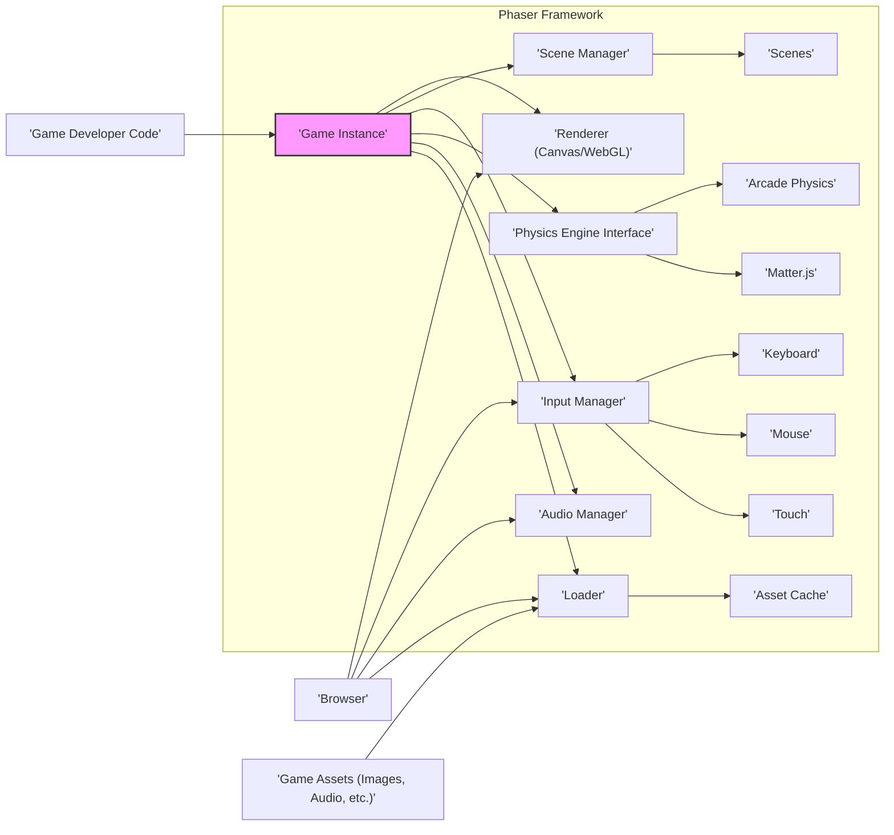
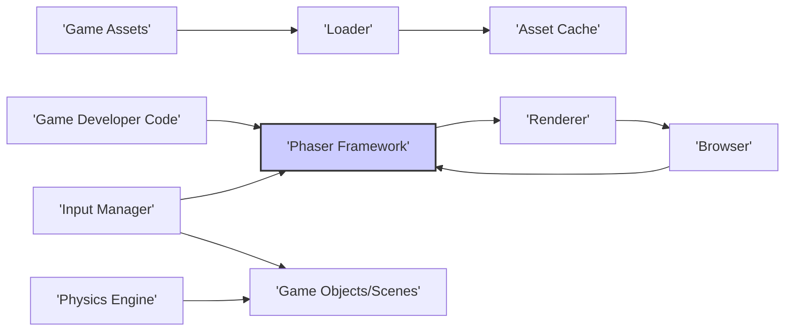

# Project Design Document: Phaser Game Development Framework

**Version:** 1.1
**Date:** October 26, 2023
**Author:** AI Software Architect

## 1. Project Overview

This document details the design of the Phaser game development framework, an open-source, HTML5 game framework primarily written in JavaScript and TypeScript. It targets desktop and mobile web browsers, offering both Canvas and WebGL renderers. This document serves as a foundational reference for understanding the framework's architecture and is a key input for subsequent threat modeling activities.

Phaser provides a rich set of APIs and tools for creating 2D games. Its features encompass rendering, comprehensive input handling, various physics engine integrations, robust audio management, and a flexible asset loading system. The framework is designed for extensibility and adaptability, enabling developers to create diverse game genres.

## 2. Goals and Objectives

*   To offer a high-performance and reliable 2D game development framework for web-based platforms.
*   To present a well-documented and intuitive API for game developers of varying skill levels.
*   To ensure broad compatibility by supporting both Canvas and WebGL rendering technologies.
*   To facilitate realistic and engaging game mechanics through seamless integration with established physics engines.
*   To provide an efficient and manageable system for loading and utilizing game assets.
*   To promote cross-browser functionality and the development of games that adapt to different screen sizes and resolutions.
*   To cultivate a vibrant and helpful community around the framework.

## 3. Target Audience

This document and the Phaser framework are primarily intended for:

*   Game developers (ranging from beginners to experienced professionals).
*   Web developers seeking to incorporate game development into their skill set.
*   Educators involved in teaching game development principles and practices.

## 4. System Architecture

Phaser employs a modular design, where distinct components handle specific aspects of game development. The core architecture can be visualized as follows:

**Key Architectural Components:**

*   **Game Instance:** The central orchestrator of the game. It initializes and manages all core subsystems, driving the main game loop.
*   **Renderer (Canvas/WebGL):** Responsible for the visual presentation of the game. Phaser abstracts the underlying rendering technology, allowing developers to target either Canvas 2D or WebGL.
*   **Scene Manager:** Handles the organization and lifecycle of different game states or levels (referred to as Scenes). It manages transitions, updates, and rendering for each Scene.
*   **Input Manager:** Provides a unified interface for handling user input from various sources, including keyboard, mouse, and touch events. It normalizes these inputs for consistent handling.
*   **Physics Engine Interface:**  Phaser doesn't implement its own physics engine directly but provides an interface for integrating with external physics libraries.
    *   **Arcade Physics:** A lightweight AABB (Axis-Aligned Bounding Box) based physics engine suitable for many 2D games.
    *   **Matter.js:** A more advanced 2D physics engine supporting complex shapes and constraints.
*   **Audio Manager:** Manages the playback of audio assets, including sound effects and music. It handles loading, playing, pausing, and controlling audio properties.
*   **Loader:**  Responsible for fetching and managing game assets from various sources. It provides mechanisms for tracking loading progress and handling different asset types.
*   **Scenes:** Represent distinct states within the game, such as menus, gameplay levels, or cutscenes. Each Scene has its own logic, manages its own game objects, and follows a defined lifecycle.
*   **Asset Cache:** A repository for storing loaded game assets in memory, enabling efficient access and reuse throughout the game.

## 5. Key Components and Interactions

This section elaborates on the key components and their interactions within the Phaser framework:

*   **Game Initialization:**
    *   The game development process begins with the developer instantiating a `Phaser.Game` object. This involves providing configuration details such as game dimensions, the desired rendering context (Canvas or WebGL), and the initial Scene to load.
    *   The `Game Instance` then initializes the core subsystems: `Renderer`, `Scene Manager`, `Input Manager`, `Audio Manager`, and `Loader`.
*   **Scene Management:**
    *   The `Scene Manager` maintains a collection of `Scene` objects.
    *   Developers define game states by creating `Scene` classes, which contain the specific logic for creating, updating, and rendering game elements within that state.
    *   The `Scene Manager` orchestrates transitions between different Scenes, invoking key lifecycle methods (e.g., `preload`, `create`, `update`, `render`) on the currently active Scene.
*   **Rendering:**
    *   The `Game Instance` drives the game loop, which alternates between update and render phases.
    *   During the render phase, the active `Scene` iterates through its display list, which contains all the visible game objects.
    *   The `Renderer` (either Canvas or WebGL) then draws each game object to the screen based on its properties, such as position, texture, and color.
*   **Input Handling:**
    *   The `Input Manager` actively listens for relevant browser events related to keyboard input, mouse movements and clicks, and touch interactions.
    *   It normalizes these raw browser events into a consistent and developer-friendly API.
    *   Game objects or the active `Scene` can subscribe to specific input events and implement custom logic to respond to user interactions.
*   **Physics Simulation:**
    *   When a physics engine is enabled for a game or a specific Scene, game objects can be assigned physics bodies.
    *   The chosen physics engine (e.g., Arcade Physics or Matter.js) simulates the movement and interactions of these bodies based on defined physical properties like mass, velocity, and collision boundaries.
    *   The `Scene`'s update loop typically includes a step to advance the physics simulation, updating the positions and states of physics-enabled objects.
*   **Audio Playback:**
    *   The `Audio Manager` provides methods for loading and playing various audio assets.
    *   Developers can trigger the playback of sound effects and background music, control the volume and playback rate, and manage the overall audio experience of the game.
*   **Asset Loading:**
    *   The `Loader` component is used to load game assets, such as images, audio files, and JSON data, from specified URLs or local storage.
    *   Developers typically specify the assets to be loaded within the `preload` method of a `Scene`.
    *   The `Loader` fetches these assets and stores them in the `Asset Cache`.
    *   Once loaded, assets can be easily accessed and utilized within the game using unique keys.

## 6. Data Flow

The primary data flow within a Phaser game involves the following interactions:

*   **Game Developer Code -> Phaser Framework:** Developers write JavaScript or TypeScript code that leverages the Phaser API to define game logic, create and manage Scenes, and manipulate game objects.
*   **Browser -> Phaser Framework:** The web browser provides essential functionalities to the framework, including input event streams (keyboard, mouse, touch), the rendering context (Canvas or WebGL API), and audio playback capabilities.
*   **Game Assets -> Loader -> Asset Cache:** Game assets are fetched from external sources (web servers, local file system) by the `Loader` component and subsequently stored in the `Asset Cache` for efficient retrieval and use.
*   **Phaser Framework -> Renderer -> Browser:** The `Renderer` translates the current game Scene into a series of drawing commands that are then executed by the browser's rendering engine (either the Canvas 2D API or the WebGL API).
*   **Input Manager -> Game Objects/Scenes:** The `Input Manager` processes raw input events from the browser and makes them available to relevant game objects and Scenes, enabling them to respond to user interactions.
*   **Physics Engine -> Game Objects:** The integrated physics engine calculates and updates the physical properties (position, velocity, rotation, etc.) of game objects that have been assigned physics bodies.

## 7. Security Considerations (Detailed)

While Phaser operates primarily on the client-side, security remains a crucial consideration, particularly when dealing with external resources and potentially user-generated content within the context of a game built with Phaser. Key areas of concern include:

*   **Cross-Site Scripting (XSS):** If a game built with Phaser loads or processes data originating from user input or external sources (e.g., level editors, chat systems, online leaderboards), it is imperative to implement robust sanitization and validation measures to prevent XSS attacks. This responsibility largely falls on the game developer utilizing the framework.
    *   **Threat:** Malicious scripts could be injected and executed within the user's browser, potentially leading to data theft, session hijacking, or defacement.
    *   **Mitigation:** Developers should sanitize all user-provided data before rendering it or using it within the game. Content Security Policy (CSP) can also be used to restrict the sources from which the browser can load resources.
*   **Asset Loading from Untrusted Sources:** Loading game assets (images, audio, scripts) from untrusted or unverified sources poses a security risk.
    *   **Threat:** Malicious assets could contain embedded scripts or exploit vulnerabilities in the browser or rendering engine.
    *   **Mitigation:** Developers should ensure that all game assets are loaded from trusted and reliable origins, preferably using HTTPS. Subresource Integrity (SRI) can be used to verify the integrity of fetched resources.
*   **Third-Party Library Vulnerabilities:** Phaser may integrate with or rely upon third-party libraries (e.g., physics engines, plugins). Vulnerabilities discovered in these external libraries could potentially impact the security of games built with Phaser.
    *   **Threat:** Exploits in third-party libraries could be leveraged to compromise the game's functionality or introduce security flaws.
    *   **Mitigation:** Regularly update Phaser and its dependencies to the latest versions, which often include security patches. Conduct security audits of third-party libraries used in the game.
*   **Data Injection Attacks:** If a Phaser-based game interacts with external services or databases (e.g., for storing game progress or user accounts), proper input validation and sanitization are essential to prevent data injection attacks (e.g., SQL injection, NoSQL injection). While this is primarily the responsibility of the backend and the game developer's integration logic, it's a relevant consideration.
    *   **Threat:** Attackers could inject malicious code into database queries or API requests, potentially leading to data breaches or unauthorized access.
    *   **Mitigation:** Implement strict input validation on the client-side and server-side. Use parameterized queries or prepared statements when interacting with databases. Follow secure coding practices for API interactions.
*   **Denial of Service (DoS):** While less direct, poorly optimized game logic, excessive asset loading, or vulnerabilities in the game's network communication could lead to performance issues and potentially a denial of service for the user.
    *   **Threat:** Users may experience crashes, freezes, or unresponsiveness, making the game unusable.
    *   **Mitigation:** Optimize game logic and asset loading procedures. Implement rate limiting and other defensive measures if the game involves network communication.
*   **Code Injection (Less Common but Possible):**  While generally discouraged, if a game dynamically evaluates code based on user input or external data, it could be vulnerable to code injection attacks.
    *   **Threat:** Attackers could inject arbitrary code that would be executed within the game's context.
    *   **Mitigation:** Avoid dynamic code evaluation based on untrusted input. If absolutely necessary, implement strict sandboxing and security measures.

**Note:** A dedicated and more in-depth threat model will be developed based on this design document to systematically identify specific vulnerabilities and propose detailed mitigation strategies.

## 8. Assumptions

*   The underlying web browser environment provides a baseline level of security and adheres to web standards.
*   Game developers utilizing the Phaser framework will adhere to secure coding practices and implement appropriate security measures when handling user input and external data.
*   External libraries and dependencies integrated with Phaser are actively maintained and updated with security considerations in mind.
*   Network communication for asset loading and interactions with external services will be conducted over secure protocols (HTTPS where applicable).

## 9. Out of Scope

This design document specifically focuses on the architectural design of the Phaser framework itself. The following aspects are considered outside the scope of this document:

*   The design and implementation details of specific games built using the Phaser framework.
*   The architecture and security of server-side infrastructure or backend services that a game might interact with.
*   Granular implementation details of individual Phaser classes, methods, or internal logic.
*   Specific security vulnerabilities or exploits within the browser environment itself.
*   Detailed performance optimization techniques and strategies for Phaser games.

This revised document provides a more detailed and comprehensive overview of the Phaser game development framework's architecture, offering a stronger foundation for subsequent threat modeling activities. The enhanced descriptions of components, interactions, and security considerations aim to provide a clearer understanding of the framework's design and potential security implications.