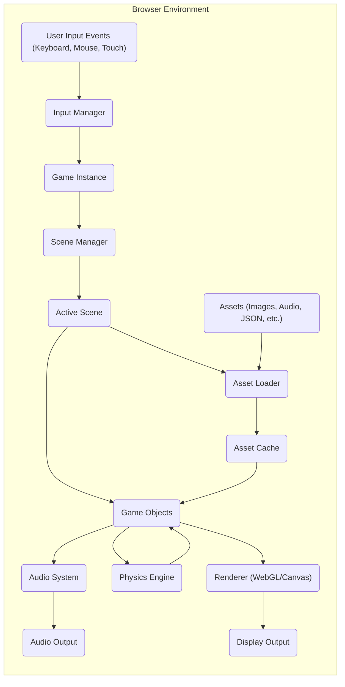

# Project Design Document: Phaser Game Engine

**Version:** 1.1
**Date:** October 26, 2023
**Author:** Gemini (AI Model)

## 1. Introduction

This document provides a detailed architectural design of the Phaser game engine, an open-source HTML5 game framework. This design is specifically created to serve as a foundation for subsequent threat modeling activities. It outlines the key components, data flow, and interactions within the Phaser framework, with a focus on potential security implications.

## 2. Goals

*   Provide a clear, concise, and comprehensive overview of the Phaser architecture relevant for security analysis.
*   Identify the major components and their specific responsibilities within the engine.
*   Illustrate the data flow within the engine, highlighting potential data transformation and interaction points.
*   Explicitly highlight potential areas of security concern and provide context for threat identification and analysis.

## 3. Scope

This document focuses on the core architecture of the Phaser engine itself, as it operates within a web browser environment. It does not cover:

*   Specific game implementations built using Phaser, as their logic and asset usage introduce unique security considerations.
*   Third-party plugins or extensions unless their functionality is deeply integrated into the core engine's operation. We acknowledge their existence as potential attack surfaces.
*   The Phaser editor or other external development tools.
*   Networked or multiplayer aspects beyond the basic handling of input events received from a network context (as processed by the browser). The security of backend services is out of scope.

## 4. Target Audience

*   Security engineers and architects responsible for performing threat modeling and security assessments of systems utilizing the Phaser framework.
*   Software developers seeking a deeper understanding of Phaser's architecture from a security perspective.

## 5. Architectural Overview

Phaser is a JavaScript-based game engine primarily designed for execution within web browsers. It leverages HTML5 Canvas and WebGL for rendering graphical content. The architecture can be broadly categorized into the following key functional areas:

*   **Core Engine Management:**  Initialization, game loop, and overall engine control.
*   **Rendering Pipeline:**  Handling the visual output of the game using either WebGL or Canvas.
*   **Input Handling System:**  Managing user interactions from various input devices.
*   **Asset Management System:**  Loading, caching, and managing game resources.
*   **Physics Simulation:** Enabling realistic interactions between game objects.
*   **Scene Management and Organization:** Structuring the game into manageable states.
*   **Audio Playback System:** Handling sound effects and music.

## 6. Component Breakdown

Here's a more detailed breakdown of the key components and their responsibilities:

*   **Game Object Factory:**
    *   Responsibility: Creates instances of various game objects (e.g., `Sprite`, `Text`, `Image`, `Graphics`).
    *   Details:  Handles object instantiation, initial property assignment, and integration with the scene.
*   **Scene Manager:**
    *   Responsibility: Manages the lifecycle of different scenes within the game (initialization, update loop, rendering, shutdown).
    *   Details: Controls scene transitions, manages active scenes, and provides hooks for scene-specific logic.
*   **Renderer (WebGL Renderer / Canvas Renderer):**
    *   Responsibility:  Draws game objects to the screen. Selects the appropriate rendering context (WebGL or Canvas).
    *   Details: Manages the rendering pipeline, including batching sprites for efficiency, applying shaders (in WebGL), and handling camera transformations.
*   **Input Manager:**
    *   Responsibility: Captures and processes user input events (keyboard, mouse, touch, gamepad).
    *   Details:  Normalizes input data, manages input states (e.g., key presses, mouse position), and dispatches events to relevant game objects or scene logic.
*   **Asset Loader:**
    *   Responsibility:  Downloads and parses game assets from various sources (local files, remote URLs).
    *   Details: Supports various asset types (images, audio, JSON, XML, text), handles loading progress, and provides callbacks upon completion.
*   **Cache:**
    *   Responsibility: Stores loaded assets in memory for quick retrieval, avoiding redundant loading.
    *   Details:  Organizes assets by type and key, providing methods for accessing cached resources.
*   **Physics Engine (e.g., Arcade Physics, Matter.js Integration):**
    *   Responsibility: Simulates physical interactions between game objects (collisions, movement, gravity).
    *   Details:  Manages physics bodies, performs collision detection, and updates object positions and velocities based on physical laws. Phaser often integrates with external physics libraries.
*   **Animation Manager:**
    *   Responsibility: Creates, manages, and plays animations for game objects.
    *   Details: Supports sprite sheet animations, frame-based animations, and potentially skeletal animations. Controls animation playback speed, looping, and events.
*   **Sound Manager:**
    *   Responsibility:  Handles the playback of audio assets (sound effects and music).
    *   Details: Provides controls for volume, panning, looping, and spatial audio (depending on the implementation).
*   **Time Step Manager (Game Loop):**
    *   Responsibility:  Manages the game loop, controlling the timing of updates and rendering.
    *   Details: Ensures a consistent frame rate and provides mechanisms for time-based calculations.
*   **Cameras:**
    *   Responsibility: Defines the viewport and controls how the game world is viewed on the screen.
    *   Details: Allows for scrolling, zooming, rotation, and other camera effects.

## 7. Data Flow

The following diagram illustrates the high-level data flow within a typical Phaser game instance running in a browser:

**Detailed Data Flow Description:**

*   **Initiation:** The game starts, and the **Game Instance** (`C`) is initialized.
*   **Input Capture:** User interactions generate **User Input Events** (`A`) within the browser.
*   **Input Processing:** The **Input Manager** (`B`) captures these events and normalizes the input data.
*   **Event Dispatch:** The **Input Manager** (`B`) dispatches input events to the **Game Instance** (`C`).
*   **Scene Management:** The **Game Instance** (`C`) delegates updates and rendering to the **Scene Manager** (`D`).
*   **Active Scene Logic:** The **Scene Manager** (`D`) activates and manages the **Active Scene** (`E`).
*   **Game Object Updates:** The **Active Scene** (`E`) updates the state and properties of its contained **Game Objects** (`F`).
*   **Asset Loading Trigger:**  The **Active Scene** (`E`) may trigger the **Asset Loader** (`G`) to load required **Assets** (`I`).
*   **Asset Retrieval:** The **Asset Loader** (`G`) fetches **Assets** (`I`) from local storage, network locations, etc.
*   **Asset Caching:** Loaded **Assets** (`I`) are stored in the **Asset Cache** (`H`).
*   **Asset Access:** **Game Objects** (`F`) retrieve necessary assets from the **Asset Cache** (`H`).
*   **Rendering Preparation:** **Game Objects** (`F`) provide their rendering data (textures, positions, etc.) to the **Renderer** (`J`).
*   **Physics Simulation:** **Game Objects** (`F`) interact with the **Physics Engine** (`N`), which calculates collisions and updates their physical properties. The **Physics Engine** (`N`) then updates the state of the **Game Objects** (`F`).
*   **Rendering Execution:** The **Renderer** (`J`) uses either WebGL or Canvas APIs to draw the **Game Objects** (`F`) onto the **Display Output** (`K`).
*   **Audio Playback Trigger:** **Game Objects** (`F`) or the **Active Scene** (`E`) can trigger the **Audio System** (`L`) to play sounds.
*   **Audio Output:** The **Audio System** (`L`) processes and outputs audio signals to the **Audio Output** (`M`).
*   **Game Loop Continuation:** The process repeats, driven by the game loop managed within the **Game Instance** (`C`).

## 8. Security Considerations (For Threat Modeling)

Based on the architectural overview and data flow, the following areas present potential security concerns and should be prioritized during threat modeling:

*   **Client-Side Script Injection (Cross-Site Scripting - XSS):**
    *   **Threat:** Malicious scripts could be injected into the game context, potentially through vulnerabilities in asset loading, user-provided content, or third-party integrations.
    *   **Examples:**
        *   A malicious image file could contain embedded JavaScript that executes when the image is processed or rendered.
        *   User-generated text displayed in the game could contain malicious script tags.
    *   **Consideration:** How does Phaser sanitize and validate data from external sources, including assets and user input? Are there mechanisms to prevent the execution of untrusted scripts?
*   **Dependency Vulnerabilities:**
    *   **Threat:** Phaser relies on various JavaScript libraries and browser APIs. Vulnerabilities in these dependencies could be exploited through Phaser.
    *   **Examples:**
        *   A vulnerability in the underlying WebGL implementation could be triggered by specific rendering operations in Phaser.
        *   A flaw in a third-party physics engine integrated with Phaser could be exploited through game object interactions.
    *   **Consideration:** What are Phaser's dependency management practices? How are vulnerabilities in dependencies identified and addressed?
*   **Asset Security and Integrity:**
    *   **Threat:** Malicious or compromised game assets could be loaded and executed, leading to various attacks.
    *   **Examples:**
        *   A manipulated audio file could exploit vulnerabilities in the browser's audio processing.
        *   A modified JSON data file could alter game logic or introduce unexpected behavior.
    *   **Consideration:** Does Phaser implement any mechanisms for verifying the integrity or authenticity of loaded assets (e.g., checksums, signatures)?
*   **Input Validation and Sanitization:**
    *   **Threat:** Improperly validated or sanitized user input could lead to unexpected behavior or vulnerabilities.
    *   **Examples:**
        *   Manipulated input events could trigger unintended game actions or bypass security checks.
        *   Large or malformed input could cause denial-of-service conditions.
    *   **Consideration:** How does Phaser validate and sanitize user input from different sources? Are there protections against input injection attacks?
*   **Rendering Pipeline Exploits:**
    *   **Threat:** Vulnerabilities in the WebGL or Canvas rendering pipeline could be exploited to cause crashes, information leaks, or even remote code execution.
    *   **Examples:**
        *   Crafted rendering commands could trigger driver bugs or browser vulnerabilities.
        *   Exploiting shader vulnerabilities in WebGL.
    *   **Consideration:** Does Phaser implement any security measures related to rendering, such as limiting resource usage or sanitizing rendering commands?
*   **State Management Issues:**
    *   **Threat:** Improper management of game state could lead to inconsistencies or vulnerabilities.
    *   **Examples:**
        *   Race conditions in state updates could lead to unpredictable behavior.
        *   Exploiting the order of operations in scene transitions.
    *   **Consideration:** How does Phaser ensure the integrity and consistency of the game state? Are there mechanisms to prevent unauthorized state modifications?
*   **Build Process Security:**
    *   **Threat:** The tools and processes used to build and package a Phaser game could be compromised, leading to the inclusion of malicious code.
    *   **Consideration:** While not directly part of the engine, understanding the typical build pipeline is relevant for a comprehensive threat model.

## 9. Deployment Considerations

Phaser games are typically deployed as static web assets (HTML, JavaScript, CSS, and associated assets) hosted on web servers or Content Delivery Networks (CDNs). Security considerations related to the hosting environment (e.g., server configuration, HTTPS enforcement, Content Security Policy) are crucial but are outside the direct scope of this document focusing on the engine itself.

## 10. Assumptions and Constraints

*   This design document represents a high-level architectural view and may not cover all internal implementation details of the Phaser engine.
*   The architecture described is based on the general understanding of Phaser's functionality and may have minor variations across different versions of the framework.
*   Security considerations are presented as potential areas of interest for further investigation and are not an exhaustive list of all possible vulnerabilities.

## 11. Future Considerations

*   Detailed analysis of specific Phaser modules (e.g., the WebGL renderer, the event system) and their internal workings from a security perspective.
*   Investigation of security best practices for developing secure Phaser games, including guidance for developers on mitigating the identified threats.
*   Analysis of the security implications of using various community-developed Phaser plugins and extensions, as these can introduce significant new attack surfaces.
