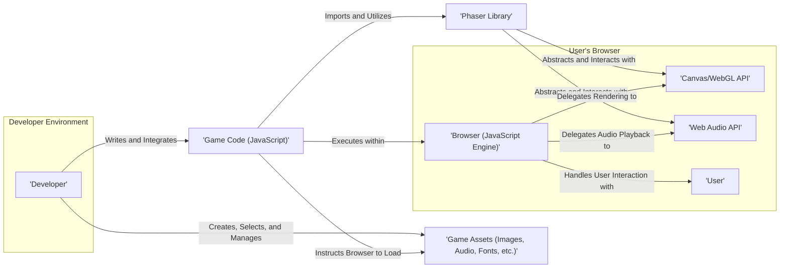
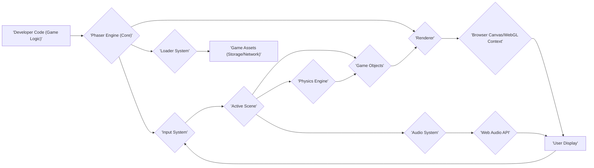

# Project Design Document: Phaser Game Development Framework

**Version:** 1.1
**Date:** October 26, 2023
**Authors:** Gemini (AI Model)

## 1. Introduction

This document provides an enhanced and more detailed design overview of the Phaser game development framework (as represented by the project at https://github.com/phaserjs/phaser). This document aims to capture the key architectural components, data flows, and interactions within the framework to facilitate future threat modeling activities. It focuses on the core functionalities, how developers utilize Phaser to create games, and potential security considerations arising from its architecture and usage.

## 2. Goals and Objectives

The primary goals of the Phaser framework are to:

* Provide a comprehensive, well-documented, and easy-to-use set of tools and APIs for 2D game development within modern web browsers.
* Offer robust cross-browser compatibility by leveraging established HTML5 technologies such as the Canvas API and WebGL API, while providing fallbacks where necessary.
* Significantly simplify common and complex game development tasks, including but not limited to: rendering, input handling across various devices, advanced physics simulations, and sophisticated audio management.
* Empower developers, regardless of their experience level, to create visually appealing and performant games using the widely adopted JavaScript programming language.
* Maintain its open-source nature, fostering a collaborative and community-driven development environment.

## 3. Target Audience

The primary target audience for Phaser includes:

* **Professional Game Developers:** Individuals or teams within game development studios utilizing web technologies for game creation and deployment.
* **Independent Game Developers (Indie Developers):**  Individual creators or small teams developing games as a hobby or for commercial purposes.
* **Web Developers with Game Development Aspirations:** Developers with existing JavaScript knowledge seeking to expand their skillset into the realm of interactive game development.
* **Educators and Students:**  Educational institutions and students using Phaser as a practical tool for learning and teaching game development principles and web technologies.
* **Hobbyists and Enthusiasts:** Individuals interested in game development as a pastime and exploring the capabilities of web-based game creation.

## 4. High-Level Architecture

Phaser operates as a client-side JavaScript library that is integrated directly into web pages. Developers leverage Phaser's extensive API to implement game logic, manage and manipulate game assets, and render interactive graphics within the user's web browser environment.

**Detailed Key Interactions:**

* **Developer Interaction:** Developers write JavaScript code, adhering to Phaser's API, to define game mechanics, create game entities, and manage the overall game flow. They are also responsible for sourcing, creating, and managing the various game assets required.
* **Phaser Library Integration:** The Phaser library, typically distributed as a JavaScript file or through a package manager, is included within the developer's project. This inclusion makes Phaser's functionalities accessible within the game code.
* **Browser Execution Environment:** When a user navigates to the web page hosting the game, the browser's built-in JavaScript engine interprets and executes the game code. This execution environment provides access to browser APIs.
* **Abstraction of Browser APIs:** Phaser acts as an abstraction layer over the underlying browser APIs like Canvas/WebGL for graphics rendering and the Web Audio API for sound. This simplifies cross-browser compatibility and provides a consistent API for developers.
* **Asynchronous Asset Loading:** Game code utilizes Phaser's loader to asynchronously fetch necessary game assets from the web server or local storage. This prevents blocking the main thread and ensures a smoother user experience.
* **Event-Driven User Interaction:** The browser captures user input events (keyboard presses, mouse clicks, touch events) and passes them to the executing game code. Phaser provides mechanisms to listen for and handle these events, triggering corresponding game actions.

## 5. Key Components

Phaser's architecture is modular, comprising several interconnected systems and components that work together to facilitate game development:

* **Core Engine (`Phaser.Core.Game`):**
    * Manages the fundamental game loop, orchestrating the update and render cycles at a defined frame rate.
    * Oversees the overall game lifecycle, including initialization, scene management, and resource disposal.
    * Provides core classes and utility functions essential for various aspects of the framework.
* **Renderer (`Phaser.Renderer.*`):**
    * Responsible for the visual presentation of game objects on the screen.
    * Offers multiple rendering contexts, primarily Canvas and WebGL, allowing Phaser to leverage hardware acceleration when available.
    * Manages the display list, determining the order in which objects are rendered, and handles camera operations for viewport management.
* **Scene Management (`Phaser.Scenes.SceneManager`, `Phaser.Scenes.Scene`):**
    * Enables developers to structure their game into distinct, logical units called scenes (e.g., main menu, gameplay level, pause screen).
    * Facilitates seamless transitions between scenes, allowing for organized game flow.
    * Provides mechanisms for managing scene-specific data and resources.
* **Game Objects (`Phaser.GameObjects.*`):**
    * Offers a rich set of pre-built visual and interactive elements, including sprites, images, text, geometric shapes, tilemaps, and more.
    * Provides methods and properties for manipulating these objects, such as position, rotation, scale, tinting, and alpha.
* **Input System (`Phaser.Input.*`):**
    * Provides a unified interface for capturing user input from various sources, including keyboard, mouse, touchscreens, and gamepads.
    * Emits events and offers methods for detecting and handling input actions, such as key presses, mouse clicks, and touch gestures.
* **Physics Engines (`Phaser.Physics.*`):**
    * Integrates with multiple physics engines (e.g., Arcade Physics for simpler simulations, Matter.js for more complex and realistic physics).
    * Handles collision detection, resolution, and the application of forces and gravity to game objects.
* **Animation System (`Phaser.Animations.*`):**
    * Enables the creation and management of frame-based animations for sprites and other game objects.
    * Supports sprite sheets (collections of animation frames) and provides tools for defining animation sequences and playback controls.
* **Audio System (`Phaser.Sound.*`):**
    * Provides functionalities for loading, playing, and manipulating sound effects and background music.
    * Leverages the browser's Web Audio API for advanced audio processing and spatialization.
* **Loader (`Phaser.Loader.*`):**
    * Manages the asynchronous loading of various game assets from different sources (local files, remote URLs).
    * Supports various asset types, including images, audio files, JSON data, and more.
    * Provides progress events and error handling mechanisms during the loading process.
* **Math and Utility Functions (`Phaser.Math.*`, `Phaser.Utils.*`):**
    * Offers a comprehensive collection of mathematical functions (geometry, trigonometry, random number generation) and utility classes for common game development tasks.
* **Plugins (`Phaser.Plugins.*`):**
    * Allows developers to extend Phaser's core functionality by creating or using third-party plugins.
    * Provides a mechanism for adding custom features and integrations without modifying the core Phaser library.

## 6. Data Flow

The typical data flow within a Phaser game can be visualized as follows:

**Detailed Data Flow Description:**

* **Developer Code as the Starting Point:** The developer's JavaScript code, which implements the specific game logic, initiates interactions with the Phaser Engine.
* **Phaser Engine Orchestration:** The Phaser Engine acts as the central orchestrator, managing the game loop and coordinating the activities of other subsystems.
* **Input Event Handling:** The Input System captures user interactions from various input devices and relays these events to the currently active Scene.
* **Scene-Specific Logic:** The active Scene processes input events, updates the game state, and manipulates Game Objects based on the defined game rules.
* **Asset Loading Process:** The Loader System, when instructed by the game code, fetches required Game Assets from their storage location (either locally or over a network).
* **Rendering Pipeline:** The Renderer takes the current state of the Game Objects (position, appearance, etc.) and draws them onto the Browser's Canvas or WebGL context for visual output.
* **Game Object Management:** Game Objects, representing visual and interactive elements, are created, updated, and managed within the active Scene.
* **Physics Simulation in Action:** The Physics Engine calculates the movement, collisions, and interactions of physical Game Objects, updating their properties accordingly.
* **Audio Playback Mechanism:** The Audio System manages the playback of sound effects and music, utilizing the Browser's Web Audio API for audio processing and output.
* **Visual and Auditory Feedback to the User:** The rendered graphics and played audio are presented to the user through their display and audio output devices.
* **Interactive Loop:** User interactions trigger new input events, which are then processed, leading to updates in the game state and further rendering and audio output, creating a continuous interactive loop.

## 7. Security Considerations (For Threat Modeling)

Given Phaser's client-side nature and its execution within a web browser, security considerations are paramount. Potential vulnerabilities can arise from how the framework is used and the context in which it operates.

* **Cross-Site Scripting (XSS) Vulnerabilities:**
    * **Dynamic Content Rendering:** If a Phaser game renders user-provided content (e.g., player names, chat messages) without proper sanitization, malicious scripts could be injected and executed within the user's browser.
    * **External Data Sources:** Loading and displaying data from untrusted external sources without validation can introduce XSS risks.
* **Dependency Vulnerabilities:**
    * **Outdated Libraries:** Phaser relies on various third-party JavaScript libraries. Using outdated versions with known security vulnerabilities can expose the application to attacks.
    * **Supply Chain Attacks:** Compromised dependencies could introduce malicious code into the Phaser project.
* **Resource Exhaustion and Denial of Service (DoS):**
    * **Excessive Input Handling:** Malicious actors could send a large volume of input events to overwhelm the game and the user's browser.
    * **Computational Intensive Operations:** Triggering computationally expensive operations within the game logic could lead to performance degradation or crashes.
    * **Asset Bomb:** Loading extremely large or numerous assets could consume excessive resources.
* **Data Integrity Issues:**
    * **Local Storage Manipulation:** If the game stores sensitive data in local storage, malicious scripts or browser extensions could tamper with this data.
    * **Data Injection:** If the game interacts with external APIs or databases, improper input validation could lead to data injection attacks.
* **Third-Party Plugin Risks:**
    * **Malicious Plugins:** Using untrusted or poorly vetted third-party plugins can introduce vulnerabilities or malicious code into the game.
    * **Plugin Vulnerabilities:** Security flaws in third-party plugins can be exploited.
* **Content Security Policy (CSP) Misconfiguration:**
    * **Permissive Policies:** A poorly configured CSP that allows loading resources from any origin can increase the risk of XSS attacks.
    * **Inline Script and Style:** Allowing inline scripts and styles weakens the protection offered by CSP.
* **Asset Tampering and Integrity:**
    * **Unsecured Assets:** If game assets are not properly secured during transmission or storage, malicious actors could replace them with harmful or inappropriate content.
    * **Lack of Integrity Checks:** Absence of mechanisms to verify the integrity of loaded assets.
* **Client-Side Logic Manipulation:**
    * **Cheating:** Since the game logic runs on the client-side, it can be manipulated by users to gain unfair advantages. While not a direct security threat to the system, it impacts the game's integrity.
* **Information Disclosure:**
    * **Exposing Sensitive Data:** Accidentally exposing sensitive information (API keys, internal paths) within client-side code or assets.

## 8. Deployment

Phaser games are typically deployed as part of a standard web application, requiring the following steps:

* **Hosting Static Files:** The game's HTML file, the Phaser library JavaScript file, the game's custom JavaScript code, CSS files, and all game assets (images, audio, fonts, etc.) are hosted on a web server.
* **Web Server Configuration:** The web server needs to be configured to serve these static files correctly with appropriate MIME types.
* **Access via Web Browser:** Users access the game by navigating to the URL where the game's HTML file is hosted using a web browser.
* **Optional CDN Usage:** For improved performance, the Phaser library itself can be served from a Content Delivery Network (CDN).

## 9. Future Considerations

While this document outlines the current design, future enhancements and considerations for Phaser might include:

* **Advanced Rendering Techniques:** Further optimization of the rendering pipeline and integration of more advanced rendering techniques (e.g., post-processing effects, improved shader support).
* **Enhanced Tooling and Editor Support:** Development of more sophisticated visual editors and tools to streamline the game development workflow.
* **Expanded Platform Support:** Exploring options for targeting platforms beyond web browsers, such as native mobile platforms (using technologies like WebAssembly or hybrid app frameworks).
* **Improved Backend Integration:** More robust and secure mechanisms for integrating Phaser games with backend services for features like multiplayer functionality, persistent data storage, and user authentication.
* **Security Best Practices Documentation:**  More comprehensive documentation and guidelines for developers on how to build secure Phaser games, addressing common vulnerabilities.

## 10. Diagrams

The diagrams included in this document provide a visual representation of the system architecture and data flow. These diagrams are crucial for understanding the relationships between different components and will be invaluable for conducting thorough threat modeling exercises. They highlight the key interaction points and data pathways within the Phaser framework and its environment.