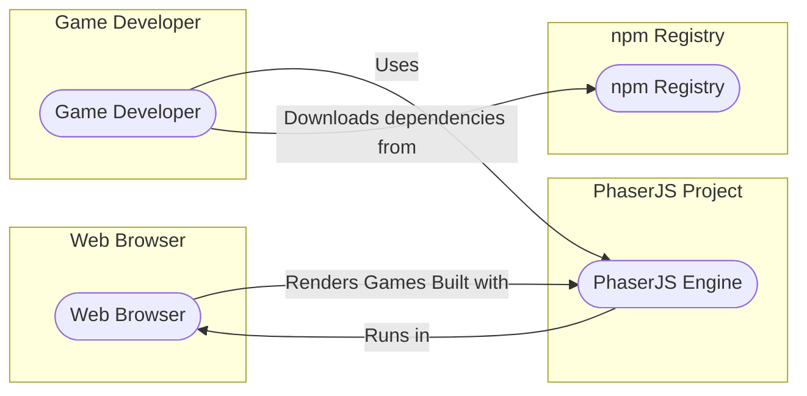

# BUSINESS POSTURE

This project, PhaserJS, is an open-source 2D game engine for web browsers, supporting JavaScript and TypeScript. Its primary business priority is to provide a feature-rich, performant, and easy-to-use game development framework for developers to create games for the web and other platforms. The project's success is measured by its adoption rate, community engagement, and the quality of games built using it.

Key business goals include:
- Growing the user base of game developers utilizing PhaserJS.
- Maintaining a vibrant and active community around the engine.
- Continuously improving the engine with new features, performance enhancements, and bug fixes.
- Ensuring the engine remains compatible with modern web browsers and technologies.
- Fostering a positive reputation for PhaserJS as a reliable and powerful game engine.

The most important business risks that need to be addressed are:
- Security vulnerabilities in the PhaserJS engine itself. If vulnerabilities are discovered and exploited in games built with PhaserJS, it can damage the reputation of the engine and deter adoption.
- Lack of community trust due to security concerns. If the project is perceived as insecure, developers may choose alternative engines.
- Supply chain attacks targeting PhaserJS dependencies or build process. Compromising the engine's distribution could have widespread impact on games using it.

# SECURITY POSTURE

Existing security controls:
- security control: Open-source code review by the community. The PhaserJS codebase is publicly available on GitHub, allowing for community scrutiny and identification of potential vulnerabilities. Implemented in: GitHub repository and community contribution process.
- security control: Use of GitHub for version control and collaboration. GitHub provides basic security features like access control and audit logs for repository activities. Implemented in: GitHub platform.
- security control: Dependency management using npm. npm provides a registry for JavaScript packages and tools for managing project dependencies. Implemented in: package.json and npm ecosystem.

Accepted risks:
- accepted risk: Reliance on community for security vulnerability identification and patching. The project's security posture heavily depends on the active participation of the open-source community to identify and report vulnerabilities.
- accepted risk: Potential vulnerabilities in third-party dependencies. PhaserJS relies on external npm packages, which may contain security vulnerabilities that could affect the engine.
- accepted risk: Lack of formal security development lifecycle (SDL). As an open-source project, PhaserJS may not have a dedicated security team or a formal SDL process in place.

Recommended security controls:
- security control: Implement automated Static Application Security Testing (SAST) in the CI/CD pipeline to identify potential code-level vulnerabilities early in the development process.
- security control: Implement automated Dependency Scanning in the CI/CD pipeline to detect known vulnerabilities in third-party dependencies.
- security control: Establish a clear vulnerability disclosure policy and process to handle security reports from the community effectively.
- security control: Conduct periodic security code reviews, focusing on critical components and areas prone to vulnerabilities.
- security control: Consider implementing Fuzz testing to identify unexpected behavior and potential vulnerabilities in input handling.

Security requirements:
- Authentication: Not directly applicable to the PhaserJS engine itself, as it is a client-side library. Authentication is relevant for any backend services that games built with PhaserJS might interact with, but this is outside the scope of the engine itself.
- Authorization: Similar to authentication, authorization is not a primary concern for the engine. Authorization would be relevant in the context of backend services used by games.
- Input validation: Crucial for PhaserJS. The engine needs to handle various types of input from game developers and the browser environment (e.g., user input, asset loading, configuration). Robust input validation is necessary to prevent vulnerabilities like Cross-Site Scripting (XSS) and other injection attacks in games built with PhaserJS.
- Cryptography: PhaserJS might require cryptographic functionalities for certain game features (e.g., secure communication, data encryption). If cryptography is used, it must be implemented correctly and securely, using well-vetted libraries and algorithms. However, core engine itself might not require cryptography. Games built on top of PhaserJS might require cryptography.

# DESIGN

## C4 CONTEXT



### Context Diagram Elements

- Name: Game Developer
  - Type: Person
  - Description: Software developers who use PhaserJS to create games.
  - Responsibilities: Develop games using PhaserJS, integrate PhaserJS into their projects, deploy games.
  - Security controls: Responsible for secure coding practices in their game development, securing their own development environments and deployment pipelines.

- Name: PhaserJS Engine
  - Type: Software System
  - Description: The PhaserJS game engine library, providing functionalities for 2D game development.
  - Responsibilities: Provide game development functionalities, render game graphics, handle game logic, manage game assets.
  - Security controls: Input validation, secure coding practices during development, dependency scanning, SAST in build process.

- Name: Web Browser
  - Type: Software System
  - Description: Web browsers (e.g., Chrome, Firefox, Safari) where games built with PhaserJS are executed.
  - Responsibilities: Execute JavaScript code, render web pages and game graphics, provide user input mechanisms.
  - Security controls: Browser security features (e.g., sandboxing, Content Security Policy), browser updates and patching.

- Name: npm Registry
  - Type: Software System
  - Description: Public registry for npm packages, used to distribute and manage PhaserJS and its dependencies.
  - Responsibilities: Host and distribute npm packages, manage package versions, provide package download services.
  - Security controls: Package signing, malware scanning, vulnerability scanning of packages in the registry.

## C4 CONTAINER

```mermaid
flowchart LR
    subgraph PhaserJS Engine
        direction TB
        SL(["Source Code Library (JavaScript/TypeScript)"])
        DOC(["Documentation Website"])
        EX(["Examples and Demos"])
        BUI(["Build System (npm scripts, Webpack)"])
    end
    SL --> BUI: Builds
    BUI --> DOC: Generates
    BUI --> EX: Generates
    GameDeveloper --> Uses --> SL
    GameDeveloper --> Uses --> DOC
    GameDeveloper --> Uses --> EX
    npmRegistry --> Downloads Dependencies --> BUI
```

### Container Diagram Elements

- Name: Source Code Library (JavaScript/TypeScript)
  - Type: Container
  - Description: The core PhaserJS engine source code, written in JavaScript and TypeScript. This includes all the engine's modules, classes, and functionalities.
  - Responsibilities: Implement game engine features, provide APIs for game development, handle game logic and rendering.
  - Security controls: Secure coding practices, input validation within the engine code, SAST scanning, code reviews.

- Name: Documentation Website
  - Type: Container
  - Description: Website hosting the PhaserJS documentation, API references, tutorials, and guides.
  - Responsibilities: Provide comprehensive documentation for developers, explain engine features and usage, host examples and tutorials.
  - Security controls: Input validation for user-generated content (if any), protection against XSS, regular security updates of website platform.

- Name: Examples and Demos
  - Type: Container
  - Description: Collection of example games and demos showcasing PhaserJS capabilities and usage patterns.
  - Responsibilities: Demonstrate engine features, provide learning resources for developers, showcase best practices.
  - Security controls: Review examples for potential vulnerabilities, ensure examples follow secure coding practices.

- Name: Build System (npm scripts, Webpack)
  - Type: Container
  - Description: Tools and scripts used to build, test, and package PhaserJS, including npm scripts and Webpack (or similar bundler).
  - Responsibilities: Compile TypeScript, bundle JavaScript code, generate documentation, run tests, create distributable packages.
  - Security controls: Secure build pipeline, dependency scanning, SAST during build, integrity checks of build artifacts.

## DEPLOYMENT

PhaserJS itself is not deployed as a standalone application. It is a library that is integrated into game developers' projects. The deployment context is therefore focused on how games built with PhaserJS are deployed. A typical deployment scenario for a web game built with PhaserJS is deployment to a web server or a Content Delivery Network (CDN).

```mermaid
flowchart LR
    subgraph Web Server / CDN
        WS1(["Web Server / CDN Instance 1"])
        WS2(["Web Server / CDN Instance 2"])
        LB(["Load Balancer"])
        DB(["Database (Optional - for game backend)"])
        API(["API Server (Optional - for game backend)"])
        WS1 --- WS2
        LB --> WS1
        LB --> WS2
        WS1 --> DB
        WS2 --> DB
        LB --> API
    end
    subgraph Internet
        WB(["Web Browser"])
    end
    WB --> LB: Game Access
```

### Deployment Diagram Elements

- Name: Web Server / CDN Instance
  - Type: Infrastructure
  - Description: Instances of web servers or CDN nodes that host the game files (HTML, JavaScript, assets). Multiple instances are used for scalability and availability.
  - Responsibilities: Serve game files to users, handle HTTP requests, cache content (in case of CDN).
  - Security controls: Web server hardening, HTTPS configuration, access control, DDoS protection, regular security patching.

- Name: Load Balancer
  - Type: Infrastructure
  - Description: Distributes incoming game traffic across multiple web server instances to ensure availability and performance.
  - Responsibilities: Load balancing, traffic routing, health checks of web server instances.
  - Security controls: Load balancer security configuration, DDoS protection, access control.

- Name: Database (Optional - for game backend)
  - Type: Infrastructure
  - Description: Database system (e.g., PostgreSQL, MySQL) used to store game data, user accounts, leaderboards, etc., if the game has backend functionality.
  - Responsibilities: Store and manage game data, provide data persistence.
  - Security controls: Database hardening, access control, encryption at rest and in transit, regular backups, vulnerability patching.

- Name: API Server (Optional - for game backend)
  - Type: Infrastructure
  - Description: API server (e.g., Node.js, Python) that handles backend logic, communication with the database, and API requests from the game client.
  - Responsibilities: Implement game backend logic, handle API requests, interact with the database.
  - Security controls: API security best practices, input validation, authorization, authentication, rate limiting, regular security patching.

- Name: Web Browser
  - Type: Environment
  - Description: User's web browser where the game is played.
  - Responsibilities: Execute game code, render game graphics, handle user input.
  - Security controls: Browser security features, user awareness of browser security practices.

## BUILD

```mermaid
flowchart LR
    subgraph Developer Workstation
        DEV(["Developer"])
        CODE(["Code Changes"])
    end
    subgraph GitHub
        VC(["Version Control (GitHub)"])
        WF(["GitHub Workflows (CI/CD)"])
    end
    subgraph Build Environment
        BE(["Build Environment (GitHub Actions Runners)"])
        DEP_SCAN(["Dependency Scanner"])
        SAST_SCAN(["SAST Scanner"])
        LINTER(["Linter"])
        TEST(["Unit Tests"])
        BUILD_ARTIFACTS(["Build Artifacts (npm package, distribution files)"])
    end
    subgraph npm Registry
        NPM_REG(["npm Registry"])
    end
    DEV --> CODE
    CODE --> VC: Commit & Push
    VC --> WF: Triggers Build
    WF --> BE: Executes Build Steps
    BE --> DEP_SCAN: Dependency Scan
    BE --> SAST_SCAN: SAST Scan
    BE --> LINTER: Linting
    BE --> TEST: Unit Tests
    BE --> BUILD_ARTIFACTS: Build & Package
    BUILD_ARTIFACTS --> NPM_REG: Publish (Release)
```

### Build Diagram Elements

- Name: Developer
  - Type: Person
  - Description: Software developer contributing code to the PhaserJS project.
  - Responsibilities: Write code, fix bugs, implement features, commit code changes.
  - Security controls: Secure development practices, secure workstation, code review participation.

- Name: Version Control (GitHub)
  - Type: Tool/Service
  - Description: GitHub repository used for version control and collaboration.
  - Responsibilities: Store source code, manage code versions, track changes, facilitate collaboration.
  - Security controls: Access control, branch protection, audit logs, two-factor authentication for developers.

- Name: GitHub Workflows (CI/CD)
  - Type: Tool/Service
  - Description: GitHub Actions workflows used for automated build, test, and deployment processes.
  - Responsibilities: Automate build process, run tests, perform security scans, publish build artifacts.
  - Security controls: Secure workflow configuration, secret management, access control to workflows, audit logs.

- Name: Build Environment (GitHub Actions Runners)
  - Type: Environment
  - Description: Environment where build processes are executed, typically GitHub Actions runners.
  - Responsibilities: Execute build steps defined in workflows, provide necessary build tools and dependencies.
  - Security controls: Secure runner environment, isolation of build processes, regular patching of runner environment.

- Name: Dependency Scanner
  - Type: Security Tool
  - Description: Tool used to scan project dependencies for known vulnerabilities.
  - Responsibilities: Identify vulnerable dependencies, report vulnerabilities to developers.
  - Security controls: Regularly updated vulnerability database, integration into CI/CD pipeline.

- Name: SAST Scanner
  - Type: Security Tool
  - Description: Static Application Security Testing tool used to analyze source code for potential vulnerabilities.
  - Responsibilities: Identify code-level vulnerabilities, report vulnerabilities to developers.
  - Security controls: Regularly updated vulnerability rules, integration into CI/CD pipeline, configuration for relevant security checks.

- Name: Linter
  - Type: Code Quality Tool
  - Description: Tool used to analyze code for stylistic and programmatic errors.
  - Responsibilities: Enforce code style guidelines, identify potential code quality issues.
  - Security controls: Configuration for security-related linting rules, integration into CI/CD pipeline.

- Name: Unit Tests
  - Type: Testing Process
  - Description: Automated unit tests to verify the functionality of individual code components.
  - Responsibilities: Ensure code correctness, detect regressions, improve code quality.
  - Security controls: Tests covering security-relevant functionalities, regular execution in CI/CD pipeline.

- Name: Build Artifacts (npm package, distribution files)
  - Type: Artifact
  - Description: Output of the build process, including npm package and distribution files ready for release.
  - Responsibilities: Package engine for distribution, provide installable package for developers.
  - Security controls: Integrity checks (e.g., checksums, signatures), secure storage of artifacts, access control.

- Name: npm Registry
  - Type: Service
  - Description: Public npm registry where PhaserJS package is published for distribution.
  - Responsibilities: Host and distribute PhaserJS package, make it available to game developers.
  - Security controls: Package signing, malware scanning, vulnerability scanning, registry security measures.

# RISK ASSESSMENT

Critical business process we are trying to protect:
- Development, build, and distribution of the PhaserJS game engine. Maintaining the integrity and security of the engine is crucial for its reputation and adoption.

Data we are trying to protect and their sensitivity:
- PhaserJS Source Code: Publicly available, but integrity is critical. Modifications by unauthorized parties or introduction of vulnerabilities would be a high risk. Sensitivity: Public, Integrity: High.
- Build Artifacts (npm package, distribution files): Publicly distributed, integrity is paramount. Compromised artifacts would directly impact users. Sensitivity: Public, Integrity: High.
- Developer Credentials and Secrets: Used for accessing GitHub, npm, and build infrastructure. Confidentiality and integrity are essential to prevent unauthorized access and malicious activities. Sensitivity: Confidential, Integrity: High.

# QUESTIONS & ASSUMPTIONS

BUSINESS POSTURE:
- Question: What is the target audience for PhaserJS in terms of developer skill level and project size? Assumption: PhaserJS targets a broad range of developers, from hobbyists to professional game developers, working on projects of varying scales.
- Question: Are there specific industries or game genres that PhaserJS is particularly focused on? Assumption: PhaserJS aims to be versatile and applicable to various 2D game genres and industries, without specific vertical focus.
- Question: What are the key performance indicators (KPIs) for PhaserJS project success beyond adoption rate? Assumption: KPIs include community engagement metrics (forum activity, contributions), user satisfaction (feedback, reviews), and the number of successful games built with PhaserJS.

SECURITY POSTURE:
- Question: Is there a dedicated security team or individual responsible for security within the PhaserJS project? Assumption: Security is primarily driven by community contributions and best practices, without a dedicated security team.
- Question: What is the process for handling security vulnerabilities reported by the community? Assumption: Vulnerability reports are likely handled through GitHub issues and project maintainers, with a public disclosure process after a fix is available.
- Question: Are there any existing security audits or penetration testing performed on PhaserJS? Assumption: No formal security audits or penetration testing are regularly conducted, relying on community review and automated tools.

DESIGN:
- Question: What are the long-term architectural goals for PhaserJS? Assumption: To maintain a modular, extensible, and performant architecture that can adapt to evolving web technologies and game development trends.
- Question: Are there plans to integrate with specific backend services or platforms? Assumption: PhaserJS aims to be backend-agnostic, allowing developers to choose their preferred backend solutions.
- Question: What is the strategy for managing breaking changes and ensuring backward compatibility? Assumption: PhaserJS likely follows semantic versioning and provides migration guides for significant updates, balancing new features with backward compatibility.