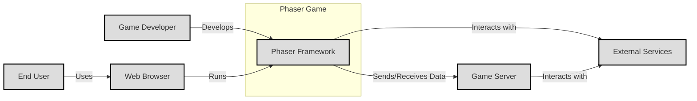
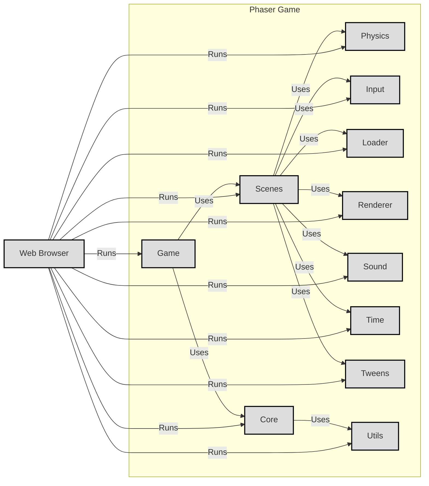

Okay, let's create a design document for the Phaser project, focusing on aspects relevant to threat modeling.

# BUSINESS POSTURE

Phaser is an open-source HTML5 game framework.  Its primary goal is to enable developers to create cross-platform games quickly and efficiently.  The project's success hinges on its ease of use, performance, feature richness, and community support.  Since it's a framework, the business posture is less about direct revenue generation and more about fostering a vibrant ecosystem and establishing Phaser as a leading choice for 2D game development.

Business Priorities:

*   Ease of Use:  Make it simple for developers of all skill levels to create games.
*   Performance:  Ensure games built with Phaser run smoothly on a wide range of devices.
*   Cross-Platform Compatibility:  Support major browsers and platforms (desktop, mobile).
*   Community Growth:  Foster a large and active community of developers.
*   Feature Richness:  Provide a comprehensive set of tools and features for game development.
*   Maintainability:  Ensure the codebase is well-maintained and easy to contribute to.
*   Open Source: Free to use and distribute.

Business Goals:

*   Become a leading 2D game framework.
*   Attract a large and active developer community.
*   Enable the creation of high-quality, performant games.
*   Maintain a sustainable open-source project.

Most Important Business Risks:

*   Loss of Community Interest: If the framework becomes outdated, difficult to use, or lacks support, developers may switch to alternatives.
*   Security Vulnerabilities:  While Phaser itself isn't a direct target for financial gain, vulnerabilities could be exploited within games *built using* Phaser, leading to reputational damage and potential harm to end-users. This is a crucial distinction.
*   Performance Issues:  Poor performance can lead to negative user experiences in games built with Phaser, impacting the framework's reputation.
*   Lack of Adoption:  If developers don't adopt Phaser, the project's goals cannot be achieved.
*   Competition: Other game frameworks and engines pose a constant competitive threat.
*   Supply Chain Attacks: Compromised dependencies could introduce vulnerabilities into Phaser or games built with it.

# SECURITY POSTURE

Phaser, as a client-side framework, has a unique security posture. It's executed within the user's browser, inheriting the browser's security model. The primary security concerns revolve around the *games built with Phaser*, not Phaser itself, as it's not a server-side application or a data storage system. However, vulnerabilities in Phaser *could* be leveraged to create exploits within those games.

Existing Security Controls:

*   security control: Browser Security Model: Phaser operates within the sandboxed environment of the web browser, benefiting from built-in security features like the Same-Origin Policy (SOP), Content Security Policy (CSP) support, and other browser-level protections. (Implemented by the browser).
*   security control: Open Source Code: The code is publicly available on GitHub, allowing for community scrutiny and contributions to identify and fix potential vulnerabilities. (Described in the GitHub repository).
*   security control: Dependency Management: Phaser uses package managers (likely npm) to manage dependencies, allowing for updates and security patches to be applied. (Described in package.json and potentially other build-related files).
*   security control: Community Reporting: Vulnerabilities can be reported by the community, allowing for prompt fixes. (Described in the GitHub repository's issue tracker and potentially a SECURITY.md file).

Accepted Risks:

*   accepted risk: Client-Side Execution: The framework runs entirely on the client-side, meaning developers building games with Phaser must implement their own security measures for server-side components (if any) and data handling.
*   accepted risk: Third-Party Libraries: Phaser may rely on third-party libraries, which could introduce their own vulnerabilities.
*   accepted risk: Developer Error: The security of games built with Phaser ultimately depends on the developers' secure coding practices. Phaser can't enforce security best practices in the games themselves.

Recommended Security Controls (High Priority):

*   security control: Regular Dependency Audits: Implement automated dependency scanning to identify and address known vulnerabilities in Phaser's dependencies.
*   security control: Content Security Policy (CSP) Guidelines: Provide clear documentation and examples for developers on how to implement CSP effectively in their Phaser games to mitigate XSS risks.
*   security control: Security Best Practices Documentation: Create comprehensive documentation outlining security best practices for game developers using Phaser, covering topics like input validation, data handling, and server-side communication.
*   security control: Static Analysis: Integrate static analysis tools into the build process to identify potential security issues in the Phaser codebase itself.

Security Requirements:

*   Authentication: Not directly applicable to Phaser itself, as it's a client-side framework. Game developers are responsible for implementing authentication mechanisms in their games, typically on the server-side.
*   Authorization: Similar to authentication, authorization is the responsibility of the game developer, typically handled server-side. Phaser provides no built-in authorization mechanisms.
*   Input Validation: Critically important for game developers to implement. Phaser should provide guidance and potentially helper functions to assist with validating user input to prevent injection attacks and other vulnerabilities within games.
*   Cryptography: Phaser may use cryptographic functions for specific features (e.g., hashing). Any use of cryptography should adhere to industry best practices and use well-vetted libraries. Game developers may need to implement their own cryptographic solutions for secure communication with servers or data protection.

# DESIGN

## C4 CONTEXT



Element Descriptions:

*   Element:
    *   Name: Phaser Framework
    *   Type: Software System
    *   Description: The core Phaser library, providing game development functionalities.
    *   Responsibilities: Providing APIs for game development, handling rendering, physics, input, audio, etc.
    *   Security Controls: Browser Security Model, Open Source Code, Dependency Management, Community Reporting.

*   Element:
    *   Name: Web Browser
    *   Type: Software System
    *   Description: The environment where Phaser games run.
    *   Responsibilities: Executing JavaScript, rendering graphics, handling user input, managing network requests.
    *   Security Controls: Same-Origin Policy, Content Security Policy, Sandboxing.

*   Element:
    *   Name: Game Developer
    *   Type: Person
    *   Description: The individual or team creating games using Phaser.
    *   Responsibilities: Writing game logic, designing game assets, implementing security best practices.
    *   Security Controls: Secure coding practices, adherence to security guidelines.

*   Element:
    *   Name: End User
    *   Type: Person
    *   Description: The player interacting with the Phaser game.
    *   Responsibilities: Playing the game, providing input.
    *   Security Controls: None directly controlled; relies on browser and game security.

*   Element:
    *   Name: External Services
    *   Type: Software System
    *   Description: Third-party services that a Phaser game might interact with (e.g., analytics, advertising, social media).
    *   Responsibilities: Providing specific services as per their design.
    *   Security Controls: Dependent on the specific service; game developers should carefully evaluate security implications.

*   Element:
    *   Name: Game Server
    *   Type: Software System
    *   Description: A server-side component that a Phaser game might communicate with for multiplayer functionality, data storage, or other backend services.
    *   Responsibilities: Handling game logic, managing player data, communicating with the Phaser game client.
    *   Security Controls: Authentication, Authorization, Input Validation, Data Encryption, Secure Communication Protocols.

## C4 CONTAINER



Element Descriptions:

*   Element:
    *   Name: Core
    *   Type: Container
    *   Description: The central part of the Phaser framework.
    *   Responsibilities: Game loop management, event handling, core utilities.
    *   Security Controls: Inherits browser security context.

*   Element:
    *   Name: Game
    *   Type: Container
    *   Description: Represents the overall game instance.
    *   Responsibilities: Managing game state, scenes, and overall game flow.
    *   Security Controls: Inherits browser security context; developers must implement game-specific security.

*   Element:
    *   Name: Scenes
    *   Type: Container
    *   Description: Represents individual game scenes (e.g., menu, gameplay, game over).
    *   Responsibilities: Managing scene-specific logic, objects, and rendering.
    *   Security Controls: Inherits browser security context; developers must implement scene-specific security.

*   Element:
    *   Name: Physics
    *   Type: Container
    *   Description: Handles physics simulations (e.g., Arcade Physics, Matter.js).
    *   Responsibilities: Calculating collisions, movement, and other physics-related interactions.
    *   Security Controls: Inherits browser security context.

*   Element:
    *   Name: Input
    *   Type: Container
    *   Description: Manages user input (keyboard, mouse, touch).
    *   Responsibilities: Capturing and processing user input events.
    *   Security Controls: Inherits browser security context; developers must validate input to prevent exploits.

*   Element:
    *   Name: Loader
    *   Type: Container
    *   Description: Handles loading game assets (images, audio, etc.).
    *   Responsibilities: Loading assets from various sources, managing loading progress.
    *   Security Controls: Inherits browser security context; developers should ensure assets are loaded from trusted sources.

*   Element:
    *   Name: Renderer
    *   Type: Container
    *   Description: Renders the game graphics (WebGL or Canvas).
    *   Responsibilities: Drawing game objects to the screen.
    *   Security Controls: Inherits browser security context.

*   Element:
    *   Name: Sound
    *   Type: Container
    *   Description: Manages audio playback.
    *   Responsibilities: Playing sounds and music.
    *   Security Controls: Inherits browser security context.

*   Element:
    *   Name: Time
    *   Type: Container
    *   Description: Provides time-related functionality.
    *   Responsibilities: Managing timers, delays, and frame timing.
    *   Security Controls: Inherits browser security context.

*   Element:
    *   Name: Tweens
    *   Type: Container
    *   Description: Handles animation and interpolation.
    *   Responsibilities: Creating smooth animations and transitions.
    *   Security Controls: Inherits browser security context.

*   Element:
    *   Name: Utils
    *   Type: Container
    *   Description: Provides utility functions.
    *   Responsibilities: Various helper functions for common tasks.
    *   Security Controls: Inherits browser security context.

*   Element:
    *   Name: Web Browser
    *   Type: Container
    *   Description: The environment where Phaser games run.
    *   Responsibilities: Executing JavaScript, rendering graphics, handling user input, managing network requests.
    *   Security Controls: Same-Origin Policy, Content Security Policy, Sandboxing.

## DEPLOYMENT

Phaser games, being client-side JavaScript applications, can be deployed in various ways:

1.  **Static Web Hosting:**  The most common approach.  The game files (HTML, CSS, JavaScript, assets) are simply uploaded to a web server (e.g., Apache, Nginx, Netlify, GitHub Pages, AWS S3, Firebase Hosting).  This is the simplest and often most suitable method.
2.  **Embedded in a Web Application:**  A Phaser game can be integrated into a larger web application, served as part of that application's codebase.
3.  **Packaged as a Desktop Application:**  Using tools like Electron or NW.js, a Phaser game can be packaged as a standalone desktop application.
4.  **Packaged as a Mobile Application:**  Using frameworks like Cordova or Capacitor, a Phaser game can be packaged as a mobile application for iOS and Android.

We'll describe the **Static Web Hosting** deployment in detail, as it's the most common and straightforward.

```mermaid
graph LR
    subgraph Deployment Environment [Web Server (e.g., AWS S3)]
        A[HTML File]
        B[CSS Files]
        C[JavaScript Files (Phaser + Game Code)]
        D[Assets (Images, Audio, etc.)]
    end
    E[Web Browser]

    E -- Requests --> A
    E -- Requests --> B
    E -- Requests --> C
    E -- Requests --> D

    classDef element fill:#ddd,stroke:#000,stroke-width:2px
    class A,B,C,D,E element
```

Element Descriptions:

*   Element:
    *   Name: HTML File
    *   Type: File
    *   Description: The main HTML file that loads the Phaser framework and game code.
    *   Responsibilities: Providing the entry point for the game.
    *   Security Controls: Should include appropriate meta tags (e.g., CSP) for security.

*   Element:
    *   Name: CSS Files
    *   Type: File
    *   Description: Stylesheets for the game's appearance.
    *   Responsibilities: Styling the game elements.
    *   Security Controls: Should be reviewed for potential CSS injection vulnerabilities (though less common).

*   Element:
    *   Name: JavaScript Files (Phaser + Game Code)
    *   Type: File
    *   Description: The Phaser framework and the game's specific JavaScript code.
    *   Responsibilities: Implementing the game logic and functionality.
    *   Security Controls:  Developers must follow secure coding practices to prevent vulnerabilities.

*   Element:
    *   Name: Assets (Images, Audio, etc.)
    *   Type: File
    *   Description:  Images, audio files, and other assets used by the game.
    *   Responsibilities: Providing the visual and auditory elements of the game.
    *   Security Controls: Should be loaded from trusted sources; integrity checks (e.g., Subresource Integrity - SRI) can be used.

*   Element:
    *   Name: Web Browser
    *   Type: Software System
    *   Description: The client application that requests and renders the game.
    *   Responsibilities: Downloading and executing the game files.
    *   Security Controls: Browser's built-in security mechanisms (SOP, CSP, etc.).

## BUILD

Phaser's build process, as seen in the repository, involves several steps and tools to create the final distributable files. The process is automated using npm scripts and various build tools.

```mermaid
graph LR
    A[Developer] -- Commits Code --> B[GitHub Repository]
    B -- Triggers --> C[GitHub Actions (CI)]
    C -- Runs --> D[npm install]
    D -- Installs --> E[Dependencies (e.g., Rollup, Terser, JSDoc)]
    C -- Runs --> F[npm run build]
    F -- Executes --> G[Rollup (Bundling)]
    G -- Bundles --> H[Phaser.js (Development Build)]
    F -- Executes --> I[Terser (Minification)]
    I -- Minifies --> J[Phaser.min.js (Production Build)]
    F -- Executes --> K[JSDoc (Documentation Generation)]
    K -- Generates --> L[Documentation]
    C -- Runs --> M[npm test]
    M -- Executes --> N[Tests]
    C -- Publishes --> O[npm Registry]
    C -- Publishes --> P[GitHub Releases]

    classDef element fill:#ddd,stroke:#000,stroke-width:2px
    class A,B,C,D,E,F,G,H,I,J,K,L,M,N,O,P element
```
Security Controls in the Build Process:

*   security control: Dependency Management (npm):  Uses npm to manage dependencies, allowing for updates and security patches.  `npm audit` can be used to identify known vulnerabilities.
*   security control: Automated Build (GitHub Actions):  The build process is automated using GitHub Actions, ensuring consistency and reducing the risk of manual errors.
*   security control: Testing (npm test): Includes a test suite to verify functionality and potentially catch regressions.
*   security control: Code Bundling (Rollup): Bundles the code into a single file, reducing the attack surface.
*   security control: Minification (Terser): Minifies the code, making it harder to reverse engineer (though this is primarily for performance, not security).
*   security control: Version Control (Git): The entire codebase and build process are version-controlled using Git, allowing for tracking changes and reverting to previous versions if necessary.

# RISK ASSESSMENT

Critical Business Processes to Protect:

*   The integrity and availability of the Phaser framework itself. This includes the source code, build process, and distribution channels (npm, GitHub Releases).
*   The reputation of Phaser as a secure and reliable framework.
*   The ability for developers to easily and securely build games using Phaser.

Data to Protect and Sensitivity:

*   Phaser Source Code:  While publicly available, its integrity is crucial.  Unauthorized modifications could introduce vulnerabilities. Sensitivity: Medium (due to the potential impact on games built with it).
*   Phaser Build Artifacts (phaser.js, phaser.min.js):  These are the distributed files used by developers.  Their integrity is paramount. Sensitivity: High (directly impacts the security of games).
*   Documentation:  Accurate and up-to-date documentation is essential for developers. Sensitivity: Low (but important for usability and security guidance).
*   No user data is directly handled by the framework.

# QUESTIONS & ASSUMPTIONS

Questions:

*   Are there any specific security certifications or compliance requirements that Phaser aims to meet (even indirectly, through the games built with it)?
*   What is the process for handling vulnerability reports from the community? Is there a dedicated security contact or process?
*   Are there any plans to integrate more advanced security features into the framework or build process (e.g., code signing, software bill of materials)?
*   What level of support is provided to game developers regarding security best practices?

Assumptions:

*   BUSINESS POSTURE: The primary goal is to maintain a healthy open-source project and foster a strong community, not direct monetization.
*   SECURITY POSTURE: The security of games built with Phaser is primarily the responsibility of the game developers. Phaser provides a framework, but developers must implement their own security measures, especially for server-side components.
*   DESIGN: The deployment model described (static web hosting) is the most common and relevant for the majority of Phaser games.
*   BUILD: The build process is accurately represented by the provided diagram, based on the information available in the GitHub repository.
*   The project is actively maintained and security is a consideration, even if not explicitly stated in all documentation.