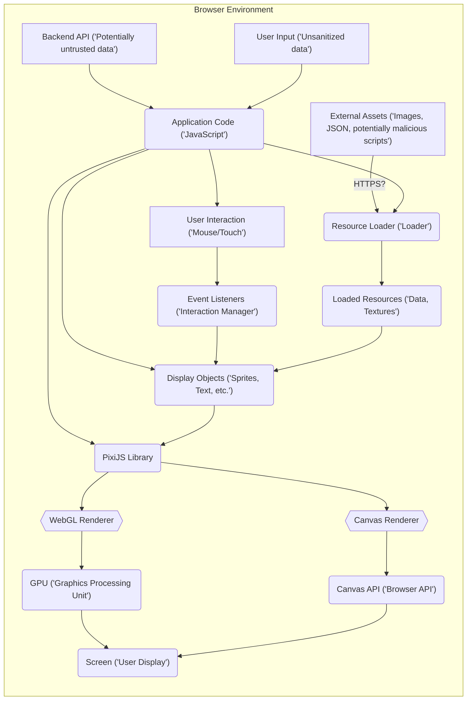

# Project Design Document: PixiJS Library (Improved)

**Version:** 1.1
**Date:** October 26, 2023
**Author:** AI Software Architect

## 1. Introduction

This document provides an enhanced architectural design overview of the PixiJS library (https://github.com/pixijs/pixi.js), specifically tailored for threat modeling. Building upon the previous version, this document aims to provide a more detailed and nuanced understanding of the library's internal workings, its interactions with the surrounding web environment, and potential security implications. This document serves as a critical input for subsequent threat modeling activities.

## 2. Goals and Objectives

The primary goal remains to provide a comprehensive architectural understanding of PixiJS to facilitate effective threat modeling. Improved objectives include:

*   Providing a more granular breakdown of key components and their interactions.
*   Clearly mapping data flow, emphasizing security-relevant data transformations and boundaries.
*   Explicitly highlighting potential threat vectors and vulnerabilities based on the architecture.
*   Offering a more detailed and accessible description of the system for a wider range of security stakeholders.

## 3. Architectural Overview

PixiJS is a client-side, primarily browser-based 2D rendering library. It empowers developers to create visually rich and interactive experiences within web applications by abstracting the complexities of WebGL and Canvas APIs. PixiJS acts as a rendering engine, taking instructions from the application code and translating them into visual output displayed within a `<canvas>` element in the browser.

PixiJS operates within the security context of the web browser and the encompassing web application. Its security is intrinsically linked to the security of the browser environment and the practices of the developers using the library. It's crucial to understand that PixiJS itself doesn't inherently introduce server-side vulnerabilities but can be a conduit for client-side attacks if not used carefully.

## 4. Key Components

This section provides a more detailed breakdown of the core components:

*   **Core API:** The fundamental building blocks for creating and manipulating visual elements.
    *   `Stage`: The root container, acting as the scene's entry point. All visible elements are descendants of the `Stage`.
    *   `Container`: A versatile grouping object that can hold and manage other display objects, enabling hierarchical organization.
    *   `Sprite`: The primary object for rendering images or textures. It manages texture mapping, transformations (position, scale, rotation), and rendering properties.
    *   `Graphics`: Enables drawing vector shapes using a drawing API. This involves interpreting drawing commands and rendering them.
    *   `Text`:  Handles the rendering of text, including styling and layout. It relies on browser font rendering capabilities.
    *   `Texture`: Represents a reference to image data used for rendering. It can be created from various sources (images, canvas, video).
    *   `BaseTexture`: The underlying, low-level representation of image data in the GPU or CPU memory.
*   **Renderer:** The engine responsible for drawing the scene to the screen.
    *   `WebGLRenderer`: Leverages the WebGL API for hardware-accelerated rendering, utilizing the GPU for performance. It manages shaders, textures, and the rendering pipeline.
    *   `CanvasRenderer`: Provides a fallback using the HTML5 Canvas 2D API for software rendering when WebGL is unavailable. It relies on the browser's drawing capabilities.
*   **Resource Loader:** Manages the asynchronous loading of external assets.
    *   `Loader`: The central class for managing the loading queue, handling different resource types, and providing progress updates.
    *   `LoaderResource`: Represents a single loaded resource, containing the raw data, metadata, and error information. It handles parsing and processing of different file formats.
*   **Interaction Manager:** Handles user input events and determines which display objects are targeted.
    *   `InteractionManager`: Attaches event listeners to the renderer's view (`<canvas>`), performs hit detection based on object bounds, and dispatches interaction events.
    *   `InteractionEvent`:  Encapsulates information about a user interaction (e.g., mouse click, touch tap), including the target display object and event coordinates.
*   **Filters and Effects:** Allows applying post-processing effects to display objects.
    *   `Filter`: The base class for creating custom fragment shaders that manipulate the rendered output.
    *   Pre-built filters (e.g., `BlurFilter`, `ColorMatrixFilter`): Implement common visual effects using WebGL shaders.
*   **Particles:** Provides tools for creating and managing animated particle effects.
    *   `ParticleContainer`: An optimized container for rendering a large number of particles efficiently, often using instancing in WebGL.
    *   `Emitter`: Manages the creation, animation, and lifecycle of individual particles based on defined parameters.
*   **Text Styles:** Defines the visual attributes of text objects.
    *   `TextStyle`: An object for configuring font family, size, color, alignment, and other text properties.
*   **Plugins:** An extensible mechanism for adding new functionalities.
    *   Renderer plugins (e.g., batching): Extend the rendering capabilities of the `WebGLRenderer` or `CanvasRenderer`.
    *   Application plugins: Add higher-level features and integrations to PixiJS applications.

## 5. Data Flow (Enhanced)

The data flow within a PixiJS application, with a focus on security-relevant aspects:

1. **Initialization:** The web application initializes the PixiJS `Renderer` (choosing between `WebGLRenderer` or `CanvasRenderer`) and creates the root `Stage`. This often involves setting up the `<canvas>` element and its context.
2. **Asset Loading (Potential Threat Vector):** The `Loader` fetches external assets from specified URLs. This is a critical point for potential vulnerabilities if the sources are untrusted or if HTTPS is not enforced. Loaded assets can include images, JSON configuration files, or even potentially malicious scripts disguised as assets.
3. **Object Creation and Manipulation:** Application code creates and manipulates display objects. Data used to populate these objects (e.g., text content, image URLs) can originate from various sources, including user input or backend APIs, introducing potential XSS risks if not properly sanitized.
4. **User Interaction (Potential Threat Vector):** The `InteractionManager` listens for user input events. Maliciously crafted input events could potentially trigger unintended behavior or exploit vulnerabilities in event handling logic.
5. **Event Handling:** When an interaction occurs, the `InteractionManager` determines the target object. If event handlers are not carefully implemented, they could be susceptible to logic flaws or unexpected input.
6. **Rendering Pipeline:** The `Renderer` traverses the display list and prepares rendering instructions. For `WebGLRenderer`, this involves processing shaders and textures. Maliciously crafted shaders could potentially cause issues, although browser security measures limit their capabilities.
7. **GPU/Canvas API Interaction:** The `WebGLRenderer` interacts with the GPU, and the `CanvasRenderer` interacts with the browser's Canvas API. While direct exploitation of these APIs from PixiJS is unlikely, vulnerabilities in the browser's implementation could indirectly affect PixiJS applications.
8. **Display Output:** The final rendered output is displayed on the screen. If the rendered content is based on unsanitized user input, it could lead to visual misrepresentation or even phishing attacks.

## 6. Security Considerations (Expanded)

This section provides a more detailed analysis of potential security concerns:

*   **Cross-Site Scripting (XSS):**
    *   **Untrusted Asset Loading:** Loading images or JSON data from untrusted origins without proper Content Security Policy (CSP) can allow attackers to inject malicious scripts. For example, a manipulated image file could contain JavaScript code that executes when the image is processed.
    *   **User-Provided Content Rendering:** Displaying user-generated text or images without thorough sanitization can lead to XSS attacks. Attackers could inject malicious HTML or JavaScript within the content.
    *   **Plugin Vulnerabilities:**  Third-party or even internally developed PixiJS plugins might contain vulnerabilities that attackers could exploit. This highlights the importance of careful plugin selection and security audits.
*   **Supply Chain Attacks:**
    *   **Compromised Dependencies:**  If PixiJS's dependencies are compromised, applications using PixiJS could inherit those vulnerabilities. Regularly updating dependencies and using tools like Software Composition Analysis (SCA) are crucial.
    *   **Malicious Packages:**  If PixiJS is installed via a package manager, there's a risk of installing a malicious or compromised package if the repository is not secure.
*   **Denial of Service (DoS):**
    *   **Resource Exhaustion:**  Attackers could craft scenarios that force PixiJS to render an extremely large number of objects or apply computationally expensive filters, potentially freezing the user's browser or device.
    *   **Malicious Assets:**  Loading extremely large or complex assets could also lead to resource exhaustion and DoS.
*   **Data Integrity:**
    *   **Asset Tampering (Man-in-the-Middle):** If assets are loaded over insecure HTTP, attackers could intercept and modify them, potentially altering the application's appearance or behavior. Enforcing HTTPS is essential.
*   **Client-Side Logic Manipulation:**
    *   While not a direct vulnerability in PixiJS, attackers can inspect and manipulate the client-side JavaScript code, potentially altering the application's logic or data. This emphasizes the need for security best practices in the overall application development.
*   **Clickjacking:** If the PixiJS application is embedded in a way that allows an attacker to overlay malicious content, users might be tricked into performing unintended actions. Proper frame security measures (e.g., `X-Frame-Options`) are necessary.
*   **Input Validation Vulnerabilities:** If the application relies on user input to control PixiJS rendering without proper validation, attackers could provide unexpected or malicious input that causes errors or unexpected behavior.

## 7. Deployment Considerations (Security Focused)

The deployment method significantly impacts the security posture of applications using PixiJS:

*   **Direct `<script>` tag inclusion:**
    *   **Risk:**  Requires manual verification of the library's integrity. Susceptible to tampering if the downloaded file is compromised.
    *   **Mitigation:**  Download from trusted sources and potentially use Subresource Integrity (SRI) hashes to ensure the file hasn't been tampered with.
*   **Using a Content Delivery Network (CDN):**
    *   **Risk:** Reliance on the CDN's security. If the CDN is compromised, applications using it could be affected.
    *   **Mitigation:** Choose reputable CDNs and use SRI hashes to verify file integrity.
*   **Package managers (npm, yarn):**
    *   **Risk:** Potential for supply chain attacks if malicious packages are introduced into the dependency tree.
    *   **Mitigation:** Regularly audit dependencies, use security scanning tools, and ensure the integrity of the package registry. Lock file usage (`package-lock.json`, `yarn.lock`) helps ensure consistent dependency versions.

## 8. Future Considerations (Security Implications)

Future development of PixiJS should prioritize security considerations:

*   **New API Design:**  New APIs should be designed with security in mind, considering potential misuse and input validation requirements. Security reviews should be part of the API design process.
*   **Integration with External Libraries:** When integrating with other libraries, the security implications of those integrations should be carefully evaluated.
*   **Security Audits:** Regular security audits and penetration testing should be conducted to identify and address potential vulnerabilities.
*   **Content Security Policy (CSP) Guidance:** Providing clear guidance and examples on how to effectively use CSP with PixiJS applications would be beneficial.
*   **Subresource Integrity (SRI) Support:**  Ensuring that PixiJS releases are accompanied by SRI hashes to facilitate secure integration via `<script>` tags and CDNs.

## 9. Conclusion

This improved design document provides a more detailed and security-focused understanding of the PixiJS library's architecture and data flow. It highlights potential threat vectors and vulnerabilities that should be considered during threat modeling activities. By understanding these aspects, developers and security professionals can build more secure and resilient web applications utilizing PixiJS. Continuous vigilance and adherence to security best practices are essential for mitigating potential risks.
