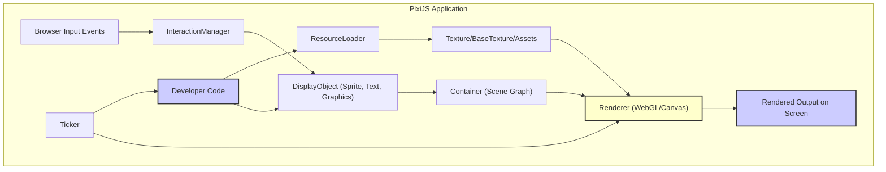

# Project Design Document: PixiJS

**Version:** 1.1
**Date:** October 26, 2023
**Author:** AI Software Architect

## 1. Introduction

This document provides an enhanced and more detailed design overview of the PixiJS library, building upon the previous version. It aims to provide a comprehensive understanding of the key architectural components, data flow, and interactions within the library. This enhanced document will serve as a robust foundation for subsequent threat modeling activities, enabling a more in-depth security analysis of the PixiJS ecosystem.

PixiJS is a powerful and versatile 2D rendering library for the web. It allows developers to create visually rich and interactive experiences using both WebGL for hardware acceleration and Canvas as a fallback. Its modular design and extensive feature set make it suitable for a wide range of applications, from games and interactive visualizations to user interfaces and special effects.

## 2. Goals and Objectives

The fundamental goals of PixiJS remain:

* **Simplicity and Ease of Use:** To offer a developer-friendly API that abstracts the complexities of low-level graphics APIs.
* **High Performance:** To leverage the capabilities of WebGL for efficient and smooth rendering, while providing a fallback to Canvas for broader compatibility.
* **Extensibility and Flexibility:** To provide a modular architecture that allows developers to customize and extend the library's functionality.
* **Broad Compatibility:** To support a wide range of modern web browsers and environments that support either WebGL or Canvas.
* **Comprehensive Feature Set:** To offer a rich set of tools and features for rendering various types of 2D graphics and handling user interactions.

The primary objective of this improved design document is to provide an even more granular understanding of PixiJS's internal workings, thereby facilitating a more detailed and effective security assessment and threat modeling process.

## 3. Architectural Overview

PixiJS employs a well-defined component-based architecture, with distinct modules responsible for specific aspects of the rendering process. This modularity enhances maintainability and allows developers to utilize only the parts of the library they need. The core of PixiJS lies in its abstraction of the underlying rendering technologies, presenting a unified API to the developer.

### 3.1. Key Components (Detailed)

* **Core:**
    *  `Application`:  The central point for initializing and managing a PixiJS application. It orchestrates the `Renderer`, `Ticker`, and the root of the display object tree (the stage). It handles the creation and management of the rendering context.
    *  `Renderer`:  An abstract class with concrete implementations for WebGL (`WebGLRenderer`) and Canvas (`CanvasRenderer`). It manages the rendering context, handles drawing calls, and performs state management.
        *  `WebGLRenderer`: Utilizes the WebGL API for hardware-accelerated rendering on the GPU. Manages shaders, textures, and buffer objects.
        *  `CanvasRenderer`: Uses the Canvas 2D API for rendering. Emulates many of the concepts of the WebGL renderer using Canvas drawing methods.
    *  `Ticker`:  Manages the application's update loop, controlling the timing of frame updates and rendering. It uses `requestAnimationFrame` for smooth animation.
    *  `DisplayObject`: The abstract base class for all visual elements that can be added to the scene. It defines common properties like position, scale, rotation, alpha, and visibility.
    *  `Container`: A subclass of `DisplayObject` that can contain other `DisplayObjects`, forming a hierarchical scene graph or display list. This structure is crucial for managing the relationships and transformations of objects.
    *  `Transform`:  Manages the local and world transformations of `DisplayObjects`. It handles the calculations for position, scale, rotation, and skew, ensuring objects are rendered correctly in the scene.
    *  `Geometry`: Defines the shape and structure of renderable objects. It contains vertex data, indices, and attribute information.
    *  `Shader`:  Programs written in GLSL (OpenGL Shading Language) that run on the GPU (for WebGL). They define how vertices are transformed and how fragments (pixels) are colored.
        *  `Program`:  Represents a compiled shader program consisting of a vertex shader and a fragment shader.
        *  `Uniform`: Global variables passed to the shader program.
        *  `Attribute`: Per-vertex data passed to the vertex shader.
    *  `Texture`: Represents image data or render targets used for applying visual content to objects.
        *  `BaseTexture`: The underlying representation of a texture in the GPU's memory.
        *  `TextureUvs`: Defines the mapping of texture coordinates onto a geometry.
    *  `ResourceLoader`:  Manages the asynchronous loading of assets such as images, fonts, and JSON data. It provides a convenient way to handle loading progress and completion.

* **Graphics:**
    *  Provides a drawing API for creating vector graphics dynamically. It allows developers to draw shapes, lines, and curves using methods like `moveTo`, `lineTo`, `beginFill`, and `endFill`.

* **Sprite:**
    *  A fundamental `DisplayObject` used for rendering images or portions of a texture. It's a basic building block for many visual elements.

* **Text:**
    *  Offers functionalities for rendering text with various styles, fonts, and formatting options. It can use either BitmapText for performance or Text for more flexible styling.

* **Interaction:**
    *  Manages user input events (mouse, touch, pointer) and determines which `DisplayObjects` are being interacted with. It handles hit testing and event propagation.

* **Filters:**
    *  Allows applying post-processing effects to `DisplayObjects` or entire scenes. Filters are implemented using shaders (for WebGL) or Canvas API manipulations.

* **Mesh:**
    *  Enables rendering of more complex and arbitrary geometries, often used for creating advanced visual effects or simulating 3D transformations.

* **Particles:**
    *  A system for efficiently rendering and animating large numbers of small visual elements, often used for effects like explosions, smoke, or rain.

* **Extract:**
    *  Provides methods for extracting image data from the renderer, allowing developers to capture screenshots or manipulate the rendered output.

### 3.2. Rendering Pipeline (WebGL - Enhanced)

1. **Scene Graph Update:** Before rendering, the application logic updates the properties of `DisplayObjects` (position, rotation, etc.).
2. **World Transform Calculation:** The `Renderer` traverses the scene graph, calculating the world transformation matrix for each `DisplayObject` by accumulating the transformations of its ancestors.
3. **Culling (Optional):**  The renderer may perform culling techniques (like frustum culling) to avoid rendering objects that are not currently visible in the viewport, improving performance.
4. **Geometry and Texture Preparation:** For each visible `DisplayObject`, the associated `Geometry` and `Texture` are prepared. This may involve uploading texture data to the GPU if it hasn't been already.
5. **Shader Program Selection and Configuration:** The appropriate `Shader` program is selected based on the `DisplayObject`'s material properties (e.g., blend mode, filters). Uniforms (global shader variables) are set with relevant data (e.g., world matrix, texture).
6. **Attribute Binding:** Vertex attributes (position, color, UV coordinates) from the `Geometry` are bound to the corresponding inputs of the vertex shader.
7. **Draw Calls:** The `Renderer` issues draw calls to the GPU, instructing it to render primitives (triangles, lines, points) using the currently bound shader, geometry, and textures. These draw calls are batched where possible to improve efficiency.
8. **Post-Processing (Filters):** If filters are applied, the rendered output is passed through the filter pipeline, where fragment shaders modify the pixel colors to achieve the desired effects.
9. **Output to Screen:** The final rendered image is presented to the user, typically by blitting the framebuffer to the screen.

### 3.3. Rendering Pipeline (Canvas - Enhanced)

The Canvas rendering pipeline emulates the WebGL process using the Canvas 2D API.

1. **Scene Graph Update:** Similar to WebGL, object properties are updated.
2. **World Transform Calculation:**  Transformations are calculated, but instead of matrices, the Canvas API's transformation methods (`translate`, `rotate`, `scale`) are used.
3. **State Management:** The `CanvasRenderer` manages the Canvas rendering context's state (e.g., fill style, stroke style, line width).
4. **Shape Drawing:** For each visible `DisplayObject`, the `CanvasRenderer` uses Canvas drawing methods to draw the object's shape and fill it with the appropriate color or pattern (from the texture).
5. **Text Rendering:** For `Text` objects, the `fillText` or `strokeText` methods of the Canvas API are used.
6. **Image Rendering:** For `Sprite` objects, the `drawImage` method is used to draw the texture onto the Canvas.
7. **Filter Emulation:** Filters are emulated using Canvas API features like `filter` or by manually manipulating pixel data, which can be less performant than WebGL filters.
8. **Output to Screen:** The Canvas element is updated, displaying the rendered scene.

## 4. Data Flow (Enhanced)

The data flow within a PixiJS application involves a continuous cycle of asset loading, scene graph manipulation, updates, rendering, and user interaction.

* **Asset Loading:**
    *  The developer initiates asset loading using the `ResourceLoader`, specifying the URLs or paths to assets (images, JSON, fonts, etc.).
    *  The `ResourceLoader` makes asynchronous requests to fetch these assets.
    *  Upon successful loading, the assets are processed and converted into usable PixiJS objects, such as `Texture` or `BaseTexture` for images, or parsed JSON data.
    *  Loaded assets are typically stored in a cache for efficient access.

* **Scene Graph Construction and Manipulation:**
    *  Developers create instances of `DisplayObject` subclasses (e.g., `Sprite`, `Text`, `Graphics`).
    *  These `DisplayObjects` are organized into a hierarchical structure by adding them as children to `Container` objects.
    *  Properties of `DisplayObjects` (position, scale, rotation, texture, text content, filters, etc.) are set and modified by the developer, often in response to application logic or user input.

* **Update Loop:**
    *  The `Ticker` drives the animation loop, emitting a "tick" event at regular intervals (typically based on the browser's refresh rate).
    *  Event listeners respond to the "tick" event, performing updates to the game state, animations, and `DisplayObject` properties.

* **Rendering:**
    *  On each tick (or as needed), the `Renderer` initiates the rendering process.
    *  It traverses the scene graph, starting from the root `Container` (the stage).
    *  For each visible `DisplayObject`, it gathers the necessary rendering data (geometry, texture, transformations, shader information).
    *  Based on the renderer type (WebGL or Canvas), it executes the appropriate rendering pipeline to draw the object to the screen.

* **User Interaction:**
    *  The `InteractionManager` listens for browser events related to user input (mouse movements, clicks, touch events).
    *  It performs hit testing to determine which `DisplayObjects` are under the pointer.
    *  It dispatches interaction events (e.g., "pointerdown", "pointermove", "pointerup") to the relevant `DisplayObjects`, allowing them to respond to user actions.

## 5. Security Considerations (Enhanced)

This section provides a more detailed examination of potential security considerations relevant to PixiJS.

### 5.1. Input Validation (Detailed)

* **Malicious Asset Loading:**
    * **Image Files:**  Exploiting vulnerabilities in image decoding libraries used by the browser. Attack vectors include buffer overflows, arbitrary code execution through specially crafted headers or image data.
    * **JSON Data:**  Malicious JSON could lead to prototype pollution vulnerabilities if parsed without proper safeguards, potentially allowing attackers to manipulate object properties globally.
    * **Font Files:**  Exploiting vulnerabilities in font parsing libraries.
    * **Consideration:** Implement robust validation checks on file headers and content. Utilize browser-provided APIs carefully and be aware of known vulnerabilities in underlying libraries. Consider using sandboxed environments for processing untrusted assets.

* **Unsafe User-Provided Text:**
    * **Cross-Site Scripting (XSS):** If user-provided text is rendered without proper sanitization, attackers can inject malicious scripts that execute in the context of the user's browser. This can lead to session hijacking, data theft, and other malicious activities. Even within a `<canvas>`, vulnerabilities can arise if the text rendering logic has flaws or if developers use PixiJS in conjunction with DOM manipulation in insecure ways. For example, dynamically creating tooltips or labels based on unsanitized user input.
    * **Consideration:**  Implement strict input sanitization and encoding for all user-provided text before rendering. Utilize browser APIs or well-vetted libraries for sanitization. Be mindful of context-specific escaping requirements.

### 5.2. Cross-Site Scripting (XSS) (Detailed)

* **Insecure DOM Integration:** Developers might inadvertently create XSS vulnerabilities when integrating PixiJS with the DOM. For instance, using `innerHTML` with data derived from PixiJS or user input without proper encoding.
* **Vulnerabilities in External Libraries:** If PixiJS relies on external libraries (even indirectly through its dependencies) with known XSS vulnerabilities, these could be exploited. Regularly auditing the dependency tree is crucial.
* **Text Rendering Exploits:** Although less common, vulnerabilities in the text rendering logic itself could potentially be exploited with specially crafted text strings that trigger unintended behavior or allow script injection.
* **Consideration:** Educate developers on secure integration practices, emphasizing output encoding and avoiding direct DOM manipulation with untrusted data. Implement a strong Content Security Policy (CSP). Regularly update and audit dependencies for known vulnerabilities.

### 5.3. Denial of Service (DoS) (Detailed)

* **Resource Exhaustion through Excessive Objects:** Rendering an extremely large number of `DisplayObjects` or highly complex graphics with numerous vertices and textures can overwhelm the user's CPU and GPU, leading to application unresponsiveness or crashes.
* **Malicious Assets Causing Performance Issues:** Loading excessively large images or complex vector graphics can consume significant memory and processing power, leading to a DoS.
* **Shader Complexity:**  Overly complex or inefficient shaders can consume excessive GPU resources, leading to performance degradation or crashes.
* **Consideration:** Implement mechanisms to limit the complexity of rendered scenes (e.g., object pooling, level-of-detail rendering). Implement size and complexity limits for loaded assets. Provide guidance to developers on shader optimization. Implement rate limiting or throttling for certain operations if necessary.

### 5.4. Dependency Management (Detailed)

* **Transitive Dependencies:** Vulnerabilities can exist not only in direct dependencies but also in their dependencies (transitive dependencies).
* **Outdated Dependencies:** Using outdated dependencies exposes the application to known vulnerabilities that have been patched in newer versions.
* **Supply Chain Attacks:**  Compromised dependencies can introduce malicious code into the application.
* **Consideration:**  Maintain an up-to-date inventory of all dependencies. Implement automated dependency scanning tools (e.g., Dependabot, Snyk) to identify and address vulnerabilities. Regularly update dependencies. Consider using software bill of materials (SBOM) to track components.

### 5.5. Content Security Policy (CSP) (Detailed)

* **Insufficiently Restrictive CSP:** A poorly configured CSP can fail to prevent XSS attacks. For example, allowing `unsafe-inline` or `unsafe-eval`.
* **Missing CSP Directives:**  Not specifying directives for resources like scripts, styles, and images can leave vulnerabilities open.
* **Consideration:**  Implement a strict and well-defined CSP that minimizes the attack surface. Avoid `unsafe-inline` and `unsafe-eval`. Carefully configure directives like `script-src`, `style-src`, `img-src`, and `connect-src`.

### 5.6. Data Security (Detailed)

* **Exposure of Sensitive Data in Rendered Content:** If sensitive information (e.g., user IDs, scores, personal data) is directly rendered without proper masking or anonymization, it could be exposed.
* **Data Leaks through Extracted Images:** If the `Extract` API is used carelessly, it could potentially leak sensitive information embedded in the rendered scene.
* **Consideration:**  Avoid rendering sensitive data directly whenever possible. Implement masking or anonymization techniques. Secure the usage of the `Extract` API and be mindful of the data being extracted.

### 5.7. Code Injection (Detailed)

* **Dynamic Code Generation from User Input:**  Constructing PixiJS code (e.g., creating filters or drawing commands) based on unsanitized user input can lead to code injection vulnerabilities, allowing attackers to execute arbitrary code within the application.
* **`eval()` or Similar Constructs:** Using `eval()` or similar dynamic code execution constructs with untrusted input is highly dangerous.
* **Consideration:**  Avoid dynamic code generation based on untrusted input. If necessary, use safe alternatives or strictly validate and sanitize input before using it in code generation.

## 6. Assumptions and Limitations

* This document assumes a foundational understanding of web graphics concepts, including rasterization, vector graphics, and the basics of WebGL and Canvas APIs.
* The focus remains primarily on the core architectural components and common usage patterns of PixiJS. Highly specialized or less frequently used features may not be covered in exhaustive detail.
* The security considerations outlined are intended to be a starting point for threat modeling. A comprehensive security assessment would require a detailed code review and penetration testing.
* This document largely addresses client-side security aspects. Security considerations related to server-side infrastructure or backend APIs used in conjunction with PixiJS are outside the scope.

## 7. Future Considerations (Expanded)

* **WebGPU Security Implications:** The transition to WebGPU could introduce new security considerations related to the WebGPU API itself, such as new attack vectors or vulnerabilities in the underlying driver implementations.
* **Further Component Isolation and Sandboxing:** Future development could focus on further isolating components or employing sandboxing techniques to limit the impact of potential vulnerabilities.
* **Formal Security Audits and Penetration Testing:**  Regular, independent security audits and penetration testing are crucial for identifying and addressing potential vulnerabilities proactively.
* **Enhanced Security Documentation and Best Practices:** Providing more detailed documentation on security best practices, common pitfalls, and secure coding guidelines for PixiJS developers can significantly improve the security posture of applications built with the library.
* **Subresource Integrity (SRI) for Dependencies:** Encouraging the use of SRI for including PixiJS and its dependencies can help prevent the use of compromised or tampered-with files.

This enhanced design document provides a more comprehensive and detailed understanding of the PixiJS architecture and its security considerations, serving as a valuable resource for in-depth threat modeling and security analysis.
