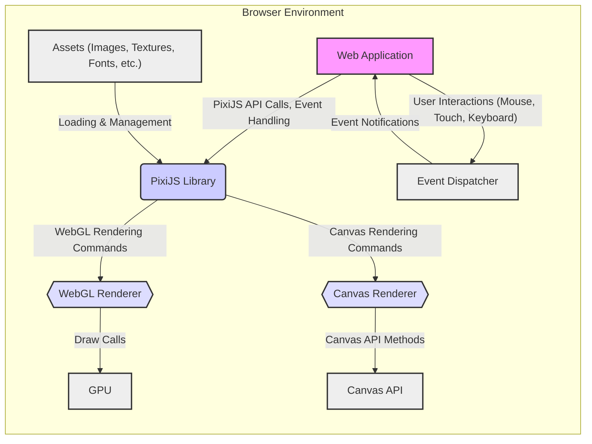
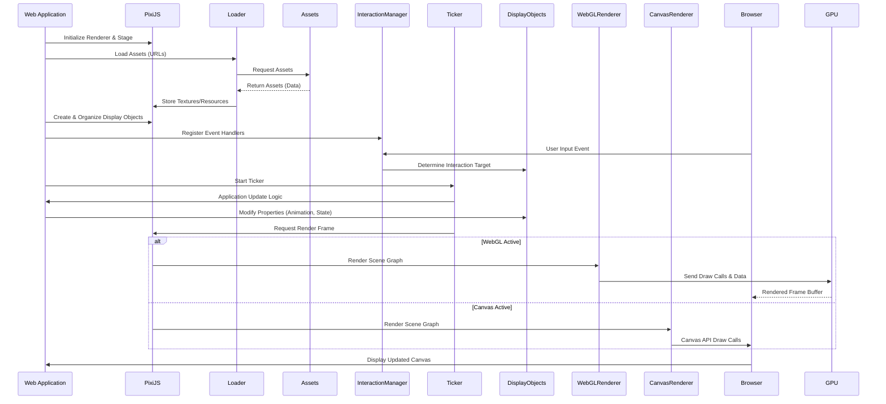

# Project Design Document: PixiJS

**Version:** 1.1
**Date:** October 26, 2023
**Author:** Gemini (AI Language Model)

## 1. Introduction

This document provides an enhanced and more detailed design overview of the PixiJS project, a fast, lightweight, and flexible 2D rendering library that operates across various devices. This revised document aims to provide a stronger foundation for subsequent threat modeling activities by offering a clearer and more comprehensive understanding of PixiJS's architecture, components, data flow, and potential interaction points.

## 2. Goals and Objectives

*   Deliver a refined and more detailed architectural overview of PixiJS.
*   Provide a clearer categorization and description of key components and their responsibilities.
*   Elaborate on the data flow within the library and its interactions with external systems, specifically the browser environment.
*   More explicitly highlight potential areas of interest and specific attack vectors for security analysis and threat modeling.
*   Serve as an improved and more informative reference point for developers and security analysts.

## 3. Target Audience

*   Security engineers and analysts responsible for performing threat modeling on systems utilizing PixiJS.
*   Developers actively contributing to the PixiJS project or integrating it into their applications.
*   Software architects designing systems that incorporate PixiJS as a rendering solution.

## 4. Scope

This document encompasses the core architecture and functionalities of the PixiJS library as represented in the provided GitHub repository. The focus remains on the client-side rendering aspects, with a more detailed exploration of the internal workings and interactions. This document does not cover specific application implementations built with PixiJS but provides a solid understanding of the library itself.

## 5. High-Level Architecture

PixiJS is a client-side JavaScript library designed for efficient 2D graphics rendering within web browsers. It intelligently utilizes either the WebGL API for hardware-accelerated rendering or falls back to the HTML5 Canvas API when WebGL is unavailable. The core of PixiJS revolves around managing a hierarchical scene graph of display objects and efficiently rendering these objects to the browser's rendering context.

**Key Components:**

*   **Web Application:** The encompassing web page or application that integrates and utilizes the PixiJS library for its rendering needs.
*   **PixiJS Library:** The central JavaScript library providing the core 2D rendering functionalities and API.
*   **WebGL Renderer:** The rendering engine that leverages the WebGL API to achieve hardware-accelerated graphics rendering.
*   **Canvas Renderer:** The alternative rendering engine that utilizes the HTML5 Canvas API for software-based rendering when WebGL is not available.
*   **GPU:** The Graphics Processing Unit, responsible for executing the rendering commands issued by the WebGL Renderer.
*   **Canvas API:** The browser's built-in API for drawing graphics programmatically on the `<canvas>` element.
*   **Event Dispatcher:**  Manages and routes user input events to the appropriate parts of the application and PixiJS.
*   **Assets (Images, Textures, Fonts, etc.):** External resources that PixiJS loads and utilizes for rendering visual elements.

## 6. Detailed Component Description

PixiJS can be broken down into several key functional areas:

*   **Core Display System:**
    *   **Display Objects:** The fundamental visual elements within a PixiJS scene. These include:
        *   `Sprite`: For displaying image-based content (textures).
        *   `Graphics`: For drawing vector-based shapes.
        *   `Text`: For rendering text with various styles.
        *   `Container`: For grouping and managing other display objects, forming the scene graph.
        *   `Mesh`: For rendering more complex, deformable shapes.
    *   **Stage:** The root `Container` that holds all visible display objects in the scene.
    *   **Scene Graph:** The hierarchical structure formed by `Containers` and other `Display Objects`, defining their relationships and rendering order.
    *   **Transform:**  Manages the position, scale, rotation, and skew of `Display Objects`.
*   **Rendering Engines:**
    *   **WebGL Renderer:**
        *   Manages the WebGL rendering context and state.
        *   Handles shader program compilation and management (vertex and fragment shaders).
        *   Implements batch rendering techniques for improved performance by grouping similar draw calls.
        *   Manages textures, framebuffers, and render targets.
        *   Utilizes geometry and buffer objects to send data to the GPU.
    *   **Canvas Renderer:**
        *   Obtains and utilizes the 2D rendering context of the HTML5 `<canvas>` element.
        *   Draws shapes, images, and text using the Canvas API's drawing methods.
        *   Performs transformations and applies styles using Canvas API functions.
*   **Resource Management:**
    *   **Loader:**  Responsible for asynchronously loading assets (images, textures, JSON data, etc.) from various sources.
    *   **Cache:**  Stores loaded resources to avoid redundant loading.
    *   **Texture:** Represents image data that can be used for rendering.
    *   **BaseTexture:** The underlying representation of image data in memory.
*   **Interaction System:**
    *   **Interaction Manager:**  Handles browser events (mouse, touch, pointer) and determines which display objects are being interacted with based on their hit areas.
    *   **Event Handling:**  Provides mechanisms for attaching event listeners to display objects.
*   **Animation and Time:**
    *   **Ticker:**  Manages the application's update loop, providing a consistent time source for animations and updates.
    *   **Animation Classes:** (e.g., `AnimatedSprite`) Facilitate frame-based animations.
*   **Filters and Effects:**
    *   **Filter System:** Allows applying post-processing effects to display objects, such as blur, color adjustments, and distortions.
    *   **Filter Classes:** Implement specific visual effects using shaders (in WebGL) or Canvas API manipulations.
*   **Text Rendering:**
    *   **Text Class:** Provides functionalities for rendering text with various font styles, sizes, and colors.
    *   **TextStyle:**  Defines the visual properties of rendered text.
*   **Utils:**
    *   A collection of utility functions for tasks like color manipulation, math calculations, and type checking.

## 7. Data Flow

The typical data flow within a PixiJS application involves these key stages:

1. **Initialization:** The web application initializes PixiJS, creating a `Renderer` (either WebGL or Canvas) and a `Stage`.
2. **Asset Loading:** The `Loader` is used to fetch necessary assets (images, textures, fonts, etc.) from specified URLs or local storage. Loaded assets are often cached for efficiency.
3. **Scene Graph Construction:** Developers create instances of `Display Objects` (e.g., `Sprite`, `Graphics`, `Text`) and organize them hierarchically by adding them to the `Stage` or other `Containers`. This defines the visual structure of the application.
4. **User Interaction:** The browser dispatches user input events (mouse clicks, touch events, keyboard presses). The `Interaction Manager` in PixiJS captures these events and determines which `Display Objects` are the targets of the interaction based on their defined hit areas and positions within the scene graph.
5. **Update Loop:** The `Ticker` drives the application's animation and logic. On each tick:
    *   Application logic updates the properties of `Display Objects` (e.g., position, rotation, scale, texture).
    *   Animation logic progresses, potentially modifying `Display Object` properties over time.
6. **Rendering:**
    *   The active `Renderer` (WebGL or Canvas) is invoked to render the scene.
    *   The `Renderer` traverses the scene graph, starting from the `Stage`.
    *   For each visible `Display Object`:
        *   **WebGL Renderer:**  Prepares and sends rendering commands (draw calls) and associated data (geometry, textures, shader uniforms) to the GPU via the WebGL API.
        *   **Canvas Renderer:**  Uses the Canvas 2D API to draw the `Display Object` onto the `<canvas>` element. This involves calling methods like `drawImage`, `fillRect`, `strokeRect`, etc.
7. **Display:** The browser displays the rendered output on the screen, updating the `<canvas>` element.

## 8. Security Considerations (Pre-Threat Model)

Integrating PixiJS into a web application introduces several potential security considerations that need to be addressed during threat modeling:

*   **Asset Loading Vulnerabilities:**
    *   **Cross-Site Scripting (XSS) via Malicious Assets:** If the application allows users to specify asset URLs, a malicious actor could provide a URL pointing to a crafted image or other asset that, when loaded and processed by the browser or PixiJS, could execute arbitrary JavaScript.
    *   **Content Security Policy (CSP) Bypasses:** Improperly configured or overly permissive CSP rules might allow the loading of malicious assets despite attempts to restrict them.
    *   **Server-Side Vulnerabilities:** If the asset server itself is compromised, malicious assets could be served without the application's knowledge.
*   **User-Provided Content Risks:**
    *   **Malicious Text Injection:** If user-provided text is rendered using PixiJS's `Text` class without proper sanitization, it could potentially be used to inject malicious scripts or manipulate the rendering in unexpected ways.
    *   **Image/Texture Manipulation Exploits:** If users can upload or manipulate images used as textures, vulnerabilities in image processing libraries or the browser's rendering engine could be exploited. This could lead to denial of service or other unexpected behavior.
*   **Client-Side Logic and State Manipulation:**
    *   **Logic Bugs Leading to Exploits:** Vulnerabilities in the application's logic that controls PixiJS elements (e.g., animation sequences, interaction handling) could be exploited to cause unintended actions or reveal sensitive information.
    *   **State Tampering:** If the application relies on client-side state related to PixiJS, attackers might attempt to manipulate this state to gain an advantage or bypass security checks.
*   **Dependency Management:**
    *   **Vulnerable Dependencies:** PixiJS relies on other JavaScript libraries. Outdated or vulnerable dependencies could introduce security flaws into the application. Regular dependency updates and security audits are crucial.
*   **Denial of Service (DoS) Attacks:**
    *   **Resource Exhaustion:** Malicious actors could attempt to overload the rendering engine by creating an extremely large number of display objects or triggering computationally expensive rendering operations, leading to performance degradation or crashes.
    *   **Malicious Filters:** Applying complex or poorly written filters could consume excessive GPU resources, leading to DoS.
*   **Input Validation and Sanitization:**
    *   **Missing or Inadequate Validation:** Failure to validate user inputs that influence PixiJS rendering (e.g., coordinates, colors, text content) could lead to unexpected behavior or vulnerabilities.
    *   **Lack of Sanitization:**  Not sanitizing user-provided content before rendering can open doors to injection attacks.

## 9. Deployment

PixiJS is typically deployed as a static JavaScript file that is included in a web page using a `<script>` tag. Alternatively, it can be installed as a dependency via package managers like npm or yarn and bundled into the application's JavaScript using tools like Webpack, Parcel, or Rollup. PixiJS executes entirely within the user's web browser.

## 10. Technologies Used

*   **JavaScript (ECMAScript):** The primary programming language for PixiJS.
*   **WebGL:** A JavaScript API for rendering interactive 2D and 3D graphics within compatible web browsers, leveraging the GPU for hardware acceleration.
*   **HTML5 Canvas API:** Provides a fallback mechanism for rendering graphics using the browser's built-in drawing capabilities.

## 11. Future Considerations

*   **WebGPU Integration:**  Future adoption of the WebGPU API could significantly alter the rendering pipeline and introduce new security considerations related to GPU access and resource management.
*   **Further Modularization:** Continued modularization of the PixiJS library could impact the architecture and data flow, potentially creating new interaction points and dependencies to consider for security.
*   **Community Plugins and Extensions:** The use of community-contributed plugins and extensions introduces external code into the application, which may have its own vulnerabilities and security risks that need to be evaluated.
*   **Advanced Rendering Features:**  The introduction of more advanced rendering features could introduce new attack surfaces or complexities in the rendering pipeline.

This enhanced design document provides a more detailed and nuanced understanding of the PixiJS project's architecture, which is crucial for conducting a comprehensive and effective threat model. The more specific identification of components, data flows, and potential security considerations aims to facilitate a deeper analysis of potential vulnerabilities and the design of robust mitigation strategies.