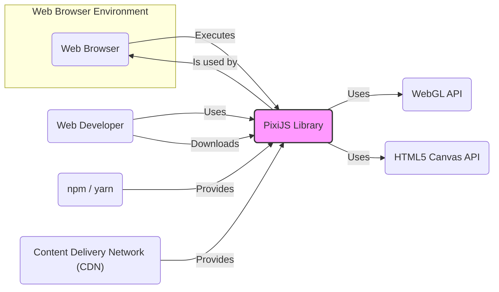
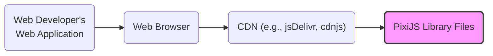
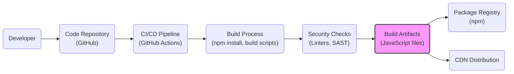

# BUSINESS POSTURE

- Business Priorities and Goals:
  - Provide a high-performance and flexible 2D rendering library for web developers.
  - Enable creation of rich, interactive graphics, games, and visualizations in web browsers.
  - Maintain broad browser compatibility and device support.
  - Foster a strong community and ecosystem around the library.
  - Ensure ease of use and a developer-friendly API.
- Business Risks:
  - Security vulnerabilities in PixiJS could be exploited in applications using the library, leading to attacks like Cross-Site Scripting (XSS) or denial of service.
  - Supply chain attacks targeting the distribution channels (e.g., npm, CDN) could compromise the library's integrity.
  - Reputational damage and loss of user trust if security issues are discovered and not addressed promptly.
  - Performance issues or lack of compatibility could lead developers to choose alternative libraries.

# SECURITY POSTURE

- Existing Security Controls:
  - security control: GitHub Dependabot is likely used to identify vulnerable dependencies. (Implemented in: GitHub Repository Settings)
  - security control: Code reviews are performed by maintainers and community contributors. (Implemented in: GitHub Pull Request Process)
  - security control: GitHub code scanning might be enabled to detect potential code vulnerabilities. (Implemented in: GitHub Repository Settings)
  - accepted risk: Reliance on community contributions for identifying and fixing security vulnerabilities.
  - accepted risk: Open-source nature means vulnerabilities may be publicly disclosed before a patch is available.

- Recommended Security Controls:
  - security control: Implement automated Security Scanning (SAST/DAST) in the CI/CD pipeline.
  - security control: Establish a formal vulnerability disclosure policy and security contact.
  - security control: Conduct periodic security audits by external security experts.
  - security control: Implement a Software Bill of Materials (SBOM) for releases to enhance supply chain transparency.

- Security Requirements:
  - Authentication: Not directly applicable to PixiJS library itself, as it does not handle user authentication. Applications using PixiJS will need to implement their own authentication mechanisms.
  - Authorization: Not directly applicable to PixiJS library itself. Applications using PixiJS will need to implement authorization based on their specific requirements.
  - Input Validation:
    - Requirement: PixiJS should validate all external inputs, such as texture URLs, shader code, and user-provided data used in rendering, to prevent injection attacks (e.g., XSS, Shader injection).
    - Requirement: Input validation should be applied on both data types and data ranges to avoid unexpected behavior and potential vulnerabilities.
  - Cryptography:
    - Requirement: PixiJS itself may not require extensive cryptography, but if it handles sensitive data or interacts with secure APIs in the future, appropriate cryptographic measures (e.g., HTTPS for network requests) should be used.
    - Requirement: Applications using PixiJS might require cryptography for secure communication or data storage, which should be implemented by the application developers, not directly within the PixiJS library.

# DESIGN

## C4 CONTEXT



- Context Diagram Elements:
  - Element:
    - Name: Web Browser
    - Type: Software System
    - Description: User's web browser (e.g., Chrome, Firefox, Safari, Edge) where web applications using PixiJS are executed.
    - Responsibilities: Executes JavaScript code, renders web pages, provides WebGL and Canvas APIs.
    - Security controls: Browser security features (e.g., sandboxing, Content Security Policy), user-configured security settings.
  - Element:
    - Name: Web Developer
    - Type: Person
    - Description: Software developers who use PixiJS to create web applications and interactive content.
    - Responsibilities: Develops web applications, integrates PixiJS library, configures and uses PixiJS API.
    - Security controls: Secure coding practices, dependency management, input validation in application code.
  - Element:
    - Name: PixiJS Library
    - Type: Software System
    - Description: The PixiJS JavaScript library, providing 2D rendering capabilities using WebGL and Canvas.
    - Responsibilities: Provides API for 2D graphics rendering, manages rendering pipeline, handles display objects and textures.
    - Security controls: Input validation within the library, secure coding practices during development, dependency vulnerability scanning.
  - Element:
    - Name: npm / yarn
    - Type: Software System
    - Description: Package managers used by web developers to download and manage JavaScript libraries, including PixiJS.
    - Responsibilities: Package distribution, dependency resolution, library installation.
    - Security controls: Package integrity checks, vulnerability scanning of packages, repository security.
  - Element:
    - Name: Content Delivery Network (CDN)
    - Type: Software System
    - Description: Network of servers used to host and deliver static files, including PixiJS library files, to end-users with high availability and performance.
    - Responsibilities: Hosting and delivering PixiJS library files, caching content, ensuring fast content delivery.
    - Security controls: CDN infrastructure security, access controls, HTTPS for content delivery.
  - Element:
    - Name: WebGL API
    - Type: Software System Interface
    - Description: JavaScript API provided by web browsers for accessing graphics hardware and performing hardware-accelerated 2D and 3D rendering.
    - Responsibilities: Provides low-level graphics rendering capabilities, hardware acceleration.
    - Security controls: Browser security controls, WebGL API security policies, driver security.
  - Element:
    - Name: HTML5 Canvas API
    - Type: Software System Interface
    - Description: JavaScript API provided by web browsers for drawing graphics on the fly using JavaScript. PixiJS uses Canvas API as a fallback when WebGL is not available.
    - Responsibilities: Provides software-based 2D graphics rendering capabilities.
    - Security controls: Browser security controls, Canvas API security policies.

## C4 CONTAINER

```mermaid
flowchart LR
    subgraph "Web Browser"
        A("PixiJS Core")
        B("Examples / Demos")
        C("Documentation")
        D("Plugins")
    end

    style A fill:#f9f,stroke:#333,stroke-width:2px
    style B fill:#f9f,stroke:#333,stroke-width:2px
    style C fill:#f9f,stroke:#333,stroke-width:2px
    style D fill:#f9f,stroke:#333,stroke-width:2px

    A -- Uses --> "WebGL API"
    A -- Uses --> "HTML5 Canvas API"
    B -- Uses --> A
    C -- Describes --> A
    D -- Extends --> A
```

- Container Diagram Elements:
  - Element:
    - Name: PixiJS Core
    - Type: Container - JavaScript Library
    - Description: The core JavaScript library of PixiJS, containing the main rendering engine, display object management, and API functionalities.
    - Responsibilities: 2D graphics rendering, scene graph management, event handling, resource management (textures, shaders).
    - Security controls: Input validation, secure coding practices, vulnerability scanning, code reviews.
  - Element:
    - Name: Examples / Demos
    - Type: Container - Web Application
    - Description: Collection of example web applications and demonstrations showcasing the features and capabilities of PixiJS.
    - Responsibilities: Demonstrating PixiJS usage, providing code examples for developers, testing PixiJS features.
    - Security controls: Input validation in example code, secure hosting of examples, regular updates to examples.
  - Element:
    - Name: Documentation
    - Type: Container - Web Application / Static Website
    - Description: API documentation, guides, and tutorials for PixiJS, hosted as a website.
    - Responsibilities: Providing comprehensive documentation for developers, API reference, usage instructions.
    - Security controls: Secure hosting of documentation website, access controls, protection against content injection.
  - Element:
    - Name: Plugins
    - Type: Container - JavaScript Libraries
    - Description: Optional plugins that extend the functionality of PixiJS core, providing additional features and capabilities.
    - Responsibilities: Extending PixiJS functionality, providing specialized features (e.g., filters, loaders, interactions).
    - Security controls: Plugin code review, vulnerability scanning of plugins, clear plugin documentation and security considerations.

## DEPLOYMENT

- Deployment Architecture Options:
  - Option 1: npm/yarn distribution - Developers install PixiJS using package managers and bundle it with their web applications.
  - Option 2: CDN distribution - Developers include PixiJS library directly from a CDN in their HTML pages.
  - Option 3: Self-hosting - Developers download PixiJS and host it on their own servers.

- Detailed Deployment Architecture (CDN Distribution):



- Deployment Diagram Elements (CDN Distribution):
  - Element:
    - Name: Web Developer's Web Application
    - Type: Software System
    - Description: The web application developed by a web developer that utilizes PixiJS for rendering graphics.
    - Responsibilities: Application logic, user interface, integrating PixiJS library, handling user interactions.
    - Security controls: Application-level security controls (authentication, authorization, input validation), secure coding practices.
  - Element:
    - Name: Web Browser
    - Type: Software System
    - Description: User's web browser that requests and executes the web application and PixiJS library.
    - Responsibilities: Executing JavaScript code, rendering web pages, providing browser security features.
    - Security controls: Browser security features (sandboxing, CSP), user security settings.
  - Element:
    - Name: CDN (e.g., jsDelivr, cdnjs)
    - Type: Infrastructure
    - Description: Content Delivery Network used to host and distribute PixiJS library files.
    - Responsibilities: Hosting PixiJS files, providing high availability and performance, caching content.
    - Security controls: CDN infrastructure security, access controls, HTTPS, DDoS protection.
  - Element:
    - Name: PixiJS Library Files
    - Type: Software Artifact
    - Description: The JavaScript files comprising the PixiJS library, hosted on the CDN.
    - Responsibilities: Providing the PixiJS library code to web browsers.
    - Security controls: Integrity checks (e.g., checksums), secure release process, vulnerability scanning of library code.

## BUILD



- Build Process Elements:
  - Element:
    - Name: Developer
    - Type: Person
    - Description: Software developer contributing code to the PixiJS project.
    - Responsibilities: Writing code, committing changes, creating pull requests.
    - Security controls: Developer workstation security, code review participation, secure coding practices.
  - Element:
    - Name: Code Repository (GitHub)
    - Type: Software System
    - Description: GitHub repository hosting the PixiJS source code.
    - Responsibilities: Version control, code storage, collaboration platform, pull request management.
    - Security controls: Access controls, branch protection, audit logs, GitHub security features (Dependabot, code scanning).
  - Element:
    - Name: CI/CD Pipeline (GitHub Actions)
    - Type: Software System
    - Description: Automated CI/CD pipeline using GitHub Actions to build, test, and publish PixiJS.
    - Responsibilities: Automated build process, testing, security checks, package publishing, release management.
    - Security controls: Secure pipeline configuration, access controls, secret management, build environment security.
  - Element:
    - Name: Build Process (npm install, build scripts)
    - Type: Software Process
    - Description: Steps involved in building PixiJS from source code, including dependency installation, code compilation, bundling, and minification.
    - Responsibilities: Transforming source code into distributable artifacts, optimizing code for performance.
    - Security controls: Dependency vulnerability scanning, build script security, secure build environment.
  - Element:
    - Name: Security Checks (Linters, SAST)
    - Type: Software Process
    - Description: Automated security checks integrated into the build process, including code linters and Static Application Security Testing (SAST) tools.
    - Responsibilities: Identifying potential code quality issues and security vulnerabilities early in the development lifecycle.
    - Security controls: SAST tool configuration, vulnerability reporting, integration with CI/CD pipeline.
  - Element:
    - Name: Build Artifacts (JavaScript files)
    - Type: Software Artifact
    - Description: The compiled and optimized JavaScript files of the PixiJS library, ready for distribution.
    - Responsibilities: Distributable library files, packaged for npm and CDN distribution.
    - Security controls: Integrity checks (checksums), signing of artifacts (optional), vulnerability scanning of artifacts.
  - Element:
    - Name: Package Registry (npm)
    - Type: Software System
    - Description: npm registry used to publish and distribute PixiJS packages to web developers.
    - Responsibilities: Package hosting, version management, package distribution.
    - Security controls: npm registry security, package integrity checks, malware scanning.
  - Element:
    - Name: CDN Distribution
    - Type: Software System
    - Description: Distribution of PixiJS library files to CDNs for public access.
    - Responsibilities: Making PixiJS library available via CDNs for easy integration into web applications.
    - Security controls: CDN security controls, secure file transfer, access controls.

# RISK ASSESSMENT

- Critical Business Processes:
  - Maintaining the integrity and availability of the PixiJS library.
  - Ensuring the security of the PixiJS library to prevent vulnerabilities in applications that use it.
  - Maintaining developer trust and community support for PixiJS.

- Data to Protect and Sensitivity:
  - Source code: Publicly available, but integrity is critical to prevent malicious modifications. Sensitivity: Public, Integrity: High.
  - Build artifacts (JavaScript files): Publicly distributed, integrity is crucial to prevent supply chain attacks. Sensitivity: Public, Integrity: High.
  - Package registry credentials and CDN access keys: Confidential, used for publishing and distributing PixiJS. Sensitivity: Confidential, Integrity: High, Availability: High.
  - Documentation content: Publicly available, integrity is important for accurate information. Sensitivity: Public, Integrity: Medium.

# QUESTIONS & ASSUMPTIONS

- BUSINESS POSTURE:
  - Assumption: PixiJS is primarily used in front-end web development for visual enhancements and interactive elements.
  - Question: Are there specific industry verticals or application domains where PixiJS is most heavily used (e.g., gaming, advertising, data visualization)?
  - Question: What is the expected lifespan and long-term maintenance plan for PixiJS?

- SECURITY POSTURE:
  - Assumption: Security is primarily community-driven with core maintainers overseeing security aspects.
  - Question: Is there a designated security team or individual responsible for security within the PixiJS project?
  - Question: Are there any historical security incidents or vulnerability reports related to PixiJS that can inform current security posture?
  - Question: What is the process for handling and responding to reported security vulnerabilities?

- DESIGN:
  - Assumption: PixiJS is designed to be browser-agnostic and compatible with modern web browsers supporting WebGL and Canvas.
  - Question: Are there specific browser versions or environments that are officially supported and tested?
  - Question: Are there any known limitations or security considerations related to the use of WebGL or Canvas APIs within PixiJS?
  - Question: What are the performance and security implications of using PixiJS in resource-constrained environments (e.g., mobile devices)?