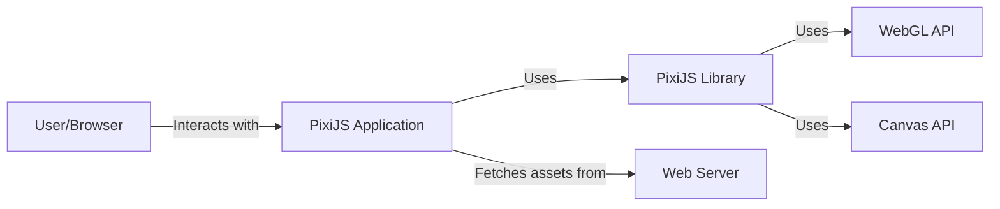
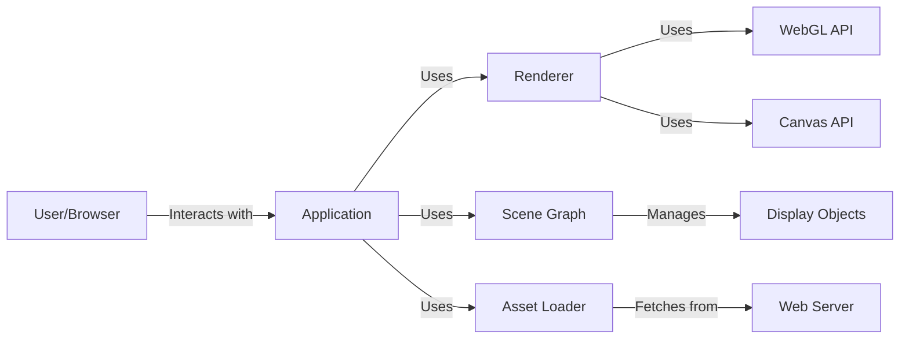
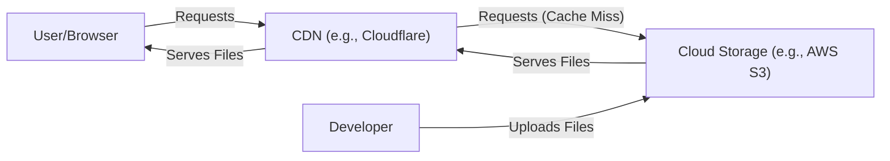
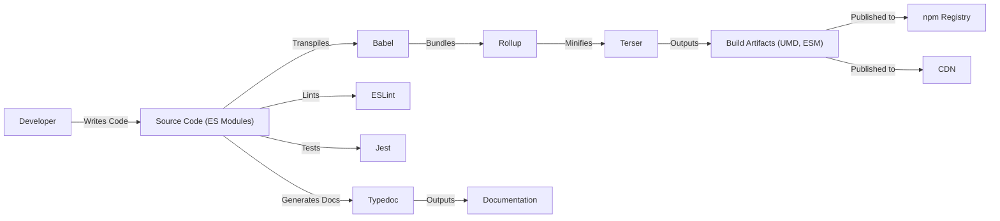

# BUSINESS POSTURE

PixiJS is a popular open-source 2D graphics library. Its primary goal is to provide a fast and flexible rendering engine for web browsers, enabling developers to create rich, interactive graphics, visualizations, and games without having to deal with the complexities of WebGL directly.

Business priorities:

- Maintain high performance and efficiency: PixiJS's core value proposition is speed. Any design changes must prioritize performance.
- Broad browser compatibility: Support a wide range of browsers and devices, including older ones, to maximize reach.
- Ease of use and developer experience: Provide a clean, well-documented API that is easy to learn and use.
- Extensibility and modularity: Allow developers to extend and customize the library to meet their specific needs.
- Community engagement and support: Foster a vibrant community and provide adequate support to users.
- Open Source Sustainability: Ensure the long-term viability of the project through contributions, sponsorships, and a healthy community.

Business risks:

- Performance regressions: Changes to the codebase could inadvertently introduce performance bottlenecks, impacting existing users.
- Compatibility issues: New features or changes might break compatibility with certain browsers or devices.
- API instability: Frequent or breaking changes to the API could frustrate developers and hinder adoption.
- Security vulnerabilities: As a library that executes code in the browser, security vulnerabilities could expose users to attacks.
- Lack of maintainers or contributors: The project's long-term health depends on a consistent stream of contributions and active maintenance.
- Competition: Other libraries or frameworks could emerge and challenge PixiJS's dominance.

# SECURITY POSTURE

Existing security controls:

- security control: Input validation: PixiJS partially validates user-provided data, such as texture sources and dimensions, to prevent common errors. Implemented in various modules, such as `Texture` and `Sprite`.
- security control: Code style and reviews: The project uses ESLint and has a code review process to maintain code quality and identify potential issues. Described in contributing guidelines.
- security control: Dependency management: The project uses package managers (like npm) to manage dependencies and keep them updated. Described in `package.json`.
- security control: Regular updates: The project is actively maintained, and updates are released regularly to address bugs and security vulnerabilities.

Accepted risks:

- accepted risk: Cross-Site Scripting (XSS): While PixiJS itself doesn't directly handle user input in a way that would typically lead to XSS, it's possible for developers to misuse the library and create XSS vulnerabilities in their applications. This is a common risk with any JavaScript library.
- accepted risk: Denial of Service (DoS): Maliciously crafted content or excessive resource usage could potentially lead to performance degradation or crashes in the browser.
- accepted risk: Third-party dependencies: Vulnerabilities in third-party dependencies could potentially impact PixiJS.

Recommended security controls:

- security control: Content Security Policy (CSP) integration guidelines: Provide clear guidelines for developers on how to integrate PixiJS with a strong CSP to mitigate XSS risks.
- security control: WebGL context loss handling: Implement robust handling of WebGL context loss events to prevent crashes and improve stability.
- security control: Input sanitization recommendations: Offer specific recommendations for sanitizing user-provided data that is used to create PixiJS objects.
- security control: Security audits: Conduct periodic security audits of the codebase to identify potential vulnerabilities.
- security control: Supply Chain Security: Implement SLSA framework to ensure integrity of build and deployment process.

Security requirements:

- Authentication: Not directly applicable to PixiJS, as it's a client-side rendering library. Authentication is the responsibility of the application using PixiJS.
- Authorization: Not directly applicable. Authorization is the responsibility of the application using PixiJS.
- Input validation: All user-provided data, such as texture sources, dimensions, and shader parameters, should be validated to prevent errors and potential security vulnerabilities.
- Cryptography: Not directly applicable, unless PixiJS is used to handle encrypted assets, in which case standard web cryptography practices should be followed.

# DESIGN

## C4 CONTEXT

Elements description:

- Element:
    - Name: User/Browser
    - Type: User
    - Description: The end-user interacting with the PixiJS application through a web browser.
    - Responsibilities: Viewing and interacting with the visual content rendered by PixiJS.
    - Security controls: Browser's built-in security mechanisms (Same-Origin Policy, CSP, etc.).

- Element:
    - Name: PixiJS Application
    - Type: Application
    - Description: The web application built using the PixiJS library.
    - Responsibilities: Creating and managing PixiJS objects, handling user input, and orchestrating the rendering process.
    - Security controls: Application-specific security measures, input validation, and proper use of PixiJS API.

- Element:
    - Name: PixiJS Library
    - Type: Library
    - Description: The PixiJS rendering library.
    - Responsibilities: Providing a high-level API for creating and manipulating 2D graphics, managing rendering resources, and interacting with WebGL/Canvas.
    - Security controls: Input validation, code reviews, dependency management.

- Element:
    - Name: Web Server
    - Type: System
    - Description: The server hosting the PixiJS application and its assets (images, sounds, etc.).
    - Responsibilities: Serving the application files and assets to the user's browser.
    - Security controls: Standard web server security measures (HTTPS, access controls, etc.).

- Element:
    - Name: WebGL API
    - Type: API
    - Description: The browser's WebGL API, used by PixiJS for hardware-accelerated rendering.
    - Responsibilities: Providing low-level access to the GPU for rendering graphics.
    - Security controls: Browser's implementation of WebGL security.

- Element:
    - Name: Canvas API
    - Type: API
    - Description: The browser's Canvas API, used by PixiJS as a fallback rendering context.
    - Responsibilities: Providing a 2D drawing API.
    - Security controls: Browser's implementation of Canvas security.

## C4 CONTAINER

Elements description:

- Element:
    - Name: User/Browser
    - Type: User
    - Description: The end-user interacting with the PixiJS application.
    - Responsibilities: Viewing and interacting with the application.
    - Security controls: Browser's built-in security.

- Element:
    - Name: Application
    - Type: Container
    - Description: The user's application code that utilizes PixiJS.
    - Responsibilities: Setting up the PixiJS stage, creating and managing display objects, handling user interactions.
    - Security controls: Application-level security, input validation.

- Element:
    - Name: Renderer
    - Type: Container
    - Description: The core rendering engine of PixiJS.
    - Responsibilities: Choosing between WebGL and Canvas rendering, managing rendering contexts, drawing display objects.
    - Security controls: Input validation, WebGL context loss handling.

- Element:
    - Name: Scene Graph
    - Type: Container
    - Description: The hierarchical structure of display objects.
    - Responsibilities: Organizing and managing display objects, handling transformations and visibility.
    - Security controls: None specific.

- Element:
    - Name: Asset Loader
    - Type: Container
    - Description: The component responsible for loading assets (images, textures, etc.).
    - Responsibilities: Fetching assets from the web server, caching loaded assets.
    - Security controls: Input validation (asset URLs).

- Element:
    - Name: WebGL API
    - Type: API
    - Description: The browser's WebGL API.
    - Responsibilities: Providing low-level access to the GPU.
    - Security controls: Browser's WebGL implementation.

- Element:
    - Name: Canvas API
    - Type: API
    - Description: The browser's Canvas API.
    - Responsibilities: Providing a 2D drawing API.
    - Security controls: Browser's Canvas implementation.

- Element:
    - Name: Web Server
    - Type: System
    - Description: The server hosting the application and assets.
    - Responsibilities: Serving files to the browser.
    - Security controls: Standard web server security.

- Element:
    - Name: Display Objects
    - Type: Component
    - Description: The individual elements that make up the scene (sprites, text, graphics, etc.).
    - Responsibilities: Representing visual elements in the scene.
    - Security controls: None specific.

## DEPLOYMENT

PixiJS, being a JavaScript library, is typically deployed as part of a web application. There are several deployment options:

1.  **Traditional Web Server:** Deploying the HTML, CSS, JavaScript (including PixiJS), and asset files to a web server like Apache, Nginx, or IIS.
2.  **Cloud Storage and CDN:** Using services like AWS S3, Google Cloud Storage, or Azure Blob Storage to host the static files and a CDN (Content Delivery Network) like Cloudflare, Akamai, or AWS CloudFront to distribute the content globally.
3.  **Serverless Platforms:** Deploying the application using serverless functions (e.g., AWS Lambda, Google Cloud Functions) and a static site hosting service (e.g., Netlify, Vercel).
4.  **Bundled with Application:** In case PixiJS is used to build desktop application, using Electron or similar framework, PixiJS will be bundled with application.

We'll describe the **Cloud Storage and CDN** approach in detail, as it's a common and efficient deployment method for web applications.

Elements description:

- Element:
    - Name: User/Browser
    - Type: User
    - Description: The end-user accessing the application through a web browser.
    - Responsibilities: Making requests for the application files and assets.
    - Security controls: Browser's built-in security mechanisms.

- Element:
    - Name: CDN (e.g., Cloudflare)
    - Type: System
    - Description: A Content Delivery Network that caches and serves the application files from edge locations closer to the users.
    - Responsibilities: Caching static content, reducing latency, and improving performance.
    - Security controls: DDoS protection, HTTPS, WAF (Web Application Firewall).

- Element:
    - Name: Cloud Storage (e.g., AWS S3)
    - Type: System
    - Description: A cloud storage service that stores the application's static files (HTML, CSS, JavaScript, assets).
    - Responsibilities: Storing and serving the application files.
    - Security controls: Access control lists (ACLs), bucket policies, encryption at rest, versioning.

- Element:
    - Name: Developer
    - Type: User
    - Description: The developer deploying the application.
    - Responsibilities: Uploading the application files to the cloud storage service.
    - Security controls: IAM (Identity and Access Management) roles and permissions.

## BUILD

PixiJS uses a build process to create optimized, minified versions of the library for distribution. The build process typically involves:

1.  **Source Code:** Developers write code in modern JavaScript (ES modules).
2.  **Transpilation:** Babel is used to transpile the code to older JavaScript versions for broader browser compatibility.
3.  **Bundling:** Rollup is used to bundle the modules into a single file (or multiple files for different formats like UMD, ESM).
4.  **Minification:** Terser is used to minify the bundled code, reducing file size.
5.  **Linting:** ESLint is used to enforce code style and identify potential errors.
6.  **Testing:** Jest is used for unit testing.
7.  **Documentation Generation:** Typedoc is used to generate API documentation from the source code.
8.  **Publishing:** The built files and documentation are published to npm and CDN.

Security controls in the build process:

- security control: Linting (ESLint): Enforces code style and helps prevent common coding errors that could lead to vulnerabilities.
- security control: Dependency management (npm): Uses npm to manage dependencies and keep them updated, reducing the risk of using vulnerable libraries. `package-lock.json` is used to ensure consistent builds.
- security control: Testing (Jest): Unit tests help ensure code correctness and prevent regressions.
- security control: Regular updates: The project is actively maintained, and updates are released regularly, including security patches.
- security control: Code reviews: All code changes are reviewed by other developers before being merged.
- security control: GitHub Actions: Build process is automated using GitHub Actions, providing transparency and auditability.

# RISK ASSESSMENT

Critical business processes to protect:

- The core rendering engine: Ensuring its performance, stability, and compatibility.
- The developer experience: Maintaining a clean and easy-to-use API.
- The community and ecosystem: Fostering a healthy and active community.

Data to protect and their sensitivity:

- PixiJS itself doesn't directly handle sensitive user data. However, applications built with PixiJS might handle such data. The sensitivity of the data depends on the specific application. Examples include:
    - User input (text, mouse coordinates): Potentially sensitive if used for authentication or personal information.
    - Game state: Could be sensitive in competitive games.
    - Asset data (images, sounds): Might be proprietary or copyrighted.

# QUESTIONS & ASSUMPTIONS

Questions:

- Are there any specific compliance requirements (e.g., GDPR, CCPA) that apply to applications built with PixiJS?
- Are there any plans to introduce features that might handle sensitive user data directly within PixiJS?
- What is the process for reporting security vulnerabilities in PixiJS?
- What is the long-term strategy for maintaining browser compatibility, especially with the evolving web platform?

Assumptions:

- Business Posture: The primary goal is to provide a fast and reliable 2D rendering library for the web.
- Security Posture: Developers using PixiJS are responsible for the security of their applications, including input validation and data protection. PixiJS aims to provide a secure foundation, but it cannot guarantee the security of applications built on top of it.
- Design: The design is modular and extensible, allowing developers to customize and extend the library. The core rendering engine is optimized for performance and compatibility.