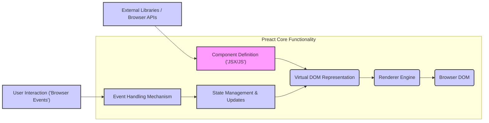
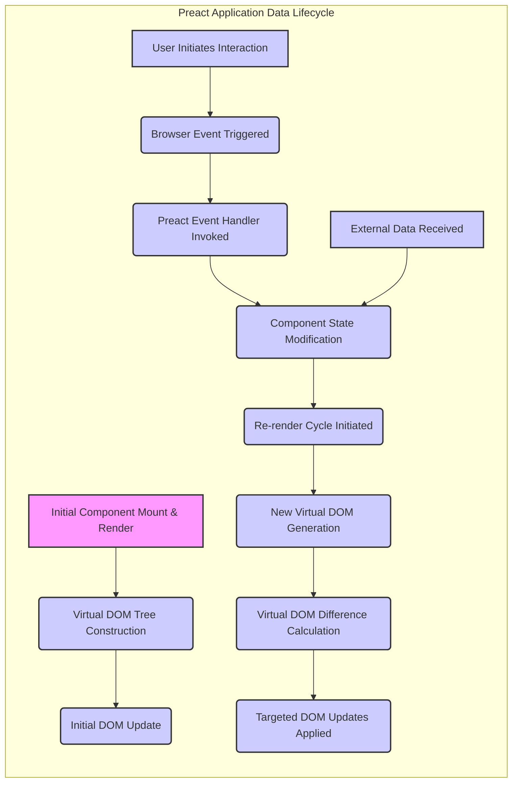

# Project Design Document: Preact JavaScript Library

**Version:** 1.1
**Date:** October 26, 2023
**Author:** AI Software Architect

## 1. Introduction

This document provides a detailed architectural overview of the Preact JavaScript library, intended for use in subsequent threat modeling activities. It describes the key components, data flow, and interactions within the library and its typical usage scenarios.

Preact is a fast, 3kB alternative to React, offering a similar modern API for building component-based user interfaces in web browsers. This document focuses on the core library functionality and its interaction with the surrounding web environment, highlighting aspects relevant to security analysis.

## 2. Goals and Objectives

The primary goals of Preact are:

* **High Performance:** Delivering a lightweight and performant library for building interactive user interfaces.
* **Small Size:** Maintaining a minimal bundle size to reduce download times and improve initial page load performance.
* **React Compatibility:** Providing a largely API-compatible experience with React to facilitate easier transitions and knowledge sharing.
* **Developer Friendliness:** Offering a straightforward and intuitive API for developers to build and maintain applications.

This design document aims to capture the architectural elements that contribute to these goals, with a particular focus on identifying potential security implications.

## 3. Architectural Overview

Preact's architecture is centered around a component-based model and an efficient virtual DOM implementation. It provides mechanisms for managing component state, efficiently rendering UI updates, and handling user interactions within the browser environment.

### 3.1. Key Components

* **Component Definition (JSX/JS):** Developers define UI elements as reusable components using JSX syntax or plain JavaScript. These components encapsulate their own logic, internal state, and rendering behavior.
* **Virtual DOM Representation:** Preact maintains an in-memory representation of the actual Document Object Model (DOM). This virtual DOM allows Preact to efficiently calculate the minimal set of changes required to update the real DOM, improving performance.
* **Renderer Engine:** The core of Preact responsible for comparing the virtual DOM with the current state of the real DOM and applying the necessary updates. This process, known as reconciliation, ensures efficient and targeted DOM manipulation.
* **State Management:** Components can manage their internal state. Changes to a component's state trigger a re-rendering process, updating the UI to reflect the new state.
* **Event Handling Mechanism:** Preact provides a synthetic event system that normalizes browser events, making event handling consistent across different browsers. Components define functions to handle user interactions (e.g., clicks, input changes).
* **Hooks:** Functions that allow functional components to "hook into" Preact state and lifecycle features, providing a way to reuse stateful logic without class components.

## 4. Data Flow

The typical data flow within a Preact application involves the following stages:

1. **Initial Render:** When a Preact application starts, the root component is initially rendered. This involves creating a virtual DOM representation based on the component's definition and then updating the actual browser DOM to reflect this initial state.
2. **User Interaction & Event Triggering:** User actions within the browser (e.g., clicking a button, typing in an input field) trigger corresponding DOM events.
3. **Event Handling & Invocation:** Preact's event system captures these browser events and invokes the associated event handler functions defined within the relevant Preact components.
4. **State Updates & Management:** Event handlers often update the component's internal state based on user interaction or other application logic.
5. **Re-rendering Process:** When a component's state changes, Preact triggers a re-rendering process for that component and its affected sub-components.
6. **Virtual DOM Diffing & Comparison:** The Renderer Engine compares the newly generated virtual DOM with the previous virtual DOM to identify the differences (the minimal set of changes).
7. **DOM Updates & Reconciliation:** Only the necessary changes (identified in the diffing step) are applied to the actual browser DOM, ensuring efficient and performant UI updates.
8. **Data Fetching from External Sources:** Components may need to fetch data from external APIs or services. This data is then used to update the component's state, triggering re-renders and updating the UI.

## 5. Security Considerations and Potential Threats

While Preact is a client-side library, its role in rendering dynamic content makes it a crucial point to consider for security. Potential threats include:

* **Cross-Site Scripting (XSS):**
    * **Threat:** If user-provided data or data from untrusted sources is directly rendered by Preact components without proper sanitization, it can lead to XSS vulnerabilities. Attackers can inject malicious scripts that will be executed in the user's browser.
    * **Attack Vectors:** Rendering unsanitized data from URL parameters, user input fields, or backend APIs.
* **Dependency Vulnerabilities:**
    * **Threat:** Preact applications rely on a variety of third-party libraries and packages. Vulnerabilities in these dependencies can be exploited to compromise the application.
    * **Attack Vectors:** Using outdated or vulnerable versions of dependencies.
* **Client-Side Data Exposure:**
    * **Threat:** Sensitive data handled client-side within Preact components (e.g., API keys, temporary tokens) could be exposed if not managed carefully.
    * **Attack Vectors:** Storing sensitive data in component state without proper protection, logging sensitive data client-side.
* **State Management Issues:**
    * **Threat:** If the application uses a more complex state management solution, vulnerabilities in that solution or improper usage can lead to security issues.
    * **Attack Vectors:**  Unauthorized state modifications, exposure of sensitive data within the state.
* **Server-Side Rendering (SSR) Vulnerabilities:**
    * **Threat:** When using Preact for SSR, vulnerabilities in the server-side environment or the rendering process itself can be exploited.
    * **Attack Vectors:** Injection attacks during the rendering process, exposure of server-side secrets.
* **Build Process Compromise:**
    * **Threat:** If the build process used to bundle the Preact application is compromised, malicious code could be injected into the final application bundle.
    * **Attack Vectors:** Supply chain attacks targeting build tools or dependencies.
* **Prototype Pollution:**
    * **Threat:** Although less common in direct Preact code, vulnerabilities in dependencies could lead to prototype pollution, potentially causing unexpected behavior or security issues.
    * **Attack Vectors:** Exploiting vulnerabilities in libraries that manipulate object prototypes.

## 6. Deployment and Usage Scenarios

Preact applications are typically deployed as static assets (HTML, CSS, JavaScript bundles) served by web servers or Content Delivery Networks (CDNs). Common usage scenarios include:

* **Single-Page Applications (SPAs):** Preact is well-suited for building SPAs where the user interface is dynamically updated in response to user interactions without full page reloads.
* **Progressive Web Apps (PWAs):** Preact's small size and performance make it a strong candidate for PWAs, where minimizing download size and maximizing performance are crucial.
* **Component Libraries and UI Widgets:** Preact can be used to develop reusable UI components or widgets that can be integrated into other web applications.
* **Integration into Existing Websites:** Preact can be incrementally adopted and integrated into specific sections of existing websites to enhance interactivity.
* **Server-Side Rendering (SSR) Applications:** Preact can be used with Node.js or other server-side environments to render the initial HTML on the server, improving initial load times and SEO.

## 7. Technologies Used

* **JavaScript (ES6+):** The primary programming language for Preact development and application logic.
* **JSX (JavaScript XML):** A syntax extension for JavaScript that allows developers to write HTML-like structures within JavaScript code for defining UI components.
* **HTML:** Provides the basic structure and semantics of web pages.
* **CSS (and CSS Preprocessors like Sass/Less):** Used for styling the user interface components.
* **Build Tools (e.g., Webpack, Rollup, Parcel):** Used to bundle, optimize, and transform Preact application code for deployment.
* **Node.js (for development, tooling, and potentially SSR):** A JavaScript runtime environment used for development tasks and server-side rendering.
* **Package Managers (npm or Yarn):** Used for managing project dependencies and installing third-party libraries.

## 8. Future Considerations

Potential future developments and considerations for Preact include:

* **Continued Performance Optimizations:** Ongoing efforts to further improve rendering performance and reduce the library's bundle size.
* **New Features and API Enhancements:**  Exploring and potentially adding new features or API improvements while maintaining a high degree of compatibility with React.
* **Security Best Practices and Tooling:**  Providing more explicit guidance and potentially tooling to help developers build more secure Preact applications.
* **Improved DevTools Integration:** Enhancing developer tools for debugging and inspecting Preact applications.

This document provides a comprehensive architectural overview of the Preact JavaScript library, focusing on aspects relevant to security analysis and threat modeling. It outlines the key components, data flow, potential threats, and common usage scenarios to facilitate a thorough security assessment.