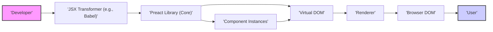
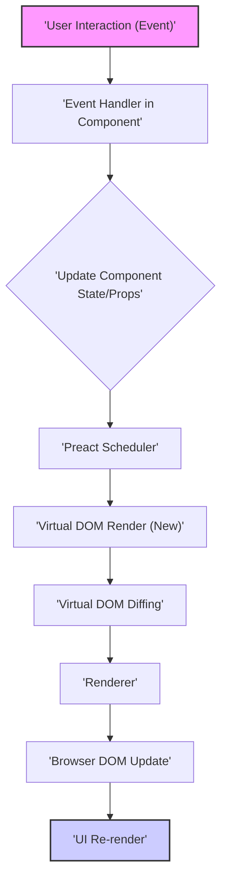

# Project Design Document: Preact

**Version:** 1.1
**Date:** October 26, 2023
**Author:** AI Software Architect

## 1. Introduction

This document provides an enhanced architectural design overview of the Preact project, a fast and lightweight (< 4kB gzipped) alternative to React, known for its comparable modern API. This detailed description of the system's components, interactions, and underlying mechanisms is specifically crafted to facilitate comprehensive threat modeling. Understanding these details is crucial for identifying potential vulnerabilities and security risks.

## 2. Goals and Objectives

The core objectives driving the Preact project are:

*   **High Performance:** To deliver exceptional rendering performance for building interactive user interfaces.
*   **Minimal Size:** To maintain an extremely small bundle size (under 4kB when gzipped) to ensure rapid loading and efficient resource utilization in web applications.
*   **React Compatibility:** To offer an API that closely mirrors React's, enabling developers familiar with React to easily adopt Preact and potentially migrate existing codebases with minimal friction.
*   **Extensibility and Interoperability:** To allow for extending core functionalities through a vibrant ecosystem of add-ons and to seamlessly integrate with other JavaScript libraries.
*   **Code Simplicity and Maintainability:** To maintain a clean, well-structured, and easily understandable codebase, fostering easier contributions and long-term maintainability.

## 3. System Architecture

Preact's architecture is fundamentally based on a component-centric model coupled with an efficient virtual DOM implementation. The core of its operation revolves around the intelligent reconciliation and rendering of UI updates.

### 3.1. High-Level Architecture Diagram

*   **Developer:**  The individual writing application code, utilizing Preact's component model and JSX syntax to define user interfaces.
*   **JSX Transformer (e.g., Babel):** A build-time tool that converts JSX syntax within the developer's code into standard JavaScript function calls. These function calls are responsible for creating the virtual DOM representation of the UI.
*   **Preact Library (Core):** The central library encompassing the core rendering engine, the component model (including both function and class components), and the virtual DOM implementation.
*   **Virtual DOM:** An in-memory, lightweight representation of the actual browser DOM structure. Preact leverages the virtual DOM to efficiently calculate the minimal set of changes required to update the real DOM.
*   **Renderer:** The specific module within Preact responsible for taking the calculated differences (the "diff") between the previous and current virtual DOM states and applying these changes to the actual browser DOM.
*   **Browser DOM:** The Document Object Model, the live representation of the web page rendered by the user's web browser.
*   **User:** The end-user who interacts with the rendered user interface within the browser.
*   **Component Instances:** Concrete instances of the components defined in the application code. Each instance holds its own state and props, influencing how it renders its portion of the UI.

### 3.2. Key Architectural Concepts

*   **Components:** The fundamental, reusable building blocks for constructing Preact applications.
    *   **Function Components:** Simpler components defined as plain JavaScript functions. They can utilize Hooks to manage state and lifecycle.
    *   **Class Components:** More complex components defined using JavaScript classes. They have access to lifecycle methods and can manage their internal state.
*   **JSX (JavaScript XML):** A syntactic extension to JavaScript that allows developers to write HTML-like structures directly within their JavaScript code. This syntax is then transformed into standard JavaScript function calls by tools like Babel.
*   **Virtual DOM:** A lightweight, in-memory representation of the DOM. Preact uses this abstraction to perform efficient updates. Instead of directly manipulating the browser's DOM, Preact works with the virtual DOM, making changes and then efficiently applying the necessary updates to the real DOM.
*   **Reconciliation Algorithm:** The core process within Preact that compares the previous and current virtual DOM trees. This algorithm identifies the minimal set of operations needed to bring the actual DOM in sync with the desired state.
*   **Renderer:** The module responsible for translating the differences identified by the reconciliation algorithm into actual DOM manipulations (creating, updating, and removing DOM nodes).
*   **Hooks:** Functions that allow function components to access state and lifecycle features that were previously only available to class components. Common hooks include `useState`, `useEffect`, and `useRef`.
*   **Props (Properties):** Data passed unidirectionally from parent components down to their child components. Props are immutable from the perspective of the child component.
*   **State:** Internal data managed within a component that can change over time. Changes to a component's state trigger a re-rendering of that component and its descendants.

## 4. Data Flow

The typical lifecycle of data within a Preact application, leading to UI updates, can be visualized as follows:

1. **User Interaction (Event):** The user interacts with the rendered UI, triggering an event (e.g., a click, a key press, a form submission).
2. **Event Handler in Component:** An event handler function defined within a Preact component is executed in response to the user interaction.
3. **Update Component State/Props:** The event handler typically updates the component's internal state using `setState` (for class components) or state setter functions returned by `useState` (for function components), or it might trigger a prop change in a parent component by calling a function passed down as a prop.
4. **Preact Scheduler:** Preact's internal scheduler receives notification of the state or prop update. To optimize performance, Preact often batches multiple updates together before triggering a re-render.
5. **Virtual DOM Render (New):** The component whose state or props have changed, along with its child components, re-renders. This involves executing the component's render function (or the function component itself), creating a new virtual DOM representation reflecting the updated data.
6. **Virtual DOM Diffing:** Preact's reconciliation algorithm compares the newly generated virtual DOM with the previous version to identify the precise differences between the two trees.
7. **Renderer:** The renderer receives the calculated diff (a set of instructions describing the changes needed in the actual DOM).
8. **Browser DOM Update:** The renderer efficiently applies the necessary changes to the browser's Document Object Model, updating only the parts of the UI that have actually changed.
9. **UI Re-render:** The browser repaints the affected portions of the user interface to reflect the updated DOM structure and data.

## 5. Key Components

The Preact library is structured into several core modules:

*   **`src/index.js` (Core):** This is the entry point of the library and contains the fundamental rendering logic.
    *   Includes the `h` function: Used to create virtual DOM nodes.
    *   Includes the `render` function: Used to mount components into the DOM.
    *   Implements the core reconciliation algorithm.
*   **`src/component.js`:** Defines the base `Component` class that developers can extend to create stateful class components. It also includes the implementation of component lifecycle methods (e.g., `componentDidMount`, `componentDidUpdate`).
*   **`src/vnode.js`:** Defines the structure and properties of virtual nodes, the building blocks of the virtual DOM.
*   **`src/diff/`:** Contains the implementation of the virtual DOM diffing algorithm, responsible for efficiently comparing virtual DOM trees.
*   **`src/dom/`:**  Contains modules that handle direct interactions with the browser's DOM API. This layer abstracts away browser-specific differences.
*   **`src/hooks.js`:** Implements the Hooks API (`useState`, `useEffect`, etc.), enabling function components to manage state and side effects.
*   **`devtools/`:** (Optional) Code related to the Preact Devtools browser extension, which aids in debugging Preact applications.
*   **`compat/`:** (Optional) A compatibility layer designed to make Preact's API more closely align with React's API, facilitating the use of React libraries within Preact projects.

## 6. Security Considerations (Detailed for Threat Modeling)

When considering the security of applications built with Preact, several areas require careful attention during threat modeling:

*   **Cross-Site Scripting (XSS):** A primary concern in front-end development. If user-provided data is not properly sanitized before being rendered into the DOM, it can lead to XSS vulnerabilities, allowing attackers to inject malicious scripts into the application.
    *   **Attack Vectors:** Injecting malicious JavaScript through form inputs, URL parameters, or data retrieved from APIs.
    *   **Mitigation:**
        *   **Context-Aware Output Encoding:**  Ensure that user-provided data is properly encoded based on the context where it's being used (e.g., HTML escaping for rendering in HTML, JavaScript escaping for use in `<script>` tags). Preact's virtual DOM provides some default protection by escaping text content, but developers must be cautious with rendering HTML or SVG directly.
        *   **Content Security Policy (CSP):** Implement a strong CSP to restrict the sources from which the browser can load resources, mitigating the impact of successful XSS attacks.
*   **Dependency Vulnerabilities:** Preact projects rely on a number of dependencies (build tools, utility libraries, etc.). Vulnerabilities in these dependencies can be exploited to compromise the application.
    *   **Attack Vectors:** Exploiting known vulnerabilities in outdated libraries to inject malicious code or gain unauthorized access.
    *   **Mitigation:**
        *   **Regular Dependency Audits:** Use tools like `npm audit` or `yarn audit` to identify known vulnerabilities in project dependencies.
        *   **Keep Dependencies Updated:** Regularly update dependencies to their latest secure versions.
        *   **Software Composition Analysis (SCA):** Consider using SCA tools to automate the process of identifying and managing open-source risks.
*   **Build Process Security:** A compromised build process can lead to the injection of malicious code into the final application bundle without the developer's knowledge.
    *   **Attack Vectors:** Attackers gaining access to the development environment or build servers to modify the build process.
    *   **Mitigation:**
        *   **Secure Development Environment:** Implement strong access controls and security practices for development machines and build servers.
        *   **Integrity Checks:** Verify the integrity of build tools and dependencies.
        *   **Supply Chain Security:** Be mindful of the security practices of third-party libraries and tools used in the build process.
*   **Server-Side Rendering (SSR) Security:** If Preact is used for SSR, it introduces server-side security considerations. Untrusted data rendered on the server can lead to vulnerabilities.
    *   **Attack Vectors:**  Exploiting vulnerabilities in server-side code to execute arbitrary commands or access sensitive data.
    *   **Mitigation:**
        *   **Input Sanitization:** Sanitize all data received from the client before rendering it on the server.
        *   **Secure Server Configuration:** Follow security best practices for server configuration and hardening.
        *   **Regular Security Audits:** Conduct security audits of the server-side rendering implementation.
*   **Client-Side Logic Vulnerabilities:** Bugs or flaws in the application's component logic or state management can be exploited by attackers.
    *   **Attack Vectors:**  Manipulating application state to bypass security checks or trigger unintended behavior.
    *   **Mitigation:**
        *   **Thorough Testing:** Implement comprehensive unit and integration tests to identify and prevent logic errors.
        *   **Code Reviews:** Conduct regular code reviews to identify potential vulnerabilities and logic flaws.
*   **Prototype Pollution:** While less common, vulnerabilities related to prototype pollution in JavaScript could potentially impact Preact applications if not handled carefully in custom code or third-party libraries.
    *   **Attack Vectors:**  Modifying the prototypes of built-in JavaScript objects to inject malicious behavior.
    *   **Mitigation:**
        *   **Avoid Direct Prototype Manipulation:** Be cautious when directly modifying the prototypes of native JavaScript objects.
        *   **Library Scrutiny:** Carefully evaluate the security practices of third-party libraries used in the project.

## 7. Deployment

Preact applications are typically deployed as static assets, consisting of HTML, CSS, and JavaScript files, served by a web server or a Content Delivery Network (CDN). The deployment process generally involves:

*   **Transpilation:** Converting JSX syntax and modern JavaScript features into browser-compatible JavaScript using tools like Babel or TypeScript.
*   **Bundling:** Combining multiple JavaScript modules into optimized bundles using tools such as Webpack, Rollup, or Parcel.
*   **Minification and Optimization:** Reducing the size of the bundled files through minification, tree-shaking, and other optimization techniques to improve loading performance.

## 8. Technology Stack

The core Preact library is primarily written in JavaScript (or TypeScript). A typical technology stack for a Preact project includes:

*   **JavaScript/TypeScript:** The primary programming language for building Preact applications.
*   **JSX:** The syntax extension used for writing declarative UI components.
*   **Build Tools:**  Tools like Webpack, Rollup, or Parcel are used for bundling and managing the build process.
*   **Transpilers:** Babel or TypeScript are used to transpile JSX and modern JavaScript/TypeScript code.
*   **Package Manager:** npm or yarn are commonly used for managing project dependencies.
*   **Testing Frameworks:** Frameworks like Jest, Mocha, or Cypress are used for testing Preact components and applications.

## 9. Future Considerations

Ongoing and potential future developments for Preact include:

*   **Further Performance Enhancements:** Continuously exploring and implementing new techniques to optimize rendering performance and reduce overhead.
*   **Improved Developer Experience (DX):**  Adding new features, tools, and documentation to streamline the development workflow and make Preact even easier to use.
*   **Ecosystem Expansion:** Fostering the growth of the Preact ecosystem by encouraging the development of more community libraries, extensions, and integrations.
*   **Enhanced React Compatibility:**  Maintaining and improving API compatibility with React to facilitate code sharing and easier transitions for developers.

This revised document provides a more in-depth and detailed architectural overview of the Preact project, specifically tailored to support thorough threat modeling activities. Understanding these details is crucial for identifying and mitigating potential security vulnerabilities in applications built with Preact.
