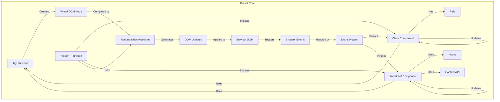
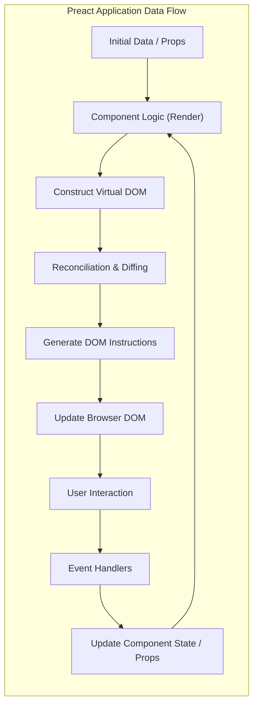

# Project Design Document: Preact

**Version:** 1.1
**Date:** October 26, 2023
**Author:** AI Software Architect

## 1. Introduction

This document provides a detailed architectural design of the Preact project, a fast 3kB alternative to React with the same modern API. This document aims to clearly outline the project's components, their interactions, and data flow, serving as a foundation for future threat modeling activities. Understanding this architecture is crucial for identifying potential vulnerabilities and security risks.

## 2. Goals

*   Provide a comprehensive overview of the Preact library's architecture.
*   Identify key components and their specific responsibilities within the library.
*   Describe the flow of data through the Preact rendering lifecycle and event handling.
*   Establish a clear and detailed understanding of the system for security analysis and threat modeling purposes.

## 3. Scope

This document focuses on the core architecture and functionality of the Preact library itself. It includes:

*   The core rendering engine and its processes.
*   The component model, including both class-based and functional components.
*   The implementation of the virtual DOM and its role in efficient updates.
*   The event handling mechanism and how it interacts with components.
*   Key APIs and interfaces exposed by the library for developers.

This document explicitly excludes:

*   In-depth analysis of specific implementation details within individual functions or modules.
*   The Preact CLI or other associated tooling built around the core library.
*   Third-party libraries or integrations unless their interaction is fundamental to Preact's core operation.
*   Detailed performance benchmarks or optimization strategies.
*   Specific application code built using Preact.

## 4. Architectural Overview

Preact is a client-side JavaScript library designed for building interactive user interfaces in web browsers. It achieves high performance and a small bundle size by implementing a virtual DOM and an efficient reconciliation algorithm. The core principle is to manage UI state and render components based on that state, updating the actual browser DOM only when necessary. Preact mirrors the React API, making it a drop-in replacement for many use cases.

## 5. Component Description

*   **Core Library (`preact`)**: This is the central module, providing the fundamental building blocks and logic for Preact applications. It exports key functions and classes used by developers.
*   **`h()` function (Hyperscript)**: This function is the cornerstone of Preact's declarative approach. It's used to create virtual DOM nodes, representing the desired structure of UI elements. It takes the element's tag name (or a component), properties (attributes, event handlers), and child nodes as arguments.
*   **`render()` function**: This function is responsible for taking a virtual DOM tree (typically the output of the `h()` function) and mounting it into a specified container in the browser's DOM. It also handles updating the DOM when the virtual DOM changes.
*   **Component (Class-based)**:  Components are reusable, self-contained UI building blocks. Class-based components extend `Preact.Component` and manage their own internal state and lifecycle methods (e.g., `render`, `componentDidMount`, `componentDidUpdate`).
*   **Component (Functional with Hooks)**:  Functional components are simpler and use hooks (like `useState`, `useEffect`) to manage state and side effects. This is the preferred approach for new Preact code.
*   **Virtual DOM**: An in-memory representation of the UI structure. Preact maintains this virtual representation to efficiently compare changes and minimize direct DOM manipulations, which are often performance-intensive.
*   **Reconciliation Algorithm (Diffing)**: This is the core logic that compares the previous and current virtual DOM trees. It identifies the minimal set of changes required to update the real DOM, optimizing performance.
*   **DOM Renderer**: This module translates the changes identified by the reconciliation algorithm into actual manipulations of the browser's Document Object Model. It handles creating, updating, and removing DOM nodes.
*   **Event System (Synthetic Events)**: Preact implements a synthetic event system that normalizes browser events, providing a consistent API across different browsers. Event handlers are attached to virtual DOM nodes and are delegated to the root of the rendered tree for efficiency.
*   **Hooks (`useState`, `useEffect`, `useContext`, etc.)**: These functions allow functional components to access Preact's state management and lifecycle features. `useState` provides a way to manage local component state, and `useEffect` handles side effects (like data fetching or DOM manipulation).
*   **Context API**: A mechanism for sharing state between components without the need to explicitly pass props down through multiple levels of the component tree. This is useful for application-wide state or theming.
*   **Refs**: Provide a way to access underlying DOM nodes or component instances directly. This is sometimes necessary for imperative interactions but should be used sparingly.

## 6. Data Flow

The flow of data within a Preact application follows a predictable pattern:

*   **Initial Render**:
    *   The application's root component is initially rendered using the `render()` function, providing the starting point for the UI.
    *   Within the component's render logic (either in the `render()` method of a class component or the function body of a functional component), the `h()` function is used to construct a virtual DOM tree representing the desired UI structure based on initial data or props.
    *   The Preact DOM Renderer takes this virtual DOM tree and translates it into actual DOM elements, inserting them into the specified container in the browser.
*   **State Updates**:
    *   When a component's internal state needs to change (e.g., in response to user interaction or data fetching), the component uses `setState()` (for class components) or the state setter function returned by `useState()` (for functional components).
    *   Updating the state triggers a re-render of the component and its child components.
    *   During the re-render, a new virtual DOM tree is created based on the updated state.
    *   The Reconciliation Algorithm compares this new virtual DOM tree with the previous one.
    *   The DOM Renderer then applies the minimal necessary changes to the actual browser DOM to reflect the updates.
*   **Event Handling**:
    *   When a user interacts with the UI (e.g., clicks a button, types in an input), the browser generates DOM events.
    *   Preact's synthetic event system captures these events.
    *   Event handlers defined within components (as props on virtual DOM nodes) are invoked.
    *   These event handlers often trigger state updates, leading to the re-rendering process described above.
*   **Props (Passing Data Down)**:
    *   Data is passed from parent components to child components via props (properties).
    *   When a parent component re-renders with different prop values, Preact will also re-render the child component that receives those props, causing its virtual DOM and potentially the real DOM to update.
*   **Context (Sharing Data Globally)**:
    *   The Context API allows components to subscribe to data provided by a Context provider higher up in the component tree.
    *   When the value provided by the Context changes, all components that are subscribed to that Context will re-render, ensuring data consistency across the application.

## 7. Diagrams

### 7.1. Component Architecture Diagram

### 7.2. Data Flow Diagram

## 8. Security Considerations (Detailed for Threat Modeling)

This section expands on potential security concerns, providing more specific examples and categories relevant for threat modeling.

*   **Cross-Site Scripting (XSS)**:
    *   **Rendering User-Provided Content**: If Preact renders unsanitized HTML received from user input or external sources, attackers can inject malicious scripts that execute in the victim's browser.
    *   **Attribute Injection**:  Dynamically setting HTML attributes based on user input without proper escaping can lead to XSS vulnerabilities. For example, setting `href` or `src` attributes directly from user data.
    *   **Mitigation**: Employ proper sanitization techniques (e.g., using a library like DOMPurify) before rendering user-provided HTML. Avoid directly setting attributes with user-controlled values.
*   **Prototype Pollution**:
    *   While less common in the core Preact library, vulnerabilities in application code or dependencies could allow attackers to modify the `Object.prototype` or other built-in prototypes, potentially leading to unexpected behavior or security breaches.
    *   **Mitigation**: Regularly audit dependencies for known vulnerabilities and follow secure coding practices to prevent unintended modifications to prototypes.
*   **Supply Chain Attacks**:
    *   Compromised dependencies (including transitive dependencies) can introduce malicious code into the Preact application.
    *   **Mitigation**: Use dependency scanning tools to identify known vulnerabilities in dependencies. Pin dependency versions to avoid unexpected updates that might introduce vulnerabilities. Consider using a software bill of materials (SBOM).
*   **Client-Side Denial of Service (DoS)**:
    *   **Recursive Rendering**:  Logic errors in component rendering or state updates can lead to infinite re-renders, consuming excessive client-side resources and potentially crashing the user's browser.
    *   **Large Data Sets**: Rendering extremely large datasets without proper pagination or virtualization can also lead to performance issues and a denial of service for the user.
    *   **Mitigation**: Implement proper error handling and prevent recursive rendering patterns. Optimize rendering performance for large datasets.
*   **Server-Side Rendering (SSR) Vulnerabilities (If Applicable)**:
    *   If Preact is used with SSR, vulnerabilities in the server-side rendering process could expose the server to attacks (e.g., Server-Side Request Forgery - SSRF).
    *   **Mitigation**: Secure the SSR environment and carefully handle data passed between the server and client during rendering.
*   **Third-Party Component Vulnerabilities**:
    *   If the application utilizes third-party Preact components, vulnerabilities within those components can introduce security risks.
    *   **Mitigation**:  Thoroughly vet third-party components before using them. Keep third-party components updated to patch known vulnerabilities.
*   **Insecure Data Handling**:
    *   Storing sensitive data in client-side state or local storage without proper encryption can expose it to attackers.
    *   **Mitigation**: Avoid storing sensitive data client-side if possible. If necessary, use appropriate encryption techniques.

## 9. Dependencies

Preact has a minimal set of runtime dependencies, which is a security advantage. However, it relies on development dependencies for building and testing. Understanding these dependencies is crucial for assessing the overall security posture.

*   **Runtime Dependencies**:
    *   **None Directly**: Preact aims for zero runtime dependencies to minimize bundle size and potential attack surface. However, it might rely on built-in browser APIs.
*   **Development Dependencies (Examples)**:
    *   **Rollup**: A module bundler used to package the Preact library. Vulnerabilities in Rollup could potentially compromise the build process.
    *   **Babel**: A JavaScript compiler used to transpile modern JavaScript syntax. Vulnerabilities in Babel could introduce issues.
    *   **Jest**: A JavaScript testing framework. While not directly part of the runtime, vulnerabilities could affect the integrity of tests.
    *   **ESLint**: A linting utility used for code quality. While not a security risk itself, it helps prevent potential issues.

It's important to regularly audit both runtime (even if minimal) and development dependencies for known security vulnerabilities using tools like `npm audit` or `yarn audit`.

## 10. Deployment

Preact applications are typically deployed as static assets (HTML, CSS, JavaScript) served by a web server or Content Delivery Network (CDN). The security of the deployment environment is paramount. Considerations include:

*   **Secure Server Configuration**: Ensuring the web server is properly configured to prevent common attacks.
*   **HTTPS**: Using HTTPS to encrypt communication between the client and server.
*   **Content Security Policy (CSP)**: Implementing a strong CSP to mitigate XSS attacks.
*   **Subresource Integrity (SRI)**: Using SRI to ensure that files fetched from CDNs haven't been tampered with.

## 11. Future Considerations

*   **Preact Devtools Security**:  The Preact Devtools browser extension interacts directly with the application's state and could be a potential target for malicious actors if vulnerabilities exist.
*   **Integration with Frameworks/Libraries**:  As Preact is often integrated with other frameworks and libraries (e.g., routing libraries, state management solutions), the security of these integrations should also be considered in a broader threat model.
*   **Emerging Web Standards**:  Keeping abreast of new web standards and browser security features is important for maintaining the security of Preact applications.

This improved design document provides a more detailed and nuanced understanding of the Preact project's architecture, which is essential for conducting a comprehensive and effective threat modeling exercise.