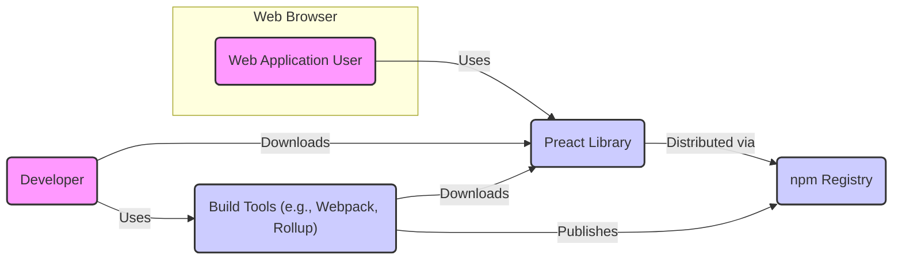
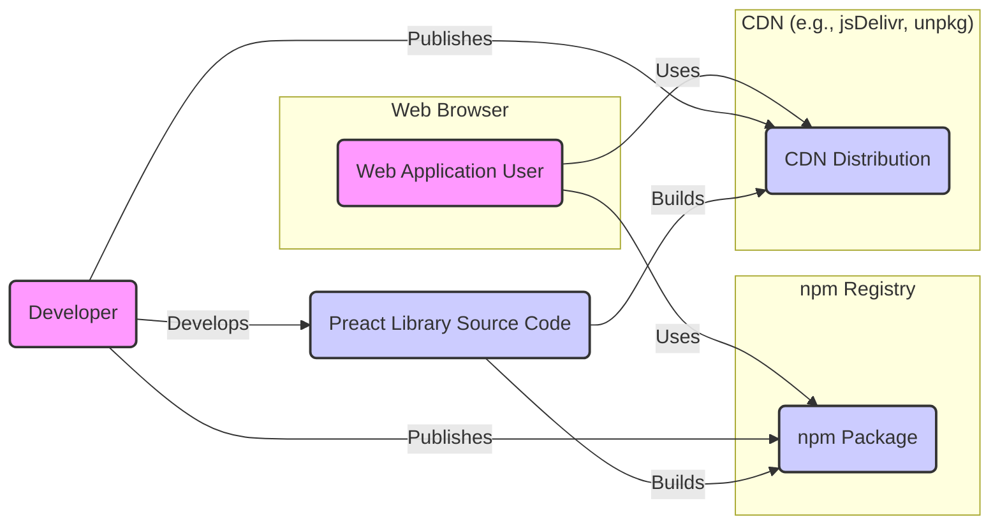
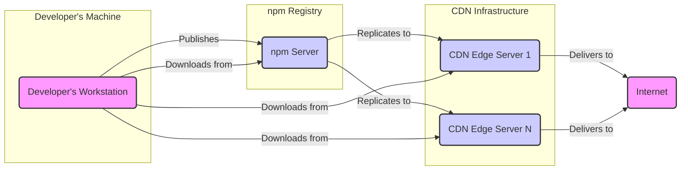

# BUSINESS POSTURE

Preact is a fast 3kB alternative to React with the same modern API. It provides a performant and lightweight JavaScript library for building user interfaces.

- Business Priorities:
 - Performance: Preact prioritizes small size and high performance to deliver fast user experiences.
 - Developer Experience: Preact aims to be easy to learn and use for developers familiar with React, minimizing the learning curve.
 - Compatibility: Maintaining a high degree of compatibility with the React API to allow for easier migration and code reuse.
 - Community Support: Building and maintaining a strong community to support users and contribute to the project's growth.
 - Open Source Sustainability: Ensuring the long-term viability and maintenance of the project as an open-source library.

- Business Goals:
 - To be a leading lightweight and performant JavaScript library for UI development.
 - To empower developers to build fast and efficient web applications.
 - To foster a thriving community around Preact.
 - To provide a stable and reliable alternative to larger frameworks.

- Business Risks:
 - Adoption Rate: Risk of low adoption if developers prefer larger, more established frameworks like React.
 - Security Vulnerabilities: Risk of security vulnerabilities in the library itself or its ecosystem that could impact user applications.
 - Community Decline: Risk of losing community support and contributions, leading to stagnation and reduced maintenance.
 - Compatibility Issues: Risk of breaking changes or compatibility issues with the React ecosystem, hindering migration and adoption.
 - Performance Regression: Risk of performance regressions in future releases that could undermine Preact's core value proposition.

# SECURITY POSTURE

Preact, as a front-end JavaScript library, inherently relies on the security posture of the environments where it is used (browsers, Node.js). Security considerations are primarily focused on preventing vulnerabilities within the library itself and guiding users to build secure applications with Preact.

- Security Controls:
 - security control: Source code is publicly available on GitHub, allowing for community review and scrutiny. (Implemented: GitHub Repository)
 - security control: Standard JavaScript development practices are followed, aiming to avoid common web vulnerabilities. (Implemented: Development Process)
 - security control: Releases are distributed through npm, leveraging npm's security scanning and distribution infrastructure. (Implemented: Release Process)

- Accepted Risks:
 - accepted risk: Vulnerabilities in user-developed applications that utilize Preact. Preact itself cannot directly control how users implement security in their applications.
 - accepted risk: Dependencies of user applications built with Preact may introduce vulnerabilities. Dependency management is the responsibility of the user.
 - accepted risk: Browser vulnerabilities. Preact relies on the security of the web browsers in which it runs.

- Recommended Security Controls:
 - security control: Implement automated security scanning (SAST, dependency checking) in the Preact build and release pipeline.
 - security control: Conduct periodic security reviews and penetration testing of the Preact library.
 - security control: Establish a clear process for reporting and handling security vulnerabilities in Preact.
 - security control: Provide security guidelines and best practices for developers using Preact to build applications.
 - security control: Encourage community security contributions and bug bounty programs.

- Security Requirements:
 - Authentication: Not directly applicable to Preact library itself. Authentication is handled by the backend services and user applications built with Preact. Preact applications will need to securely handle authentication tokens and user sessions.
 - Authorization: Not directly applicable to Preact library itself. Authorization logic resides in the backend and user applications. Preact applications will need to implement authorization checks based on user roles and permissions received from the backend.
 - Input Validation: Preact helps in rendering user interfaces, and input validation is crucial in user applications built with Preact. Preact applications must validate user inputs both on the client-side and server-side to prevent injection attacks (XSS, SQL injection, etc.). Preact's component model can be used to build reusable input validation components.
 - Cryptography: Not directly applicable to Preact library itself. Cryptographic operations are typically handled by backend services or browser APIs. Preact applications might need to use browser crypto APIs for client-side encryption or decryption, but this is application-specific. Secure handling of cryptographic keys and avoiding insecure crypto practices in user applications are important.

# DESIGN

Preact is designed as a lightweight and performant JavaScript library for building user interfaces. Its design focuses on providing a React-compatible API with a smaller footprint and improved performance.

## C4 CONTEXT

- Context Diagram Elements:
 - - Name: Web Application User
   - Type: Person
   - Description: End-users who interact with web applications built using Preact through their web browsers.
   - Responsibilities: Accessing and using web applications.
   - Security controls: Browser security features (e.g., Content Security Policy, Same-Origin Policy), user authentication and authorization implemented in web applications.
 - - Name: Preact Library
   - Type: Software System
   - Description: The Preact JavaScript library itself, providing components and APIs for building user interfaces.
   - Responsibilities: Providing a performant and lightweight UI library, rendering UI components, managing application state.
   - Security controls: Security scanning of source code and dependencies, secure release process, community security reviews.
 - - Name: npm Registry
   - Type: External System
   - Description: The npm public registry where Preact packages are published and distributed.
   - Responsibilities: Hosting and distributing JavaScript packages, providing package management tools.
   - Security controls: npm security scanning, package integrity checks, access control for package publishing.
 - - Name: Build Tools (e.g., Webpack, Rollup)
   - Type: Software System
   - Description: Tools used by developers to bundle, transpile, and optimize Preact applications and the Preact library itself.
   - Responsibilities: Building and packaging JavaScript code, optimizing code for production, dependency management.
   - Security controls: Dependency scanning, secure configuration of build tools, using trusted build tool versions.
 - - Name: Developer
   - Type: Person
   - Description: Software developers who use Preact to build web applications.
   - Responsibilities: Developing web applications using Preact, integrating Preact into their projects, managing application security.
   - Security controls: Secure coding practices, input validation, output encoding, dependency management, security testing of applications.

## C4 CONTAINER

For Preact as a library, the Container diagram is very similar to the Context diagram, as Preact itself is essentially a single container (the library). In the context of a user application built with Preact, Preact would be a container within that application's architecture. For the Preact library itself, we can consider the distribution channels as containers.

- Container Diagram Elements:
 - - Name: npm Package
   - Type: Container (Distribution Channel)
   - Description: Preact library distributed as an npm package. Developers install it using npm or yarn.
   - Responsibilities: Providing a packaged and versioned distribution of the Preact library.
   - Security controls: npm security scanning, package integrity checks, version control.
 - - Name: CDN Distribution
   - Type: Container (Distribution Channel)
   - Description: Preact library distributed via Content Delivery Networks (CDNs) for direct inclusion in web pages.
   - Responsibilities: Providing globally distributed, fast access to the Preact library for browsers.
   - Security controls: CDN security measures, HTTPS delivery, Subresource Integrity (SRI) hashes for integrity verification.
 - - Name: Preact Library Source Code
   - Type: Container (Code Repository)
   - Description: The source code of the Preact library hosted on GitHub.
   - Responsibilities: Storing and versioning the source code, managing contributions, providing a development platform.
   - Security controls: GitHub security features, access control, code review processes, branch protection.

## DEPLOYMENT

Preact library itself is not "deployed" in the traditional sense of a web application. It is distributed and used within other applications. The deployment context here refers to how Preact is made available for developers to use in their projects and how those projects are then deployed.

Deployment Architecture Option: Distribution via npm and CDN.

- Deployment Diagram Elements:
 - - Name: Developer's Workstation
   - Type: Infrastructure (Developer Environment)
   - Description: The local machine used by developers to develop, build, and publish Preact.
   - Responsibilities: Development environment, running build tools, publishing packages.
   - Security controls: Developer workstation security practices, access control, software update management.
 - - Name: npm Server
   - Type: Infrastructure (Registry Server)
   - Description: The server infrastructure hosting the npm registry, storing and serving npm packages.
   - Responsibilities: Hosting npm packages, managing package metadata, handling package downloads and uploads.
   - Security controls: npm infrastructure security, access control, security scanning, DDoS protection.
 - - Name: CDN Edge Server 1...N
   - Type: Infrastructure (CDN Edge Servers)
   - Description: Edge servers in a Content Delivery Network that cache and deliver Preact library files to end-users globally.
   - Responsibilities: Caching and delivering static files, providing fast content delivery, reducing latency.
   - Security controls: CDN infrastructure security, DDoS protection, secure content delivery (HTTPS), access control.
 - - Name: Internet
   - Type: Network
   - Description: The public internet through which developers and end-users access npm and CDNs.
   - Responsibilities: Providing network connectivity.
   - Security controls: Network security measures, encryption (HTTPS).

## BUILD

The build process for Preact involves compiling, bundling, and optimizing the source code into distributable packages. Security in the build process is crucial for ensuring the integrity and trustworthiness of the released library.

```mermaid
flowchart LR
    A("Developer") --> B("Code Repository (GitHub)");
    B --> C("CI/CD System (GitHub Actions)");
    C --> D("Build Process (npm scripts, Rollup)");
    D --> E("Security Checks (Linters, SAST, Dependency Scan)");
    E --> F("Build Artifacts (npm package, CDN files)");
    F --> G("npm Registry & CDN");

    style A fill:#f9f,stroke:#333,stroke-width:2px
    style B fill:#ccf,stroke:#333,stroke-width:2px
    style C fill:#ccf,stroke:#333,stroke-width:2px
    style D fill:#ccf,stroke:#333,stroke-width:2px
    style E fill:#ccf,stroke:#333,stroke-width:2px
    style F fill:#ccf,stroke:#333,stroke-width:2px
    style G fill:#ccf,stroke:#333,stroke-width:2px
```

- Build Process Elements:
 - - Name: Developer
   - Type: Person
   - Description: Developers who write and contribute code to the Preact project.
   - Responsibilities: Writing code, submitting pull requests, code reviews.
   - Security controls: Secure coding practices, code review process, access control to repository.
 - - Name: Code Repository (GitHub)
   - Type: Software System
   - Description: GitHub repository hosting the Preact source code.
   - Responsibilities: Version control, source code management, collaboration platform.
   - Security controls: GitHub security features, access control, branch protection, audit logs.
 - - Name: CI/CD System (GitHub Actions)
   - Type: Software System
   - Description: GitHub Actions used for automated build, test, and release processes.
   - Responsibilities: Automating build and release pipeline, running tests, performing security checks.
   - Security controls: Secure CI/CD configuration, access control to workflows, secret management, audit logs.
 - - Name: Build Process (npm scripts, Rollup)
   - Type: Software System
   - Description: The scripts and tools used to compile, bundle, and optimize Preact code (e.g., npm scripts, Rollup, Babel).
   - Responsibilities: Compiling code, bundling modules, optimizing for production.
   - Security controls: Using trusted build tools and versions, secure configuration of build tools, input validation in build scripts.
 - - Name: Security Checks (Linters, SAST, Dependency Scan)
   - Type: Software System
   - Description: Automated security checks integrated into the build process, including linters, Static Application Security Testing (SAST), and dependency vulnerability scanning.
   - Responsibilities: Identifying potential code quality issues and security vulnerabilities.
   - Security controls: SAST tools, dependency scanning tools, configured to detect known vulnerabilities and coding flaws.
 - - Name: Build Artifacts (npm package, CDN files)
   - Type: Data
   - Description: The packaged and optimized Preact library ready for distribution (npm package, CDN files).
   - Responsibilities: Distributable library files.
   - Security controls: Integrity checks (e.g., checksums, signatures), secure storage of artifacts.
 - - Name: npm Registry & CDN
   - Type: External System
   - Description: npm registry and CDN used to distribute the build artifacts.
   - Responsibilities: Distributing Preact library to developers and end-users.
   - Security controls: npm and CDN security controls as described in Deployment section.

# RISK ASSESSMENT

- Critical Business Processes:
 - Maintaining the integrity and availability of the Preact library.
 - Ensuring the performance and reliability of Preact for user applications.
 - Maintaining the trust and reputation of the Preact project within the developer community.
 - Secure and timely release of updates and bug fixes.

- Data to Protect and Sensitivity:
 - Source Code: Publicly available, but integrity is critical to prevent malicious modifications.
 - Build Artifacts (npm packages, CDN files): Publicly available, but integrity is critical to prevent supply chain attacks.
 - Developer Credentials and Secrets: Sensitive, need to be protected to prevent unauthorized access to build and release processes.
 - Project Infrastructure (GitHub, CI/CD): Sensitive, needs to be protected to ensure availability and integrity of the project.

# QUESTIONS & ASSUMPTIONS

- Questions:
 - What are the specific security tools currently used in the Preact build pipeline (if any)?
 - Is there a documented process for handling security vulnerabilities reported by the community?
 - Are there any plans for formal security audits or penetration testing of Preact?
 - What are the guidelines provided to developers using Preact regarding secure application development?
 - What is the process for managing and rotating secrets used in the build and release pipeline?

- Assumptions:
 - Preact project prioritizes performance and developer experience as key business goals.
 - Security is considered important, but might not be the primary focus compared to larger frameworks with dedicated security teams.
 - The project relies on community contributions for security reviews and vulnerability reporting.
 - Standard open-source development practices are followed, including code reviews and testing.
 - The build and release process is automated using CI/CD pipelines.
 - Distribution is primarily through npm and CDNs.