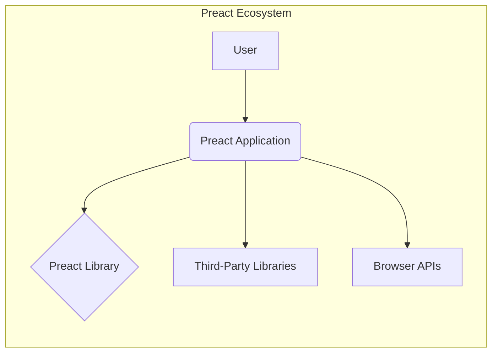
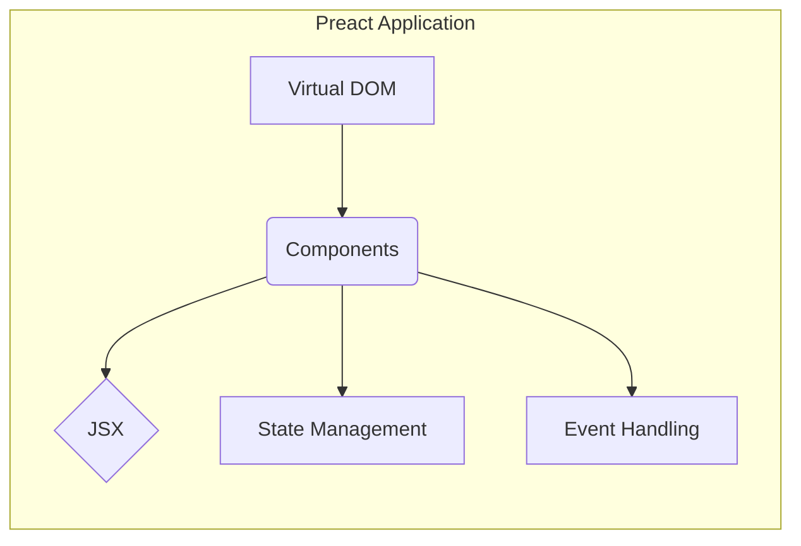
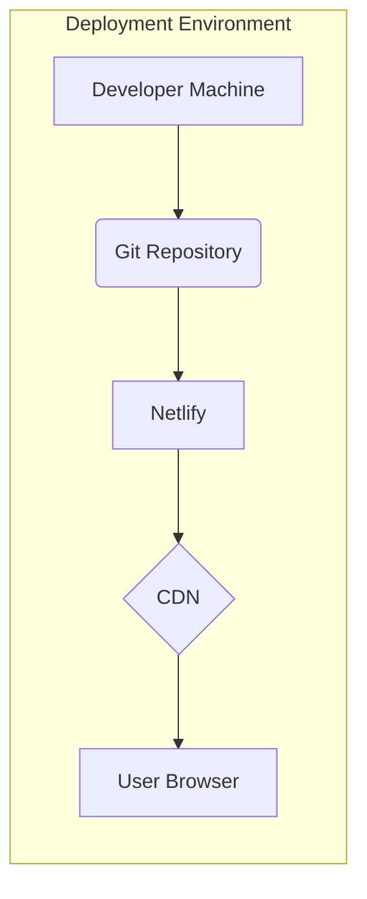
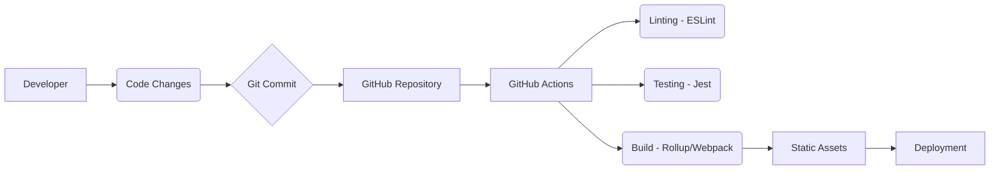

# BUSINESS POSTURE

Preact is a fast, lightweight alternative to React with a similar API. It aims to provide a smaller library size while maintaining compatibility with the React ecosystem. This suggests a focus on performance and efficiency, likely targeting developers and businesses prioritizing fast load times and a smooth user experience, especially on resource-constrained devices or networks.

Business Priorities:

*   Performance: Minimize library size and maximize rendering speed.
*   Compatibility: Maintain compatibility with the React ecosystem (libraries, tools, etc.).
*   Developer Experience: Provide a familiar and easy-to-use API for developers already familiar with React.
*   Adoption: Encourage widespread adoption by offering a compelling alternative to React.
*   Maintainability: Ensure the codebase is maintainable and easy to contribute to.

Business Goals:

*   Provide a viable, high-performance alternative to React for front-end development.
*   Reduce the overhead of JavaScript libraries in web applications.
*   Enable developers to build fast and interactive user interfaces.
*   Foster a community around Preact and its ecosystem.

Most Important Business Risks:

*   Compatibility Drift: Failing to keep up with changes in the React ecosystem, leading to compatibility issues.
*   Performance Degradation: Introducing changes that negatively impact performance, undermining the core value proposition.
*   Security Vulnerabilities: Introducing security flaws that could be exploited in applications built with Preact.
*   Lack of Adoption: Failing to attract a sufficient number of users and contributors, hindering long-term sustainability.
*   Community Fragmentation: Splitting the community with incompatible forks or extensions.

# SECURITY POSTURE

Existing Security Controls:

*   security control: Code Reviews: The project uses pull requests on GitHub, implying that code reviews are part of the development process. (Described in contribution guidelines).
*   security control: Testing: The project has a comprehensive test suite, including unit tests and integration tests. (Described in the repository structure and contribution guidelines).
*   security control: Linting: The project uses ESLint to enforce code style and identify potential issues. (Described in package.json and configuration files).
*   security control: Dependency Management: The project uses npm/yarn to manage dependencies, allowing for updates and security patches. (Described in package.json).
*   security control: Continuous Integration: The project uses GitHub Actions for continuous integration, automating builds and tests. (Described in .github/workflows).

Accepted Risks:

*   accepted risk: Reliance on Community Contributions: The project relies on community contributions, which may introduce varying levels of code quality and security awareness.
*   accepted risk: Third-Party Dependencies: The project depends on third-party libraries, which may have their own security vulnerabilities.
*   accepted risk: XSS Vulnerabilities: While Preact likely mitigates common XSS vectors, the ultimate responsibility for preventing XSS lies with the application developer using Preact.

Recommended Security Controls:

*   security control: Security Audits: Conduct regular security audits, both manual and automated, to identify potential vulnerabilities.
*   security control: Vulnerability Disclosure Program: Establish a clear process for reporting and addressing security vulnerabilities.
*   security control: Content Security Policy (CSP): Provide guidance and examples for implementing CSP in applications built with Preact.
*   security control: Supply Chain Security: Implement measures to secure the software supply chain, such as signing releases and verifying dependencies.
*   security control: SAST (Static Application Security Testing): Integrate SAST tools into the CI/CD pipeline to automatically scan for vulnerabilities.
*   security control: DAST (Dynamic Application Security Testing): Perform regular DAST scans on demo applications or test environments.

Security Requirements:

*   Authentication: Not directly applicable to Preact itself, as it's a front-end library. Authentication is the responsibility of the application using Preact.
*   Authorization: Not directly applicable to Preact itself. Authorization is the responsibility of the application using Preact.
*   Input Validation:
    *   Preact should provide mechanisms for sanitizing user input to prevent XSS vulnerabilities.
    *   Developers using Preact should be educated on the importance of input validation and sanitization.
    *   Preact should escape output by default to prevent XSS.
*   Cryptography:
    *   Not directly applicable to Preact itself, as it's a front-end library. Cryptographic operations should be handled on the server-side or using appropriate web APIs.
*   Data Protection:
    *   Preact should not store or handle sensitive data directly. Sensitive data management is the responsibility of the application using Preact.

# DESIGN

## C4 CONTEXT

*   Elements Description:
    *   Element:
        *   Name: User
        *   Type: Person
        *   Description: A person interacting with a web application built using Preact.
        *   Responsibilities: Interacts with the user interface, provides input, and receives output.
        *   Security controls: Browser security features, user-provided security measures.
    *   Element:
        *   Name: Preact Application
        *   Type: Software System
        *   Description: A web application built using the Preact library.
        *   Responsibilities: Renders the user interface, handles user interactions, manages application state, and communicates with external services.
        *   Security controls: Input validation, output encoding, secure coding practices, application-specific security measures.
    *   Element:
        *   Name: Preact Library
        *   Type: Software System
        *   Description: The Preact library itself, providing the core functionality for building user interfaces.
        *   Responsibilities: Provides components, virtual DOM rendering, state management, and other core features.
        *   Security controls: Code reviews, testing, linting, secure development practices.
    *   Element:
        *   Name: Third-Party Libraries
        *   Type: Software System
        *   Description: External libraries used by the Preact application, such as routing libraries, state management libraries, or utility libraries.
        *   Responsibilities: Provide specific functionalities not covered by Preact itself.
        *   Security controls: Dependency management, security audits of third-party libraries.
    *   Element:
        *   Name: Browser APIs
        *   Type: Software System
        *   Description: APIs provided by the web browser, such as DOM manipulation, network requests, and local storage.
        *   Responsibilities: Provide access to browser functionalities.
        *   Security controls: Browser security features, sandboxing, same-origin policy.

## C4 CONTAINER

*   Elements Description:
    *   Element:
        *   Name: Virtual DOM
        *   Type: Container
        *   Description: An in-memory representation of the user interface.
        *   Responsibilities: Efficiently updates the real DOM based on changes in application state.
        *   Security controls: Internal consistency checks.
    *   Element:
        *   Name: Components
        *   Type: Container
        *   Description: Reusable building blocks of the user interface.
        *   Responsibilities: Render specific parts of the UI, manage their own state, and handle user interactions.
        *   Security controls: Input validation, output encoding, secure coding practices within components.
    *   Element:
        *   Name: JSX
        *   Type: Container
        *   Description: A syntax extension for JavaScript that allows writing HTML-like code within JavaScript.
        *   Responsibilities: Provides a more readable and concise way to define UI structures.
        *   Security controls: Proper escaping of user input to prevent XSS.
    *   Element:
        *   Name: State Management
        *   Type: Container
        *   Description: Mechanisms for managing the data that drives the user interface.
        *   Responsibilities: Stores and updates application state, triggers re-renders when state changes.
        *   Security controls: Secure handling of sensitive data, if any.
    *   Element:
        *   Name: Event Handling
        *   Type: Container
        *   Description: Mechanisms for responding to user interactions, such as clicks, form submissions, and keyboard input.
        *   Responsibilities: Attaches event listeners to DOM elements, executes event handlers when events occur.
        *   Security controls: Prevention of event-based attacks, such as clickjacking.

## DEPLOYMENT

Possible deployment solutions:

1.  Static Hosting (e.g., Netlify, Vercel, GitHub Pages, AWS S3 + CloudFront, Google Cloud Storage + CDN): Preact applications are typically built into static assets (HTML, CSS, JavaScript) that can be served directly from a CDN or static hosting provider.
2.  Server-Side Rendering (SSR) (e.g., Node.js server with Express, Next.js, custom server): For applications requiring SSR, a server environment is needed to render the initial HTML on the server.
3.  Containerization (e.g., Docker, Kubernetes): Preact applications can be containerized for deployment in various environments, including cloud platforms and on-premise servers.

Chosen solution (Static Hosting with Netlify):

*   Elements Description:
    *   Element:
        *   Name: Developer Machine
        *   Type: Infrastructure
        *   Description: The local machine where developers write and test code.
        *   Responsibilities: Code development, local testing, building the application.
        *   Security controls: Local security measures, secure coding practices.
    *   Element:
        *   Name: Git Repository
        *   Type: Infrastructure
        *   Description: A version control system (e.g., GitHub, GitLab, Bitbucket) storing the application's source code.
        *   Responsibilities: Code versioning, collaboration, branching, merging.
        *   Security controls: Access control, branch protection rules, code reviews.
    *   Element:
        *   Name: Netlify
        *   Type: Infrastructure
        *   Description: A platform for building, deploying, and hosting web applications.
        *   Responsibilities: Automated builds, deployment to CDN, SSL/TLS certificates, custom domains.
        *   Security controls: Platform-level security measures, DDoS protection, secure infrastructure.
    *   Element:
        *   Name: CDN
        *   Type: Infrastructure
        *   Description: A content delivery network that distributes the application's static assets across multiple servers worldwide.
        *   Responsibilities: Fast content delivery, reduced latency, improved performance.
        *   Security controls: DDoS protection, caching of static assets.
    *   Element:
        *   Name: User Browser
        *   Type: Infrastructure
        *   Description: The web browser used by end-users to access the Preact application.
        *   Responsibilities: Rendering the UI, executing JavaScript, handling user interactions.
        *   Security controls: Browser security features, sandboxing, same-origin policy.

## BUILD

*   Build Process Description:
    1.  Developer: A developer writes code and makes changes to the Preact application.
    2.  Code Changes: The changes are staged and prepared for a commit.
    3.  Git Commit: The changes are committed to the local Git repository.
    4.  GitHub Repository: The commit is pushed to a remote GitHub repository.
    5.  GitHub Actions: A GitHub Actions workflow is triggered by the push event.
    6.  Linting (ESLint): ESLint checks the code for style and potential errors.
    7.  Testing (Jest): Jest runs the test suite to ensure code quality and functionality.
    8.  Build (Rollup/Webpack): A bundler like Rollup or Webpack packages the application code and dependencies into static assets (HTML, CSS, JavaScript).
    9.  Static Assets: The build process produces optimized static assets ready for deployment.
    10. Deployment: The static assets are deployed to a hosting provider (e.g., Netlify, Vercel, AWS S3).

*   Security Controls:
    *   Linting (ESLint): Enforces code style and identifies potential security issues.
    *   Testing (Jest): Ensures code quality and helps prevent regressions.
    *   Dependency Management (npm/yarn): Allows for updating and patching dependencies to address security vulnerabilities.
    *   GitHub Actions: Automates the build and deployment process, ensuring consistency and reducing manual errors.
    *   SAST (Static Application Security Testing) - could be integrated into GitHub Actions.

# RISK ASSESSMENT

*   Critical Business Processes:
    *   Rendering the user interface efficiently and responsively.
    *   Maintaining compatibility with the React ecosystem.
    *   Providing a smooth developer experience.
    *   Ensuring the stability and maintainability of the codebase.

*   Data:
    *   Preact itself does not handle sensitive data directly. However, applications built with Preact may handle various types of data, depending on their purpose.
    *   Data Sensitivity:
        *   User Input: Potentially sensitive, depending on the application. Could include personal information, credentials, or financial data.
        *   Application State: May contain data relevant to the application's functionality, but not necessarily sensitive.
        *   Configuration Data: May contain API keys or other secrets, which should be protected.

# QUESTIONS & ASSUMPTIONS

*   Questions:
    *   Are there any specific compliance requirements (e.g., GDPR, HIPAA) that applications built with Preact need to adhere to?
    *   What is the expected level of security awareness among developers using Preact?
    *   Are there any plans to integrate more advanced security features directly into Preact?
    *   What is the process for handling security vulnerabilities reported by the community?
    *   Are there any specific performance targets or benchmarks that Preact aims to achieve?

*   Assumptions:
    *   Business Posture: Developers prioritize performance and a small bundle size when choosing Preact.
    *   Security Posture: The Preact core team is committed to addressing security vulnerabilities in a timely manner.
    *   Design: The majority of Preact applications will be deployed as static sites or using server-side rendering with Node.js.
    *   Design: Most of the security concerns will be addressed by the developers using Preact, rather than within the library itself.
    *   Design: Build process will be automated using CI/CD tools.