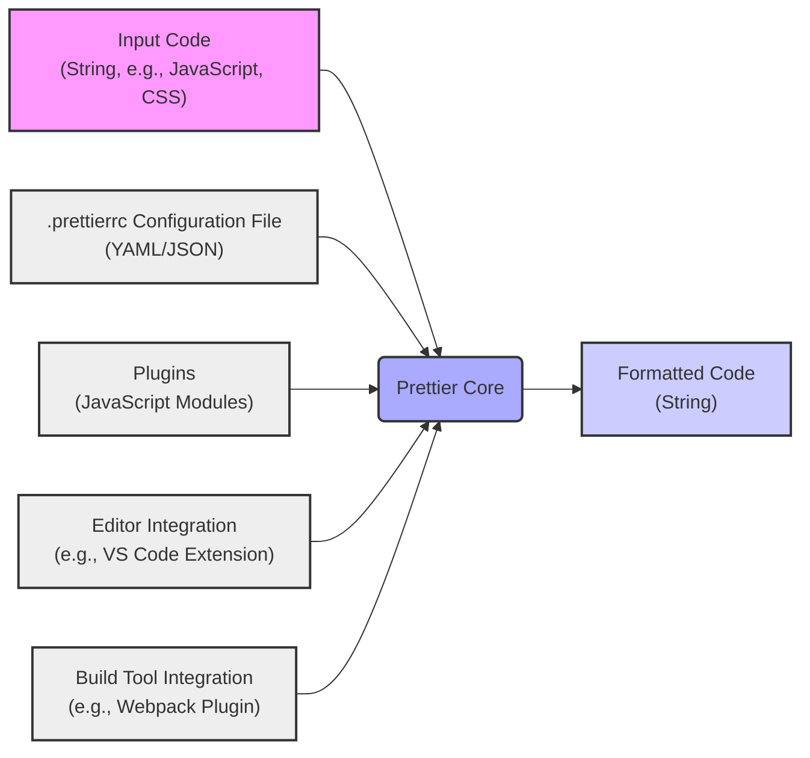
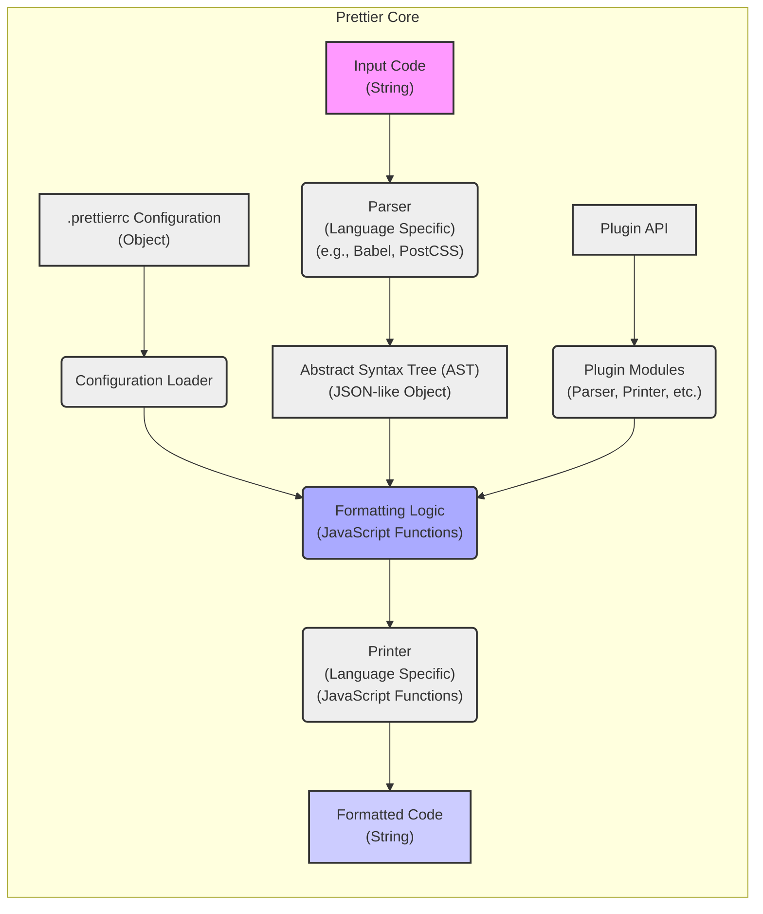

# Project Design Document: Prettier Code Formatter

**Version:** 1.1
**Date:** October 26, 2023
**Author:** Gemini (AI Language Model)

## 1. Introduction

This document provides an enhanced design overview of the Prettier code formatter project, as hosted on GitHub at [https://github.com/Prettier/prettier](https://github.com/Prettier/prettier). Building upon the initial design, this version aims to provide a more detailed and nuanced understanding of the system's architecture, data flow, and key components, specifically tailored for subsequent threat modeling activities. This document will serve as a robust foundation for identifying potential security vulnerabilities and attack vectors.

## 2. Goals

*   Clearly and comprehensively define the architecture and components of the Prettier code formatter, including its extension points.
*   Illustrate the data flow within the system with greater specificity regarding data types and transformations.
*   Identify key areas and components that represent potential security boundaries and are therefore relevant for security considerations.
*   Provide a solid and detailed basis for identifying potential threats, vulnerabilities, and attack surfaces.

## 3. Non-Goals

*   This document does not aim to be an exhaustive technical specification detailing every function and code path within Prettier.
*   It will not delve into the intricate implementation details of individual language parsers or printers beyond their general function and interfaces.
*   A detailed analysis of the project's build process, CI/CD pipeline, or release management is outside the scope of this document.
*   While mentioning plugins, a comprehensive catalog of all available Prettier plugins is not included.

## 4. System Architecture

Prettier functions as both a command-line interface (CLI) tool and a JavaScript library, enabling automated code formatting to enforce consistent style. Its core process involves parsing source code into an Abstract Syntax Tree (AST), applying formatting rules based on configuration and plugins, and then printing the formatted AST back into code.

### 4.1. High-Level Architecture

*   **Input Code (String, e.g., JavaScript, CSS):** The raw source code to be formatted, typically provided as a string.
*   **Prettier Core:** The central processing unit of Prettier, orchestrating parsing, formatting, and printing.
*   **Formatted Code (String):** The output, representing the input code after applying Prettier's formatting rules, also as a string.
*   **.prettierrc Configuration File (YAML/JSON):** An optional file allowing users to customize formatting behavior through settings defined in YAML or JSON format.
*   **Plugins (JavaScript Modules):**  External modules that extend Prettier's capabilities, such as adding support for new languages or custom formatting logic. These are typically JavaScript files.
*   **Editor Integration (e.g., VS Code Extension):**  Integrations that allow users to run Prettier directly within their code editors.
*   **Build Tool Integration (e.g., Webpack Plugin):** Integrations that enable Prettier to be part of the software build process.

### 4.2. Detailed Architecture

*   **Parser (Language Specific) (e.g., Babel, PostCSS):**  Takes the input code string and uses a language-specific parser (like Babel for JavaScript or PostCSS for CSS) to generate an Abstract Syntax Tree (AST).
*   **Abstract Syntax Tree (AST) (JSON-like Object):** A hierarchical representation of the code's structure, typically a JSON-like object, which facilitates manipulation and analysis.
*   **.prettierrc Configuration (Object):** The parsed contents of the `.prettierrc` file, represented as a JavaScript object, containing user-defined formatting preferences.
*   **Configuration Loader:**  Responsible for locating, reading, and parsing the `.prettierrc` file and merging it with default configuration settings.
*   **Plugin API:** The interface through which plugins interact with Prettier core, allowing them to provide custom parsers, printers, and other formatting logic.
*   **Plugin Modules (Parser, Printer, etc.):**  Individual plugin modules that extend Prettier's functionality. These can include custom parsers for new languages, custom printers, or modifications to the formatting logic.
*   **Formatting Logic (JavaScript Functions):** The core algorithms and functions that traverse the AST and apply formatting rules based on the loaded configuration and plugin contributions.
*   **Printer (Language Specific) (JavaScript Functions):** Takes the formatted AST and converts it back into a formatted code string, using language-specific rules for syntax and output.
*   **Formatted Code (String):** The final output, a string containing the consistently formatted code.

## 5. Data Flow

The data flow within Prettier involves a series of transformations applied to the input code:

*   **Input Code Acquisition:** Prettier receives the source code as a string, either from the command line, an editor integration, or programmatically.
*   **Parsing:** The input code string is passed to the appropriate language-specific parser. The parser analyzes the code and generates an Abstract Syntax Tree (AST), typically represented as a JSON-like object.
*   **Configuration Loading and Merging:** The Configuration Loader searches for `.prettierrc` files, reads their contents (YAML or JSON), parses them into JavaScript objects, and merges these settings with Prettier's default configurations.
*   **Plugin Interaction:** Prettier loads and initializes any specified plugins. Plugins can register custom parsers, printers, and contribute to the formatting logic through the Plugin API.
*   **Formatting Application:** The AST, along with the loaded configuration and plugin contributions, is passed to the Formatting Logic. This component traverses the AST and applies formatting rules, potentially modifying the AST structure or creating a new representation.
*   **Printing:** The formatted AST (or its equivalent representation) is then passed to the language-specific Printer. The printer traverses the AST and generates the final formatted code string.
*   **Output:** The formatted code string is returned as the output of the Prettier process.

## 6. Key Components

This section details the key components of Prettier, highlighting their responsibilities and potential security implications:

*   **Core Formatting Engine:**
    *   **Responsibility:** Implements the core logic for applying formatting rules to the AST. This involves traversing the tree, making decisions about spacing, line breaks, and other stylistic elements.
    *   **Security Considerations:**  Vulnerabilities here could lead to unexpected output, denial-of-service (e.g., through infinite loops or excessive resource consumption), or potentially even logic errors if formatting changes the semantic meaning of the code in subtle ways.
*   **Language Parsers (e.g., Babel, PostCSS):**
    *   **Responsibility:**  Converts raw code strings into structured ASTs. Different parsers are used for different languages.
    *   **Security Considerations:** Parsers are a significant attack surface. Vulnerabilities like buffer overflows, stack overflows, or arbitrary code execution could be exploited through maliciously crafted input code. Parser bugs could also lead to incorrect ASTs, causing unexpected formatting or even security issues in the formatted code.
*   **Plugin System and API:**
    *   **Responsibility:** Provides a mechanism for extending Prettier's functionality. Plugins can introduce new language support, custom formatting rules, and more.
    *   **Security Considerations:**  Malicious or poorly written plugins pose a significant risk. They could execute arbitrary code, access sensitive data, or introduce vulnerabilities that compromise the security of the host system or the formatted code. The plugin loading and execution mechanism needs to be carefully secured.
*   **.prettierrc Configuration File Handling:**
    *   **Responsibility:**  Allows users to customize Prettier's behavior. The configuration loader is responsible for finding, reading, and parsing these files.
    *   **Security Considerations:**  Maliciously crafted `.prettierrc` files could potentially be used for denial-of-service (e.g., through excessively large configurations), or in more severe cases, could exploit vulnerabilities in the configuration loader itself. The way Prettier searches for configuration files (e.g., traversing up directory structures) needs to be secure to prevent issues like reading unintended files.
*   **Command-Line Interface (CLI):**
    *   **Responsibility:** Provides the primary interface for users to interact with Prettier. It handles command-line arguments, file input/output, and error reporting.
    *   **Security Considerations:**  The CLI needs to be robust against command injection vulnerabilities if it processes user-provided input (e.g., file paths) without proper sanitization. Care must be taken when handling file system operations based on user input.
*   **JavaScript Library Interface:**
    *   **Responsibility:** Allows programmatic use of Prettier within other JavaScript applications.
    *   **Security Considerations:**  Similar to the CLI, the library interface needs to be designed to prevent misuse that could lead to security vulnerabilities in the integrating application. Input validation and proper error handling are crucial.

## 7. Security Considerations

This section outlines potential security considerations based on the architecture and key components:

*   **Input Validation and Sanitization:**
    *   **Threat:** Maliciously crafted input code could exploit vulnerabilities in language parsers, leading to denial-of-service or arbitrary code execution.
    *   **Mitigation:** Implement robust input validation and sanitization techniques within the parsers to handle unexpected or malformed input gracefully. Consider using well-vetted and regularly updated parser libraries.
*   **Plugin Security and Isolation:**
    *   **Threat:** Malicious plugins could execute arbitrary code, access sensitive data, or introduce vulnerabilities.
    *   **Mitigation:** Implement a secure plugin loading mechanism that includes validation of plugin integrity (e.g., through checksums or signatures). Consider sandboxing plugins to limit their access to system resources. Clearly define and enforce the Plugin API to prevent plugins from performing unauthorized actions.
*   **Configuration Security:**
    *   **Threat:** Maliciously crafted `.prettierrc` files could cause denial-of-service or potentially exploit vulnerabilities in the configuration loader.
    *   **Mitigation:** Implement limits on the size and complexity of configuration files. Sanitize configuration values to prevent unexpected behavior. Carefully control how Prettier searches for and loads configuration files to prevent path traversal issues.
*   **Dependency Management:**
    *   **Threat:** Using vulnerable dependencies could introduce security flaws into Prettier.
    *   **Mitigation:** Regularly audit and update dependencies to patch known vulnerabilities. Use tools to automatically detect and alert on vulnerable dependencies.
*   **Error Handling and Information Disclosure:**
    *   **Threat:** Verbose error messages could leak sensitive information about the system or internal workings of Prettier.
    *   **Mitigation:** Implement secure error handling that avoids exposing sensitive details in error messages. Log detailed error information securely for debugging purposes.
*   **Resource Management:**
    *   **Threat:** Processing excessively large input files or complex code structures could lead to denial-of-service through resource exhaustion.
    *   **Mitigation:** Implement safeguards to limit resource consumption, such as setting maximum input file sizes or timeouts for processing.
*   **Code Injection Prevention:**
    *   **Threat:** Vulnerabilities in parsers or formatting logic could potentially allow for the injection of malicious code into the formatted output.
    *   **Mitigation:** Employ secure coding practices and thorough testing to minimize the risk of code injection vulnerabilities. Regularly review and audit the codebase.

## 8. Future Considerations

*   Conduct a detailed security audit of the core formatting engine to identify potential logic flaws or vulnerabilities.
*   Perform focused threat modeling on the individual language parsers used by Prettier, considering language-specific attack vectors.
*   Develop and implement a robust plugin security model, including mechanisms for plugin verification and sandboxing.
*   Review and harden the configuration loading process to prevent malicious configuration attacks.
*   Perform security testing of the CLI and library interfaces, including fuzzing and penetration testing.
*   Establish a clear process for reporting and addressing security vulnerabilities within the Prettier project.

This enhanced design document provides a more comprehensive and detailed understanding of the Prettier project, specifically tailored for threat modeling. The expanded descriptions of components, data flow, and security considerations will enable a more thorough and effective identification of potential security risks.
