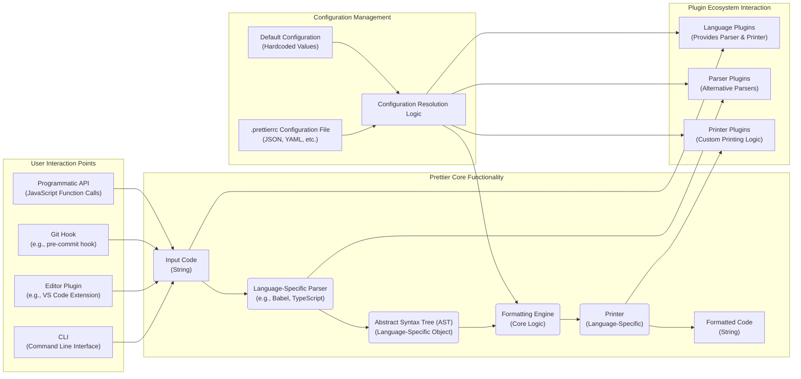

## Project Design Document: Prettier Code Formatter (Improved)

**1. Introduction**

This document provides an enhanced design overview of the Prettier code formatter project, focusing on architectural details relevant for security analysis and threat modeling. It aims to provide a clear and comprehensive understanding of the system's components, their interactions, and the flow of data. This document serves as the foundation for identifying potential security vulnerabilities and developing mitigation strategies.

**2. Goals**

*   Provide a detailed and precise description of Prettier's architecture and functionality, emphasizing security-relevant aspects.
*   Clearly identify key components, their specific responsibilities, and their interactions with each other and external entities.
*   Thoroughly outline the data flow within the system, including data transformations and potential points of manipulation.
*   Establish a robust understanding of the project's structure to facilitate comprehensive security analysis and threat identification.

**3. Non-Goals**

*   In-depth code-level implementation details of specific modules or functions.
*   Detailed performance metrics, benchmarking results, or optimization strategies.
*   Granular user interface/user experience (UI/UX) design specifications.
*   Extensive details about the implementation of individual plugins within the plugin ecosystem, beyond their general interaction model.

**4. High-Level Architecture**

Prettier functions as both a command-line interface (CLI) tool and a library, enabling integration into diverse development workflows such as editor plugins and Git hooks. The core process involves receiving source code, transforming it into an Abstract Syntax Tree (AST), applying formatting rules to the AST, and then generating the formatted code. The configuration and plugin systems significantly influence this process.

**5. Component Breakdown**

*   **Input Code (String):** The raw source code to be formatted, represented as a string. The encoding and language of this input are crucial.
*   **CLI (Command Line Interface):**
    *   **Responsibility:** Handles command-line argument parsing, reads input files, invokes the Prettier formatting engine, and writes the formatted output to files or standard output.
    *   **Security Relevance:** Input validation, handling of file paths, and preventing command injection are key security considerations.
*   **Editor Plugin:**
    *   **Responsibility:** Integrates Prettier's formatting functionality into code editors, typically triggered by user actions (e.g., saving a file). Uses the Prettier library programmatically.
    *   **Security Relevance:** Relies on secure communication between the editor and the Prettier library. Potential vulnerabilities in the plugin itself could be exploited.
*   **Git Hook:**
    *   **Responsibility:** Executes Prettier automatically as part of the Git commit process, ensuring code style consistency.
    *   **Security Relevance:**  Ensuring the integrity of the hook script and preventing malicious code execution within the hook environment are important.
*   **Programmatic API:**
    *   **Responsibility:**  Provides JavaScript functions that allow other applications to programmatically access Prettier's formatting capabilities.
    *   **Security Relevance:**  Proper input sanitization and validation within the calling application are necessary to prevent issues.
*   **Language-Specific Parser (e.g., Babel, TypeScript):**
    *   **Responsibility:** Parses the input code into an Abstract Syntax Tree (AST). Different parsers are used based on the detected language.
    *   **Security Relevance:** Vulnerabilities in the parser can lead to denial-of-service attacks or potentially even remote code execution if processing untrusted code.
*   **Abstract Syntax Tree (AST) (Language-Specific Object):**
    *   **Responsibility:** A tree-like representation of the code's structure. It's an intermediate representation used by the formatting engine.
    *   **Security Relevance:**  While not directly executable, vulnerabilities in the formatting engine's handling of specific AST structures could be exploited.
*   **Formatting Engine (Core Logic):**
    *   **Responsibility:** The central component that applies formatting rules to the AST based on configuration settings.
    *   **Security Relevance:**  Bugs in the formatting logic could lead to unexpected or incorrect code transformations.
*   **Printer (Language-Specific):**
    *   **Responsibility:** Takes the formatted AST and generates the output code string. Different printers are used for different languages.
    *   **Security Relevance:**  Vulnerabilities in the printer could lead to the generation of malformed or potentially exploitable code.
*   **.prettierrc Configuration File (JSON, YAML, etc.):**
    *   **Responsibility:**  Allows users to customize Prettier's formatting behavior.
    *   **Security Relevance:**  Maliciously crafted configuration files could potentially cause unexpected behavior or even resource exhaustion if not properly validated. Path traversal vulnerabilities during configuration file lookup are a concern.
*   **Default Configuration (Hardcoded Values):**
    *   **Responsibility:**  Provides fallback formatting rules when no configuration file is found.
    *   **Security Relevance:** The default configuration should be secure and not introduce any inherent vulnerabilities.
*   **Configuration Resolution Logic:**
    *   **Responsibility:** Determines which configuration file to use based on the file being formatted and the project structure.
    *   **Security Relevance:**  Vulnerabilities in this logic could allow an attacker to force the use of a malicious configuration file.
*   **Language Plugins (Provides Parser & Printer):**
    *   **Responsibility:** Extend Prettier's support for new languages by providing the necessary parser and printer implementations.
    *   **Security Relevance:**  Plugins from untrusted sources could contain vulnerabilities in their parsing or printing logic.
*   **Parser Plugins (Alternative Parsers):**
    *   **Responsibility:** Offer alternative parsing implementations for existing languages.
    *   **Security Relevance:**  Similar to language plugins, untrusted parser plugins could introduce vulnerabilities.
*   **Printer Plugins (Custom Printing Logic):**
    *   **Responsibility:** Provide custom logic for generating the formatted output.
    *   **Security Relevance:**  Untrusted printer plugins could generate malicious output or have vulnerabilities in their printing logic.

**6. Data Flow**

The flow of data through Prettier involves several stages, with transformations occurring at each step:

1. **Input (Source Code String):**  Unformatted source code is received by Prettier via one of its entry points.
2. **Language Detection:** Based on file extension or explicit configuration, Prettier determines the language of the input code.
3. **Parser Selection:** The appropriate language-specific parser (or a parser plugin) is selected.
4. **Parsing (String to AST):** The selected parser processes the input code string and generates a language-specific Abstract Syntax Tree (AST). This involves tokenization and syntactic analysis.
5. **Configuration Loading:** Prettier traverses the file system to locate a `.prettierrc` file. If found, the configuration settings are loaded and merged with the default configuration. This process involves reading and parsing configuration files (JSON, YAML, etc.).
6. **Formatting (AST Transformation):** The Formatting Engine receives the AST and the loaded configuration. It traverses the AST and applies formatting rules, potentially modifying the AST structure or adding/removing nodes related to whitespace and formatting.
7. **Printer Selection:** The appropriate language-specific printer (or a printer plugin) is selected.
8. **Printing (AST to Formatted String):** The selected printer takes the formatted AST and generates the final formatted code string.
9. **Output (Formatted Code String):** The formatted code string is returned to the user or the integrating application. This might involve writing to a file, updating an editor buffer, or returning the string programmatically.

**7. Security Considerations (Detailed)**

This section elaborates on potential security concerns for threat modeling:

*   **Dependency Vulnerabilities:**
    *   **Threat:**  Prettier relies on numerous third-party libraries. Known vulnerabilities in these dependencies could be exploited if not patched.
    *   **Examples:**  Vulnerabilities in the parser libraries (e.g., Babel, PostCSS) could lead to arbitrary code execution if processing maliciously crafted code.
*   **Configuration Vulnerabilities:**
    *   **Threat:** Malicious or unintended configurations in `.prettierrc` files could lead to unexpected behavior.
    *   **Examples:**  A configuration that disables certain safety checks or introduces unexpected formatting patterns could be used to obfuscate malicious code. Path traversal vulnerabilities during configuration file lookup could allow loading arbitrary configuration files.
*   **Plugin Security:**
    *   **Threat:**  Malicious or poorly written plugins could introduce vulnerabilities. Plugins have access to the AST and can influence the formatting process.
    *   **Examples:** A malicious parser plugin could inject code into the AST, which is then emitted by the printer. A malicious printer plugin could generate arbitrary output.
*   **Code Injection through Formatting:**
    *   **Threat:**  Vulnerabilities in the parsing or printing logic could be exploited to inject malicious code into the formatted output.
    *   **Examples:**  In templating languages or code generation scenarios, a carefully crafted input could exploit a bug to introduce unintended executable code.
*   **Denial of Service (DoS):**
    *   **Threat:**  Crafted input code or configurations could cause excessive resource consumption (CPU, memory).
    *   **Examples:**  Extremely large input files, deeply nested code structures, or complex regular expressions in parsers could lead to DoS.
*   **Supply Chain Attacks:**
    *   **Threat:**  Compromise of the Prettier repository, build process, or distribution channels could lead to the distribution of a compromised version.
    *   **Examples:**  An attacker could inject malicious code into the Prettier codebase or replace legitimate dependencies with malicious ones.
*   **Regular Expression Denial of Service (ReDoS):**
    *   **Threat:**  Poorly written regular expressions in parsing or formatting logic could be vulnerable to ReDoS attacks, causing significant performance degradation or crashes.
    *   **Examples:**  Regular expressions used for tokenization or syntax highlighting might be vulnerable.
*   **Path Traversal:**
    *   **Threat:**  Vulnerabilities when resolving configuration files or plugin locations could allow access to arbitrary files on the system.
    *   **Examples:**  Using relative paths in configuration or plugin loading without proper sanitization could allow an attacker to access sensitive files.
*   **Information Disclosure:**
    *   **Threat:**  Error messages or logging could inadvertently reveal sensitive information about the system or the code being formatted.
    *   **Examples:**  Stack traces or debug logs might expose file paths or internal data structures.

**8. Deployment Model**

Prettier is deployed and utilized in various contexts, each with its own security implications:

*   **Local Installation (Development Dependency):**
    *   **Context:** Developers install Prettier within their project's `node_modules` directory.
    *   **Security Relevance:** Vulnerabilities could impact the developer's local environment. Supply chain attacks targeting dependencies are a concern.
*   **Global Installation:**
    *   **Context:** Prettier is installed system-wide, making it accessible from any project.
    *   **Security Relevance:** A compromised global installation could affect multiple projects on the user's machine.
*   **Editor Integrations (Plugins):**
    *   **Context:** Prettier is integrated into code editors via plugins.
    *   **Security Relevance:** The security of the editor plugin itself and the communication between the editor and Prettier are crucial. Plugin vulnerabilities could compromise the editor.
*   **CI/CD Pipelines:**
    *   **Context:** Prettier is used as part of automated build and deployment processes.
    *   **Security Relevance:** Vulnerabilities could lead to the deployment of incorrectly formatted or potentially malicious code. The security of the CI/CD environment is paramount.

**9. Future Considerations (Security Implications)**

Future developments in Prettier could introduce new security challenges:

*   **New Language Support:**  Requires integrating new parsers and printers, potentially introducing new vulnerabilities specific to those components.
*   **Advanced Configuration Options:**  Increased complexity in configuration could lead to new avenues for misconfiguration or exploitation.
*   **WebAssembly (Wasm) Implementation:**  Introducing Wasm components requires careful consideration of Wasm security best practices and potential vulnerabilities in the Wasm runtime.
*   **Improved Plugin API:**  While offering more flexibility, a more powerful plugin API could also increase the attack surface if not designed with security in mind. Stricter validation and sandboxing of plugins might be necessary.
*   **Remote Configuration Loading:** If Prettier were to support loading configurations from remote sources, this would introduce significant security risks related to the integrity and authenticity of the configuration data.

This improved design document provides a more detailed and security-focused overview of the Prettier project. It highlights potential areas of concern that should be further investigated during the threat modeling process.
