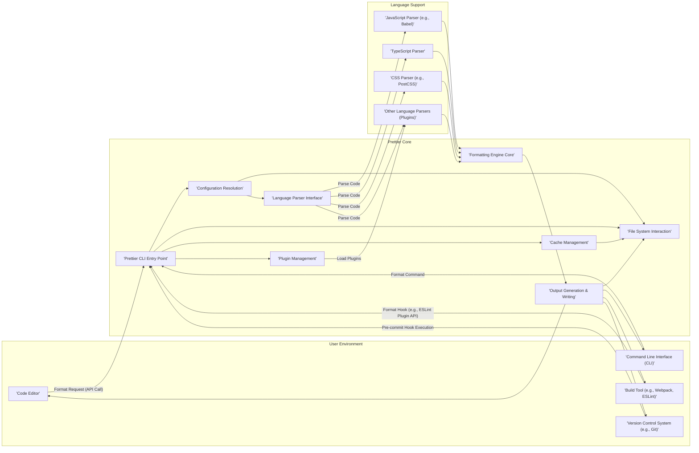

## Project Design Document: Prettier Code Formatter (Improved)

**1. Introduction**

This document provides an enhanced design overview of the Prettier code formatter project (https://github.com/prettier/prettier), specifically tailored for threat modeling. Building upon the previous version, this document offers more granular details about the system's architecture, data flow, and potential security considerations. The aim is to provide a robust foundation for identifying and mitigating potential threats.

**2. Project Overview**

Prettier remains an opinionated code formatter designed to enforce consistent code formatting across various programming languages and markup formats. Its core function is to automate code styling, thereby improving readability and reducing stylistic debates. Prettier's versatility is evident in its integrations with code editors, build tools, and version control systems, making it a central part of many development workflows.

**3. Goals and Objectives**

*   **Enforce Consistent Code Formatting:**  Automate the application of predefined style rules to source code.
*   **Enhance Code Readability:** Improve the visual structure and clarity of code, making it easier to understand and maintain.
*   **Minimize Style Debates:** Eliminate subjective discussions about code formatting preferences within development teams.
*   **Boost Developer Productivity:** Free developers from manual formatting tasks, allowing them to focus on core logic.
*   **Broad Language Support:** Offer formatting capabilities for a wide array of programming languages and markup formats.
*   **Provide Extensibility via Plugins:** Enable customization and support for emerging languages or specific formatting needs through a plugin architecture.

**4. Target Audience**

*   Individual software developers
*   Development teams and organizations
*   Maintainers of open-source software projects
*   Security engineers involved in code review and security analysis

**5. System Architecture**

The Prettier architecture revolves around a central formatting engine accessible through various interfaces. The following diagram provides a more detailed view of the components and their interactions:

**6. Data Flow (Detailed)**

A typical formatting operation involves the following data flow, with potential security implications highlighted:

*   **Input Acquisition:**
    *   **Source Code:**  The raw code to be formatted, potentially originating from files, standard input, or editor buffers. *Security Concern: Maliciously crafted code could exploit parser vulnerabilities.*
    *   **Configuration Data:**  Settings defining formatting rules, read from configuration files (`.prettierrc.json`, etc.), command-line arguments, or editor settings. *Security Concern: Untrusted configuration sources could introduce malicious settings or file paths.*
*   **Initialization and Configuration:**
    *   The Prettier CLI entry point receives the request and initiates the process.
    *   Configuration resolution involves locating and merging configuration settings from various sources. *Security Concern: Improper handling of configuration precedence could lead to unexpected behavior or the loading of unintended configurations.*
    *   File system interaction occurs to read configuration files. *Security Concern: Path traversal vulnerabilities could allow access to sensitive files.*
*   **Parsing:**
    *   Based on the detected language, the appropriate parser is invoked (either built-in or provided by a plugin).
    *   The parser transforms the source code into an Abstract Syntax Tree (AST). *Security Concern: Parser vulnerabilities could be exploited by specially crafted code, leading to crashes or even remote code execution.*
*   **Formatting:**
    *   The core formatting engine traverses the AST and applies formatting rules based on the resolved configuration.
    *   Plugins might participate in the formatting process, especially for custom language features or syntax. *Security Concern: Malicious plugins could manipulate the AST or introduce vulnerabilities during formatting.*
*   **Output Generation:**
    *   The formatted code is generated from the modified AST.
*   **Output and Caching:**
    *   The formatted code is written back to the original file, printed to standard output, or returned to the calling application. *Security Concern: Path traversal vulnerabilities during output writing could overwrite unintended files.*
    *   Prettier may utilize a cache to store formatted output for performance. *Security Concern: Cache poisoning could lead to the use of incorrectly formatted code.*

**7. Key Components (Detailed)**

*   **Prettier CLI Entry Point:**  Handles command-line arguments, error handling, and orchestrates the formatting process. *Security Consideration: Vulnerabilities here could allow command injection or bypass security checks.*
*   **Configuration Resolution:**  Locates, reads, and merges configuration settings from various sources (files, CLI, API). *Security Consideration:  Improper validation or sanitization of configuration values could lead to vulnerabilities.*
*   **File System Interaction:**  Provides functions for reading and writing files, accessing directories, and checking file existence. *Security Consideration:  Susceptible to path traversal vulnerabilities if not carefully implemented.*
*   **Language Parser Interface:**  An abstraction layer that allows Prettier to work with different language parsers. *Security Consideration:  Ensuring parsers are sandboxed or isolated is crucial to prevent exploits from affecting the core application.*
*   **Formatting Engine Core:**  The central logic that applies formatting rules to the AST. *Security Consideration:  Bugs in the formatting logic could lead to unexpected code transformations or introduce vulnerabilities in the formatted code.*
*   **Plugin Management:**  Handles the loading, registration, and invocation of plugins. *Security Consideration:  A significant attack surface, as malicious plugins could execute arbitrary code or access sensitive data.*
*   **Output Generation & Writing:**  Formats the processed AST back into a string and writes it to the specified output. *Security Consideration:  Path traversal vulnerabilities are a concern during file writing.*
*   **Cache Management:**  Stores formatted output to improve performance. *Security Consideration:  Cache poisoning could lead to the use of outdated or maliciously altered formatted code.*
*   **Language Parsers (e.g., Babel, TypeScript Parser):**  Convert source code into an AST. *Security Consideration:  Parsers are complex and can have vulnerabilities that could be exploited by crafted input.*

**8. Security Considerations (Specific Examples)**

This section provides more concrete examples of potential threats:

*   **Exploiting Parser Vulnerabilities:**  Crafting JavaScript code with specific syntax that triggers a buffer overflow or other vulnerability in the Babel parser.
*   **Malicious Configuration Overrides:**  A user providing a `.prettierrc.json` file in a higher directory that injects malicious formatting rules or triggers unintended file system operations.
*   **Plugin Backdoors:**  Installing a seemingly innocuous Prettier plugin that contains code to exfiltrate environment variables or modify files outside the project directory.
*   **Dependency Confusion Attacks:**  If Prettier or its plugins rely on internal packages without proper scoping, attackers could publish malicious packages with the same name on public repositories.
*   **Path Traversal via CLI Arguments:**  Using command-line arguments like `--write` with a maliciously crafted path to overwrite system files.
*   **ReDoS in Language Grammars:**  Exploiting poorly written regular expressions within language parsers to cause excessive CPU consumption.
*   **Cache Poisoning via Symlink Manipulation:**  Tricking Prettier into caching the output of a malicious file by manipulating symbolic links.
*   **Cross-Site Scripting (XSS) in Editor Integrations:**  If the communication between Prettier and a code editor is not properly secured, malicious code could be injected into the editor interface.

**9. Deployment Model**

Prettier's deployment remains consistent, but security considerations vary depending on the context:

*   **Local Development:**  Developers install Prettier, introducing potential vulnerabilities from the npm ecosystem.
*   **Editor Integrations:**  Security relies on the integrity of the editor plugin and the communication channel between the editor and Prettier.
*   **Build Processes:**  Running Prettier in build pipelines requires careful consideration of the security of the build environment and dependencies.
*   **Version Control Hooks:**  Pre-commit hooks execute Prettier on developer machines, making them susceptible to local vulnerabilities.
*   **CI/CD Pipelines:**  Security in CI/CD pipelines is crucial, as Prettier has write access to the codebase. Supply chain security for dependencies is paramount.

**10. Technologies Used**

The core technologies remain the same, but understanding their security implications is important:

*   **JavaScript/Node.js:**  Vulnerabilities in the Node.js runtime or JavaScript libraries can impact Prettier.
*   **npm/yarn:**  The package managers are potential attack vectors for supply chain attacks.
*   **Language-Specific Parsers:**  The security of these parsers directly affects Prettier's robustness.

**11. Future Considerations**

Security should be a primary consideration in future development:

*   **Sandboxing Plugins:**  Implementing mechanisms to isolate plugins and limit their access to system resources.
*   **Improved Input Sanitization:**  Strengthening the sanitization of input code and configuration data.
*   **Regular Security Audits:**  Conducting regular security audits of the Prettier codebase and its dependencies.
*   **Supply Chain Security Measures:**  Implementing measures to verify the integrity of dependencies and prevent supply chain attacks.

This improved design document provides a more detailed and security-focused overview of the Prettier project. It serves as a more robust foundation for subsequent threat modeling activities, enabling a deeper understanding of potential vulnerabilities and attack vectors.