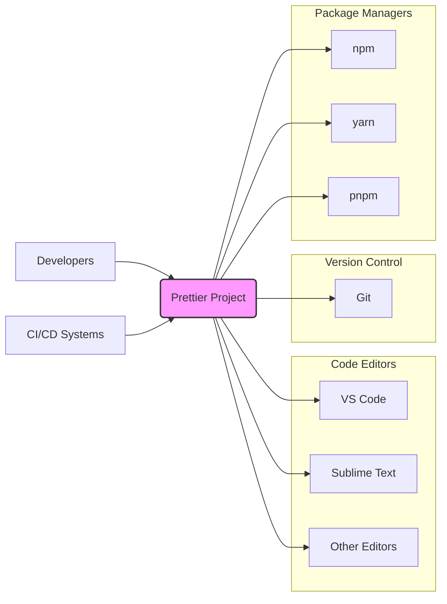
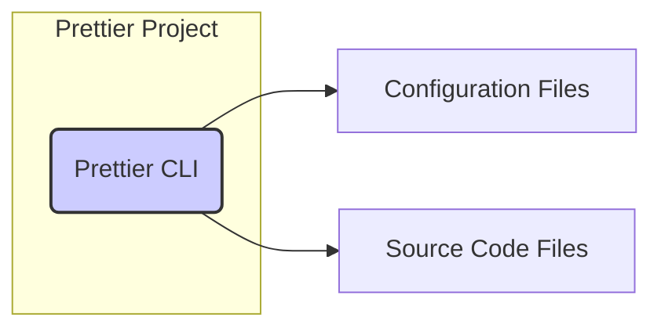
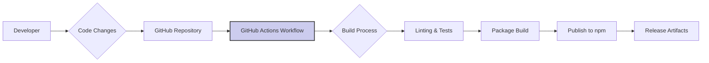

# BUSINESS POSTURE

This project, Prettier, is a code formatter. The primary business priority it addresses is to ensure consistent code style across software development projects. This consistency leads to improved code readability, reduced cognitive load for developers, and easier code maintenance.

Business goals for Prettier include:
- Enhancing code quality and consistency across diverse projects and teams.
- Improving developer productivity by automating code formatting tasks.
- Reducing time spent on code reviews related to style inconsistencies.
- Facilitating easier collaboration and code maintainability.

Most important business risks associated with Prettier:
- Risk of introducing vulnerabilities into the software development lifecycle if Prettier itself is compromised or contains vulnerabilities.
- Risk of disrupting development workflows if Prettier malfunctions, produces incorrect formatting, or becomes unavailable.
- Risk of supply chain attacks targeting Prettier's dependencies or distribution channels.
- Risk of adoption friction if Prettier is perceived as too opinionated or difficult to integrate into existing workflows.

# SECURITY POSTURE

Existing security controls:
- security control: GitHub repository access control to manage who can contribute to the project. Implemented in: GitHub repository settings.
- security control: Issue tracking and pull request reviews for code changes. Implemented in: GitHub Issues and Pull Requests.
- security control: Community driven security through open source model and public scrutiny of code. Implemented in: Open GitHub repository.

Accepted risks:
- accepted risk: Potential vulnerabilities in dependencies used by Prettier.
- accepted risk: Risk of community contributions introducing unintended security issues.
- accepted risk: Reliance on the security of the Node.js ecosystem and npm registry.

Recommended security controls:
- recommended security control: Implement automated Static Application Security Testing (SAST) tools in the CI/CD pipeline to detect potential code-level vulnerabilities.
- recommended security control: Implement Dependency Scanning to identify and monitor known vulnerabilities in project dependencies.
- recommended security control: Generate and publish Software Bill of Materials (SBOM) to enhance transparency and supply chain security.
- recommended security control: Sign release artifacts to ensure integrity and authenticity of distributed versions.
- recommended security control: Regularly perform security audits and penetration testing to proactively identify and address security weaknesses.

Security requirements:
- Authentication: Not directly applicable as Prettier is a command-line tool and library, not a service requiring user authentication. However, authentication is relevant for contributors to the project via GitHub accounts.
- Authorization: Authorization is managed by GitHub repository permissions for contributors. For users of Prettier, authorization is not a direct concern as it operates locally or within CI/CD pipelines under the context of the executing user or system.
- Input validation: Robust input validation is crucial for Prettier. It must correctly parse and handle various code syntax and structures to prevent unexpected behavior or vulnerabilities during code formatting. Input validation should be applied to the code being formatted and configuration options.
- Cryptography: Cryptography is not a primary requirement for Prettier's core functionality of code formatting. However, if Prettier implements features like secure configuration storage or communication in the future, cryptographic measures might become relevant. For now, it's not a core security requirement.

# DESIGN

Prettier is designed as a command-line interface (CLI) tool and a library that can be integrated into various development environments and tools. It primarily operates on source code files, parsing them into an Abstract Syntax Tree (AST), applying formatting rules, and outputting the formatted code.

## C4 CONTEXT



Context Diagram Elements:

- Element:
    - Name: Developers
    - Type: User
    - Description: Software developers who use Prettier to format their code.
    - Responsibilities: Using Prettier CLI or editor integrations to format code locally before committing, configuring Prettier settings for their projects.
    - Security controls: Local machine security practices, secure coding habits.

- Element:
    - Name: CI/CD Systems
    - Type: System
    - Description: Continuous Integration and Continuous Delivery pipelines that use Prettier to enforce code style consistency automatically.
    - Responsibilities: Running Prettier as part of automated build and test processes, ensuring code formatting compliance before deployment.
    - Security controls: CI/CD pipeline security, secure configuration management for Prettier within CI/CD.

- Element:
    - Name: VS Code
    - Type: System
    - Description: Popular code editor with Prettier extension for real-time code formatting.
    - Responsibilities: Providing integration with Prettier for developers, allowing on-save formatting and other features.
    - Security controls: Editor extension security model, secure communication with Prettier CLI.

- Element:
    - Name: Sublime Text
    - Type: System
    - Description: Another code editor with Prettier plugins available.
    - Responsibilities: Providing integration with Prettier for developers.
    - Security controls: Editor plugin security model, secure communication with Prettier CLI.

- Element:
    - Name: Other Editors
    - Type: System
    - Description: Various other code editors and IDEs that support Prettier integrations.
    - Responsibilities: Providing integration with Prettier.
    - Security controls: Editor/IDE plugin security models.

- Element:
    - Name: Git
    - Type: System
    - Description: Version control system commonly used in software development. Prettier is often used in conjunction with Git for code formatting workflows.
    - Responsibilities: Storing and managing source code, used in conjunction with Prettier for pre-commit hooks to format code.
    - Security controls: Git repository access controls, branch protection rules.

- Element:
    - Name: npm
    - Type: System
    - Description: Node Package Manager, the primary package registry for JavaScript packages. Prettier is distributed via npm.
    - Responsibilities: Hosting and distributing Prettier package, managing dependencies.
    - Security controls: npm registry security, package signing (npm provenance).

- Element:
    - Name: yarn
    - Type: System
    - Description: Another JavaScript package manager and registry. Prettier can also be installed via yarn.
    - Responsibilities: Hosting and distributing Prettier package, managing dependencies.
    - Security controls: yarn registry security, package integrity checks.

- Element:
    - Name: pnpm
    - Type: System
    - Description: A performant JavaScript package manager. Prettier can also be installed via pnpm.
    - Responsibilities: Hosting and distributing Prettier package, managing dependencies.
    - Security controls: pnpm registry security, package integrity checks.

- Element:
    - Name: Prettier Project
    - Type: Software System
    - Description: The Prettier code formatter itself, including the CLI and library components.
    - Responsibilities: Parsing code, applying formatting rules, outputting formatted code, providing configuration options.
    - Security controls: Input validation, secure coding practices, dependency management, build process security.

## C4 CONTAINER



Container Diagram Elements:

- Element:
    - Name: Prettier CLI
    - Type: Container - Node.js Application
    - Description: The command-line interface application of Prettier, written in Node.js. It's the primary executable used by developers and CI/CD systems.
    - Responsibilities:
        - Accepting command-line arguments and configuration options.
        - Reading source code files.
        - Parsing source code into AST.
        - Applying formatting rules based on configuration.
        - Outputting formatted code to files or stdout.
        - Handling errors and reporting issues.
    - Security controls:
        - Input validation on command-line arguments and configuration.
        - Secure handling of file system operations.
        - Dependency vulnerability scanning.
        - Regular updates to Node.js runtime and dependencies.

- Element:
    - Name: Configuration Files
    - Type: Data Store - Files
    - Description: Configuration files (e.g., `.prettierrc.js`, `.prettierignore`) that specify formatting rules and file exclusion patterns.
    - Responsibilities:
        - Storing user-defined formatting preferences.
        - Defining file paths to be ignored by Prettier.
        - Customizing Prettier's behavior for specific projects.
    - Security controls:
        - Access control to configuration files to prevent unauthorized modification.
        - Validation of configuration file content to prevent malicious settings.

- Element:
    - Name: Source Code Files
    - Type: Data Store - Files
    - Description: The source code files that Prettier formats (e.g., `.js`, `.ts`, `.css`, `.html`).
    - Responsibilities:
        - Providing input to Prettier for formatting.
        - Being modified by Prettier with formatted code.
    - Security controls:
        - File system permissions to control access to source code.
        - Backup and version control of source code before and after formatting.

## DEPLOYMENT

Prettier is primarily deployed in two main environments:

1.  Developer's Local Machines: Developers install Prettier globally or per project using package managers (npm, yarn, pnpm) to use the CLI tool directly or through editor integrations.
2.  CI/CD Pipelines: Prettier is integrated into CI/CD pipelines as a build step to automatically format code and enforce style consistency during the software build process.

Detailed Deployment for Developer's Local Machine:

```mermaid
flowchart LR
    subgraph "Developer Machine"
        A[Operating System]
        subgraph "Node.js Environment"
            B[Node.js Runtime]
            C[Prettier CLI (npm package)]
            D[Code Editor (VS Code, etc.)]
        end
        E[Source Code Files]
    end

    D --> C
    C --> E
    B --> C
    A --> B
    style C fill:#efe,stroke:#333,stroke-width:2px
```

Deployment Diagram Elements (Developer Machine):

- Element:
    - Name: Operating System
    - Type: Infrastructure - Operating System (macOS, Windows, Linux)
    - Description: The host operating system on the developer's machine.
    - Responsibilities: Providing the underlying environment for running Node.js and Prettier.
    - Security controls: OS-level security controls, user account management, firewall, antivirus.

- Element:
    - Name: Node.js Runtime
    - Type: Infrastructure - Runtime Environment
    - Description: The Node.js runtime environment required to execute Prettier, which is a Node.js application.
    - Responsibilities: Executing JavaScript code, providing APIs for file system access, network operations, etc.
    - Security controls: Keeping Node.js runtime updated with security patches, secure configuration of Node.js environment.

- Element:
    - Name: Prettier CLI (npm package)
    - Type: Container - Node.js Application
    - Description: The Prettier command-line interface installed as an npm package.
    - Responsibilities: Formatting code files based on user commands and configuration.
    - Security controls: Package integrity verification during installation, regular updates to the Prettier package.

- Element:
    - Name: Code Editor (VS Code, etc.)
    - Type: Application - Code Editor
    - Description: Code editor with Prettier extension installed, providing integration with Prettier.
    - Responsibilities: Interacting with Prettier CLI, triggering formatting on save or command.
    - Security controls: Editor extension security model, secure communication with Prettier CLI.

- Element:
    - Name: Source Code Files
    - Type: Data - Files
    - Description: The source code files residing on the developer's local machine that are being formatted by Prettier.
    - Responsibilities: Being the input and output of the formatting process.
    - Security controls: File system permissions, local machine security practices.

## BUILD

The Prettier build process is automated using GitHub Actions. It involves several stages to ensure code quality, perform checks, and publish releases.



Build Process Elements:

- Element:
    - Name: Developer
    - Type: Actor
    - Description: Developers who contribute code changes to the Prettier project.
    - Responsibilities: Writing code, submitting pull requests, participating in code reviews.
    - Security controls: Secure coding practices, GitHub account security, two-factor authentication.

- Element:
    - Name: Code Changes
    - Type: Data - Code
    - Description: Source code modifications made by developers.
    - Responsibilities: Representing new features, bug fixes, or improvements to Prettier.
    - Security controls: Code review process, pull request checks.

- Element:
    - Name: GitHub Repository
    - Type: System - Version Control
    - Description: The GitHub repository hosting the Prettier project source code.
    - Responsibilities: Storing code, managing branches, tracking changes, triggering CI workflows.
    - Security controls: Repository access controls, branch protection rules, audit logs.

- Element:
    - Name: GitHub Actions Workflow
    - Type: System - CI/CD
    - Description: Automated workflows defined in GitHub Actions to build, test, and publish Prettier.
    - Responsibilities: Automating the build process, running tests, performing security checks, publishing releases.
    - Security controls: Secure workflow definitions, secrets management, access control to workflows.

- Element:
    - Name: Build Process
    - Type: Process - Automation
    - Description: The sequence of steps executed by GitHub Actions to build Prettier.
    - Responsibilities: Compiling code, running linters, executing unit and integration tests, packaging the release.
    - Security controls: SAST tools integration, dependency scanning, build environment security.

- Element:
    - Name: Linting & Tests
    - Type: Process - Security Check
    - Description: Automated linting and testing stages within the build process to ensure code quality and catch potential issues.
    - Responsibilities: Identifying code style violations, detecting bugs, ensuring code functionality.
    - Security controls: Static analysis tools, unit tests, integration tests.

- Element:
    - Name: Package Build
    - Type: Process - Packaging
    - Description: Creating distributable packages of Prettier (e.g., npm package).
    - Responsibilities: Packaging code and assets into release artifacts.
    - Security controls: Ensuring build reproducibility, verifying package integrity.

- Element:
    - Name: Publish to npm
    - Type: Process - Distribution
    - Description: Publishing the built Prettier package to the npm registry.
    - Responsibilities: Making Prettier available for download and installation by users.
    - Security controls: npm account security, package signing (npm provenance), registry security.

- Element:
    - Name: Release Artifacts
    - Type: Data - Packages
    - Description: The final distributable packages of Prettier, available on npm.
    - Responsibilities: Being the deliverable product of the build process.
    - Security controls: Package integrity verification, release signing.

# RISK ASSESSMENT

Critical business process we are trying to protect:
- Maintaining code style consistency across software projects, which indirectly supports code quality, developer productivity, and maintainability.
- The software development lifecycle itself, as Prettier is a tool integrated into this process.

Data we are trying to protect and their sensitivity:
- Source code being formatted: Sensitivity is generally medium to high, as source code is the intellectual property and core asset of software projects. However, Prettier itself does not store or transmit this data; it processes it locally or within CI/CD environments. The risk is more about potential manipulation or exposure during processing if Prettier were compromised.
- Prettier configuration files: Sensitivity is low to medium. Configuration files might contain project-specific style preferences, but they generally do not contain sensitive data.
- Prettier package itself: Sensitivity is medium. The integrity and availability of the Prettier package are important to ensure developers can reliably use it. A compromised package could introduce vulnerabilities into user projects.

# QUESTIONS & ASSUMPTIONS

Questions:
- What is the expected scale of usage for Prettier? Is it primarily for individual developers and small teams, or is it also used extensively in large organizations and enterprise environments?
- Are there any specific compliance requirements or industry regulations that Prettier needs to adhere to (e.g., related to data processing or software supply chain)?
- Are there any performance benchmarks or scalability targets for Prettier's formatting process?
- What is the process for reporting and handling security vulnerabilities in Prettier?

Assumptions:
- BUSINESS POSTURE: The primary business goal is to improve code quality and developer productivity through automated code formatting. The project is intended for wide adoption across the software development community.
- SECURITY POSTURE: Security is important but not the absolute highest priority compared to functionality and usability. The project relies on community contributions and open-source security principles. Standard security practices for open-source Node.js projects are applicable.
- DESIGN: Prettier is designed as a CLI tool and library for local and CI/CD integration. It operates on source code files and configuration files. The deployment model is primarily focused on developer machines and CI/CD environments. The build process is automated using GitHub Actions and includes basic security checks.