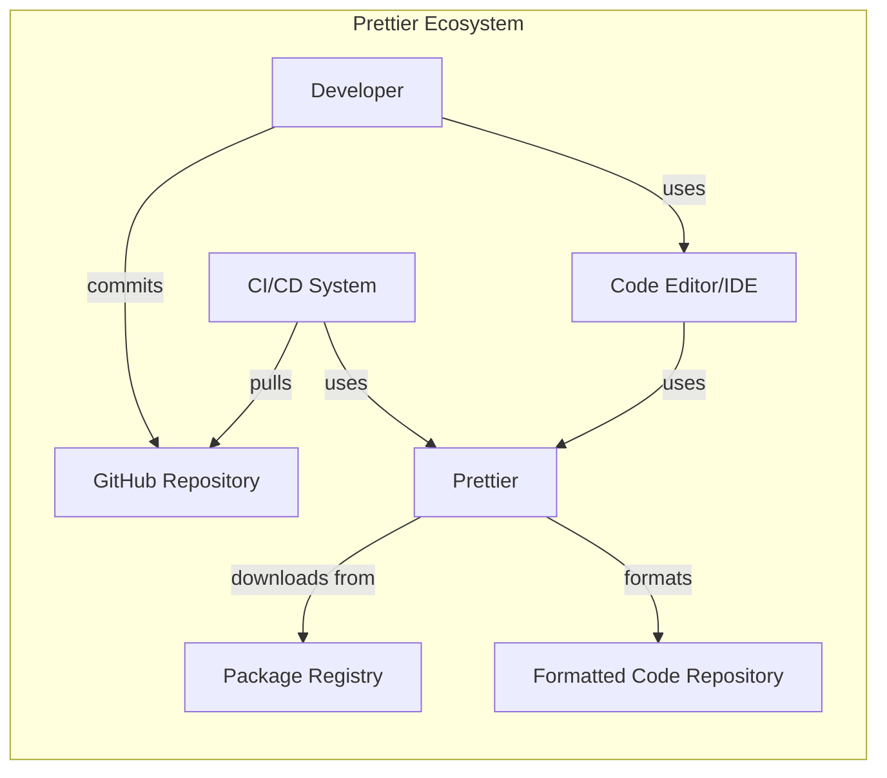
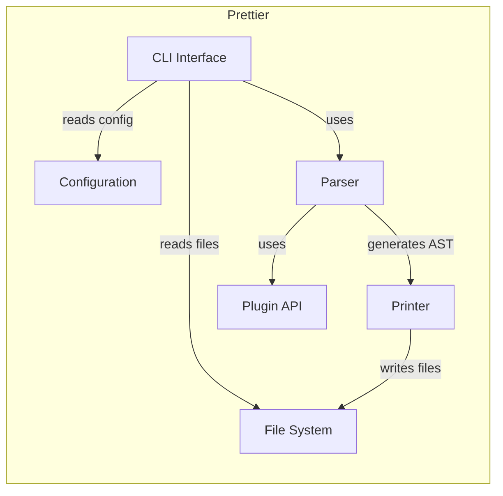
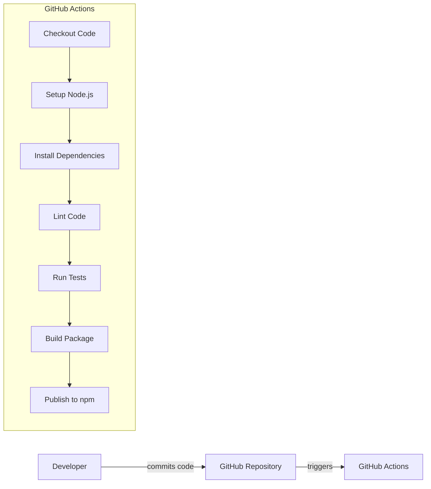

Okay, let's create a design document for the Prettier project, focusing on aspects relevant to threat modeling.

# BUSINESS POSTURE

Prettier is an opinionated code formatter that enforces a consistent style by parsing code and re-printing it with its own rules.  It's widely used across the JavaScript/TypeScript ecosystem and increasingly for other languages.

Priorities and Goals:

*   Maintainability:  Ensure the codebase is easy to understand, modify, and extend.  This is crucial for a community-driven project with many contributors.
*   Consistency: Provide a single, reliable way to format code, eliminating style debates and ensuring uniformity across projects.
*   Extensibility:  Allow for the addition of new languages and formatting options without disrupting the core functionality.
*   Adoption:  Maximize usage within the developer community, becoming the *de facto* standard for code formatting.
*   Performance: Format code quickly and efficiently, even for very large files.
*   Trust: Maintain the trust of the developer community by ensuring the tool does not introduce vulnerabilities or unexpected behavior.

Business Risks:

*   Malicious Code Injection:  The most significant risk is that a compromised version of Prettier (either through a supply chain attack or a direct compromise of the repository) could inject malicious code into projects that use it.  Given Prettier's widespread use, this could have devastating consequences.
*   Denial of Service:  A vulnerability in Prettier could be exploited to cause excessive resource consumption (CPU, memory) when formatting code, effectively causing a denial-of-service attack on build pipelines or developer workstations.
*   Data Exfiltration: While less likely, a compromised version of Prettier could potentially attempt to exfiltrate code or other sensitive data from projects during formatting.
*   Reputational Damage:  Any security incident, even a minor one, could significantly damage Prettier's reputation and lead to a loss of trust within the community.
*   Incorrect Formatting: While not strictly a security risk, incorrect formatting that subtly alters code logic could introduce bugs, potentially leading to security vulnerabilities in the formatted code.

# SECURITY POSTURE

Existing Security Controls:

*   security control: Code Reviews: All changes to the Prettier codebase go through a code review process on GitHub. (Described in the contributing guidelines and enforced by GitHub's pull request system).
*   security control: Testing: Prettier has an extensive test suite that helps ensure the correctness and stability of the formatter. (Described in the contributing guidelines and visible in the repository's test files).
*   security control: Dependency Management: Prettier uses package managers (like npm or yarn) to manage its dependencies. (Visible in `package.json` and `yarn.lock` files).
*   security control: Linting: Prettier uses linters (like ESLint) to enforce code style and identify potential issues. (Configuration files like `.eslintrc.js` are present in the repository).
*   security control: Community Vigilance: The large and active Prettier community acts as an informal security control, as users are likely to report any suspicious behavior or vulnerabilities.

Accepted Risks:

*   accepted risk: Dependency Vulnerabilities:  Like any project with dependencies, Prettier is susceptible to vulnerabilities in its dependencies. While efforts are made to keep dependencies up-to-date, there's always a risk of a zero-day vulnerability in a dependency.
*   accepted risk: Human Error:  Despite code reviews, there's always a risk of human error introducing a vulnerability.

Recommended Security Controls:

*   security control: Software Composition Analysis (SCA): Implement SCA tooling to automatically scan dependencies for known vulnerabilities and generate alerts.
*   security control: Static Application Security Testing (SAST): Integrate SAST tools into the build process to identify potential security vulnerabilities in the Prettier codebase itself.
*   security control: Code Signing: Digitally sign released versions of Prettier to ensure their integrity and authenticity.
*   security control: Two-Factor Authentication (2FA): Enforce 2FA for all maintainers with commit access to the repository.
*   security control: Security.md: Create and maintain a `SECURITY.md` file in the repository to provide clear instructions on how to report security vulnerabilities.
*   security control: Fuzz Testing: Introduce fuzz testing to discover edge cases and potential vulnerabilities that might be missed by traditional testing.

Security Requirements:

*   Authentication: Not directly applicable to Prettier itself, as it's a command-line tool. However, authentication is relevant for accessing the GitHub repository and publishing new releases.
*   Authorization: Not directly applicable to Prettier itself. However, authorization is relevant for managing access to the GitHub repository and its resources.
*   Input Validation: Prettier must handle potentially malformed or malicious input (the code it's formatting) gracefully. It should not crash, enter infinite loops, or execute arbitrary code due to invalid input.
*   Cryptography: Not directly used by Prettier for its core functionality. However, cryptography is relevant for secure communication with the npm registry and for verifying the integrity of downloaded dependencies.

# DESIGN

## C4 CONTEXT



Element Descriptions:

*   Element:
    *   Name: Developer
    *   Type: Person
    *   Description: A software developer who writes code and uses Prettier to format it.
    *   Responsibilities: Writing code, configuring Prettier, running Prettier locally.
    *   Security controls: 2FA for GitHub access, secure coding practices.

*   Element:
    *   Name: CI/CD System
    *   Type: System
    *   Description: A continuous integration/continuous delivery system (e.g., Jenkins, GitHub Actions, CircleCI).
    *   Responsibilities: Automating builds, running tests, deploying code, running Prettier as part of the build process.
    *   Security controls: Access controls, secure configuration, vulnerability scanning.

*   Element:
    *   Name: Code Editor/IDE
    *   Type: System
    *   Description: A software application used by developers to write and edit code (e.g., VS Code, Sublime Text, Atom).
    *   Responsibilities: Providing a user interface for code editing, integrating with tools like Prettier.
    *   Security controls: Regular updates, secure configuration, extension security.

*   Element:
    *   Name: Prettier
    *   Type: System
    *   Description: The Prettier code formatter.
    *   Responsibilities: Parsing code, reformatting code according to its rules, writing formatted code.
    *   Security controls: Code reviews, testing, linting, dependency management, SCA, SAST, fuzz testing.

*   Element:
    *   Name: Package Registry
    *   Type: System
    *   Description: A repository for software packages (e.g., npm registry).
    *   Responsibilities: Storing and distributing Prettier releases.
    *   Security controls: Access controls, vulnerability scanning, package signing.

*   Element:
    *   Name: GitHub Repository
    *   Type: System
    *   Description: The Git repository hosted on GitHub where the Prettier source code is stored.
    *   Responsibilities: Storing the source code, managing issues and pull requests, hosting releases.
    *   Security controls: Access controls, 2FA enforcement, branch protection rules, code review policies.

*   Element:
    *   Name: Formatted Code Repository
    *   Type: System
    *   Description: The Git repository where formatted code is stored.
    *   Responsibilities: Storing the formatted code.
    *   Security controls: Access controls.

## C4 CONTAINER



Element Descriptions:

*   Element:
    *   Name: CLI Interface
    *   Type: Container
    *   Description: The command-line interface for interacting with Prettier.
    *   Responsibilities: Parsing command-line arguments, reading configuration files, reading files to be formatted, invoking the parser and printer, writing formatted files.
    *   Security controls: Input validation, secure handling of command-line arguments.

*   Element:
    *   Name: Parser
    *   Type: Container
    *   Description: The component responsible for parsing the input code into an Abstract Syntax Tree (AST).
    *   Responsibilities: Lexing and parsing the input code, handling different language syntaxes, creating the AST.
    *   Security controls: Input validation, robust parsing logic, fuzz testing.

*   Element:
    *   Name: Printer
    *   Type: Container
    *   Description: The component responsible for converting the AST back into formatted code.
    *   Responsibilities: Traversing the AST, applying formatting rules, generating the output code.
    *   Security controls: Secure handling of the AST, output validation.

*   Element:
    *   Name: Plugin API
    *   Type: Container
    *   Description: The API that allows developers to extend Prettier with support for new languages and formatting options.
    *   Responsibilities: Providing a stable and well-defined interface for plugins, loading and managing plugins.
    *   Security controls: Secure plugin loading, sandboxing of plugins (if possible), input validation.

*   Element:
    *   Name: Configuration
    *   Type: Container
    *   Description: The component responsible for managing Prettier's configuration options.
    *   Responsibilities: Reading configuration files (e.g., `.prettierrc`), providing default configuration values, validating configuration options.
    *   Security controls: Secure handling of configuration files, input validation.

*   Element:
    *   Name: File System
    *   Type: Container
    *   Description: The system's file system.
    *   Responsibilities: Reading and writing files.
    *   Security controls: Operating system file permissions.

## DEPLOYMENT

Possible Deployment Solutions:

1.  Installation via npm/yarn (most common).
2.  Direct download of pre-built binaries (less common).
3.  Building from source (for contributors and advanced users).

Chosen Solution (npm/yarn):

```mermaid
graph LR
    subgraph User's System
        Node_js[Node.js Runtime]
        npm_yarn[npm/yarn]
        Prettier_Installation[Prettier Installation]

        npm_yarn -- downloads from --> Package_Registry[Package Registry (e.g., npm)]
        npm_yarn -- installs --> Prettier_Installation
        Prettier_Installation -- uses --> Node_js
    end
```

Element Descriptions:

*   Element:
    *   Name: Node.js Runtime
    *   Type: Node
    *   Description: The JavaScript runtime environment required to run Prettier.
    *   Responsibilities: Executing JavaScript code.
    *   Security controls: Regular updates, secure configuration.

*   Element:
    *   Name: npm/yarn
    *   Type: Node
    *   Description: Package managers for JavaScript.
    *   Responsibilities: Downloading and installing Prettier and its dependencies.
    *   Security controls: Using verified registries, checking package integrity.

*   Element:
    *   Name: Prettier Installation
    *   Type: Node
    *   Description: The installed Prettier package.
    *   Responsibilities: Providing the Prettier executable and its dependencies.
    *   Security controls: Regular updates, verifying package integrity after installation.

*   Element:
    *   Name: Package Registry (e.g., npm)
    *   Type: Node
    *   Description: The remote registry from which Prettier is downloaded.
    *   Responsibilities: Hosting Prettier packages.
    *   Security controls: Registry security measures, package signing (if available).

## BUILD


Build Process Description:

1.  Developer commits code to the GitHub repository.
2.  GitHub Actions workflow is triggered.
3.  The workflow checks out the code.
4.  The workflow sets up the Node.js environment.
5.  The workflow installs dependencies using yarn.
6.  The workflow runs linters (ESLint) to check code style and identify potential issues.
7.  The workflow runs the test suite.
8.  The workflow builds the Prettier package.
9.  The workflow publishes the package to the npm registry (if a release is being created).

Security Controls in Build Process:

*   security control: Linting (ESLint): Enforces code style and identifies potential security issues.
*   security control: Testing: Ensures the correctness and stability of the code.
*   security control: Dependency Management (yarn): Manages dependencies and their versions.
*   security control: GitHub Actions: Provides a secure and automated build environment.
*   security control: npm Registry: Provides a (relatively) secure platform for distributing the package.

# RISK ASSESSMENT

Critical Business Processes:

*   Code Formatting: The core process of formatting code consistently and reliably.
*   Software Development Lifecycle Integration: Seamless integration into developers' workflows and CI/CD pipelines.
*   Community Engagement: Maintaining a healthy and active community of contributors and users.

Data to Protect:

*   Source Code (Sensitivity: Variable): Prettier processes source code, which can range in sensitivity from public open-source code to highly confidential proprietary code. While Prettier itself doesn't store the code, a compromised version could potentially access and exfiltrate it.
*   Configuration Files (Sensitivity: Low to Medium): Prettier configuration files may contain information about project structure or formatting preferences.
*   npm Credentials (Sensitivity: High): Credentials used to publish Prettier to the npm registry are highly sensitive and must be protected.

# QUESTIONS & ASSUMPTIONS

Questions:

*   What is the specific process for handling security vulnerability reports?
*   Are there any existing security audits or penetration tests performed on Prettier?
*   What is the process for managing and rotating npm publishing credentials?
*   Are there any plans to implement code signing for Prettier releases?
*   What level of sandboxing, if any, is used for Prettier plugins?

Assumptions:

*   BUSINESS POSTURE: The Prettier maintainers prioritize security and are willing to invest in improving it.
*   SECURITY POSTURE: The existing security controls (code reviews, testing, linting) are effectively implemented and maintained.
*   DESIGN: The design diagrams accurately reflect the current architecture of Prettier. The build process described is accurate. The deployment process via npm/yarn is the primary method used by developers.