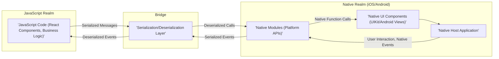
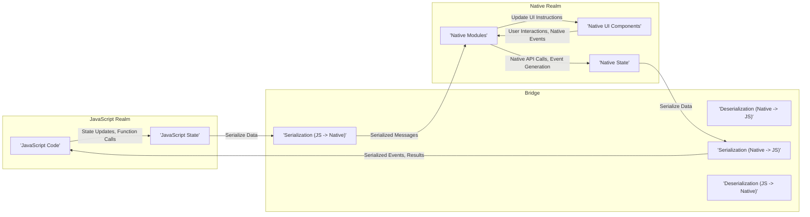

# Project Design Document: React Native

**Version:** 1.1
**Date:** October 26, 2023
**Author:** AI Software Architect

## 1. Introduction

This document provides a detailed architectural overview of the React Native framework, based on the publicly available source code repository at [https://github.com/facebook/react-native](https://github.com/facebook/react-native). This document is intended to serve as a foundation for threat modeling activities, providing a comprehensive understanding of the system's components, interactions, and data flow. This version includes clarifications and expansions based on initial review.

## 2. Goals and Objectives

The primary goal of React Native is to enable developers to build native mobile applications for iOS and Android platforms (and potentially others) using JavaScript and the React library. Key objectives include:

*   **Cross-Platform Development:**  Enable a "learn once, write anywhere" approach, maximizing code reuse across different mobile platforms.
*   **Native Performance:**  Provide a user experience comparable to applications built using platform-specific native languages and UI frameworks.
*   **Developer Productivity:**  Leverage the familiar React paradigm, component-based architecture, and large JavaScript ecosystem to accelerate development.
*   **Hot Reloading (Fast Refresh):**  Allow developers to see code changes reflected in the application almost instantly during development, improving iteration speed.
*   **Extensibility:**  Provide mechanisms for developers to integrate custom native code for accessing platform-specific features or optimizing performance-critical sections.

## 3. High-Level Architecture

The core of React Native architecture revolves around bridging the gap between JavaScript code and native platform components, enabling communication and interaction between these two distinct realms.

**Key Components at a High Level:**

*   **JavaScript Code:** This layer encompasses the application's logic, UI definitions (using React components), and state management. It is executed within a JavaScript engine, typically JavaScriptCore, running in a separate thread.
*   **The Bridge:** This is the crucial communication channel facilitating asynchronous message passing between the JavaScript and native threads. It handles the serialization of JavaScript objects and function calls into a format suitable for native environments and vice versa.
*   **Native Modules:** These are collections of platform-specific code (written in Objective-C/Swift for iOS and Java/Kotlin for Android) that expose native APIs and functionalities to the JavaScript code. They act as interfaces to the underlying operating system and device capabilities.
*   **Native UI Components:** These are the actual user interface elements rendered by the operating system's native UI framework (e.g., `UIView` on iOS, `View` on Android). React Native provides abstractions over these components, allowing developers to manipulate them from JavaScript.
*   **Native Host Application:** This is the container application that embeds the React Native runtime environment and provides the necessary context for the JavaScript code to execute and interact with the native platform.

## 4. Detailed Architecture

A more granular view of the architecture reveals the intricate interplay between various components.

*   **JavaScript Engine (JavaScriptCore):**
    *   Responsible for interpreting and executing the JavaScript code that defines the application's logic and UI.
    *   Provides the runtime environment, including memory management (garbage collection) and standard JavaScript APIs.
    *   Runs on a separate thread, preventing UI blocking during heavy JavaScript processing.
*   **The Bridge (Asynchronous Message Passing with Serialization/Deserialization):**
    *   **Serialization (Marshalling):** Converts JavaScript objects, including function calls and data, into a serializable format (often JSON-like) for transmission across the bridge.
    *   **Deserialization (Unmarshalling):** Converts the serialized messages received from the other side back into native objects or JavaScript objects, allowing for seamless interaction.
    *   **Asynchronous Nature:** Communication is primarily asynchronous to maintain UI responsiveness. Operations in one realm do not block the other.
    *   **Batching:** The bridge often employs batching to optimize communication by grouping multiple messages into a single transmission, reducing overhead.
*   **Native Modules (Platform-Specific Functionality Exposure):**
    *   **Method Exposure:** Native Modules expose specific methods that can be invoked directly from JavaScript code, providing access to native functionalities.
    *   **Event Emitters/Listeners:** Native Modules can emit events that JavaScript code can subscribe to, enabling the native side to notify the JavaScript side of significant occurrences (e.g., sensor data updates, push notifications).
    *   **Lifecycle Management:** Native Modules are managed within the lifecycle of the native application, allowing them to interact with native resources and services.
    *   **Examples:** Modules for accessing the camera, geolocation services, local storage, or performing network requests using native networking libraries.
*   **UI Thread (Main Thread):**
    *   The primary thread responsible for rendering the user interface, handling user interactions (touches, gestures), and ensuring a smooth and responsive user experience.
    *   Receives instructions from the JavaScript thread (via the bridge) on how to update the UI.
    *   Performs the actual rendering of native UI components.
*   **Shadow Tree (Virtual DOM Representation):**
    *   A lightweight, in-memory representation of the UI hierarchy, managed on the JavaScript side.
    *   Changes to the React component tree are first reflected in the shadow tree.
    *   React Native uses a reconciliation process to efficiently compare the current shadow tree with the previous one to determine the minimal set of changes required to update the native UI.
*   **Native UI Components (Platform-Specific Widgets):**
    *   The fundamental building blocks of the user interface, provided by the underlying operating system (e.g., `UIButton`, `UILabel` on iOS; `Button`, `TextView` on Android).
    *   React Native provides a set of cross-platform components that map to their native counterparts, allowing developers to build UIs without writing platform-specific code for basic elements.
*   **Packager (Metro):**
    *   A JavaScript bundler responsible for taking all the JavaScript code, assets (images, fonts), and dependencies of the React Native application and bundling them into one or more JavaScript files that can be executed by the JavaScript engine.
    *   Provides essential development features like hot reloading (or Fast Refresh), allowing developers to see changes in real-time without a full application rebuild.
    *   Serves the bundled JavaScript code to the application during development.

## 5. Key Components and Their Interactions

Understanding how these components interact is crucial for grasping the overall architecture.

1. **JavaScript Code Execution:** The JavaScript engine executes the application's JavaScript code, including React components and business logic.
2. **Initiating Native Functionality:** When JavaScript code needs to access a native feature (e.g., accessing device contacts), it invokes a method on a corresponding Native Module.
3. **Message Serialization via Bridge:** The call to the Native Module method, along with any arguments, is serialized into a JSON-like message by the bridge.
4. **Asynchronous Message Passing:** This serialized message is then asynchronously passed across the bridge to the native side.
5. **Message Deserialization on Native Side:** The native side receives the message and deserializes it, identifying the target Native Module and the specific method to be invoked.
6. **Native Module Execution:** The designated method within the Native Module is executed, interacting with native APIs and potentially performing platform-specific operations.
7. **Returning Results to JavaScript (if applicable):** If the Native Module needs to return data to the JavaScript side (e.g., the list of contacts), the result is serialized by the bridge.
8. **Passing Results Back Across the Bridge:** The serialized result is asynchronously transmitted back to the JavaScript side.
9. **Result Deserialization in JavaScript:** The JavaScript side receives the message and deserializes the result, making it available to the application code.
10. **Updating the UI:** When JavaScript code needs to update the user interface (e.g., displaying new data), it updates the state of React components.
11. **Shadow Tree Update:** These state changes trigger a re-render of the React components, resulting in updates to the shadow tree.
12. **Layout Calculation and Diffing:** React Native calculates the layout based on the updated shadow tree and compares it to the previous state to determine the minimal set of changes required for the native UI.
13. **UI Update Instructions via Bridge:** The necessary UI update instructions (e.g., create, update, or delete specific native UI elements) are serialized and sent to the native side via the bridge.
14. **Native UI Rendering on Main Thread:** The native UI components are updated on the main thread based on the received instructions, resulting in the visual changes on the screen.
15. **Native Events and User Interactions:** User interactions with the native UI (e.g., button presses, scrolling) or other native events (e.g., sensor data changes, push notifications) are captured by the native operating system.
16. **Event Serialization by Native Modules:** Relevant native events are processed by Native Modules, and data related to these events is serialized by the bridge.
17. **Event Passing to JavaScript:** The serialized event data is asynchronously passed back to the JavaScript side via the bridge.
18. **Event Handling in JavaScript:** The JavaScript code receives the event data and handles it, potentially triggering state updates, further actions, or UI modifications.

## 6. Data Flow

Visualizing the data flow helps in understanding how information moves within the React Native architecture.

**Key Data Flow Paths:**

*   **JavaScript to Native (Initiating Actions):** JavaScript code triggers actions that require native functionality by invoking methods on Native Modules. Data associated with these actions is serialized and passed across the bridge.
*   **Native to JavaScript (Returning Results, Emitting Events):** Native Modules communicate results of native operations or notify the JavaScript side of native events. This involves serializing data on the native side and deserializing it on the JavaScript side.
*   **JavaScript to Native (UI Synchronization):** Changes in the JavaScript-managed UI representation (shadow tree) are translated into instructions for updating the actual native UI components. This data flows from JavaScript to native via the bridge.
*   **Native to JavaScript (User Input, System Events):** User interactions with the native UI or system-level events are captured by the native platform and communicated back to the JavaScript side through Native Modules and the bridge.

## 7. Security Considerations (Pre-Threat Modeling)

This section outlines potential security considerations based on the architectural design, serving as a starting point for a more in-depth threat modeling process.

*   **Bridge Security:**
    *   **Data Integrity:**  Ensuring that data transmitted across the bridge is not tampered with or corrupted during transit. Mechanisms to detect and prevent data modification are crucial.
    *   **Data Confidentiality:** Protecting sensitive data exchanged between JavaScript and native code from unauthorized access or interception. Encryption or other secure communication protocols might be necessary for sensitive information.
    *   **Injection Vulnerabilities:**  Preventing the injection of malicious code or data through the bridge. Robust input validation and sanitization on both the JavaScript and native sides are essential.
    *   **Denial of Service:**  Considering potential vulnerabilities that could allow an attacker to flood the bridge with messages, leading to performance degradation or application crashes.
*   **Native Module Security:**
    *   **Vulnerabilities in Native Code:**  Addressing potential security flaws (e.g., buffer overflows, memory leaks) within the implementation of custom Native Modules. Secure coding practices and thorough testing are vital.
    *   **Overexposure of Sensitive APIs:**  Carefully designing Native Modules to avoid exposing sensitive native APIs or functionalities to JavaScript code in an insecure manner. Implement proper authorization and access controls.
    *   **Third-Party Native Modules:**  Scrutinizing the security of third-party Native Modules before integration, as they can introduce vulnerabilities if not properly vetted. Regularly update and monitor dependencies for known security issues.
*   **JavaScript Realm Security:**
    *   **Dependency Vulnerabilities:**  Managing and mitigating security vulnerabilities in JavaScript libraries and dependencies used by the React application. Employing dependency scanning tools and keeping dependencies up-to-date is crucial.
    *   **Code Injection (e.g., Cross-Site Scripting - XSS):**  Preventing the injection of malicious JavaScript code into the application, especially when dealing with dynamic content or user input. Implement proper output encoding and content security policies.
    *   **Secure Data Handling:**  Implementing secure practices for storing and handling sensitive data within the JavaScript realm, considering options like secure storage APIs provided by the native platform.
*   **Communication with External Services:**
    *   **Secure Network Requests:**  Ensuring all communication with external services (APIs, backends) is conducted over secure protocols like HTTPS to protect data in transit.
    *   **API Key and Secret Management:**  Securely managing API keys, authentication tokens, and other secrets. Avoid hardcoding secrets in the codebase and consider using secure storage mechanisms provided by the native platform or dedicated secret management solutions.
*   **Build and Deployment Security:**
    *   **Supply Chain Security:**  Verifying the integrity and authenticity of build tools, dependencies, and the overall build pipeline to prevent the introduction of malicious code.
    *   **Code Signing:**  Properly signing the application package for each platform to ensure its authenticity and prevent tampering after deployment.
*   **Platform-Specific Security Considerations:**
    *   **iOS Security Features:**  Leveraging iOS security features like the Keychain for secure storage of credentials and sensitive data. Adhering to Apple's security guidelines.
    *   **Android Security Features:**  Utilizing Android security features like the Keystore for secure storage and following Android security best practices.
    *   **Permissions Management:**  Carefully requesting and managing platform permissions to minimize the application's attack surface and respect user privacy. Only request necessary permissions and explain their purpose to the user.

## 8. Deployment

Deploying a React Native application involves packaging the JavaScript code and assets within a native application wrapper for each target platform.

*   **iOS Deployment:** The JavaScript bundle and assets are packaged into an `.app` bundle, which is then archived into an `.ipa` file for distribution through the Apple App Store or enterprise distribution channels. This process typically involves using Xcode.
*   **Android Deployment:** The JavaScript bundle and assets are packaged into an `.apk` (Android Package Kit) or `.aab` (Android App Bundle) file for distribution through the Google Play Store or other Android app stores. This process typically involves using Gradle within Android Studio.

The general deployment steps include:

*   **Bundling JavaScript Code and Assets:** Using the Metro bundler to create optimized JavaScript bundles and package assets.
*   **Native Build Process:** Compiling the native parts of the application using platform-specific tools (Xcode for iOS, Gradle for Android).
*   **Code Signing and Provisioning:** Signing the application with appropriate developer certificates and provisioning profiles (for iOS) to ensure authenticity and enable installation on devices.
*   **Distribution:** Uploading the signed application package to the respective app stores or distributing it through other channels (e.g., enterprise distribution).

## 9. Technologies Used

*   **JavaScript (ECMAScript):** The primary programming language for building application logic and UI components.
*   **React:** A declarative JavaScript library for building user interfaces based on a component-based architecture.
*   **JavaScriptCore (or Hermes):** The JavaScript engine that executes the JavaScript code. Hermes is a JavaScript engine optimized for React Native.
*   **Objective-C/Swift (iOS):** The primary native languages used for developing iOS Native Modules and platform-specific code.
*   **Java/Kotlin (Android):** The primary native languages used for developing Android Native Modules and platform-specific code.
*   **Metro:** The default JavaScript bundler for React Native projects.
*   **Xcode (iOS):** The integrated development environment (IDE) used for building, testing, and deploying iOS applications.
*   **Android Studio (Android):** The official IDE for Android app development, used for building, testing, and deploying Android applications.
*   **npm or yarn:** Package managers used for managing JavaScript dependencies.

This improved document provides a more detailed and refined architectural overview of React Native, offering a stronger foundation for subsequent threat modeling activities. The enhanced descriptions, clearer diagrams, and expanded security considerations aim to facilitate a more comprehensive understanding of the framework's intricacies and potential security implications.
