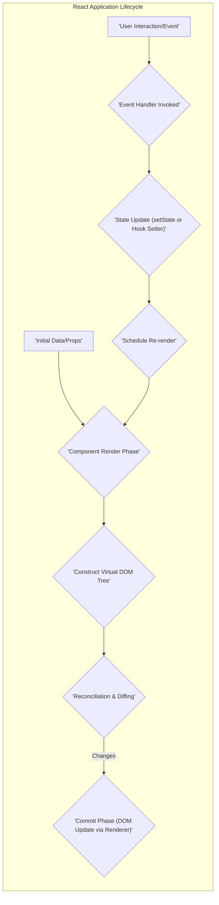

## Project Design Document: React Library (Improved)

**1. Introduction**

This document provides an enhanced design overview of the React JavaScript library, emphasizing architectural details, key component interactions, and data flow. This detailed design serves as a critical input for subsequent threat modeling activities, enabling a comprehensive assessment of potential security vulnerabilities. The document aims to offer a clear and in-depth understanding of React's internal mechanisms and its interactions with external systems.

**2. Project Overview**

React is a declarative, efficient, and flexible open-source JavaScript library designed for building user interfaces (UIs) or UI components. It empowers developers to construct intricate UIs from small, isolated, and reusable pieces of code known as "components." React's primary application lies in the development of single-page applications (SPAs), mobile applications (via React Native), and interactive web applications.

**3. Goals**

* Provide a declarative programming model for describing user interfaces, simplifying development and enhancing predictability.
* Enable highly performant UI updates through the implementation of a virtual DOM, minimizing direct manipulation of the browser's DOM.
* Foster a component-based architecture, promoting code reusability, modularity, and maintainability in large-scale applications.
* Offer a flexible and extensible ecosystem, allowing integration with various libraries and tools to address diverse development needs.

**4. Target Audience**

This document is primarily intended for:

* Security engineers responsible for conducting threat modeling and security assessments of React-based systems.
* Software developers actively working with or contributing to the React library's codebase.
* System architects designing and integrating systems that incorporate React as a front-end technology.

**5. System Architecture**

```mermaid
graph LR
    subgraph "React Core Functionality"
        direction LR
        A["'React' (Core Library)"] --> B["'Virtual DOM' (In-Memory Representation)"];
        B --> C["'Reconciliation Algorithm' (Diffing & Batching)"];
        C --> D["'Renderer' (Platform-Specific)"];
    end
    E["'User-Defined Components'"] --> A;
    F["'Browser DOM' (Actual UI)"] <-- D;
    G["'Browser Events' (User Interactions)"] --> E;
    H["'State Management Libraries' (Optional, e.g., Redux, Zustand)"] -- State Updates --> E;
    I["'Data Fetching Libraries' (Optional, e.g., Fetch API, Axios)"] -- Data Flow --> E;
    J["'JSX Preprocessor'"] -- Transforms --> A;
```

**6. Key Components (Detailed)**

* **React Core (react):** The foundational library providing the essential building blocks and APIs for creating and managing components. It includes the core reconciliation logic and component lifecycle management.
* **Virtual DOM:** An abstract, lightweight representation of the actual browser DOM held in memory. React uses the virtual DOM to efficiently determine the minimal set of changes required to update the real DOM, leading to performance improvements.
* **Reconciliation Algorithm:** The core algorithm responsible for comparing the current virtual DOM with the previous version. This process identifies the differences (diffing) and then batches these changes for efficient updates to the real DOM. Key aspects include:
    * **Diffing:**  Identifying the nodes that have changed, been added, or been removed.
    * **Batching:** Grouping multiple state updates into a single re-render cycle to optimize performance.
* **Renderer (e.g., ReactDOM, React Native):** A platform-specific module responsible for translating the changes determined by the reconciliation algorithm into actual updates to the target environment's UI.
    * **ReactDOM:** The primary renderer for web browsers, manipulating the browser's DOM.
    * **React Native:** A renderer for building native mobile applications on iOS and Android.
* **Components:** The fundamental building blocks of React applications. They encapsulate their own rendering logic, data (state), and behavior.
    * **Function Components:** JavaScript functions that return JSX. They can utilize Hooks to manage state and lifecycle effects.
    * **Class Components:** JavaScript classes that extend `React.Component` and have their own lifecycle methods and state management capabilities.
* **JSX (JavaScript XML):** A syntax extension that allows developers to write HTML-like structures directly within JavaScript code. JSX is transpiled into standard JavaScript function calls that create React elements. This preprocessing step is crucial and a potential area for vulnerabilities if the transpiler itself is compromised or has flaws.
* **Props (Properties):** Immutable data passed from parent components to child components. Props are the primary mechanism for data flow down the component tree.
* **State:** Mutable data that is local to a component and controls its rendering behavior. Changes to a component's state trigger a re-render of that component and its descendants.
* **Hooks:** Functions that enable functional components to access React state and lifecycle features that were previously only available in class components. Common hooks include `useState`, `useEffect`, `useContext`, and `useRef`.
* **Context:** A mechanism to share state and other values between components without explicitly passing props through every level of the component tree, simplifying data sharing in complex applications.

**7. Data Flow (Detailed)**



* **Initial Data/Props:** The application's lifecycle begins with initial data or props being passed to the root component, often from a parent component or an external data source.
* **Component Render Phase:** When a component needs to be rendered (initially or due to state/prop changes), React calls its render function (or the function body for functional components).
* **Construct Virtual DOM Tree:** During the render phase, the component describes its UI structure, resulting in the creation or update of a virtual DOM tree.
* **Reconciliation & Diffing:** React's reconciliation algorithm compares the newly constructed virtual DOM tree with the previous one to identify the minimal set of changes required to update the actual DOM.
* **Commit Phase (DOM Update via Renderer):** The Renderer (e.g., ReactDOM) takes the calculated changes and efficiently updates the browser's DOM to reflect the new UI state.
* **User Interaction/Event:** User interactions within the browser (e.g., clicks, keyboard input, mouse movements) trigger DOM events.
* **Event Handler Invoked:** React attaches event listeners to the virtual DOM, and when an event occurs, the corresponding event handler function defined in the component is invoked.
* **State Update (setState or Hook Setter):** Within the event handler, the component's state can be updated using `setState` (for class components) or state setter functions provided by Hooks (for functional components).
* **Schedule Re-render:** Updating the state triggers a re-render of the component (and potentially its children) to reflect the new data, restarting the cycle from the "Component Render Phase."

**8. External Interactions and Dependencies (Security Implications)**

* **Browser DOM:** React's core function is to manipulate the browser's DOM. Vulnerabilities in React or the application code could lead to unintended DOM manipulations, potentially enabling XSS attacks.
* **Browser Events:** React relies on browser events for user interaction. Improper handling of events or injection of malicious event handlers could lead to security issues.
* **JavaScript Environment:** React operates within a JavaScript environment. Security vulnerabilities in the JavaScript engine or browser can impact React applications.
* **Build Tools (e.g., Webpack, Parcel, Babel):** These tools are crucial for building React applications. Compromised build tools could inject malicious code into the application bundle. Ensure these dependencies are from trusted sources and regularly updated.
* **State Management Libraries (e.g., Redux, Zustand):** While these libraries enhance state management, vulnerabilities in them could expose application state or allow unauthorized modifications.
* **Routing Libraries (e.g., React Router):**  Improperly configured routing can lead to unauthorized access to certain parts of the application. Ensure route definitions are secure and prevent unintended navigation.
* **Data Fetching Libraries (e.g., Fetch API, Axios):**  These libraries handle communication with external APIs. Vulnerabilities in these libraries or insecure API endpoints can lead to data breaches or other security issues. Be mindful of:
    * **Man-in-the-Middle (MITM) attacks:** Ensure HTTPS is used for all API communication.
    * **Cross-Site Request Forgery (CSRF):** Implement appropriate CSRF protection mechanisms.
    * **Server-Side Vulnerabilities:**  React relies on backend APIs. Vulnerabilities on the server-side can be exploited through React applications.
* **UI Libraries (e.g., Material UI, Ant Design):**  Using third-party UI libraries can speed up development, but vulnerabilities in these libraries can introduce security risks. Regularly update and audit these dependencies.

**9. Security Considerations (Detailed)**

* **Cross-Site Scripting (XSS):**  A primary security concern in web applications. React's default behavior of escaping rendered values helps prevent XSS. However, developers must be extremely cautious when using:
    * `dangerouslySetInnerHTML`: Rendering raw HTML from untrusted sources can directly lead to XSS. Avoid this whenever possible.
    * Rendering URLs or content from user input without proper sanitization.
* **Supply Chain Attacks:**  React applications rely on numerous dependencies. Regularly audit and update these dependencies to patch known vulnerabilities. Use tools like `npm audit` or `yarn audit` to identify and address security issues in dependencies. Consider using Software Bill of Materials (SBOMs) for better visibility.
* **Server-Side Rendering (SSR) Vulnerabilities:** If using SSR, ensure the server-side rendering environment is secure. Pay attention to potential injection vulnerabilities or insecure data handling on the server.
* **Client-Side Logic Vulnerabilities:**  Bugs in component logic, state management, or event handling can lead to unexpected behavior that attackers might exploit. Thorough testing and code reviews are crucial.
* **Denial of Service (DoS):**  While React itself doesn't inherently introduce many DoS vectors, inefficient rendering logic, excessive re-renders, or large data processing on the client-side can impact performance and potentially lead to client-side DoS.
* **Data Handling:**
    * **Sensitive Data Exposure:** Avoid storing sensitive information in client-side state or local storage if possible. If necessary, encrypt the data.
    * **Input Validation:**  Validate all user inputs on the client-side and, more importantly, on the server-side to prevent injection attacks and data corruption.
* **Third-Party Integrations:** Carefully evaluate the security posture of any third-party services or APIs integrated with the React application. Follow security best practices for API authentication and authorization.

**10. Deployment**

React applications are typically deployed as static assets (HTML, CSS, JavaScript bundles, and potentially media files). Common deployment strategies include:

* **Static Site Hosting:** Deploying the bundled application to services like Netlify, Vercel, or AWS S3.
* **Content Delivery Networks (CDNs):** Serving static assets via CDNs for improved performance and scalability.
* **Server-Side Rendering (SSR):** Deploying a Node.js server (or similar environment) to pre-render the initial HTML on the server, improving initial load times and SEO. This requires careful security considerations for the server environment.

**11. Future Considerations**

* **React Server Components:**  This emerging feature allows components to render on the server, potentially reducing the amount of JavaScript sent to the client and improving performance. Understanding the security implications of server-side component rendering will be crucial.
* **Continued Evolution of Hooks and APIs:**  As React evolves, new features and APIs are introduced. Continuously assess the security implications of these new features and update security practices accordingly.
* **Improved Tooling for Security Analysis:**  The React ecosystem may see the development of more specialized tools for static analysis and security auditing of React code.

This improved design document provides a more detailed and security-focused overview of the React library. This enhanced understanding is essential for conducting thorough threat modeling and building secure React applications.