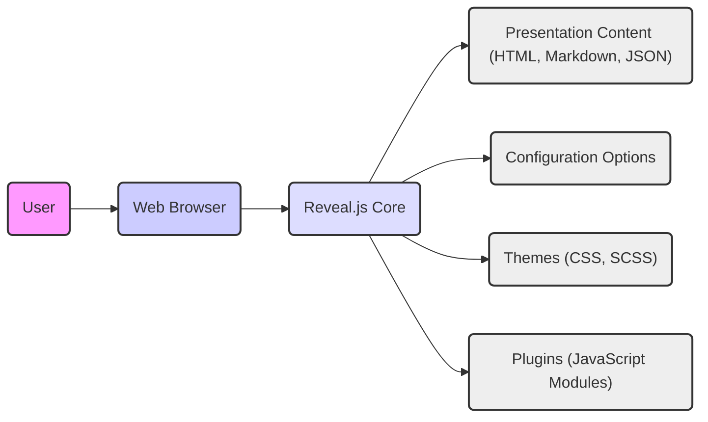

## Project Design Document: Reveal.js Presentation Framework (Improved)

**1. Introduction**

This document provides an enhanced design overview of the Reveal.js presentation framework, an open-source tool enabling the creation of HTML-based presentations. This detailed description is specifically intended to serve as a foundation for subsequent threat modeling activities, offering a comprehensive understanding of the system's architecture, components, data flow, and inherent security considerations.

**2. Goals and Objectives**

The core objective of Reveal.js is to empower users to develop engaging and interactive presentations leveraging standard web technologies (HTML, CSS, and JavaScript). Key design goals include:

* **Simplified Presentation Creation:**  Offering an accessible and straightforward method for authoring presentations.
* **Extensive Customization Capabilities:**  Providing deep customization options for visual styling and interactive behaviors.
* **Responsive Design:** Ensuring presentations render correctly and adapt seamlessly across various screen sizes and devices.
* **Plugin-Based Extensibility:**  Facilitating the addition of new features and functionalities through a robust plugin architecture.
* **Adherence to Accessibility Standards:**  Supporting accessibility best practices to ensure inclusivity for a wider audience.

**3. System Architecture**

Reveal.js employs a client-side architecture, meaning the presentation logic and rendering are executed entirely within the user's web browser.

* **High-Level Architecture:**

* **Detailed Component Breakdown:**

    * **User:** The individual viewing and interacting with the presentation through a web browser.
    * **Web Browser:** The software application (e.g., Chrome, Firefox, Safari, Edge) responsible for interpreting and executing the presentation code. This includes the browser's JavaScript engine, rendering engine, and DOM manipulation capabilities.
    * **Reveal.js Core:** The primary JavaScript library (`reveal.js`) that orchestrates the presentation logic. Key responsibilities include:
        * **Slide Structure Management:**  Organizing and managing the hierarchy of slides and fragments within the presentation.
        * **Navigation Implementation:**  Handling slide transitions triggered by user input (keyboard, mouse, touch).
        * **DOM Rendering and Manipulation:**  Dynamically updating the Document Object Model to display the current slide and its content.
        * **Event Handling System:**  Managing user interactions (clicks, key presses) and internal events within the framework.
        * **Plugin Lifecycle Management:**  Loading, initializing, and managing the execution of registered plugins.
        * **State Management:** Maintaining the current state of the presentation (current slide, zoom level, etc.).
    * **Presentation Content (HTML, Markdown, JSON):** The files containing the actual content displayed in the presentation. This can be structured as:
        * **HTML:** Direct HTML markup defining the structure and content of each slide.
        * **Markdown:** Markdown syntax that is parsed and converted into HTML by Reveal.js (often using a library like `marked.js`).
        * **JSON:**  Data files used by plugins or custom scripts to dynamically generate content.
        * **External Resources:** Links to images, videos, audio files, and other media embedded within the presentation content. These resources are fetched by the browser.
    * **Configuration Options:** JavaScript objects or attributes used to customize the behavior and appearance of the presentation. These options are typically defined within the HTML file or a separate JavaScript file and include settings for:
        * **Transition Effects:**  Specifying the animation style used when moving between slides.
        * **User Interface Controls:**  Enabling or disabling elements like navigation arrows, progress bars, and slide number indicators.
        * **Keyboard Bindings:**  Customizing keyboard shortcuts for navigation and other actions.
        * **Plugin-Specific Settings:**  Configuration options for individual plugins.
        * **Presentation Layout:**  Settings related to slide dimensions, margins, and overall layout.
    * **Themes (CSS, SCSS):** Stylesheets that define the visual aesthetics of the presentation. Themes control:
        * **Typography:** Font styles, sizes, and line heights for text elements.
        * **Color Palette:**  Defining the primary and secondary colors used throughout the presentation.
        * **Layout and Spacing:**  Controlling the positioning and spacing of elements on each slide.
        * **Transition Visuals:**  Visual aspects of slide transition animations.
        * **Customization via SCSS:** Some themes utilize SCSS (Sassy CSS) for more advanced styling and variable management, requiring pre-processing.
    * **Plugins (JavaScript Modules):** Optional JavaScript modules that extend the core functionality of Reveal.js. Examples include:
        * **Speaker Notes:**  Allowing presenters to view and manage speaker notes.
        * **Search Functionality:**  Enabling users to search for specific text within the presentation.
        * **Zoom Controls:**  Providing zoom in/out functionality for detailed content.
        * **Mathematical Equation Rendering:**  Integrating libraries like MathJax or KaTeX to display mathematical formulas.
        * **Remote Control Capabilities:**  Allowing control of the presentation from a separate device.
        * **Chalkboard/Drawing Tools:** Enabling on-screen annotations during the presentation.

**4. Data Flow**

The typical data flow for rendering and interacting with a Reveal.js presentation proceeds as follows:

1. **User Initiates Request:** The user opens an HTML file containing the Reveal.js framework and presentation content via a web browser (either locally or through a web server).
2. **Resource Loading and Parsing:** The web browser fetches and parses the HTML file. It then initiates requests for associated resources specified in the HTML, including:
    * `reveal.js` core JavaScript library (`reveal.js`).
    * CSS files for the selected theme and base styles (`theme.css`, `reveal.css`).
    * Presentation content files (HTML or Markdown). If Markdown is used, a Markdown parser script is also loaded.
    * Configuration scripts containing presentation settings.
    * Any registered plugin JavaScript files.
    * External media resources (images, videos, audio).
3. **Reveal.js Initialization:** Once the core `reveal.js` script is loaded and executed, it initializes the presentation. This involves:
    * Parsing the HTML structure to identify slide elements (typically using `<section>` tags).
    * Processing Markdown content (if present) into HTML.
    * Applying the styles defined in the loaded CSS themes.
    * Reading and applying the specified configuration options.
    * Initializing and configuring any enabled plugins, potentially loading additional resources required by the plugins.
4. **Initial Rendering:** The browser's rendering engine processes the HTML, CSS, and JavaScript to display the initial slide of the presentation.
5. **User Interaction and Event Handling:** The user interacts with the presentation through various input methods:
    * **Keyboard Input:** Pressing keys like arrow keys, spacebar, Enter, etc., to navigate between slides or trigger actions.
    * **Mouse Clicks:** Clicking on navigation controls, links, or interactive elements within the slides.
    * **Touch Gestures:** Swiping or tapping on touch-enabled devices to navigate.
6. **Event Capture and Processing:** The browser captures these user interactions, and Reveal.js's event handling system intercepts and processes them.
7. **State Update and DOM Manipulation:** Based on the user interaction, Reveal.js updates the presentation's internal state (e.g., the current slide index). It then manipulates the DOM to reflect these changes, such as:
    * Transitioning to the next or previous slide by showing/hiding slide elements.
    * Revealing or hiding fragments within a slide.
    * Triggering animations or other visual effects.
    * Invoking plugin functionalities based on the interaction.
8. **Re-rendering:** The browser re-renders the affected parts of the presentation based on the DOM updates, displaying the new slide or updated content.

**5. Security Considerations**

Given its client-side nature and reliance on web technologies, Reveal.js presents several security considerations relevant for threat modeling:

* **Cross-Site Scripting (XSS) Vulnerabilities:**
    * **Risk:** If presentation content originates from untrusted sources or allows user-generated content without proper sanitization, malicious JavaScript code can be injected and executed within the user's browser, potentially leading to data theft, session hijacking, or other malicious actions.
    * **Mitigation:**
        * **Strict Content Source Control:**  Thoroughly vet the sources of presentation content.
        * **Input Sanitization:**  Sanitize any user-provided input before rendering it within the presentation. Employ context-aware output encoding.
        * **Content Security Policy (CSP):** Implement a strict CSP header to control the resources the browser is allowed to load, mitigating the impact of injected scripts.
* **Content Security Policy (CSP) Bypasses:**
    * **Risk:**  A poorly configured or overly permissive CSP can be circumvented by attackers, allowing them to inject malicious scripts despite the intended protection.
    * **Mitigation:**
        * **Principle of Least Privilege:**  Define a restrictive CSP that only allows necessary resources.
        * **Regular Review and Updates:**  Periodically review and update the CSP to address new bypass techniques and ensure it remains effective.
        * **Nonce or Hash-Based CSP:**  Utilize nonces or hashes for script and style tags to further restrict execution to trusted code.
* **Dependency Vulnerabilities:**
    * **Risk:** Reveal.js relies on third-party JavaScript libraries (e.g., for Markdown parsing) and potentially user-added plugins. These dependencies may contain known security vulnerabilities.
    * **Mitigation:**
        * **Regular Updates:** Keep Reveal.js and all its dependencies updated to the latest versions to patch known vulnerabilities.
        * **Dependency Scanning:**  Use automated dependency scanning tools to identify and address potential vulnerabilities in the project's dependencies.
        * **Software Composition Analysis (SCA):** Implement SCA practices to manage and monitor open-source dependencies.
* **Third-Party Plugin Risks:**
    * **Risk:** Plugins developed by external parties may contain security flaws or malicious code that could compromise the security of the presentation.
    * **Mitigation:**
        * **Careful Plugin Selection:**  Thoroughly evaluate the security and trustworthiness of third-party plugins before using them. Consider the plugin's popularity, maintainership, and security track record.
        * **Plugin Updates:** Keep all installed plugins updated to their latest versions.
        * **Sandboxing (Limited):** While browser sandboxing offers some protection, it's not a complete solution against malicious plugin code.
* **Exposure of Sensitive Information:**
    * **Risk:**  Accidentally embedding sensitive data (e.g., API keys, credentials, internal URLs) directly within the presentation content, configuration files, or plugin code.
    * **Mitigation:**
        * **Avoid Hardcoding Secrets:**  Never embed sensitive information directly in the codebase.
        * **Environment Variables:**  Utilize environment variables or secure configuration management techniques to handle sensitive data.
        * **Regular Code Reviews:** Conduct code reviews to identify and remove any inadvertently included sensitive information.
* **Clickjacking Attacks:**
    * **Risk:** An attacker could embed the Reveal.js presentation within a malicious website using an `<iframe>` and trick users into performing unintended actions by overlaying deceptive UI elements.
    * **Mitigation:**
        * **X-Frame-Options Header:**  Set the `X-Frame-Options` header to `DENY` or `SAMEORIGIN` to prevent the presentation from being embedded in frames from other domains.
        * **Content Security Policy (frame-ancestors):**  Use the `frame-ancestors` directive in the CSP header to specify which origins are allowed to embed the presentation.
* **Cross-Site Request Forgery (CSRF):**
    * **Risk:** While primarily a concern for server-side applications, if the Reveal.js presentation interacts with backend services (e.g., for saving presentation progress or fetching dynamic data), CSRF vulnerabilities could exist in those interactions.
    * **Mitigation:**
        * **Anti-CSRF Tokens:** Implement CSRF protection mechanisms, such as synchronizer tokens, for any requests made to backend services.
        * **SameSite Cookie Attribute:**  Utilize the `SameSite` attribute for cookies to mitigate CSRF attacks.
* **Denial of Service (DoS) Attacks (Client-Side):**
    * **Risk:**  Maliciously crafted presentation content with excessive animations, extremely large media files, or computationally intensive JavaScript could potentially overload the user's browser, leading to a denial of service.
    * **Mitigation:**
        * **Content Optimization:**  Optimize presentation content for performance. Limit the use of heavy animations and large, unoptimized media files.
        * **Resource Limits:** If hosting the presentation on a server, implement resource limits to prevent a single presentation from consuming excessive resources.
        * **Input Validation:** If the presentation accepts user input that influences rendering, validate and sanitize this input to prevent resource exhaustion.

**6. Deployment Considerations**

Reveal.js presentations are typically deployed as static web assets. Common deployment strategies include:

* **Static File Hosting:** Deploying the presentation files (HTML, CSS, JavaScript, media) on standard web servers (e.g., Apache, Nginx) or cloud storage services (e.g., AWS S3, Google Cloud Storage, Azure Blob Storage) configured for static website hosting.
* **Content Delivery Networks (CDNs):**  Leveraging CDNs to serve the Reveal.js library and presentation assets, improving performance and availability by caching content geographically closer to users.
* **Integration within Web Applications:** Embedding Reveal.js presentations within larger web applications, potentially served from the application's existing infrastructure.
* **Local File System Access:**  Users can directly open the HTML file from their local file system, although this limits accessibility and sharing.

The chosen deployment method significantly impacts the attack surface and security considerations. For instance, using a public CDN introduces reliance on the CDN provider's security measures.

**7. Technologies Used**

* **Core Technologies:**
    * HTML5 (for structuring content)
    * CSS3 (for styling and visual presentation)
    * JavaScript (for core functionality and interactivity)
* **Optional Dependencies (depending on features and plugins):**
    * Markdown Parsers (e.g., `marked.js`)
    * Math Rendering Libraries (e.g., MathJax, KaTeX)
    * Syntax Highlighting Libraries (e.g., highlight.js, Prism.js)
    * Various JavaScript libraries for specific plugin functionalities.

**8. Future Considerations**

* **Enhanced Built-in Security Features:** Exploring the feasibility of incorporating more robust security features directly into the Reveal.js core, such as stricter default CSP configurations or built-in input sanitization helpers.
* **Improved Accessibility Guidance and Tools:**  Providing more comprehensive documentation and tools to assist presentation authors in creating accessible content.
* **Performance Enhancements:**  Continuously optimizing the framework for faster loading times and smoother rendering, especially for complex presentations.
* **Standardized Plugin Security Guidelines:**  Developing and promoting security best practices for plugin developers to minimize vulnerabilities in the plugin ecosystem.

This improved design document provides a more in-depth understanding of the Reveal.js framework, specifically tailored for threat modeling purposes. By detailing the architecture, data flow, and potential security vulnerabilities, this document serves as a valuable resource for identifying and mitigating risks associated with the use and deployment of Reveal.js presentations.