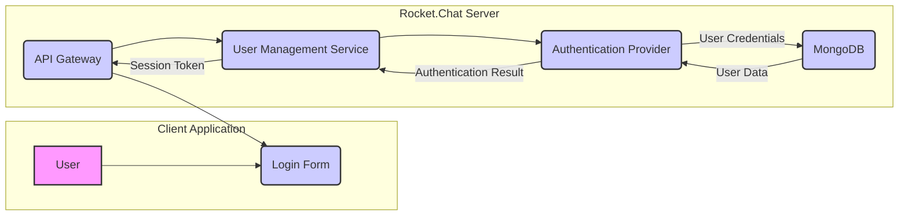
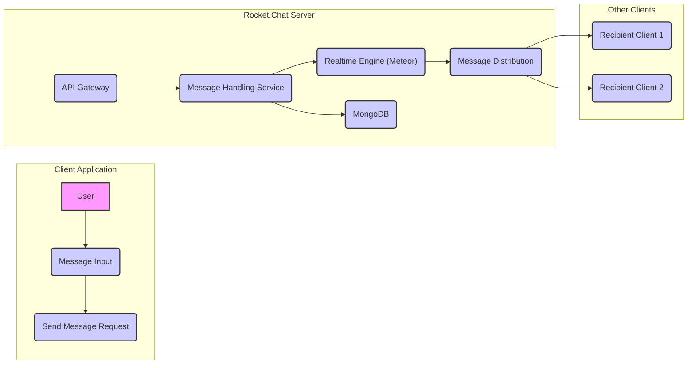
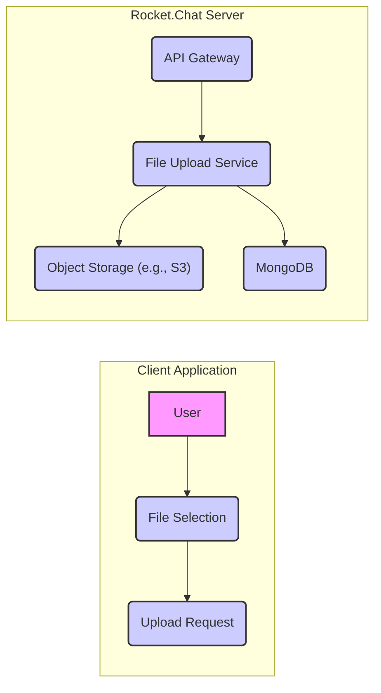
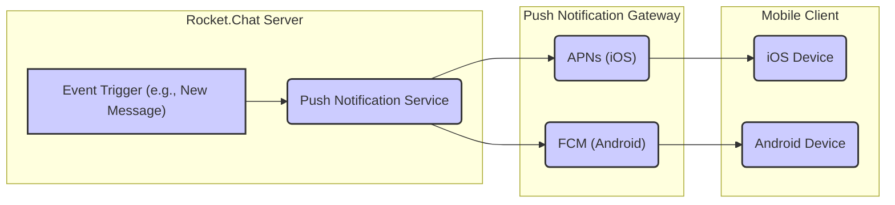

# Project Design Document: Rocket.Chat

**Version:** 1.1
**Date:** October 26, 2023
**Author:** AI Software Architect

## 1. Introduction

This document provides an enhanced architectural overview of the Rocket.Chat platform, an open-source team communication platform. This revised document aims to provide a more detailed and comprehensive foundation for subsequent threat modeling activities. It elaborates on the key components, their interactions, and the data flow within the system, offering greater clarity and specificity.

## 2. Goals

*   Provide a more detailed and comprehensive architectural description of Rocket.Chat.
*   Clearly identify the responsibilities and functionalities of each key component.
*   Illustrate the data flow within the system for common use cases with greater precision.
*   Highlight potential areas of security concern with more specific examples for future threat modeling.

## 3. Scope

This document covers the core architecture of a typical Rocket.Chat deployment, including:

*   Client applications (web, desktop, mobile) and their primary functions.
*   The Rocket.Chat server, detailing its internal services and their roles.
*   The underlying database and its data storage responsibilities.
*   Key supporting services like push notifications and object storage, including their interaction with the core server.
*   Common integration points and their interaction patterns.

This document still does not cover:

*   Specific deployment configurations (e.g., Kubernetes, Docker) beyond their general impact on infrastructure.
*   Detailed implementation specifics of individual modules' code.
*   Third-party integrations in exhaustive detail, focusing on their interaction boundaries and data exchange.

## 4. Target Audience

*   Security engineers and architects tasked with performing threat modeling and security assessments.
*   Development teams involved in building, maintaining, or integrating with Rocket.Chat.
*   Operations teams responsible for the deployment, configuration, and ongoing management of Rocket.Chat instances.

## 5. Architectural Overview

Rocket.Chat is a real-time communication platform designed for team collaboration. It employs a modular architecture, with the central Rocket.Chat server orchestrating various services. It facilitates communication through features like channels, direct messages, audio/video conferencing, and file sharing. The Rocket.Chat server is the central hub, responsible for routing messages, managing users and permissions, and coordinating interactions between different parts of the system.

## 6. Key Components

*   **Client Applications:**
    *   **Web Browser Client:** A JavaScript-based application providing the primary user interface, handling message rendering, user interaction, and real-time updates via WebSockets.
    *   **Desktop Applications (Electron-based):**  Native applications built using Electron, wrapping the web client for a desktop experience, potentially offering OS-level integrations like notifications.
    *   **Mobile Applications (Native iOS and Android):**  Platform-specific applications providing mobile access, leveraging native UI components and push notification capabilities.
    *   **Command Line Interface (CLI):**  A tool for administrators and developers to interact with the server programmatically, performing tasks like user management or data migration.

*   **Rocket.Chat Server:**
    *   **API Gateway:** The single entry point for all client requests. It handles routing requests to the appropriate internal services, performs initial authentication and authorization checks, and may handle rate limiting.
    *   **Realtime Engine (Meteor):**  Manages real-time communication using WebSockets (or potentially other protocols). It's responsible for broadcasting new messages, presence updates, and other real-time events to connected clients.
    *   **Message Handling Service:**  Processes incoming messages, stores them in the database, handles message editing and deletion requests, and manages message history retrieval.
    *   **User Management Service:**  Manages user accounts, including registration, login, password management, profile updates, and role-based access control.
    *   **Channel Management Service:**  Handles the creation, management, and access control of channels (public and private) and direct message conversations. This includes managing channel membership and permissions.
    *   **File Upload Service:**  Manages the process of uploading files, interacting with object storage for persistent storage, and storing file metadata in the database. It may also handle file previews and transformations.
    *   **Integration Service:**  Facilitates integrations with external applications and services through mechanisms like webhooks (for outbound events) and REST APIs (for inbound commands). It also manages OAuth authentication for third-party applications.
    *   **Administration Service:**  Provides administrative interfaces and APIs for server configuration, user and channel management, monitoring server health, and managing integrations.
    *   **Push Notification Service:**  Manages the delivery of push notifications to mobile clients via platform-specific gateways (APNs for iOS, FCM for Android). It handles device token registration and notification payload creation.

*   **Database:**
    *   **MongoDB:**  A NoSQL document database serving as the primary data store for messages, user profiles, channel information, settings, and other persistent data.

*   **Object Storage:**
    *   Typically a cloud-based object storage service (e.g., AWS S3, Google Cloud Storage, Azure Blob Storage) or a local file system used for storing uploaded files, offloading file storage from the main database.

*   **Push Notification Gateway:**
    *   Platform-specific services like **Firebase Cloud Messaging (FCM)** for Android devices and **Apple Push Notification service (APNs)** for iOS devices, responsible for delivering push notifications to the respective mobile operating systems.

## 7. Data Flow Diagrams

### 7.1 User Login

*   The "User" interacts with the "Login Form" within the "Client Application", providing their credentials.
*   The "Login Form" sends the user's credentials to the "API Gateway" on the "Rocket.Chat Server" via an HTTPS request.
*   The "API Gateway" routes the authentication request to the "User Management Service".
*   The "User Management Service" delegates the authentication process to the "Authentication Provider".
*   The "Authentication Provider" retrieves the stored "User Data" (e.g., hashed password) from "MongoDB" using the provided username.
*   The "Authentication Provider" compares the provided credentials with the stored "User Data".
*   The "Authentication Provider" returns the "Authentication Result" (success or failure) to the "User Management Service".
*   Upon successful authentication, the "User Management Service" generates a "Session Token" (e.g., a JWT) and sends it back to the "API Gateway".
*   The "API Gateway" returns the "Session Token" to the "Client Application", which will use it for subsequent requests.

### 7.2 Sending a Message

*   The "User" composes a message in the "Message Input" area of the "Client Application".
*   The "Client Application" sends a "Send Message Request" (containing the message content, recipient information, etc.) to the "API Gateway" on the "Rocket.Chat Server".
*   The "API Gateway" routes the request to the "Message Handling Service".
*   The "Message Handling Service" performs actions like sanitizing the message content and storing the message persistently in "MongoDB".
*   The "Message Handling Service" then pushes the new message to the "Realtime Engine (Meteor)".
*   The "Realtime Engine (Meteor)"'s "Message Distribution" component identifies the recipients of the message.
*   The "Realtime Engine (Meteor)" sends the message in real-time to the connected "Recipient Client 1" and "Recipient Client 2" (and any other recipients) via their established WebSocket connections.

### 7.3 File Upload

*   The "User" selects a file for upload using the "File Selection" interface in the "Client Application".
*   The "Client Application" initiates an "Upload Request" to the "API Gateway" on the "Rocket.Chat Server", typically using a multipart form data request.
*   The "API Gateway" routes the file upload request to the "File Upload Service".
*   The "File Upload Service" handles the transfer of the file to the designated "Object Storage (e.g., S3)". This might involve pre-signed URLs for direct uploads.
*   Once the file is successfully stored, the "File Upload Service" stores metadata about the uploaded file (e.g., filename, size, storage location) in "MongoDB".

### 7.4 Push Notification

*   An "Event Trigger (e.g., New Message received by a user who is offline)" occurs on the "Rocket.Chat Server".
*   The "Push Notification Service" identifies the target mobile devices based on user preferences and device registrations.
*   The "Push Notification Service" constructs the appropriate notification payload for each platform (APNs for iOS, FCM for Android).
*   The "Push Notification Service" sends the notifications to the respective "APNs (iOS)" and "FCM (Android)" gateways.
*   The push notification gateways then deliver the notifications to the corresponding "iOS Device" and "Android Device".

## 8. Security Considerations

This section provides more specific examples of potential security concerns based on the architecture described. These areas will require detailed examination during the threat modeling process.

*   **Authentication and Authorization:**
    *   **Credential Stuffing/Brute Force:**  Vulnerability to attacks attempting to guess user credentials.
    *   **Session Hijacking:**  Risk of attackers stealing or intercepting session tokens to gain unauthorized access.
    *   **Insufficient Authorization Checks:**  Potential for users to access resources or perform actions they are not permitted to.
    *   **OAuth Misconfiguration:**  Security risks associated with improperly configured OAuth flows for third-party integrations.

*   **Data Security:**
    *   **Man-in-the-Middle Attacks:**  Risk of eavesdropping on communication if TLS/HTTPS is not properly implemented or configured.
    *   **Database Injection Attacks (NoSQL Injection):**  Potential for attackers to manipulate database queries if input validation is insufficient.
    *   **Data Breach (Database or Object Storage):**  Risk of unauthorized access to sensitive data stored in the database or object storage.
    *   **Exposure of Sensitive Data in Logs:**  Accidental logging of sensitive information.

*   **Input Validation:**
    *   **Cross-Site Scripting (XSS):**  Vulnerability allowing attackers to inject malicious scripts into web pages viewed by other users.
    *   **Cross-Site Request Forgery (CSRF):**  Risk of attackers forcing logged-in users to perform unintended actions.
    *   **Command Injection:**  Potential for attackers to execute arbitrary commands on the server if user input is not properly sanitized.

*   **Rate Limiting:**
    *   **Denial of Service (DoS) Attacks:**  Vulnerability to attacks that overwhelm the server with excessive requests.
    *   **Abuse of API Endpoints:**  Potential for malicious actors to excessively use API endpoints for unintended purposes.

*   **Dependency Management:**
    *   **Vulnerable Dependencies:**  Risk of introducing known vulnerabilities through outdated or insecure third-party libraries.

*   **Infrastructure Security:**
    *   **Unsecured Server Configurations:**  Vulnerabilities arising from misconfigured firewalls, open ports, or default credentials.
    *   **Lack of Access Controls:**  Insufficient restrictions on who can access server infrastructure.

*   **Push Notification Security:**
    *   **Push Notification Spoofing:**  Potential for attackers to send fake push notifications.
    *   **Exposure of Sensitive Information in Notifications:**  Accidental inclusion of sensitive data in notification payloads.

*   **File Upload Security:**
    *   **Malware Uploads:**  Risk of users uploading malicious files that could compromise the server or other users.
    *   **Unrestricted File Types:**  Potential for users to upload file types that could be exploited.
    *   **Insecure File Storage Permissions:**  Risk of unauthorized access to uploaded files.

*   **Integration Security:**
    *   **Webhook Security:**  Ensuring the authenticity and integrity of webhook requests.
    *   **API Key Management:**  Secure storage and handling of API keys used for integrations.
    *   **Data Validation from Integrations:**  Properly validating data received from external systems to prevent vulnerabilities.

## 9. Assumptions and Constraints

*   This document assumes a typical self-hosted deployment of Rocket.Chat utilizing MongoDB as its primary database and potentially a separate object storage service.
*   The focus remains on the core functionalities and common integration patterns, without delving into the specifics of every available plugin or customization.
*   Security considerations are presented at a higher level and serve as a starting point for more granular threat modeling exercises.

## 10. Future Considerations

*   Detailed design specifications for individual microservices within the Rocket.Chat server, including their specific APIs and data models.
*   Security architecture considerations for specific features like end-to-end encryption for messages and secure audio/video conferencing.
*   Analysis of different deployment models, such as cloud-hosted Rocket.Chat offerings, and their unique security implications.
*   Detailed integration patterns with various identity providers using protocols like SAML or OpenID Connect.
*   Consideration of security best practices for handling personally identifiable information (PII) and compliance with relevant regulations.

This improved document provides a more detailed and nuanced understanding of the Rocket.Chat architecture, offering a stronger foundation for comprehensive threat modeling and security analysis.