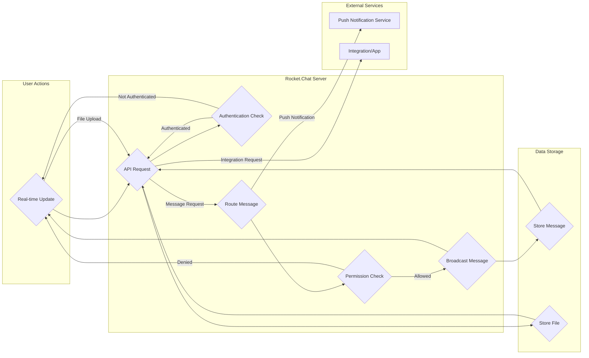

## Project Design Document: Rocket.Chat

**1. Introduction**

This document provides a high-level design overview of the Rocket.Chat open-source communication platform. It aims to provide a clear understanding of the system's architecture, key components, and data flow, serving as a foundation for subsequent threat modeling activities. This document focuses on the core functionalities and infrastructure of a typical Rocket.Chat deployment.

**2. Goals**

*   Describe the overall architecture of Rocket.Chat.
*   Identify key components and their interactions.
*   Outline the primary data flows within the system.
*   Provide a basis for identifying potential security threats and vulnerabilities.

**3. Target Audience**

This document is intended for:

*   Security engineers and architects responsible for threat modeling.
*   Development teams involved in maintaining and extending Rocket.Chat.
*   Operations teams responsible for deploying and managing Rocket.Chat instances.

**4. System Overview**

Rocket.Chat is a web-based, open-source team collaboration platform offering features similar to Slack or Microsoft Teams. It provides real-time messaging, audio and video conferencing, file sharing, and integrations with other services. A typical deployment involves a server-side application handling core logic and data persistence, and various client applications for user interaction.

**5. Key Components**

*   **Rocket.Chat Server:**
    *   The core application responsible for handling all business logic, including message routing, user authentication, permission management, and real-time communication.
    *   Built using Node.js and often utilizes the Meteor framework.
    *   Exposes APIs for client applications and integrations.
*   **Database:**
    *   Persistent storage for all application data, including user information, messages, channels, settings, and audit logs.
    *   MongoDB is the officially supported and most commonly used database.
*   **Real-time Engine (Omnichannel Livechat):**
    *   Handles real-time communication using WebSockets.
    *   Manages message broadcasting and subscription mechanisms.
*   **Object Storage (GridFS or Cloud Providers like AWS S3, Google Cloud Storage):**
    *   Stores uploaded files and media.
    *   Can be configured to use local storage or cloud-based object storage services.
*   **Push Notification Service (Rocket.Chat Push Gateway, Firebase Cloud Messaging (FCM), Apple Push Notification service (APNs)):**
    *   Delivers push notifications to mobile and desktop clients.
    *   Can be self-hosted or rely on third-party services.
*   **Client Applications:**
    *   **Web Client:** A browser-based interface for accessing Rocket.Chat.
    *   **Desktop Clients (Electron-based):** Native applications for Windows, macOS, and Linux.
    *   **Mobile Clients (Native iOS and Android):** Applications for mobile devices.
    *   **Command Line Interface (CLI):**  Provides a text-based interface for interacting with the server.
*   **Integrations & Apps:**
    *   Mechanisms for extending Rocket.Chat's functionality.
    *   Can be custom-built or use the Rocket.Chat Apps Marketplace.
    *   Interact with the server via APIs.
*   **Authentication Services:**
    *   Handles user authentication and authorization.
    *   Supports various methods, including username/password, OAuth 2.0, LDAP, SAML, and CAS.
*   **Administration Interface:**
    *   A web-based interface for managing the Rocket.Chat server, users, settings, and integrations.

**6. Data Flow**

**Data Flow Description:**

*   **User Login:**
    *   User interacts with a client application.
    *   The client sends authentication credentials to the API Gateway.
    *   The API Gateway forwards the request to the Authentication Service.
    *   The Authentication Service verifies the credentials against the database.
    *   Upon successful authentication, a session token is issued.
*   **Sending a Message:**
    *   User composes and sends a message via a client application.
    *   The client sends the message content to the API Gateway.
    *   The API Gateway routes the message to the Message Handler.
    *   The Message Handler verifies user permissions with the Permission Engine.
    *   If permitted, the message is broadcasted to relevant users via the Real-time Engine.
    *   The message is also stored in the Database.
*   **File Upload:**
    *   User uploads a file through a client application.
    *   The client sends the file to the API Gateway.
    *   The API Gateway stores the file in Object Storage.
    *   Metadata about the file (e.g., location) is stored in the Database.
*   **Receiving a Message:**
    *   The Real-time Engine pushes new messages to subscribed clients via WebSockets.
*   **Push Notifications:**
    *   When a user is offline or the client is in the background, the server sends push notifications via the Push Notification Service.
*   **Integration Interaction:**
    *   Integrations or Apps communicate with the server via the exposed APIs.

**7. Deployment Model**

Rocket.Chat can be deployed in various ways:

*   **Self-Hosted:**
    *   Organizations manage their own infrastructure, including servers, databases, and object storage.
    *   Provides maximum control and customization.
*   **Cloud-Hosted (e.g., Rocket.Chat Cloud):**
    *   Rocket.Chat or third-party providers manage the infrastructure.
    *   Offers ease of deployment and management.
*   **Hybrid:**
    *   A combination of self-hosted and cloud-hosted components. For example, the server might be self-hosted while using a cloud-based object storage service.

**8. Security Considerations (High-Level)**

*   **Authentication and Authorization:** Securely verifying user identities and controlling access to resources.
*   **Data Encryption:** Protecting data at rest (database, object storage) and in transit (HTTPS, WSS).
*   **Input Validation:** Preventing injection attacks by validating user input.
*   **Rate Limiting:** Protecting against denial-of-service attacks.
*   **Content Security Policy (CSP):** Mitigating cross-site scripting (XSS) attacks.
*   **Regular Security Audits and Penetration Testing:** Identifying and addressing potential vulnerabilities.
*   **Dependency Management:** Keeping dependencies up-to-date to patch known security flaws.
*   **Secure Configuration:** Properly configuring the server, database, and other components.
*   **Push Notification Security:** Ensuring the security of the push notification infrastructure.

**9. Future Considerations**

*   Detailed API specifications for threat modeling API interactions.
*   Specific deployment architecture diagrams for different deployment models.
*   Detailed data flow diagrams for specific features (e.g., audio/video conferencing).
*   User roles and permissions model.

This document provides a foundational understanding of the Rocket.Chat architecture. Further analysis and documentation will be required for a comprehensive threat model.
