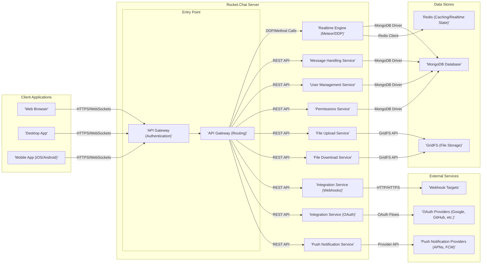

## Project Design Document: Rocket.Chat for Threat Modeling (Improved)

**1. Introduction**

This document provides an enhanced and more detailed design overview of the Rocket.Chat open-source team communication platform (as represented by the GitHub repository: https://github.com/rocketchat/rocket.chat). This document is specifically tailored to facilitate comprehensive threat modeling activities. It meticulously outlines the key components, their interactions with specific communication protocols, detailed data flows, and deployment considerations with a focus on security implications. This granular information is crucial for identifying a wider range of potential security vulnerabilities and designing more effective mitigation strategies.

**2. System Overview**

Rocket.Chat is a multifaceted communication platform offering a rich set of features including team chat, audio and video conferencing, file sharing, and extensive integrations with external services. Its flexible deployment options range from self-hosted installations to cloud-based solutions.

**3. Detailed Design**

This section provides a more granular breakdown of the key components within the Rocket.Chat system, detailing their specific functionalities and communication protocols.

*   **Client Applications:**
    *   **Web Browser:** Users interact with Rocket.Chat through a web interface, communicating with the server primarily via HTTPS for standard requests and WebSockets for real-time communication.
    *   **Desktop App:** Native applications for desktop operating systems (Windows, macOS, Linux) offer a more integrated experience. They communicate with the server using HTTPS and WebSockets, similar to the web browser.
    *   **Mobile App (iOS/Android):** Native mobile applications for iOS and Android platforms. They communicate with the server via HTTPS and WebSockets and rely on platform-specific push notification services.

*   **Rocket.Chat Server:**
    *   **API Gateway (Authentication):**  The initial entry point for all client requests. It is responsible for authenticating users using various methods and verifying authentication tokens before routing requests further.
    *   **API Gateway (Routing):**  After successful authentication, this component routes requests to the appropriate internal services based on the requested endpoint.
    *   **Realtime Engine (Meteor/DDP):**  Provides the core real-time communication infrastructure using the Distributed Data Protocol (DDP) over WebSockets. It manages message broadcasting, user presence updates, and other real-time interactions.
    *   **Message Handling Service:**  Responsible for the processing, sanitization, and storage of messages. This includes handling message formatting (markdown, mentions), validating message content, and persisting messages in the database. It communicates with the database via the MongoDB driver.
    *   **User Management Service:**  Handles user-related operations such as registration, profile management, password resets, and user status updates. It interacts with the database to store and retrieve user information.
    *   **Permissions Service:**  Enforces access control policies, determining whether a user has the necessary permissions to perform specific actions within rooms, channels, or direct messages. It consults the database to evaluate permissions.
    *   **File Upload Service:**  Manages the process of uploading files shared within the platform. It receives files via HTTPS, potentially performs security checks, and stores them using the File Storage Service.
    *   **File Download Service:**  Handles requests to download files. It retrieves files from the File Storage Service and serves them to the client via HTTPS.
    *   **Integration Service (Webhooks):**  Enables Rocket.Chat to send notifications to external systems via HTTP or HTTPS webhooks. It manages the configuration and triggering of webhook events.
    *   **Integration Service (OAuth):**  Facilitates authentication and authorization with third-party applications using the OAuth protocol. It handles the OAuth flow and manages access tokens.
    *   **Push Notification Service:**  Manages the delivery of push notifications to mobile applications. It interacts with push notification providers (APNs for iOS, FCM for Android) using their respective APIs.

*   **Data Stores:**
    *   **MongoDB Database:** The primary persistent data store for Rocket.Chat. It stores user information, messages, channel configurations, settings, and other critical data. Communication occurs via the official MongoDB driver.
    *   **GridFS (File Storage):**  A component of MongoDB specifically used for storing large files, such as images, documents, and videos. The File Upload and Download Services interact with GridFS using its API.
    *   **Redis (Caching/Realtime State):**  Used for caching frequently accessed data to improve performance and potentially for managing real-time state information and message queues. The Realtime Engine interacts with Redis using a Redis client.

*   **External Services:**
    *   **Push Notification Providers (APNs, FCM):**  Third-party services responsible for delivering push notifications to mobile devices. Rocket.Chat's Push Notification Service interacts with these providers via their specific APIs.
    *   **OAuth Providers (Google, GitHub, etc.):**  External identity providers used for user authentication via the OAuth protocol. Rocket.Chat's Integration Service (OAuth) interacts with these providers according to the OAuth specification.
    *   **Webhook Targets:**  External applications or services that receive notifications from Rocket.Chat via HTTP or HTTPS webhooks.

**4. Data Flow (Detailed)**

This section provides a more detailed breakdown of data flow for key operations, highlighting the specific components and protocols involved.

*   **Sending a Message:**
    1. A user composes a message in a client application (Web, Desktop, Mobile).
    2. The client application sends the message content to the **API Gateway (Authentication)** via an HTTPS POST request or a WebSocket message.
    3. The **API Gateway (Authentication)** authenticates the user by verifying their session token or credentials.
    4. The **API Gateway (Routing)** routes the authenticated request to the **Message Handling Service** via an internal API call.
    5. The **Message Handling Service** receives the message, performs sanitization and formatting, and potentially interacts with the **Permissions Service** to verify the user's permission to send messages in the target room/channel.
    6. The **Message Handling Service** stores the message content, metadata (sender, timestamp, room ID), and any associated attachments in the **MongoDB Database**.
    7. The **Realtime Engine (Meteor/DDP)** is notified of the new message (either through database change streams or a direct notification from the Message Handling Service).
    8. The **Realtime Engine** broadcasts the new message to all connected clients in the relevant room/channel via WebSocket DDP messages.
    9. If the recipient is offline or has notifications enabled, the **Push Notification Service** is triggered.
    10. The **Push Notification Service** retrieves the recipient's device tokens from the **MongoDB Database**.
    11. The **Push Notification Service** sends a push notification containing a message summary to the appropriate **Push Notification Providers (APNs/FCM)** via their respective APIs.
    12. The **Push Notification Providers** deliver the notification to the recipient's device.

*   **User Authentication (OAuth with Google):**
    1. The user initiates the login process via the "Login with Google" button in a client application.
    2. The client application redirects the user's browser to the **API Gateway (Routing)**, initiating the OAuth flow.
    3. The **API Gateway (Routing)** redirects the user to the **OAuth Providers (Google)** authorization endpoint.
    4. The user authenticates with Google and grants Rocket.Chat the requested permissions.
    5. Google redirects the user back to the **Integration Service (OAuth)** in Rocket.Chat with an authorization code.
    6. The **Integration Service (OAuth)** exchanges the authorization code for an access token from Google.
    7. The **Integration Service (OAuth)** retrieves the user's profile information from Google using the access token.
    8. The **User Management Service** either finds an existing user matching the Google profile or creates a new user account in the **MongoDB Database**.
    9. The **Authentication Service** generates a session token for the logged-in user.
    10. The session token is returned to the client application, typically via a cookie or local storage.

*   **File Upload:**
    1. A user selects a file to upload in a client application.
    2. The client application sends the file to the **API Gateway (Authentication)** via an HTTPS POST request to the File Upload Service endpoint.
    3. The **API Gateway (Authentication)** authenticates the user.
    4. The **API Gateway (Routing)** routes the request to the **File Upload Service**.
    5. The **File Upload Service** may perform security checks (e.g., anti-virus scanning, file type validation).
    6. The **File Upload Service** stores the file content in **GridFS**.
    7. The **File Upload Service** stores metadata about the file (filename, size, MIME type, user ID) in the **MongoDB Database**.
    8. The **File Upload Service** returns a file ID or URL to the client application.
    9. The client application can then send a message containing a link or reference to the uploaded file, following the message sending data flow.

**5. Security Considerations (Detailed)**

This section expands on the initial security considerations, providing more specific examples of potential threats and vulnerabilities.

*   **Authentication and Authorization:**
    *   **Threats:** Brute-force attacks on login forms, credential stuffing, session hijacking, insecure storage of credentials in the database, privilege escalation.
    *   **Considerations:** Implement strong password policies, rate limiting on login attempts, multi-factor authentication (MFA), secure storage of password hashes with salt, regular security audits of authentication mechanisms, proper session management (secure cookies, expiration).
*   **Data Security:**
    *   **Threats:** Data breaches due to unauthorized access to the database or file storage, man-in-the-middle attacks intercepting sensitive data in transit, cross-site scripting (XSS) attacks, SQL injection attacks.
    *   **Considerations:** Implement encryption at rest for the database and file storage, enforce HTTPS/TLS for all client-server and server-server communication, rigorous input validation and sanitization to prevent injection attacks, use Content Security Policy (CSP) to mitigate XSS, regular security scanning for vulnerabilities.
*   **Realtime Communication Security:**
    *   **Threats:** Unauthorized interception or manipulation of WebSocket messages, denial-of-service attacks targeting the Realtime Engine.
    *   **Considerations:** Enforce secure WebSocket connections (WSS), implement authentication and authorization checks for WebSocket connections, rate limiting on WebSocket connections, protection against DDoS attacks.
*   **Integration Security:**
    *   **Threats:** Webhook injection, unauthorized access to OAuth tokens, insecure handling of API keys for external services.
    *   **Considerations:** Implement webhook signature verification, securely store and manage OAuth client secrets and access tokens, follow the principle of least privilege when granting permissions to integrated applications.
*   **Infrastructure Security:**
    *   **Threats:** Vulnerabilities in the underlying operating systems or network infrastructure, unauthorized access to servers, denial-of-service attacks.
    *   **Considerations:** Regularly patch operating systems and software, implement strong firewall rules, use intrusion detection and prevention systems, secure server configurations, perform regular security assessments of the infrastructure.
*   **Push Notification Security:**
    *   **Threats:** Unauthorized sending of push notifications, exposure of push notification tokens.
    *   **Considerations:** Securely store and manage push notification tokens, implement mechanisms to prevent unauthorized sending of notifications, use appropriate authentication when interacting with push notification providers.
*   **File Handling Security:**
    *   **Threats:** Upload of malicious files (malware), unauthorized access to uploaded files.
    *   **Considerations:** Implement anti-virus scanning for uploaded files, enforce access controls for uploaded files, securely store and retrieve files, sanitize filenames to prevent path traversal vulnerabilities.

**6. Deployment Architecture (Security Implications)**

This section elaborates on the security implications of different deployment architectures.

*   **Self-Hosted Deployment:**
    *   **Security Implications:** The organization is fully responsible for the security of the entire stack, including the operating system, network, and application. This requires significant expertise and resources to properly configure and maintain security measures. Vulnerabilities in the underlying infrastructure can directly impact the security of Rocket.Chat.
    *   **Considerations:** Implement robust security hardening procedures for servers, configure firewalls and intrusion detection systems, establish a process for regular security patching and vulnerability management.

*   **Cloud Deployment (e.g., using Docker/Kubernetes on AWS):**
    *   **Security Implications:** While the cloud provider handles some aspects of infrastructure security, the organization is still responsible for securing the application and its configuration within the cloud environment. Misconfigurations of cloud services (e.g., overly permissive security groups, insecure storage buckets) can lead to vulnerabilities.
    *   **Considerations:** Utilize cloud provider security features (e.g., security groups, IAM roles, encryption services), follow cloud security best practices, implement infrastructure-as-code for consistent and secure configurations, regularly review and audit cloud configurations.

**7. Assumptions and Constraints**

*   This design document is based on the general architecture of Rocket.Chat as understood from the public GitHub repository, documentation, and common deployment patterns. Specific implementation details may vary between versions and configurations.
*   The focus is on the core components and their interactions relevant for threat modeling. Operational aspects, monitoring, and specific third-party integrations are not covered in exhaustive detail.
*   The technology stack mentioned is based on common knowledge and may not be entirely comprehensive.
*   This document serves as a foundational resource for threat modeling and should be further refined and adapted based on the specific deployment environment, configuration, and identified threats.

This improved design document provides a more detailed and security-focused overview of the Rocket.Chat architecture, enabling more thorough and effective threat modeling activities. By understanding the intricacies of the components, data flows, communication protocols, and deployment considerations, security professionals can better identify and mitigate potential vulnerabilities, ultimately enhancing the security posture of the platform.