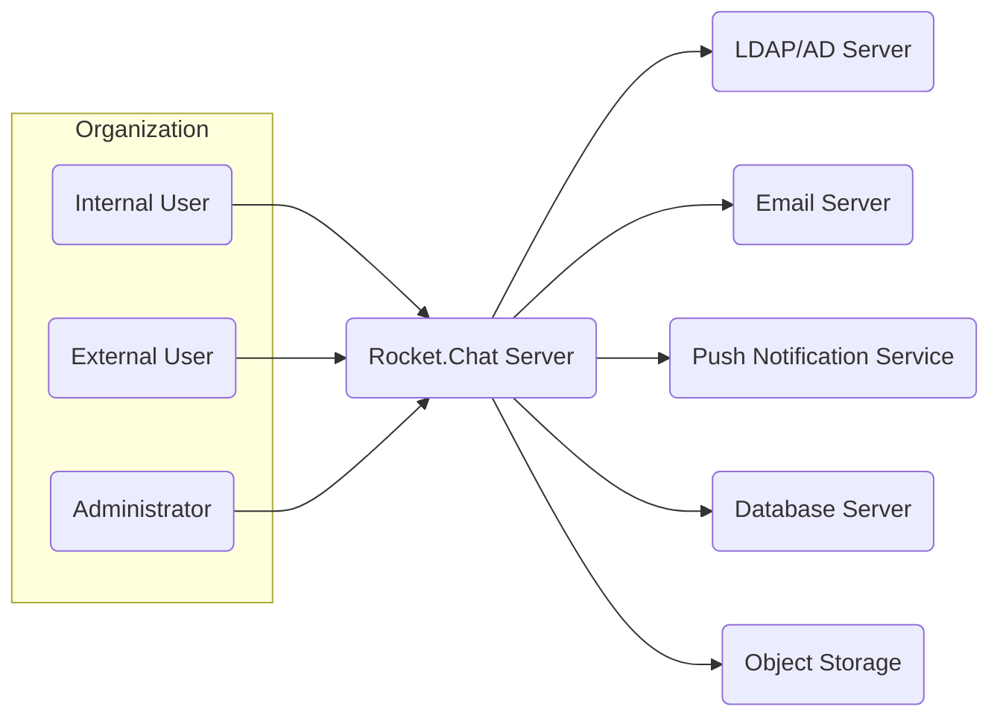
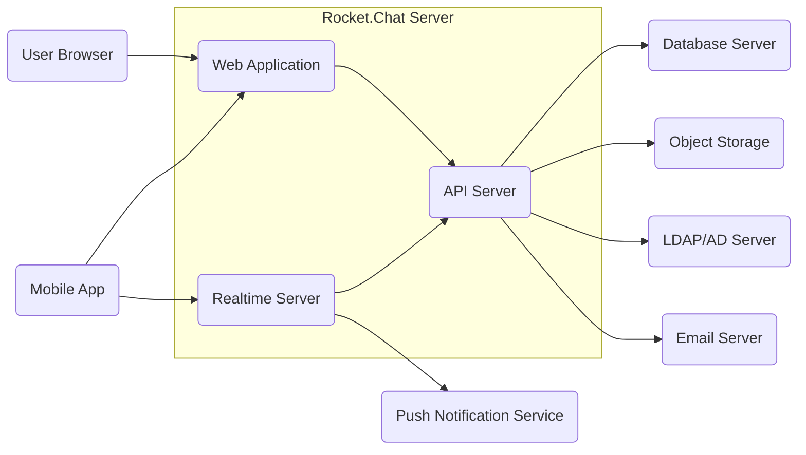
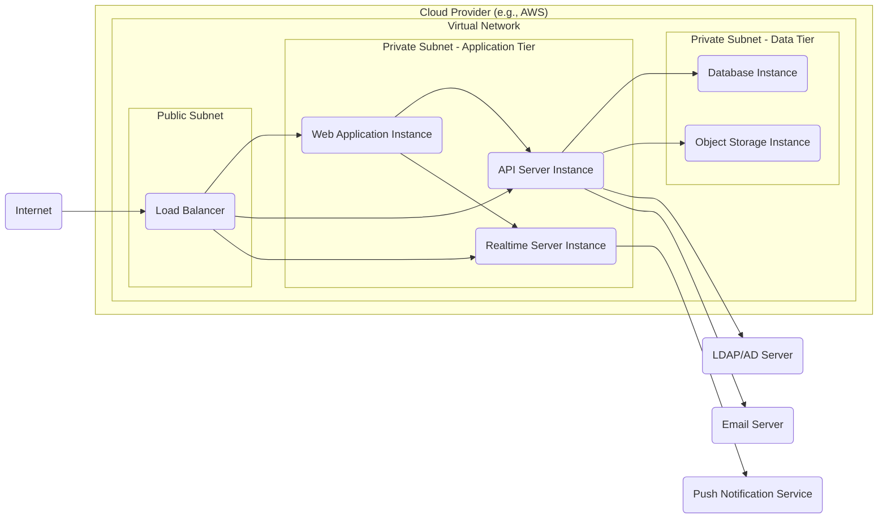
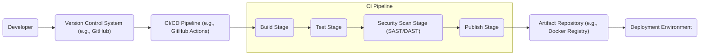

# BUSINESS POSTURE

Rocket.Chat is an open-source team communication platform. The primary business priority is to provide a reliable, feature-rich, and secure communication solution for organizations of all sizes. The goal is to enable efficient collaboration, improve team productivity, and foster a connected work environment.

Key business risks associated with Rocket.Chat include:
- Data breaches and leaks of sensitive communication data.
- Service disruptions impacting business operations and communication flow.
- Compliance violations related to data privacy and security regulations (e.g., GDPR, HIPAA).
- Reputational damage due to security incidents or platform instability.
- Loss of user trust and adoption if the platform is perceived as insecure or unreliable.

# SECURITY POSTURE

Existing security controls:
- security control: Access control to the application via username and password authentication. (Implemented in application code)
- security control: Role-based access control (RBAC) for managing user permissions and access to features. (Implemented in application code)
- security control: HTTPS encryption for communication between clients and the server. (Implemented in web server configuration)
- security control: Regular security updates and patches for the platform and its dependencies. (Described in project documentation and release notes)
- security control: Data encryption at rest for sensitive data in the database. (Configurable database feature)
- security control: Input validation and sanitization to prevent common web vulnerabilities. (Implemented in application code)

Accepted risks:
- accepted risk: Potential vulnerabilities in third-party dependencies. (Mitigated by regular updates and vulnerability scanning)
- accepted risk: Risk of social engineering attacks targeting users. (Mitigated by user security awareness training)
- accepted risk: Availability risks associated with infrastructure failures. (Mitigated by redundancy and monitoring)

Recommended security controls:
- security control: Implement multi-factor authentication (MFA) for enhanced user login security.
- security control: Integrate with Security Information and Event Management (SIEM) system for security monitoring and incident response.
- security control: Conduct regular penetration testing and vulnerability assessments.
- security control: Implement a Web Application Firewall (WAF) to protect against web-based attacks.
- security control: Implement static and dynamic application security testing (SAST/DAST) in the CI/CD pipeline.
- security control: Enhance logging and auditing capabilities for security events.

Security requirements:
- Authentication:
  - requirement: Secure user authentication mechanism to verify user identity.
  - requirement: Support for strong password policies and enforcement.
  - requirement: Option for multi-factor authentication (MFA).
  - requirement: Secure session management to prevent session hijacking.
- Authorization:
  - requirement: Role-based access control (RBAC) to manage user permissions.
  - requirement: Granular access control to features and data based on user roles and context.
  - requirement: Principle of least privilege should be applied to user and system accounts.
- Input Validation:
  - requirement: Comprehensive input validation on all user inputs to prevent injection attacks (e.g., XSS, SQL injection).
  - requirement: Input sanitization and encoding to neutralize malicious input.
  - requirement: Use of secure coding practices to minimize vulnerabilities related to input handling.
- Cryptography:
  - requirement: Use of strong encryption algorithms for data in transit (HTTPS/TLS).
  - requirement: Encryption of sensitive data at rest (e.g., database encryption).
  - requirement: Secure storage and management of cryptographic keys.
  - requirement: Proper use of hashing and salting for password storage.

# DESIGN

## C4 CONTEXT

Context Diagram Elements:

- Element:
  - Name: Internal User
  - Type: Person
  - Description: Employees or members within the organization who use Rocket.Chat for internal communication and collaboration.
  - Responsibilities: Communicate with colleagues, collaborate on projects, access internal information.
  - Security controls: Username/password authentication, MFA (recommended), RBAC permissions within Rocket.Chat.

- Element:
  - Name: External User
  - Type: Person
  - Description: Users outside the organization (e.g., clients, partners) who may be granted limited access to Rocket.Chat for communication and collaboration.
  - Responsibilities: Communicate with internal users, collaborate on specific projects, access limited information.
  - Security controls: Username/password authentication, MFA (recommended), RBAC permissions within Rocket.Chat, access control lists for external users.

- Element:
  - Name: Administrator
  - Type: Person
  - Description: Users responsible for managing and configuring the Rocket.Chat server, including user management, system settings, and security configurations.
  - Responsibilities: System administration, user management, security configuration, monitoring, backups.
  - Security controls: Strong authentication (username/password, MFA), role-based access control with administrative privileges, audit logging of administrative actions.

- Element:
  - Name: Rocket.Chat Server
  - Type: Software System
  - Description: The core Rocket.Chat application server that provides real-time messaging, team collaboration features, and user management.
  - Responsibilities: Real-time communication, user management, channel management, data storage, API access, integrations.
  - Security controls: HTTPS encryption, authentication, authorization, input validation, session management, data encryption at rest, security updates, logging, monitoring.

- Element:
  - Name: LDAP/AD Server
  - Type: Software System
  - Description: Lightweight Directory Access Protocol (LDAP) or Active Directory (AD) server used for user authentication and directory services integration.
  - Responsibilities: User authentication, user directory management, providing user information to Rocket.Chat.
  - Security controls: Secure communication protocols (LDAPS), access control to directory information, password policies.

- Element:
  - Name: Email Server
  - Type: Software System
  - Description: Email server used for sending email notifications, password resets, and other email-based communication.
  - Responsibilities: Sending email notifications, handling password resets, email communication.
  - Security controls: SMTP authentication, TLS encryption for email transmission, spam filtering.

- Element:
  - Name: Push Notification Service
  - Type: Software System
  - Description: Service used to send push notifications to users' mobile devices or desktop applications for new messages and alerts.
  - Responsibilities: Delivering push notifications to users.
  - Security controls: Secure API communication, authentication for push notification requests, data encryption in transit.

- Element:
  - Name: Database Server
  - Type: Software System
  - Description: Database server used to store Rocket.Chat data, including messages, user information, channel details, and settings.
  - Responsibilities: Data persistence, data retrieval, data integrity.
  - Security controls: Access control, data encryption at rest, database hardening, regular backups.

- Element:
  - Name: Object Storage
  - Type: Software System
  - Description: Object storage system used to store file uploads, avatars, and other media files.
  - Responsibilities: Storage of files and media, file retrieval.
  - Security controls: Access control, data encryption at rest, secure API access, integrity checks.

## C4 CONTAINER

Container Diagram Elements:

- Element:
  - Name: Web Application
  - Type: Container
  - Description: The web interface of Rocket.Chat, providing users with a browser-based client to access the platform. Built using JavaScript frameworks (e.g., React).
  - Responsibilities: User interface rendering, handling user interactions, communication with API Server and Realtime Server.
  - Security controls: Input validation, output encoding, session management, HTTPS, Content Security Policy (CSP), protection against XSS and CSRF.

- Element:
  - Name: API Server
  - Type: Container
  - Description: REST API backend for Rocket.Chat, handling business logic, data access, and communication with other services. Built using Node.js.
  - Responsibilities: API endpoint management, authentication and authorization, data processing, database interactions, object storage interactions, email and LDAP integration.
  - Security controls: Authentication, authorization, input validation, secure API design, rate limiting, logging, protection against injection attacks, secure configuration management.

- Element:
  - Name: Realtime Server
  - Type: Container
  - Description: Handles real-time communication using WebSockets, enabling instant messaging and live updates. Built using Node.js.
  - Responsibilities: Real-time message broadcasting, connection management, presence management, push notification integration.
  - Security controls: Secure WebSocket communication (WSS), authentication, authorization, input validation, rate limiting, protection against denial-of-service attacks.

- Element:
  - Name: Database Server
  - Type: Container
  - Description: Database system (e.g., MongoDB) used to persist Rocket.Chat data.
  - Responsibilities: Data storage, data retrieval, data persistence, data integrity.
  - Security controls: Access control, data encryption at rest, database hardening, regular backups, audit logging.

- Element:
  - Name: Object Storage
  - Type: Container
  - Description: Object storage system (e.g., AWS S3, MinIO) for storing files and media.
  - Responsibilities: File storage, file retrieval, media storage.
  - Security controls: Access control, data encryption at rest, secure API access, integrity checks, versioning.

- Element:
  - Name: Push Notification Service
  - Type: External System
  - Description: External service (e.g., Firebase Cloud Messaging, Apple Push Notification service) for sending push notifications.
  - Responsibilities: Push notification delivery.
  - Security controls: Secure API communication, authentication for push notification requests, data encryption in transit (TLS).

- Element:
  - Name: LDAP/AD Server
  - Type: External System
  - Description: External LDAP or Active Directory server for user authentication.
  - Responsibilities: User authentication, user directory.
  - Security controls: Secure communication protocols (LDAPS), access control to directory information, password policies.

- Element:
  - Name: Email Server
  - Type: External System
  - Description: External email server for sending emails.
  - Responsibilities: Email delivery.
  - Security controls: SMTP authentication, TLS encryption for email transmission.

- Element:
  - Name: User Browser
  - Type: Client
  - Description: Web browser used by users to access Rocket.Chat Web Application.
  - Responsibilities: Rendering web application, user interaction.
  - Security controls: Browser security features, user awareness of phishing and social engineering.

- Element:
  - Name: Mobile App
  - Type: Client
  - Description: Mobile application (iOS, Android) for accessing Rocket.Chat.
  - Responsibilities: Mobile user interface, push notification handling, communication with WebApp and Realtime Server.
  - Security controls: Mobile OS security features, secure storage of credentials, app security hardening, code obfuscation.

## DEPLOYMENT

Deployment Solution: Cloud-based Deployment (e.g., AWS, Azure, GCP)

Deployment Diagram Elements:

- Element:
  - Name: Cloud Provider (e.g., AWS)
  - Type: Infrastructure
  - Description: Cloud infrastructure provider hosting the Rocket.Chat deployment.
  - Responsibilities: Providing infrastructure resources, network connectivity, security services.
  - Security controls: Physical security of data centers, network security controls, infrastructure security services (firewalls, IDS/IPS), compliance certifications.

- Element:
  - Name: Virtual Network
  - Type: Infrastructure
  - Description: Isolated network within the cloud provider environment for deploying Rocket.Chat resources.
  - Responsibilities: Network isolation, network routing, security boundary.
  - Security controls: Network Access Control Lists (NACLs), Security Groups, network segmentation.

- Element:
  - Name: Public Subnet
  - Type: Infrastructure
  - Description: Subnet within the virtual network with public internet access, hosting the Load Balancer.
  - Responsibilities: Publicly accessible entry point for the application.
  - Security controls: Network firewall rules, DDoS protection.

- Element:
  - Name: Load Balancer
  - Type: Infrastructure
  - Description: Distributes incoming traffic across multiple Web Application, API Server, and Realtime Server instances.
  - Responsibilities: Traffic distribution, high availability, SSL termination.
  - Security controls: SSL/TLS encryption, DDoS protection, access logs.

- Element:
  - Name: Private Subnet - Application Tier
  - Type: Infrastructure
  - Description: Private subnet hosting Web Application, API Server, and Realtime Server instances. No direct internet access.
  - Responsibilities: Application execution, processing user requests.
  - Security controls: Security Groups, network segmentation, internal firewalls.

- Element:
  - Name: Web Application Instance
  - Type: Infrastructure
  - Description: Virtual machine or container instance running the Web Application container.
  - Responsibilities: Serving the web application, handling user interface.
  - Security controls: Operating system hardening, application security controls (as described in Container section).

- Element:
  - Name: API Server Instance
  - Type: Infrastructure
  - Description: Virtual machine or container instance running the API Server container.
  - Responsibilities: API processing, business logic execution.
  - Security controls: Operating system hardening, application security controls (as described in Container section).

- Element:
  - Name: Realtime Server Instance
  - Type: Infrastructure
  - Description: Virtual machine or container instance running the Realtime Server container.
  - Responsibilities: Real-time communication handling.
  - Security controls: Operating system hardening, application security controls (as described in Container section).

- Element:
  - Name: Private Subnet - Data Tier
  - Type: Infrastructure
  - Description: Private subnet hosting Database and Object Storage instances. No direct internet access.
  - Responsibilities: Data persistence, data storage.
  - Security controls: Security Groups, network segmentation, database access controls, object storage access policies.

- Element:
  - Name: Database Instance
  - Type: Infrastructure
  - Description: Managed database service or virtual machine running the Database Server.
  - Responsibilities: Database management, data persistence.
  - Security controls: Database security controls (as described in Container section), access control lists, encryption at rest.

- Element:
  - Name: Object Storage Instance
  - Type: Infrastructure
  - Description: Managed object storage service or virtual machine running the Object Storage Server.
  - Responsibilities: Object storage management, file storage.
  - Security controls: Object storage security controls (as described in Container section), access control policies, encryption at rest.

- Element:
  - Name: Push Notification Service
  - Type: External System
  - Description: External push notification service.
  - Responsibilities: Push notification delivery.
  - Security controls: Secure API communication.

- Element:
  - Name: LDAP/AD Server
  - Type: External System
  - Description: External LDAP/AD server.
  - Responsibilities: User authentication.
  - Security controls: Secure communication protocols.

- Element:
  - Name: Email Server
  - Type: External System
  - Description: External email server.
  - Responsibilities: Email delivery.
  - Security controls: Secure communication protocols.

- Element:
  - Name: Internet
  - Type: External System
  - Description: Public internet network.
  - Responsibilities: Public network access.
  - Security controls: General internet security considerations.

## BUILD

Build Process Description:

The build process for Rocket.Chat typically involves the following stages, often automated using a CI/CD pipeline:

1. Developer commits code changes to a Version Control System (VCS) like GitHub.
2. The CI/CD pipeline is triggered automatically upon code commits or pull requests.
3. Build Stage:
    - Source code is retrieved from the VCS.
    - Dependencies are downloaded and managed.
    - Application code is compiled and packaged into build artifacts (e.g., Docker images, JavaScript bundles).
4. Test Stage:
    - Automated unit tests, integration tests, and functional tests are executed to ensure code quality and functionality.
5. Security Scan Stage:
    - Static Application Security Testing (SAST) tools are used to analyze the source code for potential vulnerabilities.
    - Dynamic Application Security Testing (DAST) tools are used to scan the running application for vulnerabilities.
    - Dependency vulnerability scanning is performed to identify vulnerable dependencies.
    - Linters and code quality checks are executed.
6. Publish Stage:
    - Build artifacts that pass all tests and security checks are published to an Artifact Repository (e.g., Docker Registry, npm registry).
    - Release notes and changelogs are generated.
7. Deployment Environment:
    - The deployment process retrieves the build artifacts from the Artifact Repository and deploys them to the target environment (e.g., cloud infrastructure, on-premises servers).

Build Diagram Elements:

- Element:
  - Name: Developer
  - Type: Person
  - Description: Software developers writing and committing code changes.
  - Responsibilities: Code development, code review, committing code changes.
  - Security controls: Secure development practices, code review process, access control to VCS.

- Element:
  - Name: Version Control System (VCS) (e.g., GitHub)
  - Type: Tool
  - Description: System for managing and tracking code changes.
  - Responsibilities: Source code management, version control, collaboration.
  - Security controls: Access control, branch protection, audit logging, secure code storage.

- Element:
  - Name: CI/CD Pipeline (e.g., GitHub Actions)
  - Type: Tool
  - Description: Automated pipeline for building, testing, and deploying software.
  - Responsibilities: Build automation, testing automation, security scanning automation, deployment automation.
  - Security controls: Secure pipeline configuration, access control to pipeline, secret management, audit logging.

- Element:
  - Name: Build Stage
  - Type: Stage
  - Description: Stage in the CI/CD pipeline responsible for compiling and packaging the application.
  - Responsibilities: Code compilation, dependency management, artifact creation.
  - Security controls: Secure build environment, dependency vulnerability scanning, build process integrity.

- Element:
  - Name: Test Stage
  - Type: Stage
  - Description: Stage in the CI/CD pipeline responsible for running automated tests.
  - Responsibilities: Unit testing, integration testing, functional testing.
  - Security controls: Test environment isolation, secure test data management.

- Element:
  - Name: Security Scan Stage (SAST/DAST)
  - Type: Stage
  - Description: Stage in the CI/CD pipeline responsible for performing security scans.
  - Responsibilities: Static code analysis, dynamic application scanning, dependency vulnerability scanning.
  - Security controls: SAST/DAST tool configuration, vulnerability reporting, integration with security workflows.

- Element:
  - Name: Publish Stage
  - Type: Stage
  - Description: Stage in the CI/CD pipeline responsible for publishing build artifacts.
  - Responsibilities: Artifact publishing, release management, versioning.
  - Security controls: Secure artifact repository access, artifact integrity checks, signing and verification of artifacts.

- Element:
  - Name: Artifact Repository (e.g., Docker Registry)
  - Type: Tool
  - Description: Repository for storing and managing build artifacts.
  - Responsibilities: Artifact storage, artifact versioning, artifact distribution.
  - Security controls: Access control, artifact integrity checks, vulnerability scanning of artifacts, secure storage.

- Element:
  - Name: Deployment Environment
  - Type: Environment
  - Description: Target environment where the application is deployed (e.g., cloud, on-premises).
  - Responsibilities: Running the application, providing runtime environment.
  - Security controls: Environment security controls (as described in Deployment section), secure configuration management, monitoring.

# RISK ASSESSMENT

Critical business processes we are trying to protect:
- Real-time communication between users.
- Storage and retrieval of communication history and files.
- User authentication and authorization.
- System availability and reliability.

Data we are trying to protect and their sensitivity:
- Chat messages: Sensitive, containing business communications, potentially confidential information, personal data. Sensitivity: High.
- User credentials (passwords, API keys): Highly sensitive, critical for authentication and authorization. Sensitivity: Critical.
- User profiles and personal information: Sensitive, containing personal data. Sensitivity: Medium to High (depending on regulations).
- Files and media uploads: Potentially sensitive, depending on content. Sensitivity: Medium to High.
- System logs and audit trails: Sensitive, containing security-related information. Sensitivity: Medium.
- Configuration data: Sensitive, containing system settings and potentially secrets. Sensitivity: High.

# QUESTIONS & ASSUMPTIONS

Questions:
- What is the specific deployment environment (cloud provider, on-premises)?
- What are the specific compliance requirements (GDPR, HIPAA, etc.)?
- What is the organization's risk appetite?
- Are there any existing security policies or standards that need to be followed?
- What are the specific integrations with other systems beyond LDAP/AD, Email, and Push Notifications?
- What is the expected user base size and growth?

Assumptions:
- The project is intended for organizational use, requiring a focus on security and compliance.
- The deployment will be in a cloud environment for scalability and availability.
- Security is a high priority for the project, given the nature of communication data.
- Standard security best practices for web applications and cloud deployments are applicable.
- The organization has a moderate risk appetite and is willing to invest in security controls.