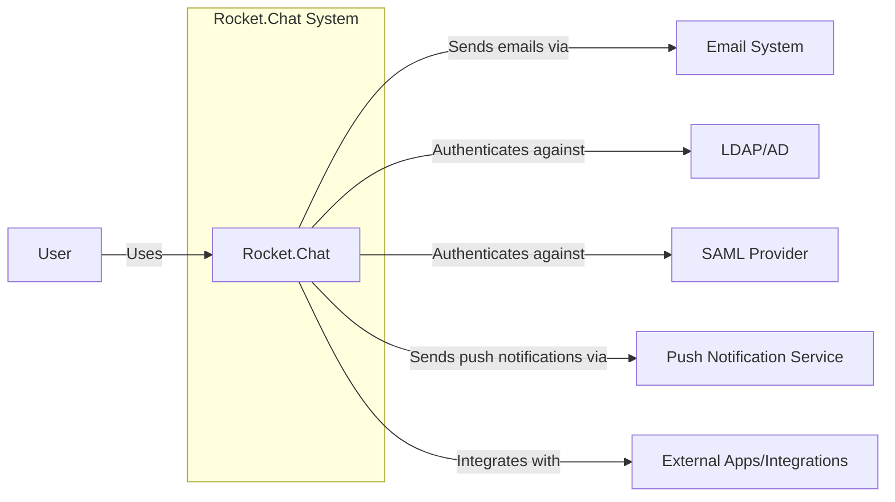
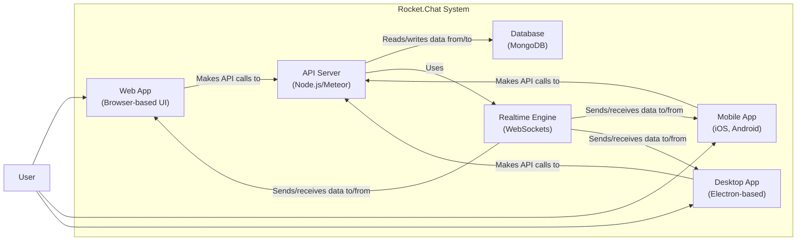
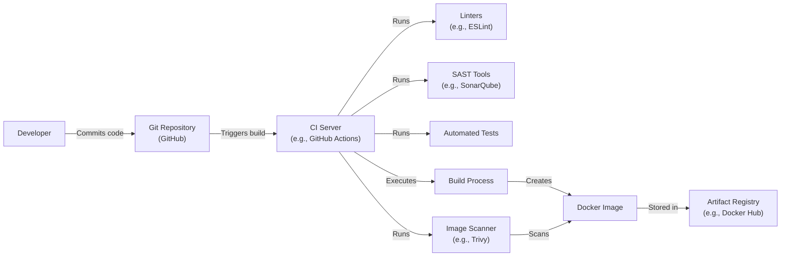

Okay, let's create a design document for Rocket.Chat based on the provided GitHub repository.

# BUSINESS POSTURE

Rocket.Chat is an open-source team communication platform, positioning itself as a competitor to Slack.  Its business priorities revolve around:

*   Providing a secure and reliable communication platform.
*   Offering a customizable and extensible solution for diverse organizational needs.
*   Maintaining a vibrant open-source community and ecosystem.
*   Offering both self-hosted and cloud-hosted deployment options.
*   Attracting and retaining users through a feature-rich experience.
*   Monetizing through enterprise features, support, and cloud hosting.

Key business risks that need to be addressed:

*   Data breaches and unauthorized access to sensitive communications.
*   Service disruptions and downtime impacting user productivity.
*   Reputational damage due to security vulnerabilities or privacy concerns.
*   Loss of user trust due to inadequate data protection measures.
*   Competition from established players in the communication platform market.
*   Supply chain attacks that can compromise Rocket.Chat instances.
*   Compliance violations related to data privacy regulations (e.g., GDPR, CCPA).

# SECURITY POSTURE

Based on the repository and general knowledge of similar applications, here's an assessment of Rocket.Chat's likely security posture:

*   security control: Role-Based Access Control (RBAC) to manage user permissions. (Implemented in the core application logic).
*   security control: End-to-end encryption (E2EE) for private conversations (optional feature, implemented using client-side and server-side cryptography).
*   security control: Two-Factor Authentication (2FA) to enhance account security. (Implemented as an option for users).
*   security control: Integration with external authentication providers (e.g., LDAP, SAML). (Implemented through plugins and configuration).
*   security control: Audit logging to track user activity and system events. (Implemented in the server-side logging mechanisms).
*   security control: Regular security updates and vulnerability patching. (Evidenced by the release cycle and security advisories in the repository).
*   security control: Input validation to prevent common web vulnerabilities (e.g., XSS, CSRF). (Implemented in the server-side and client-side code).
*   security control: Use of HTTPS for secure communication between clients and servers. (Enforced through server configuration and client-side code).
*   security control: Content Security Policy (CSP) to mitigate XSS attacks. (Implemented through HTTP headers).
*   security control: Rate limiting to prevent brute-force attacks and denial-of-service. (Implemented in the server-side API layer).
*   accepted risk: Reliance on third-party libraries and dependencies, which may introduce vulnerabilities.
*   accepted risk: Potential for misconfiguration by administrators, leading to security weaknesses.
*   accepted risk: The inherent complexity of a large codebase, increasing the likelihood of undiscovered vulnerabilities.

Recommended security controls (high priority):

*   Implement a comprehensive Software Bill of Materials (SBOM) management system to track and manage dependencies.
*   Integrate Static Application Security Testing (SAST) and Dynamic Application Security Testing (DAST) into the CI/CD pipeline.
*   Conduct regular penetration testing and vulnerability assessments by independent security experts.
*   Implement a robust secrets management solution to protect API keys, passwords, and other sensitive credentials.
*   Enhance data loss prevention (DLP) capabilities to prevent sensitive data from leaving the platform.

Security Requirements:

*   Authentication:
    *   Support for strong passwords and password complexity rules.
    *   Secure storage of passwords using industry-standard hashing algorithms (e.g., bcrypt).
    *   Protection against brute-force attacks and account lockout mechanisms.
    *   Secure session management with appropriate timeouts and token invalidation.
    *   Support for multi-factor authentication (MFA).
*   Authorization:
    *   Fine-grained access control based on roles and permissions.
    *   Ability to define custom roles and permissions.
    *   Enforcement of least privilege principle.
    *   Regular review and auditing of user permissions.
*   Input Validation:
    *   Strict validation of all user inputs on both the client-side and server-side.
    *   Use of whitelisting and input sanitization techniques.
    *   Protection against common web vulnerabilities (e.g., XSS, SQL injection, CSRF).
    *   Secure handling of file uploads.
*   Cryptography:
    *   Use of strong, industry-standard cryptographic algorithms and protocols.
    *   Secure key management practices.
    *   Protection of data in transit using TLS/SSL.
    *   Optional end-to-end encryption for sensitive conversations.
    *   Regular review and updates of cryptographic libraries.

# DESIGN

## C4 CONTEXT



Element Descriptions:

*   Element:
    *   Name: User
    *   Type: Person
    *   Description: A person who uses Rocket.Chat to communicate with others.
    *   Responsibilities: Sending messages, participating in channels, managing their profile, etc.
    *   Security controls: Password authentication, 2FA, session management.

*   Element:
    *   Name: Rocket.Chat
    *   Type: Software System
    *   Description: The core Rocket.Chat application.
    *   Responsibilities: Managing users, channels, messages, and other communication features.
    *   Security controls: RBAC, input validation, audit logging, etc.

*   Element:
    *   Name: Email System
    *   Type: External System
    *   Description: An external email system used for sending notifications and other emails.
    *   Responsibilities: Delivering emails to users.
    *   Security controls: TLS/SSL for communication, spam filtering.

*   Element:
    *   Name: LDAP/AD
    *   Type: External System
    *   Description: An external LDAP or Active Directory server for user authentication.
    *   Responsibilities: Authenticating users and providing user information.
    *   Security controls: Secure communication with Rocket.Chat, password policies.

*   Element:
    *   Name: SAML Provider
    *   Type: External System
    *   Description: An external SAML provider for single sign-on (SSO).
    *   Responsibilities: Authenticating users and providing user information.
    *   Security controls: Secure communication with Rocket.Chat, SAML protocol security.

*   Element:
    *   Name: Push Notification Service
    *   Type: External System
    *   Description: A service for sending push notifications to mobile and desktop clients.
    *   Responsibilities: Delivering push notifications to users.
    *   Security controls: Secure communication with Rocket.Chat, API key authentication.

*   Element:
    *   Name: External Apps/Integrations
    *   Type: External System
    *   Description: Third-party applications and integrations that extend Rocket.Chat's functionality.
    *   Responsibilities: Providing specific features and integrations.
    *   Security controls: API key authentication, OAuth, secure communication.

## C4 CONTAINER



Element Descriptions:

*   Element:
    *   Name: Web App
    *   Type: Web Application
    *   Description: The browser-based user interface for Rocket.Chat.
    *   Responsibilities: Providing the user interface, handling user interactions, making API calls.
    *   Security controls: Input validation, XSS protection, CSP.

*   Element:
    *   Name: Mobile App
    *   Type: Mobile Application
    *   Description: Native mobile applications for iOS and Android.
    *   Responsibilities: Providing the user interface, handling user interactions, making API calls.
    *   Security controls: Secure storage of credentials, platform-specific security features.

*   Element:
    *   Name: Desktop App
    *   Type: Desktop Application
    *   Description: Electron-based desktop application.
    *   Responsibilities: Providing the user interface, handling user interactions, making API calls.
    *   Security controls: Secure storage of credentials, code signing.

*   Element:
    *   Name: API Server
    *   Type: Server-side Application
    *   Description: The core server-side application built with Node.js and Meteor.
    *   Responsibilities: Handling API requests, business logic, user authentication, data access.
    *   Security controls: RBAC, input validation, authentication, authorization, rate limiting.

*   Element:
    *   Name: Database
    *   Type: Database
    *   Description: MongoDB database for storing application data.
    *   Responsibilities: Storing and retrieving data.
    *   Security controls: Access control, encryption at rest (if configured), regular backups.

*   Element:
    *   Name: Realtime Engine
    *   Type: Server-side component
    *   Description: Component responsible for real-time communication using WebSockets.
    *   Responsibilities: Managing WebSocket connections, pushing updates to clients.
    *   Security controls: Authentication, authorization, secure WebSocket communication.

## DEPLOYMENT

Rocket.Chat can be deployed in several ways:

1.  **Self-Hosted (Manual Installation):**  Installing Rocket.Chat directly on a server using the source code and manual configuration.
2.  **Self-Hosted (Docker):** Using Docker and Docker Compose to deploy Rocket.Chat containers.
3.  **Self-Hosted (Snaps):**  Using Snap packages for simplified installation and updates.
4.  **Cloud-Hosted (Rocket.Chat Cloud):**  Using Rocket.Chat's official cloud hosting service.
5.  **One-Click Deployments:** Using pre-configured deployments on cloud providers like DigitalOcean, AWS, or Heroku.

We'll describe the **Docker Compose** deployment in detail, as it's a common and recommended approach.

```mermaid
graph LR
    subgraph Deployment Environment (e.g., Cloud Server, On-Premise Server)
        Internet["Internet"]
        LoadBalancer["Load Balancer\n(e.g., Nginx, HAProxy)"]
        DockerHost["Docker Host"]
        RocketChatContainer["Rocket.Chat Container\n(Node.js/Meteor)"]
        MongoDBContainer["MongoDB Container"]
        MongoReplicaSet1["MongoDB Replica Set Member 1"]
        MongoReplicaSet2["MongoDB Replica Set Member 2"]
        MongoReplicaSet3["MongoDB Replica Set Member 3"]

        Internet -- "HTTPS" --> LoadBalancer
        LoadBalancer -- "HTTP" --> RocketChatContainer
        RocketChatContainer -- "MongoDB Protocol" --> MongoDBContainer
        subgraph MongoDB Replica Set
            MongoDBContainer --> MongoReplicaSet1
            MongoDBContainer --> MongoReplicaSet2
            MongoDBContainer --> MongoReplicaSet3
        end
    end
```

Element Descriptions:

*   Element:
    *   Name: Internet
    *   Type: Network
    *   Description: The public internet.
    *   Responsibilities: Routing traffic to the deployment environment.
    *   Security controls: Firewall, DDoS protection (typically provided by the hosting provider).

*   Element:
    *   Name: Load Balancer
    *   Type: Network Appliance/Software
    *   Description: A load balancer (e.g., Nginx, HAProxy) that distributes traffic across multiple Rocket.Chat instances.
    *   Responsibilities: Distributing traffic, SSL termination, health checks.
    *   Security controls: SSL/TLS configuration, firewall rules.

*   Element:
    *   Name: Docker Host
    *   Type: Server
    *   Description: The server that hosts the Docker engine and runs the containers.
    *   Responsibilities: Running Docker containers.
    *   Security controls: Operating system security, Docker security best practices.

*   Element:
    *   Name: Rocket.Chat Container
    *   Type: Docker Container
    *   Description: The container running the Rocket.Chat application.
    *   Responsibilities: Running the Rocket.Chat application.
    *   Security controls: Container security best practices, minimal base image, regular updates.

*   Element:
    *   Name: MongoDB Container
    *   Type: Docker Container
    *   Description: The container running the MongoDB database.
    *   Responsibilities: Running the MongoDB database.
    *   Security controls: Container security best practices, access control, data encryption (if configured).
* Element:
    *   Name: Mongo Replica Set Member 1/2/3
    *   Type: Database Instance
    *   Description: Instances of MongoDB that provide redundancy and high availability.
    *   Responsibilities: Data replication and failover.
    *   Security controls: Authentication, authorization, network security.

## BUILD

Rocket.Chat's build process involves several steps, from development to creating deployable artifacts.  While the specifics vary depending on the development environment and CI/CD setup, a typical process looks like this:

1.  **Development:** Developers write code and commit changes to the Git repository (GitHub).
2.  **Continuous Integration (CI):**  A CI system (e.g., GitHub Actions, Jenkins) automatically triggers builds on code commits.
3.  **Dependency Management:** Dependencies are managed using `npm` (Node Package Manager). `package.json` and `package-lock.json` define the project's dependencies.
4.  **Linting:** Code linters (e.g., ESLint) check for code style and potential errors.
5.  **Static Analysis:** Static analysis tools (e.g., SonarQube) can be integrated to identify potential security vulnerabilities and code quality issues.
6.  **Testing:** Automated tests (unit tests, integration tests) are executed.
7.  **Building:** The application is built, which typically involves compiling code, bundling assets, and creating a production-ready distribution.
8.  **Docker Image Creation:** A Docker image is created, packaging the application and its dependencies into a deployable unit.
9.  **Image Scanning:** The Docker image is scanned for known vulnerabilities using container security tools (e.g., Trivy, Clair).
10. **Artifact Storage:** The built artifacts (e.g., Docker image) are stored in a registry (e.g., Docker Hub, private registry).



Security Controls in the Build Process:

*   security control: Dependency vulnerability scanning (using tools like `npm audit` or Snyk).
*   security control: Static Application Security Testing (SAST).
*   security control: Container image vulnerability scanning.
*   security control: Code signing (for desktop applications).
*   security control: Secure build environment (e.g., isolated CI runners).
*   security control: Least privilege access to build tools and resources.

# RISK ASSESSMENT

*   Critical Business Processes:
    *   Real-time communication and collaboration between users.
    *   Secure storage and retrieval of messages and files.
    *   User authentication and authorization.
    *   Integration with external systems (e.g., LDAP, SAML).
    *   Maintaining service availability and reliability.

*   Data Sensitivity:
    *   **Messages:**  Can range from low sensitivity (public channels) to high sensitivity (private conversations, direct messages).  May contain personally identifiable information (PII), confidential business information, or intellectual property.
    *   **Files:**  Similar to messages, files can vary in sensitivity.  May contain PII, confidential documents, or sensitive data.
    *   **User Data:**  Includes usernames, email addresses, profile information, and potentially authentication credentials (if not using external authentication).  This data is considered PII and requires protection.
    *   **Configuration Data:**  Includes server settings, API keys, and other configuration information.  This data is highly sensitive and must be protected from unauthorized access.
    *   **Logs:** Contain information about system activity, user actions, and potential security events. Log data can be sensitive and should be protected and monitored.

# QUESTIONS & ASSUMPTIONS

*   Questions:
    *   What specific compliance requirements (e.g., GDPR, HIPAA, SOC 2) apply to Rocket.Chat deployments?
    *   What is the current process for handling security incidents and vulnerabilities?
    *   What are the specific threat models that have been considered for Rocket.Chat?
    *   What level of penetration testing and vulnerability assessments are regularly conducted?
    *   Are there any specific security configurations or hardening guidelines provided to administrators?
    *   What is the process for managing and rotating secrets (e.g., API keys, database credentials)?
    *   What are the specific data retention policies for messages, files, and logs?

*   Assumptions:
    *   BUSINESS POSTURE: Rocket.Chat prioritizes security and data protection, but also needs to balance security with usability and feature development.
    *   SECURITY POSTURE: The security controls mentioned are implemented to a reasonable degree, but there may be gaps or areas for improvement.
    *   DESIGN: The design diagrams represent a typical deployment, but specific configurations may vary. The build process is automated to some extent, but may not include all the recommended security checks.
    *   The organization has a basic incident response plan.
    *   Administrators are responsible for configuring and maintaining the security of their Rocket.Chat instances.
    *   Users are aware of basic security best practices (e.g., strong passwords, phishing awareness).
    *   Third-party dependencies are regularly updated, but there may be a delay in patching vulnerabilities.