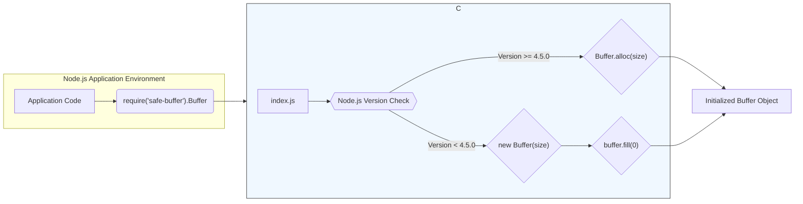

## Project Design Document: safe-buffer (Improved)

**1. Introduction**

This document provides an enhanced design overview of the `safe-buffer` project, a crucial Node.js library designed to offer a safer alternative to the built-in `Buffer` API, particularly concerning the risks associated with uninitialized memory. This detailed design serves as a foundational resource for subsequent threat modeling exercises, providing a comprehensive understanding of the project's purpose, architecture, data flow, and critical security considerations.

**2. Project Overview**

The `safe-buffer` library directly addresses a significant security concern prevalent in older Node.js versions (prior to v4.5.0): the potential for `Buffer` instances created using `new Buffer(size)` to contain uninitialized memory. This uninitialized memory could inadvertently expose sensitive data. `safe-buffer` mitigates this risk by providing a consistent and secure API for creating `Buffer` instances that are guaranteed to be initialized to zero. This ensures data confidentiality from the moment of allocation.

**3. Goals**

* **Maintain API Compatibility:** Offer a near drop-in replacement for the native Node.js `Buffer` API, minimizing disruption for existing codebases.
* **Guarantee Zero-Initialization:** Ensure that all newly created `Buffer` instances are initialized with zeros, preventing the leakage of potentially sensitive data.
* **Provide Backwards Compatibility:** Extend the security benefits of zero-initialized buffers to applications running on older, potentially vulnerable Node.js versions.
* **Optimize for Performance:** Strive for performance characteristics that are comparable to the native `Buffer` implementation, minimizing overhead.
* **Maintain Minimal Footprint:** Keep the codebase small and focused, with minimal external dependencies to reduce the attack surface and simplify maintenance.

**4. Non-Goals**

* **Advanced Cryptographic Operations:**  `safe-buffer` is not intended to provide cryptographic functionalities beyond basic buffer manipulation. Cryptographic operations should rely on dedicated libraries.
* **Custom Memory Management:** The library leverages the underlying Node.js memory management and does not implement custom memory allocation strategies.
* **General-Purpose Data Structure Library:** `safe-buffer` is specifically focused on providing a safer `Buffer` implementation and is not intended to be a general-purpose data structure library.

**5. Architecture**

The `safe-buffer` library operates as a strategic wrapper around the native Node.js `Buffer` API. Its core logic resides in intelligently selecting the appropriate method for `Buffer` creation based on the detected Node.js version.

* **Key Components:**
    * **`index.js` (Main Entry Point):** This file serves as the primary module, exporting the `Buffer` class provided by `safe-buffer`. It contains the logic to dynamically determine the safest `Buffer` creation method.
    * **Version Detection Logic:**  The module includes code to detect the currently running Node.js version.
    * **Conditional Buffer Creation:** Based on the detected version, `safe-buffer` employs one of two strategies:
        * **For Node.js versions >= 4.5.0:**  It directly utilizes `Buffer.alloc(size)`, which inherently guarantees zero-initialization.
        * **For Node.js versions < 4.5.0:** It falls back to using `new Buffer(size)` followed by `buffer.fill(0)` to explicitly zero-fill the allocated memory.

* **High-Level Architecture Diagram:**



**6. Data Flow**

The primary data flow within `safe-buffer` centers around the secure creation of `Buffer` objects.

* **Secure Buffer Creation Process:**
    1. The application code invokes `require('safe-buffer').Buffer`, specifying the desired size, an array of data, or a string.
    2. The `index.js` module within `safe-buffer` determines the current Node.js version.
    3. **Conditional Execution:**
        * If the Node.js version is 4.5.0 or higher, `Buffer.alloc(size)` is called directly, allocating and zero-initializing the memory.
        * If the Node.js version is lower than 4.5.0, `new Buffer(size)` is used to allocate the memory, followed immediately by `buffer.fill(0)` to explicitly write zeros to all memory locations.
    4. The newly created and securely initialized `Buffer` object is then returned to the calling application.

* **Subsequent Buffer Manipulation:** Once a `Buffer` object is created using `safe-buffer`, it can be manipulated using the standard methods provided by the native `Buffer` API (e.g., `write()`, `read()`, `slice()`). `safe-buffer` does not intercept or modify these subsequent operations.

* **Data Flow Diagram (Buffer Creation):**

```mermaid
graph LR
    A["Application Code"] --> B{{"safe-buffer".Buffer(...)}};
    B --> C{{"Determine Node.js Version"}};
    C -- ">= 4.5.0" --> D{"Call Buffer.alloc(size)"};
    C -- "< 4.5.0" --> E{"Call new Buffer(size)"};
    E --> F{"Call buffer.fill(0)"};
    D --> G["Return Initialized Buffer"];
    F --> G;
    G --> A;
    style B fill:#e0ffff,stroke:#333,stroke-width:1px
```

**7. Security Considerations (Enhanced for Threat Modeling)**

The core security advantage of `safe-buffer` lies in its proactive mitigation of information disclosure vulnerabilities stemming from uninitialized memory within `Buffer` objects. This section details key security features and potential concerns relevant to threat modeling.

* **Key Security Features:**
    * **Mandatory Initialization:** Guarantees that newly allocated buffers are always initialized to zero, preventing the accidental exposure of sensitive data residing in previously used memory locations. This directly addresses the primary vulnerability it aims to solve.
    * **Seamless Backwards Compatibility:** Extends the protection against uninitialized memory to applications running on older Node.js versions that are inherently more vulnerable. This allows for safer operation in legacy environments.

* **Potential Security Concerns and Threat Vectors:**
    * **Dependency on Node.js Core:** While `safe-buffer` itself has no external dependencies, its functionality is intrinsically tied to the Node.js core `Buffer` implementation. Any undiscovered vulnerabilities within the core `Buffer` API could potentially impact applications using `safe-buffer`. **Threat:** Exploitation of underlying `Buffer` vulnerabilities.
    * **Bypassing `safe-buffer`:** Developers might inadvertently or intentionally use the native `Buffer` constructor directly (e.g., `new Buffer(size)`) instead of the `safe-buffer` API, thus negating the security benefits. This is a critical application-level concern. **Threat:** Accidental or intentional use of insecure `Buffer` creation.
    * **Integer Overflow in Size Calculation:** When creating buffers with extremely large sizes, potential integer overflow issues during size calculation (before reaching `safe-buffer`) could lead to the allocation of smaller-than-expected buffers, potentially causing buffer overflows during write operations. While `safe-buffer` mitigates uninitialized memory, it doesn't prevent all buffer-related errors. **Threat:** Buffer overflow due to integer overflow in size calculation.
    * **Denial of Service (DoS) through Excessive Allocation:**  Malicious actors could attempt to exhaust system memory by requesting the allocation of extremely large buffers, even if they are zero-initialized. This is a general concern with memory allocation and not specific to `safe-buffer`'s initialization mechanism. **Threat:** Memory exhaustion leading to DoS.
    * **Memory Leaks (Less Likely):** Although `safe-buffer` doesn't directly manage memory deallocation, improper handling of `Buffer` objects in the application code could still lead to memory leaks. This is an application-level concern but worth noting. **Threat:** Memory leaks due to improper buffer management in the application.

**8. Deployment**

`safe-buffer` is typically deployed as a standard dependency within a Node.js application. The installation process is straightforward using common package managers.

* **Deployment Procedure:**
    1. Add `safe-buffer` as a dependency to the `dependencies` section of your project's `package.json` file.
    2. Execute `npm install` or `yarn add safe-buffer` in your project's root directory to download and install the library.
    3. In your application code, replace all instances where the native `Buffer` constructor is used with `require('safe-buffer').Buffer`.

**9. Future Considerations**

* **Continuous Monitoring of Node.js Security:**  Actively track security advisories and updates related to the native Node.js `Buffer` implementation to ensure continued compatibility and address any newly discovered vulnerabilities.
* **Exploration of Additional Safety Measures:** Investigate potential enhancements to address other common `Buffer`-related security pitfalls or improve developer ergonomics.
* **Performance Benchmarking and Optimization:** Regularly evaluate the performance impact of the initialization step, particularly in newer Node.js versions, and explore potential optimizations without compromising security.

**10. Threat Model Scope (Refined)**

This enhanced design document provides a comprehensive foundation for conducting a thorough threat model of the `safe-buffer` project and its integration within Node.js applications. The threat model should specifically consider:

* **Assets:** The primary assets are the confidentiality and integrity of data stored and processed within `Buffer` objects in applications utilizing `safe-buffer`.
* **Attackers:** Potential attackers include malicious actors seeking to exploit vulnerabilities to gain unauthorized access to sensitive data, manipulate data, or cause denial of service.
* **Threats:** Focus on threats related to:
    * Information disclosure due to uninitialized memory (mitigated by `safe-buffer`).
    * Exploitation of vulnerabilities in the underlying Node.js `Buffer` implementation.
    * Circumvention of `safe-buffer`'s protections through direct use of the native `Buffer` constructor.
    * Buffer overflows resulting from integer overflows in size calculations.
    * Denial of service attacks through excessive memory allocation.
    * Memory leaks due to improper buffer management in the application.
* **Vulnerabilities:** Identify potential weaknesses in the design, implementation, and usage patterns of `safe-buffer` that could be exploited by attackers.

This document is a living artifact and should be periodically reviewed and updated to reflect any changes in the project's design, dependencies, or the evolving threat landscape.
