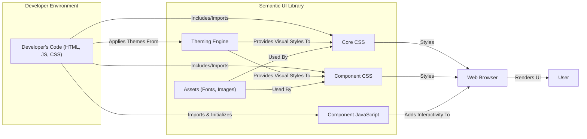
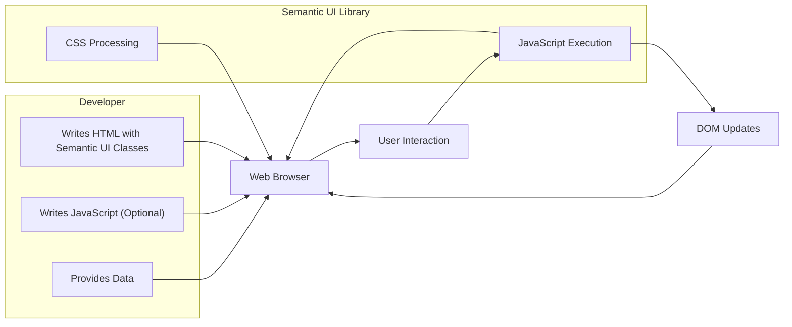

## Project Design Document: Semantic UI (Improved)

**1. Introduction**

This document provides an enhanced architectural design of the Semantic UI project, an open-source front-end development framework. This detailed description aims to offer a deeper understanding of the system's internal structure, interactions, and data flow, specifically tailored for effective threat modeling.

**2. Project Overview**

Semantic UI is a front-end framework designed to empower developers to build elegant and responsive user interfaces using human-friendly HTML. It offers a rich collection of pre-designed UI components, customizable themes, and utility functions, promoting code readability and maintainability. The framework emphasizes semantic HTML, making the structure and purpose of elements clear.

**3. Architectural Overview**

Semantic UI's architecture is predominantly client-side, focusing on the presentation layer of web applications. It comprises several interconnected modules that collaborate to deliver its functionalities.

**Key Components:**

*   **Developer's Code:** The HTML, CSS, and JavaScript code authored by the developer that integrates and utilizes the Semantic UI library. This forms the application's specific structure and logic.
*   **Semantic UI Library:** The central part of the framework, structured into distinct modules:
    *   **Core CSS:** Provides foundational styles, including the grid system, reset styles, and basic element styling.
    *   **Component CSS:** Contains the specific styles for individual UI components (e.g., buttons, forms, modals).
    *   **Component JavaScript:** Implements the interactive behavior and dynamic functionality for UI components.
    *   **Theming Engine:**  Manages the application of visual themes, allowing for customization of colors, fonts, and other visual attributes.
    *   **Assets (Fonts, Images):** Static resources like icon fonts and default images used by the framework.
*   **Web Browser:** The runtime environment where the web application, including Semantic UI, is interpreted and rendered for the user.
*   **User:** The end-user who interacts with the web application presented through the browser.

**4. Component Details**

*   **Semantic UI Core CSS:**
    *   Establishes the fundamental visual structure and layout capabilities.
    *   Includes a responsive grid system based on flexbox or CSS Grid, enabling adaptable layouts across different screen sizes.
    *   Provides CSS reset rules to normalize styles across browsers.
    *   Defines basic styling for common HTML elements.
*   **Semantic UI Component CSS:**
    *   Offers a comprehensive set of pre-defined CSS classes for styling various UI elements like buttons, forms, menus, modals, etc.
    *   Employs a semantic and human-readable naming convention for CSS classes.
    *   Is highly customizable through the theming engine.
    *   Potential security consideration: Maliciously crafted CSS (if theming is compromised) could potentially be used for UI redressing attacks.
*   **Semantic UI Component JavaScript:**
    *   Adds interactive behavior and dynamic functionality to UI components.
    *   Manages component states, handles user interactions (e.g., clicks, hovers), and manipulates the DOM.
    *   Historically relied on jQuery, but newer versions aim for greater jQuery independence.
    *   Potential security consideration: Vulnerabilities in the JavaScript code could lead to XSS if user input is not handled carefully within component logic or if dependencies have vulnerabilities.
*   **Semantic UI Theming Engine:**
    *   Allows developers to customize the visual appearance of the framework by modifying a set of theme variables.
    *   Themes can be defined using LESS or SASS preprocessors.
    *   Enables consistent styling across the entire application.
    *   Potential security consideration: If the theming mechanism is not properly secured, malicious themes could inject arbitrary CSS or JavaScript.
*   **Developer's HTML:**
    *   Provides the structural foundation of the web page.
    *   Semantic UI classes are applied to HTML elements to leverage the framework's styling and behavior.
    *   The structure and semantic correctness of the HTML are crucial for accessibility and SEO.
*   **Developer's JavaScript:**
    *   Allows developers to extend and interact with Semantic UI components.
    *   Used for initializing components, handling custom events, and integrating with application logic.
    *   Potential security consideration: Developers must be cautious about introducing vulnerabilities in their custom JavaScript when interacting with Semantic UI components.
*   **Web Browser:**
    *   Interprets and executes the HTML, CSS, and JavaScript code.
    *   Renders the user interface based on the provided styles and scripts.
    *   Enforces browser security policies (e.g., Same-Origin Policy, Content Security Policy).

**5. Data Flow**

The primary data flow in a system utilizing Semantic UI revolves around the rendering and interaction with UI elements based on developer-provided code and data.

**Detailed Data Flow:**

1. **Developer writes HTML:** The developer creates HTML markup, strategically applying Semantic UI CSS classes to elements to define their appearance and behavior.
2. **Developer writes JavaScript (Optional):** The developer may write custom JavaScript to initialize Semantic UI components, handle specific interactions, or manipulate data that affects the UI.
3. **Developer provides Data:** The developer integrates data into the application, which will be dynamically displayed or used by Semantic UI components. This data can originate from various sources (e.g., backend APIs, local storage).
4. **CSS Processing:** The web browser parses the Semantic UI CSS (and any custom CSS), applying the styles to the HTML elements based on the defined classes.
5. **JavaScript Execution:** The web browser executes the Semantic UI JavaScript (and any custom JavaScript), which initializes components, attaches event listeners, and manages component behavior.
6. **Web Browser Renders UI:** The browser renders the user interface based on the processed HTML, CSS, and executed JavaScript. Semantic UI components are displayed with their intended styles and interactive capabilities.
7. **User Interaction:** The user interacts with the rendered UI (e.g., clicks a button, submits a form, hovers over an element).
8. **JavaScript Handles Interaction:** User interactions trigger events in the browser. Semantic UI's JavaScript (or the developer's custom JavaScript) listens for these events and executes corresponding logic.
9. **DOM Updates:** Based on the event handling logic, JavaScript may manipulate the Document Object Model (DOM), updating the UI's structure, content, or styles.
10. **Browser Re-renders (if necessary):** If the DOM is updated, the browser re-renders the affected parts of the UI to reflect the changes.

**6. Security Considerations**

Utilizing Semantic UI introduces several security considerations that developers must address:

*   **Cross-Site Scripting (XSS):**
    *   **Risk:** If developers use Semantic UI to render user-supplied data without proper encoding or sanitization, malicious scripts can be injected and executed in the user's browser.
    *   **Mitigation:** Implement robust input validation and output encoding techniques. Utilize browser security features like Content Security Policy (CSP).
*   **Dependency Vulnerabilities:**
    *   **Risk:** Semantic UI relies on third-party libraries (e.g., potentially jQuery). Vulnerabilities in these dependencies can be exploited by attackers.
    *   **Mitigation:** Regularly update Semantic UI and its dependencies to the latest versions. Employ tools for dependency vulnerability scanning.
*   **Theme Security:**
    *   **Risk:** Using untrusted or malicious themes can introduce malicious CSS or JavaScript, leading to UI redressing attacks, data theft, or other malicious activities.
    *   **Mitigation:** Only use themes from trusted sources. Carefully review theme code before implementation. Implement CSP to restrict the execution of inline scripts and styles.
*   **Content Security Policy (CSP) Bypasses:**
    *   **Risk:**  Improperly configured or overly permissive CSP can be bypassed, negating its security benefits.
    *   **Mitigation:** Implement a strict and well-defined CSP that restricts the sources of allowed resources. Regularly review and update the CSP.
*   **Subresource Integrity (SRI) Failures:**
    *   **Risk:** If SRI tags are not used or are incorrectly implemented when loading Semantic UI from a CDN, attackers could potentially serve compromised files.
    *   **Mitigation:** Utilize SRI tags for all external resources, including Semantic UI files from CDNs. Ensure the integrity hashes are correctly generated and maintained.
*   **Client-Side Logic Manipulation:**
    *   **Risk:** Attackers can potentially manipulate client-side JavaScript code, including Semantic UI's functionality, to alter the application's behavior or steal sensitive information.
    *   **Mitigation:** Minimize sensitive logic on the client-side. Implement server-side validation and authorization.
*   **UI Redressing (Clickjacking):**
    *   **Risk:** Attackers might embed the application within a malicious iframe to trick users into performing unintended actions.
    *   **Mitigation:** Implement frame busting techniques or utilize the `X-Frame-Options` HTTP header.

**7. Deployment Considerations**

The chosen deployment method for Semantic UI can impact security:

*   **CDN (Content Delivery Network):**
    *   **Pros:**  Improved performance through caching, reduced server load.
    *   **Cons:** Reliance on the CDN's security and availability. Potential for CDN compromise. Requires using SRI for integrity checks.
*   **NPM/Yarn (Package Managers):**
    *   **Pros:**  Version control, easier updates, integration with build processes.
    *   **Cons:** Potential for supply chain attacks if malicious packages are introduced into the dependency tree. Requires regular dependency audits.
*   **Local Files:**
    *   **Pros:**  Full control over the files, no external dependencies.
    *   **Cons:** Requires manual updates, potentially larger application bundle size.

**8. Technologies Used**

*   **HTML5:**  For structuring the web page content.
*   **CSS3 (LESS or SASS):** For styling the UI components and managing the visual appearance.
*   **JavaScript (ES6+):** For implementing interactive behavior and dynamic functionality.
*   **jQuery (Historically, and potentially still in some versions):** A JavaScript library used for DOM manipulation and event handling.
*   **Font Files (e.g., Font Awesome, Semantic UI Icons):** For displaying icons.
*   **Build Tools (e.g., Gulp, Webpack):** For building, customizing, and optimizing Semantic UI for production.

**9. Future Considerations**

*   **Increased jQuery Independence:**  Continued efforts to reduce or eliminate the dependency on jQuery will enhance performance and potentially reduce the attack surface by removing a common target for vulnerabilities.
*   **Web Component Standards Adoption:**  Migrating towards web component standards could lead to more encapsulated, reusable, and potentially more secure components with better browser-level security features.
*   **Enhanced Accessibility Features:**  Ongoing improvements to ensure Semantic UI components are fully accessible will benefit all users and align with security best practices by reducing reliance on potentially insecure workarounds.
*   **Security Audits and Penetration Testing:** Regular security audits and penetration testing of the Semantic UI codebase are crucial for identifying and addressing potential vulnerabilities proactively.

This improved design document provides a more detailed and security-focused overview of the Semantic UI project's architecture, components, and data flow. This enhanced information will be invaluable for conducting comprehensive threat modeling exercises and implementing appropriate security measures.