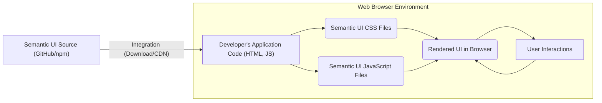
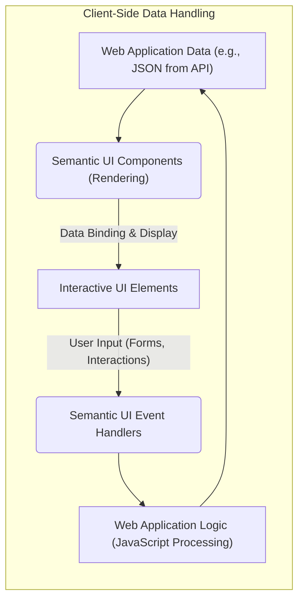

# Project Design Document: Semantic UI (Improved)

**Project Name:** Semantic UI

**Version:** 1.1

**Date:** October 26, 2023

**Prepared By:** Gemini (AI Model)

## 1. Introduction

This document provides an enhanced design overview of the Semantic UI project, a widely adopted open-source front-end development framework. This revised document is specifically designed to serve as a robust foundation for subsequent threat modeling activities. It offers a clearer articulation of the system's architecture, a more detailed breakdown of key components, a refined understanding of data flow, and a more comprehensive initial assessment of potential security concerns.

## 2. Project Overview

Semantic UI is a front-end framework that provides a collection of reusable UI components and theming capabilities built with HTML, CSS, and JavaScript. Its primary goal is to enable developers to build visually appealing and responsive web interfaces efficiently, using a shared vocabulary of UI patterns. It emphasizes intuitive class names and component structures based on natural language principles.

## 3. System Architecture

Semantic UI operates entirely within the client-side environment of a web browser. It is integrated into web applications as a set of static assets (CSS and JavaScript files). It does not have any inherent server-side functionalities.

*   **Developer's Application Code (HTML, JS):** The custom code written by developers that incorporates Semantic UI classes and JavaScript behaviors. This is where developers utilize Semantic UI to build their UI.
*   **Semantic UI CSS Files:** The core cascading stylesheets that define the visual appearance and layout of Semantic UI components.
*   **Semantic UI JavaScript Files:**  The JavaScript code providing interactivity and dynamic behavior for Semantic UI components.
*   **Rendered UI in Browser:** The final visual output displayed to the user in their web browser, styled and enhanced by Semantic UI.
*   **User Interactions:** Actions performed by the user within the browser, such as clicking buttons, filling forms, and navigating.
*   **Semantic UI Source (GitHub/npm):** The origin of the Semantic UI framework, either downloaded directly or included via package managers.

## 4. Data Flow

Semantic UI's primary function is to present and manipulate data within the client's browser. It doesn't manage persistent storage or direct server-side communication itself. It relies on the web application it's part of to provide and process data.

*   **Web Application Data (e.g., JSON from API):** Data fetched from backend services or defined within the client-side application, intended for display and interaction within the UI. This could be user profiles, product listings, etc.
*   **Semantic UI Components (Rendering):** Semantic UI elements like tables, forms, modals, and lists that are populated with data.
*   **Interactive UI Elements:** The visual representation of the data within Semantic UI components, allowing user interaction.
*   **User Input (Forms, Interactions):** Data entered by the user through Semantic UI components like form fields, selections, and button clicks.
*   **Semantic UI Event Handlers:** JavaScript functions within Semantic UI that are triggered by user interactions with the components.
*   **Web Application Logic (JavaScript Processing):** Custom JavaScript code within the web application that handles events triggered by Semantic UI, processes user input, and potentially updates the application data or communicates with backend services.

## 5. Key Components

*   **CSS Framework:**
    *   Provides a comprehensive library of CSS classes for styling and layout.
    *   Employs a human-readable naming convention, making it easier for developers to understand and use.
    *   Offers responsive design capabilities, ensuring layouts adapt to different screen sizes.
    *   Includes a theming system allowing for extensive visual customization. **Potential Threat:**  Malicious CSS injected through custom themes could lead to UI redressing or data exfiltration.
*   **JavaScript Components:**
    *   Offers interactive UI elements such as dropdowns, modals, accordions, and tooltips.
    *   Provides APIs for programmatically controlling and manipulating these components.
    *   Historically relied on jQuery (or a compatible library) for DOM manipulation, though newer versions might have reduced this dependency. **Potential Threat:** Vulnerabilities in the underlying JavaScript library (e.g., jQuery) could be exploited. Improper handling of user input within JavaScript components could lead to XSS.
*   **Themes:**
    *   Enable visual customization of the framework's appearance.
    *   Can be overridden and extended to create unique designs.
    *   Themes are primarily implemented through sets of CSS variables and style rules. **Potential Threat:**  Untrusted or poorly developed themes could introduce malicious CSS or JavaScript, leading to security vulnerabilities.
*   **Build Tools (Gulp):**
    *   Used internally for building and compiling the Semantic UI CSS and JavaScript from its source code.
    *   Handles tasks such as minification, concatenation, and asset management. **Potential Threat:** Compromise of the build pipeline could lead to the introduction of malicious code into the distributed framework.
*   **Documentation:**
    *   Provides detailed explanations of components, usage guidelines, and examples.
    *   Crucial for developers to understand how to use the framework correctly and securely. **Potential Threat:**  Inaccurate or incomplete documentation could lead to developers misusing the framework and introducing vulnerabilities.
*   **Distribution Channels:**
    *   **npm/Yarn:** Packages for easy integration into JavaScript-based projects. **Potential Threat:**  Compromised packages on npm could inject malicious code.
    *   **CDN (Content Delivery Network):** Hosting of static files for direct inclusion in HTML. **Potential Threat:**  Compromise of the CDN could lead to the delivery of malicious code to users. Lack of Subresource Integrity (SRI) checks increases this risk.
    *   **Direct Download:** Downloading source files directly from the repository. **Potential Threat:**  Risk of downloading compromised files from unofficial sources.

## 6. Security Considerations (Detailed for Threat Modeling)

This section expands on potential security concerns, providing more specific examples relevant to threat modeling.

*   **Cross-Site Scripting (XSS):**
    *   **Threat Scenario:** An attacker injects malicious JavaScript code into data that is then displayed by a Semantic UI component (e.g., a comment in a forum, a product description).
    *   **Vulnerability:** The web application fails to properly sanitize user-supplied data before rendering it through Semantic UI.
    *   **Impact:**  Execution of malicious scripts in the user's browser, potentially leading to session hijacking, data theft, or redirection to malicious sites.
*   **Dependency Vulnerabilities:**
    *   **Threat Scenario:** A known vulnerability exists in jQuery (or another underlying dependency) used by Semantic UI.
    *   **Vulnerability:** The application includes a version of Semantic UI that relies on the vulnerable dependency.
    *   **Impact:**  Attackers could exploit the dependency vulnerability to compromise the client-side application.
*   **Client-Side Logic Manipulation/Tampering:**
    *   **Threat Scenario:** An attacker gains access to the client-side code (e.g., through a browser extension vulnerability or a compromised development environment) and modifies the Semantic UI JavaScript.
    *   **Vulnerability:** Lack of integrity checks or security measures on the client-side code.
    *   **Impact:**  Altered functionality of the UI, potentially leading to data manipulation, unauthorized actions, or exposure of sensitive information.
*   **Theme Vulnerabilities:**
    *   **Threat Scenario:** A developer uses a custom or third-party Semantic UI theme that contains malicious CSS or JavaScript.
    *   **Vulnerability:** The application blindly trusts and includes external theme assets without proper review.
    *   **Impact:**  Malicious CSS could be used for UI redressing attacks (tricking users into performing unintended actions), while malicious JavaScript could lead to XSS.
*   **CDN Compromise (If Used):**
    *   **Threat Scenario:** The CDN hosting Semantic UI files is compromised by an attacker.
    *   **Vulnerability:** The application relies on a CDN without implementing Subresource Integrity (SRI) checks.
    *   **Impact:**  The attacker can inject malicious code into the Semantic UI files served by the CDN, affecting all users of the application.
*   **Misconfiguration:**
    *   **Threat Scenario:** Developers incorrectly configure or use Semantic UI components, leading to security flaws. For example, using a vulnerable configuration option or failing to properly escape data.
    *   **Vulnerability:** Lack of understanding of secure usage patterns or insufficient security awareness among developers.
    *   **Impact:**  Potential for XSS, information disclosure, or other vulnerabilities depending on the specific misconfiguration.
*   **Supply Chain Security:**
    *   **Threat Scenario:** The Semantic UI package on npm is compromised, or malicious code is introduced into the source code repository.
    *   **Vulnerability:**  Weaknesses in the software supply chain security practices.
    *   **Impact:**  Developers unknowingly include malicious code in their applications when installing or updating Semantic UI.
*   **Denial of Service (DoS) - Client-Side:**
    *   **Threat Scenario:** An attacker crafts malicious input that, when processed by Semantic UI components, causes excessive resource consumption in the user's browser, leading to a crash or unresponsiveness.
    *   **Vulnerability:** Inefficient rendering or processing of certain input patterns by Semantic UI JavaScript.
    *   **Impact:**  Inability for users to interact with the application.

## 7. Assumptions and Dependencies

*   **Secure Web Application Development:** It is assumed that the web application integrating Semantic UI follows secure development practices, including input validation, output encoding, authentication, and authorization. Semantic UI itself does not provide these security features.
*   **Modern Browser Security Features:** The security of Semantic UI relies on the security features implemented by modern web browsers (e.g., Content Security Policy (CSP), Same-Origin Policy).
*   **Developer Security Awareness:** Developers using Semantic UI are expected to have a basic understanding of web security principles and how to use the framework securely.
*   **Secure Network Communication (HTTPS):**  It is assumed that Semantic UI assets are served over secure HTTPS connections to prevent tampering during transit.
*   **Up-to-Date Dependencies:**  The security of Semantic UI is dependent on its underlying libraries (e.g., jQuery) being up-to-date with the latest security patches.

## 8. Threat Modeling Focus

This design document highlights several areas critical for effective threat modeling of applications using Semantic UI:

*   **Data Input Points:** Focus on how user-provided data interacts with Semantic UI components and ensure proper sanitization.
*   **Integration Points:** Analyze how Semantic UI is integrated into the web application and potential vulnerabilities introduced during this process.
*   **Dependency Management:**  Assess the risks associated with Semantic UI's dependencies and the process for keeping them updated.
*   **Client-Side Code Integrity:** Consider mechanisms to ensure the integrity of the Semantic UI code delivered to the client.
*   **Theming Security:** Evaluate the risks associated with using custom or third-party themes.
*   **Configuration Review:**  Examine common misconfigurations of Semantic UI components that could lead to security issues.

## 9. Future Considerations

*   Implement Subresource Integrity (SRI) for CDN-hosted assets.
*   Regularly audit and update Semantic UI and its dependencies to address security vulnerabilities.
*   Provide clear guidelines and best practices for secure usage of Semantic UI in the official documentation.
*   Consider static analysis tools to identify potential security vulnerabilities in code utilizing Semantic UI.

This improved design document provides a more detailed and security-focused overview of Semantic UI, making it a more effective resource for conducting thorough threat modeling activities.
