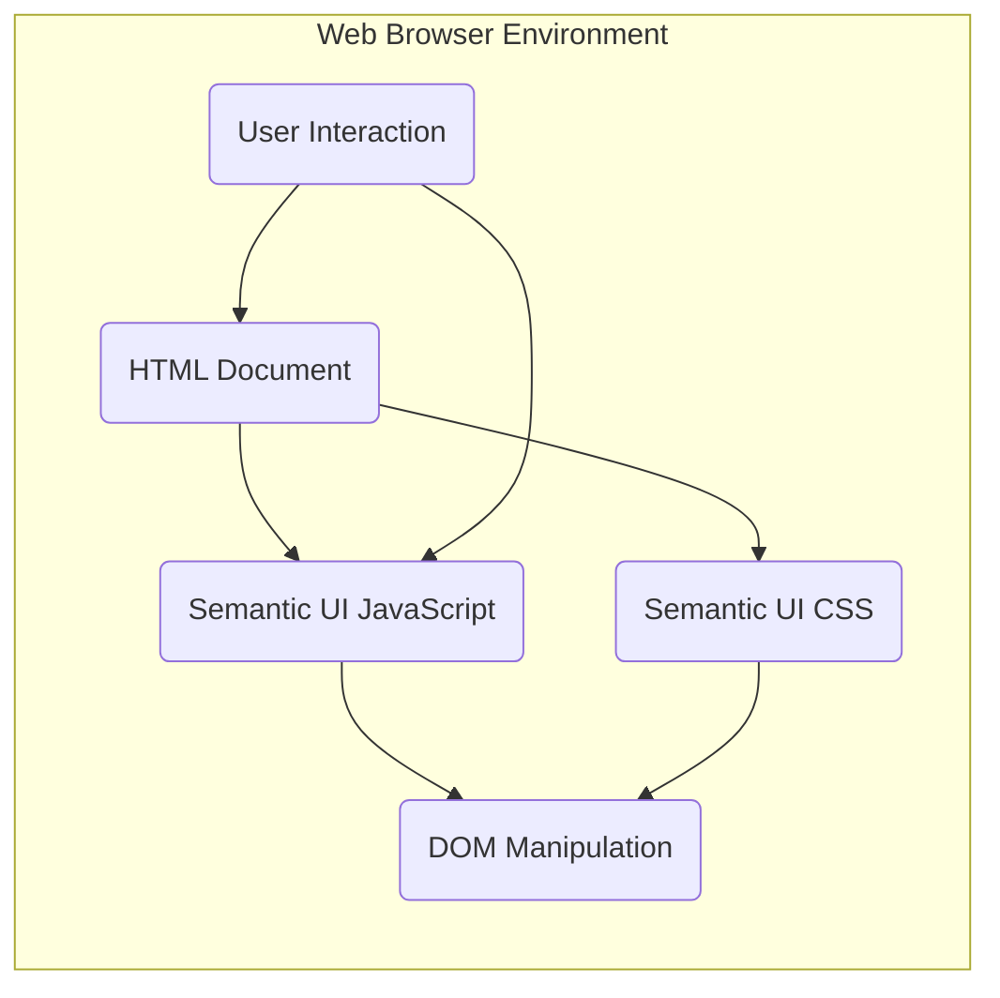
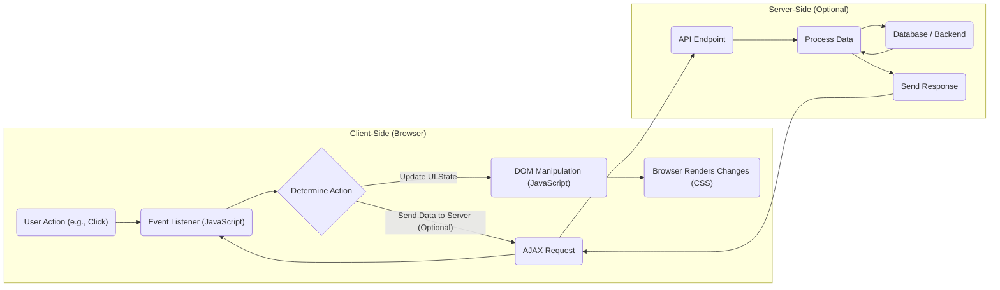

## Project Design Document: Semantic UI (Improved)

**1. Introduction**

This document provides an enhanced architectural design for the Semantic UI project, a widely-used front-end development framework. The purpose of this document is to offer a clear and detailed understanding of the project's structure, core components, data flow mechanisms, and crucial security considerations. This detailed design will serve as a robust foundation for subsequent threat modeling exercises.

**2. Goals and Objectives**

*   To furnish developers with a comprehensive and reusable library of UI components and theming capabilities for efficient web application development.
*   To maintain a codebase characterized by human-readable HTML, CSS, and JavaScript, promoting ease of understanding and modification.
*   To facilitate rapid prototyping and accelerated development cycles for user interfaces.
*   To enforce visual and functional consistency across diverse web projects, enhancing user experience.
*   To offer a highly adaptable and customizable theming system, allowing for brand-specific visual implementations.

**3. High-Level Architecture**

Semantic UI operates primarily within the client-side environment of a web browser. It functions by providing CSS stylesheets and JavaScript files that are integrated into web development projects.

*   **HTML Document:** The foundational structure of the web page where developers utilize Semantic UI's predefined classes and component structures.
*   **Semantic UI CSS:**  The collection of stylesheets that define the visual presentation and layout rules for Semantic UI's extensive library of UI components.
*   **Semantic UI JavaScript:** The set of JavaScript files that introduce interactivity and dynamic behavior to the UI components, enhancing user engagement.
*   **DOM Manipulation:**  Semantic UI's JavaScript interacts directly with the Document Object Model (DOM) to dynamically update and manipulate the user interface based on user actions and application logic.
*   **User Interaction:**  Encompasses all forms of user engagement with the web page (e.g., mouse clicks, keyboard input), triggering events that are handled by JavaScript, potentially leading to DOM updates and visual changes dictated by the CSS.

**4. Component Design**

Semantic UI is logically organized into several key functional components:

*   **CSS Library:**
    *   Offers a rich set of pre-designed styles for a wide array of UI elements, including buttons, forms, modals, menus, and more.
    *   Employs a semantic and human-friendly naming convention for CSS classes, improving code readability and maintainability.
    *   Implements a flexible grid system, empowering developers to create responsive and well-structured layouts.
    *   Adheres to responsive design principles, ensuring optimal viewing experiences across various screen sizes and devices.
    *   Provides a robust theming mechanism through the use of CSS variables and the ability to override default styles with custom stylesheets.
*   **JavaScript Library:**
    *   Adds interactive capabilities to UI components, enabling features like dropdown menus, modal dialogs, accordion panels, and tabbed interfaces.
    *   Manages user-initiated events and dynamically updates the DOM to reflect changes in application state or user interaction.
    *   Includes a collection of utility functions designed to simplify common UI-related tasks and interactions.
    *   Historically relies on the jQuery library for DOM manipulation and event handling, although efforts are underway to reduce this dependency.
*   **Themes:**
    *   Provide a powerful mechanism for customizing the visual appearance of Semantic UI components to align with specific branding or design requirements.
    *   Offers a selection of default themes (e.g., 'default', 'material', 'bootstrap') to provide starting points for customization.
    *   Empowers developers to create entirely custom themes by modifying predefined CSS variables and selectively overriding existing styles.
    *   Theming primarily involves adjustments to CSS variables, but can also extend to customizing JavaScript behavior for certain components.
*   **Build Tools:**
    *   Leverages tools such as Gulp for automating the build and distribution processes of the framework.
    *   Handles essential tasks like compiling LESS or SASS stylesheets into CSS, minifying CSS and JavaScript files for optimized performance, and generating comprehensive documentation.
    *   These tools are primarily utilized during the development and release cycles of Semantic UI itself, ensuring efficient management of the codebase.
*   **Documentation:**
    *   Provides extensive and detailed documentation outlining the usage, customization options, and best practices for utilizing the framework and its components.
    *   Includes numerous practical examples and clear usage guidelines to assist developers in effectively implementing Semantic UI.
    *   Documentation is typically generated from inline code comments and potentially supplementary documentation files, ensuring accuracy and up-to-date information.

**5. Data Flow**

The typical data flow within a web application utilizing Semantic UI follows this pattern:

*   **User Action (e.g., Click):** A user interacts with a UI element on the web page, such as clicking a button, selecting a dropdown item, or submitting a form.
*   **Event Listener (JavaScript):** Semantic UI's JavaScript library (or custom JavaScript code) has event listeners attached to relevant DOM elements to capture these user actions.
*   **Determine Action:** Based on the specific event triggered and the associated Semantic UI component, the JavaScript logic determines the appropriate action to take.
*   **Update UI State:** This may involve modifying the visual state of a component (e.g., displaying a modal, toggling a class), updating data displayed on the page, or preparing data for submission.
*   **DOM Manipulation (JavaScript):** Semantic UI's JavaScript directly manipulates the Document Object Model to reflect the updated UI state. This could involve adding or removing elements, changing attributes, or modifying content.
*   **Browser Renders Changes (CSS):** The web browser re-renders the affected portions of the page based on the CSS styles provided by Semantic UI, ensuring the visual changes are applied correctly.
*   **AJAX Request (Optional):**  User interactions may trigger asynchronous JavaScript and XML (AJAX) requests to communicate with a server-side application. This is common for submitting form data or fetching dynamic content.
*   **API Endpoint (Server-Side):** The server-side API receives the AJAX request at a specific endpoint.
*   **Process Data (Server-Side):** The server-side application processes the received data according to its business logic.
*   **Database / Backend (Server-Side):** The server may interact with a database or other backend systems to retrieve or store data.
*   **Send Response (Server-Side):** The server sends a response back to the client-side application, typically in a format like JSON.
*   **Response Handling (Client-Side):** The JavaScript code on the client-side handles the server's response, potentially updating the UI again based on the received data.

**6. Security Considerations**

While Semantic UI is primarily a front-end framework, several security considerations are crucial for applications utilizing it:

*   **Cross-Site Scripting (XSS):**
    *   A primary concern is the potential for XSS vulnerabilities if user-supplied data is directly injected into the DOM without proper sanitization.
    *   Developers must diligently sanitize any user input before rendering it using Semantic UI components to prevent malicious scripts from being executed.
    *   The core Semantic UI framework itself should be designed to avoid introducing inherent XSS vulnerabilities.
*   **Dependency Vulnerabilities:**
    *   Semantic UI relies on external libraries, notably jQuery (though this dependency is being addressed). Security vulnerabilities discovered in these dependencies could potentially impact applications using Semantic UI.
    *   Regularly updating Semantic UI and its dependencies is essential to patch known vulnerabilities. Utilizing dependency scanning tools can aid in this process.
*   **Content Security Policy (CSP):**
    *   Implementing a robust Content Security Policy (CSP) is highly recommended for applications using Semantic UI to mitigate the risk of XSS attacks.
    *   The CSP should be configured to explicitly allow the loading of Semantic UI's CSS and JavaScript files from trusted sources while restricting other potentially malicious sources.
*   **Subresource Integrity (SRI):**
    *   When including Semantic UI files from a Content Delivery Network (CDN), utilizing Subresource Integrity (SRI) tags provides an added layer of security.
    *   SRI tags ensure that the browser only executes files from the CDN if their content matches a known cryptographic hash, preventing the execution of tampered files.
*   **Denial of Service (DoS):**
    *   While less direct, poorly implemented or excessively complex UI interactions built with Semantic UI could potentially contribute to client-side performance issues.
    *   Malicious actors could potentially exploit these performance bottlenecks to create a client-side Denial of Service (DoS) situation.
*   **Theme Security:**
    *   If applications allow users to upload or select custom themes from untrusted sources, this could introduce security risks.
    *   Malicious themes could potentially contain harmful CSS or JavaScript that could compromise the application or user data. Thoroughly vetting custom themes is crucial.
*   **Build Process Security:**
    *   The security of the Semantic UI build process itself is important. Compromises in the build pipeline could lead to the introduction of malicious code into the framework's distribution.
    *   Maintaining secure development practices and infrastructure for the Semantic UI project is vital.

**7. Deployment Considerations**

Semantic UI is typically deployed by incorporating its CSS and JavaScript files into a web project. Common deployment methods include:

*   **Direct Download and Inclusion:** Downloading the pre-built Semantic UI files and including them directly within the project's file structure.
*   **Content Delivery Network (CDN) Linking:** Referencing Semantic UI files hosted on a public CDN. This can improve loading times by leveraging browser caching and geographically distributed servers.
*   **Package Managers (npm, yarn):** Installing Semantic UI as a project dependency using package managers like npm or yarn. This integrates Semantic UI into the project's build process and simplifies dependency management.

The chosen deployment method can influence factors like performance, caching behavior, and security (e.g., using a CDN with SRI offers potential security advantages).

**8. Dependencies**

*   **jQuery:** Historically, jQuery has been a core dependency of Semantic UI, providing essential functionality for DOM manipulation, event handling, and AJAX interactions. Efforts are underway to reduce or eliminate this dependency in future versions.
*   **Build Tools (Gulp, etc.):** These tools are essential for the development and release process of Semantic UI itself, automating tasks like compilation, minification, and documentation generation.
*   **LESS/SASS (or other CSS Preprocessors):** Used during the development of Semantic UI's CSS to enable features like variables, mixins, and nested rules, improving the maintainability and organization of the stylesheets.

**9. Future Considerations**

*   **Reduced jQuery Dependency:** A significant focus is on minimizing or completely removing the dependency on jQuery to enhance performance, reduce bundle sizes, and align with modern JavaScript development practices.
*   **Web Components Adoption:** Exploring the adoption of Web Components standards for building more encapsulated, reusable, and interoperable UI elements. This could lead to a more modular and maintainable architecture.
*   **Accessibility Enhancements:** Continuous efforts to improve the accessibility of Semantic UI components, ensuring they are usable by individuals with disabilities, adhering to WCAG guidelines.
*   **Performance Optimization:** Ongoing initiatives to optimize the performance of the framework, focusing on reducing file sizes, improving rendering speed, and minimizing resource consumption.

This improved design document provides a more detailed and nuanced understanding of the Semantic UI project's architecture, offering a solid foundation for comprehensive threat modeling activities. By thoroughly understanding the components, data flow, and potential security implications, security professionals can effectively identify and mitigate potential risks associated with the use of this popular front-end framework.