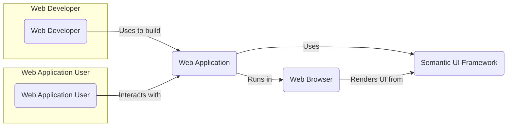
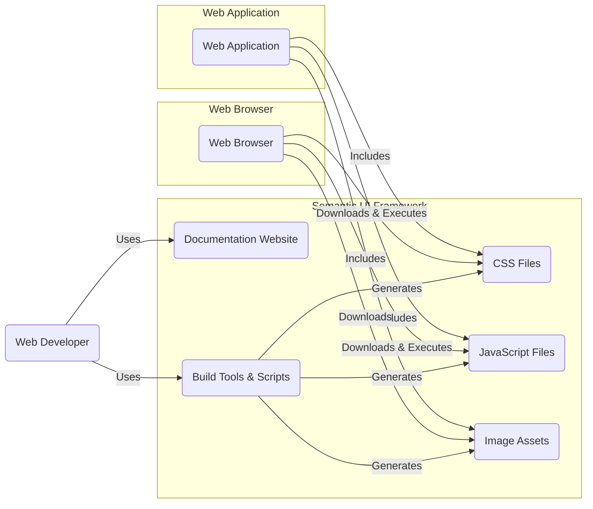
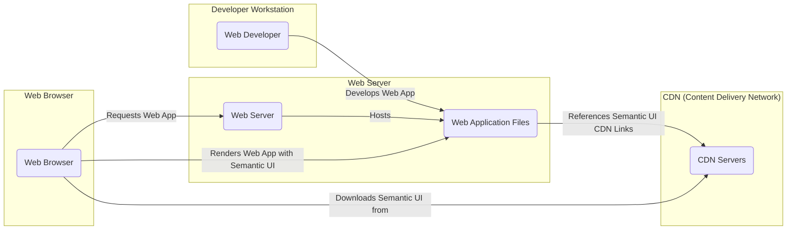
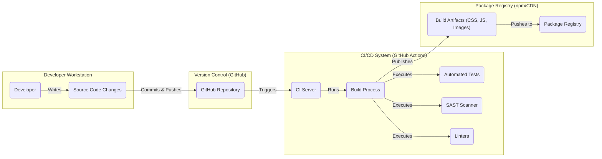

# BUSINESS POSTURE

Semantic UI is an open-source user interface (UI) framework that aims to empower designers and developers to create beautiful, responsive websites and applications. The primary business goal is to provide a reusable, community-driven library of UI components that simplifies front-end development. It prioritizes ease of use, flexibility, and a visually appealing design system.

Key business priorities for Semantic UI include:
- Maintaining a high-quality, well-documented UI framework.
- Fostering a strong and active community of users and contributors.
- Ensuring compatibility with modern web browsers and technologies.
- Providing a customizable and extensible framework to meet diverse project needs.

Most important business risks that need to be addressed:
- Community Dependency Risk: Reliance on community contributions for maintenance, updates, and security fixes. A decline in community engagement could lead to stagnation or security vulnerabilities remaining unaddressed.
- Software Quality Risk: Defects or inconsistencies in the framework could negatively impact user experience and project timelines for developers using Semantic UI.
- Security Vulnerability Risk: Security flaws in the framework could be exploited in applications built using Semantic UI, leading to potential data breaches or other security incidents.
- Compatibility Risk: Lack of compatibility with new browsers, devices, or web technologies could limit the framework's usability and adoption.

# SECURITY POSTURE

Existing security controls:
- security control: Publicly accessible GitHub repository. This allows for community review of code and potential identification of vulnerabilities. Implemented in: GitHub platform.
- security control: Open-source licensing (MIT License). This promotes transparency and allows for broad usage and scrutiny of the codebase. Implemented in: LICENSE file in the repository.
- security control: Issue tracking system on GitHub. Used for reporting bugs and feature requests, which can include security-related issues. Implemented in: GitHub Issues.
- security control: Community contributions and pull requests.  Peer review by community members can help identify potential security issues in code changes. Implemented in: GitHub Pull Request process.

Accepted risks:
- accepted risk: Reliance on community for security vulnerability discovery and patching. Response time to security issues may vary depending on community activity.
- accepted risk: Potential for vulnerabilities to exist in the codebase due to the complexity of UI framework and community-driven development.
- accepted risk: No formal security audit process is explicitly documented.

Recommended security controls:
- security control: Implement automated security scanning tools (SAST/DAST) in the CI/CD pipeline to proactively identify potential vulnerabilities in code changes.
- security control: Establish a clear process for reporting and handling security vulnerabilities, including a security policy and contact information.
- security control: Conduct periodic security reviews or penetration testing, potentially engaging external security experts, to identify and address security weaknesses.
- security control: Implement dependency scanning to identify and manage vulnerabilities in third-party libraries used by the build process or framework itself.
- security control:  Promote and enforce secure coding practices among contributors through documentation and code review guidelines.

Security requirements:
- Authentication: Not directly applicable to a UI framework. Semantic UI itself does not handle user authentication. Applications using Semantic UI will implement their own authentication mechanisms.
- Authorization: Not directly applicable to a UI framework. Semantic UI components are used to build user interfaces, and authorization logic is implemented within the application using the framework.
- Input Validation: Relevant for UI components that handle user input (e.g., forms, input fields). Semantic UI should encourage or provide mechanisms for developers to easily implement client-side input validation to prevent common vulnerabilities like cross-site scripting (XSS). Security requirement: Ensure that documentation and examples highlight the importance of input validation when using form components.
- Cryptography: Not a primary security requirement for a UI framework itself. However, if Semantic UI provides components that might be used for handling sensitive data (e.g., password input fields), it should follow secure development practices and avoid introducing vulnerabilities. Security requirement: Ensure that any components dealing with sensitive data do not introduce cryptographic weaknesses or vulnerabilities.

# DESIGN

## C4 CONTEXT

Context Diagram Elements:

- Element:
  - Name: Web Application User
  - Type: Person
  - Description: End-users who interact with web applications built using Semantic UI.
  - Responsibilities: Accessing and using web applications through web browsers.
  - Security controls: Browser security features, user device security.

- Element:
  - Name: Web Developer
  - Type: Person
  - Description: Software developers who use Semantic UI to create the user interface of web applications.
  - Responsibilities: Developing and maintaining web applications, integrating Semantic UI into their projects, ensuring secure usage of the framework.
  - Security controls: Secure development practices, code review, developer workstations security.

- Element:
  - Name: Semantic UI Framework
  - Type: Software System
  - Description: An open-source UI component library providing pre-built HTML, CSS, and JavaScript components for building user interfaces.
  - Responsibilities: Providing reusable UI components, styling and layout functionality, responsiveness across devices.
  - Security controls: Input validation guidance in documentation, community code review, potential future automated security scanning.

- Element:
  - Name: Web Browser
  - Type: Software System
  - Description: Software application used by web application users to access and interact with web applications. Examples include Chrome, Firefox, Safari, Edge.
  - Responsibilities: Rendering web pages, executing JavaScript, enforcing browser security policies (e.g., Same-Origin Policy).
  - Security controls: Browser security features (e.g., XSS protection, Content Security Policy enforcement), sandboxing, regular updates.

- Element:
  - Name: Web Application
  - Type: Software System
  - Description: A web-based application built by web developers, utilizing Semantic UI for its user interface.
  - Responsibilities: Providing specific application functionality to users, handling user requests, managing data, implementing application-level security controls.
  - Security controls: Authentication, authorization, input validation, secure session management, application firewalls, vulnerability scanning.

## C4 CONTAINER

Container Diagram Elements:

- Element:
  - Name: CSS Files
  - Type: Container
  - Description: Cascading Style Sheets files that define the visual styling and layout of Semantic UI components.
  - Responsibilities: Providing the visual appearance of the UI framework, handling responsive design.
  - Security controls: Content Security Policy (CSP) to mitigate XSS risks, Subresource Integrity (SRI) for CDN delivery.

- Element:
  - Name: JavaScript Files
  - Type: Container
  - Description: JavaScript files that provide interactive behavior and dynamic functionality for Semantic UI components.
  - Responsibilities: Implementing component behavior, handling user interactions, providing dynamic UI updates.
  - Security controls: Input validation within JavaScript components, secure coding practices, potential SAST scanning of JavaScript code.

- Element:
  - Name: Image Assets
  - Type: Container
  - Description: Image files (icons, logos, etc.) used by Semantic UI components for visual enhancements.
  - Responsibilities: Providing visual assets for the UI framework.
  - Security controls:  Regularly scan for malware, ensure images are served securely (HTTPS).

- Element:
  - Name: Documentation Website
  - Type: Container
  - Description: A website providing documentation, examples, and guides for using Semantic UI.
  - Responsibilities:  Helping developers understand and use Semantic UI effectively, showcasing components and features.
  - Security controls: Standard web application security practices (authentication for admin areas if any, input validation, protection against common web vulnerabilities), HTTPS.

- Element:
  - Name: Build Tools & Scripts
  - Type: Container
  - Description: Scripts and tools used to build, test, and package Semantic UI from source code. This includes task runners, compilers, and testing frameworks.
  - Responsibilities: Automating the build process, ensuring code quality, generating distributable assets.
  - Security controls: Secure build environment, dependency scanning, code linting, SAST scanning, access control to build infrastructure.

## DEPLOYMENT

Semantic UI is typically deployed in a few ways:

1.  **CDN (Content Delivery Network):**  Developers link to Semantic UI CSS and JavaScript files hosted on a CDN. This is a common and convenient method for quick integration.
2.  **Package Managers (npm, Yarn):** Developers install Semantic UI as a dependency in their project using package managers. This allows for more control over versioning and customization.
3.  **Self-Hosting:** Developers download Semantic UI files and host them directly on their own web servers. This provides maximum control but requires more setup.

For detailed description, let's consider **CDN Deployment**:

Deployment Diagram Elements (CDN Deployment):

- Element:
  - Name: Web Developer
  - Type: Infrastructure
  - Description: Developer's local machine used for writing code and building web applications.
  - Responsibilities: Developing and testing web applications that use Semantic UI.
  - Security controls: Developer workstation security practices, antivirus, firewall.

- Element:
  - Name: CDN Servers
  - Type: Infrastructure
  - Description: Network of geographically distributed servers hosting Semantic UI CSS, JavaScript, and image files.
  - Responsibilities: Providing fast and reliable delivery of Semantic UI assets to web browsers globally.
  - Security controls: CDN provider's security measures (DDoS protection, access controls, physical security), HTTPS delivery, Subresource Integrity (SRI) hashes.

- Element:
  - Name: Web Server
  - Type: Infrastructure
  - Description: Server hosting the web application files (HTML, application-specific JavaScript, etc.).
  - Responsibilities: Serving the web application to users, handling user requests.
  - Security controls: Web server hardening, firewall, intrusion detection/prevention systems, regular security updates, HTTPS.

- Element:
  - Name: Web Application Files
  - Type: Software
  - Description: Files comprising the web application, including HTML, application-specific JavaScript, and references to Semantic UI CDN links.
  - Responsibilities: Defining the structure and behavior of the web application.
  - Security controls: Application-level security controls (authentication, authorization, input validation), secure coding practices.

- Element:
  - Name: Web Browser
  - Type: Infrastructure
  - Description: User's web browser accessing the web application.
  - Responsibilities: Rendering the web application, executing JavaScript, downloading Semantic UI assets from CDN.
  - Security controls: Browser security features, user device security.

## BUILD

Build Process Diagram Elements:

- Element:
  - Name: Developer
  - Type: Person
  - Description: Software developer contributing code changes to the Semantic UI project.
  - Responsibilities: Writing code, fixing bugs, implementing features, committing and pushing code changes.
  - Security controls: Secure coding practices, code review, developer workstation security.

- Element:
  - Name: Source Code Changes
  - Type: Data
  - Description: Modifications to the Semantic UI source code made by developers.
  - Responsibilities: Representing new features, bug fixes, or improvements to the framework.
  - Security controls: Version control (Git) to track changes and revert if necessary.

- Element:
  - Name: GitHub Repository
  - Type: System
  - Description: Central repository hosting the Semantic UI source code, issue tracking, and collaboration features.
  - Responsibilities: Version control, code storage, issue management, pull request management.
  - Security controls: Access control (GitHub permissions), branch protection, audit logs.

- Element:
  - Name: CI Server (GitHub Actions)
  - Type: System
  - Description: Continuous Integration server (likely GitHub Actions) that automates the build, test, and deployment process.
  - Responsibilities: Automating build process, running tests, performing security checks, publishing artifacts.
  - Security controls: Access control to CI/CD pipelines, secure configuration of CI/CD workflows, secrets management, audit logs.

- Element:
  - Name: Build Process
  - Type: Process
  - Description: Automated scripts and tools that compile, build, and package Semantic UI from source code.
  - Responsibilities: Compiling code, bundling assets, running tests, generating distributable artifacts.
  - Security controls: Secure build scripts, dependency management, input validation in build scripts.

- Element:
  - Name: Automated Tests
  - Type: Process
  - Description: Automated tests (unit, integration, etc.) executed during the build process to ensure code quality and functionality.
  - Responsibilities: Verifying code correctness, detecting regressions, improving code reliability.
  - Security controls: Secure test environment, test coverage for security-relevant functionality.

- Element:
  - Name: SAST Scanner
  - Type: Tool
  - Description: Static Application Security Testing tool integrated into the build process to automatically scan code for potential vulnerabilities.
  - Responsibilities: Proactively identifying potential security flaws in the source code.
  - Security controls: Properly configured SAST tool, regular updates to vulnerability rules.

- Element:
  - Name: Linters
  - Type: Tool
  - Description: Code linters used to enforce code style and identify potential code quality issues.
  - Responsibilities: Improving code consistency and readability, identifying potential bugs or stylistic issues.
  - Security controls: Properly configured linters to enforce secure coding guidelines.

- Element:
  - Name: Build Artifacts (CSS, JS, Images)
  - Type: Data
  - Description: Compiled and packaged CSS, JavaScript, and image files ready for distribution.
  - Responsibilities: Representing the distributable version of Semantic UI.
  - Security controls: Integrity checks (checksums, signatures), secure storage.

- Element:
  - Name: Package Registry (npm/CDN)
  - Type: System
  - Description: Package registry (like npm) or CDN where Semantic UI build artifacts are published for developers to consume.
  - Responsibilities: Distributing Semantic UI packages to developers, hosting CDN files.
  - Security controls: Access control to package registry, secure CDN infrastructure, malware scanning of published packages, Subresource Integrity (SRI) hashes for CDN delivery.

# RISK ASSESSMENT

Critical business processes we are trying to protect:
- Development and distribution of Semantic UI framework.
- Maintaining the integrity and availability of the Semantic UI framework for web developers.
- Ensuring the security and reliability of web applications built using Semantic UI (indirectly).

Data we are trying to protect and their sensitivity:
- Source code of Semantic UI: Publicly available, but integrity is important to prevent malicious modifications. Sensitivity: Public, Integrity: High.
- Build artifacts (CSS, JS, images): Publicly available, but integrity is crucial to prevent distribution of compromised files. Sensitivity: Public, Integrity: High.
- Documentation website content: Publicly available, integrity and availability are important for user experience. Sensitivity: Public, Integrity: Medium, Availability: Medium.
- Build process and CI/CD pipeline configuration: Confidential, access control is important to prevent unauthorized modifications. Sensitivity: Confidential, Integrity: High.
- Developer credentials and access keys: Confidential, critical to protect against unauthorized access to infrastructure and code repositories. Sensitivity: Confidential, Integrity: High, Availability: High.

# QUESTIONS & ASSUMPTIONS

Questions:
- Is there a formal security incident response plan for Semantic UI?
- Are there any specific security testing practices currently in place beyond community code review?
- What is the process for managing and patching vulnerabilities in third-party dependencies?
- Are there any plans to implement automated security scanning tools in the CI/CD pipeline?
- Is there a designated security contact or team for the Semantic UI project?

Assumptions:
- Semantic UI project relies heavily on community contributions for security.
- There is no dedicated security team actively monitoring and securing the project.
- Security awareness and secure coding practices among contributors may vary.
- The primary deployment method is CDN or package managers.
- The build process is automated using CI/CD, likely GitHub Actions.
- The project aims to provide a secure and reliable UI framework, but security is not the absolute top priority compared to functionality and ease of use.