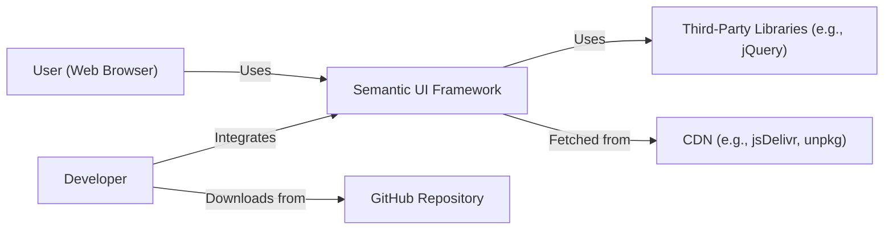
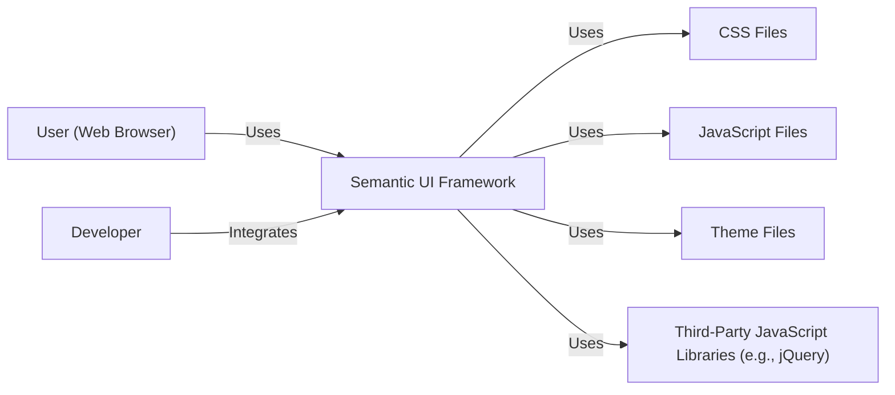
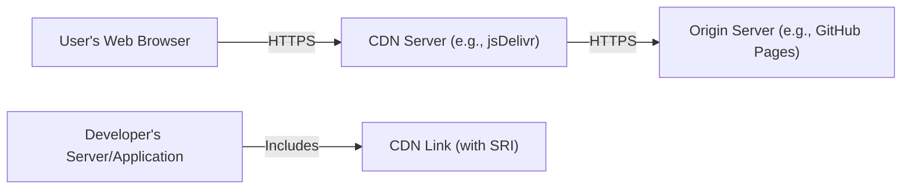
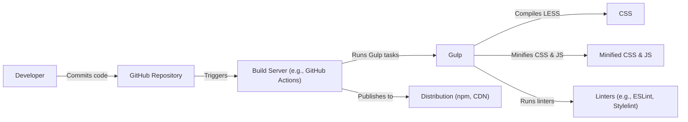

Okay, let's create a design document for the Semantic UI project, focusing on aspects relevant for threat modeling.

# BUSINESS POSTURE

Semantic UI is a front-end development framework, similar to Bootstrap, that helps developers create beautiful, responsive layouts using human-friendly HTML.  The project's primary goal is to empower designers and developers to build websites quickly and efficiently with a consistent look and feel.  It's an open-source project, meaning community contributions and widespread adoption are key to its success.

Business Priorities:

*   Ease of Use:  Make it simple for developers of all skill levels to use the framework.
*   Consistency:  Provide a unified look and feel across different web applications.
*   Customizability:  Allow developers to easily theme and customize the framework to match their brand.
*   Community Growth:  Foster a strong and active community of users and contributors.
*   Maintainability: Ensure the codebase is well-maintained and easy to update.
*   Performance: Deliver fast loading times and smooth user experiences.

Business Risks:

*   Reputation Damage:  Security vulnerabilities in the framework could be exploited, leading to compromised websites and damage to the Semantic UI brand.
*   Loss of User Trust:  If the framework is perceived as insecure, developers may choose alternative solutions.
*   Maintenance Overhead:  Unaddressed security issues could lead to increased maintenance costs and effort.
*   Supply Chain Attacks: Compromise of the build or distribution process could inject malicious code.
*   Lack of Adoption: If the framework is difficult to use or perceived as insecure, it may not gain widespread adoption.

# SECURITY POSTURE

Existing Security Controls:

*   security control: Code Reviews: The GitHub repository shows evidence of pull requests and code reviews, which are essential for identifying potential security issues. (Visible in the GitHub repository's Pull Requests section).
*   security control: Community Scrutiny: Being an open-source project, the codebase is subject to scrutiny by a large community of developers, increasing the likelihood of discovering vulnerabilities. (Implicit in the open-source nature of the project).
*   security control: Issue Tracking: The GitHub Issues section allows users to report bugs and potential security vulnerabilities. (Visible in the GitHub repository's Issues section).

Accepted Risks:

*   accepted risk: Reliance on Third-Party Libraries: Semantic UI, like most front-end frameworks, likely depends on third-party JavaScript libraries.  Vulnerabilities in these dependencies could impact the security of Semantic UI.
*   accepted risk: XSS Potential:  Without strict adherence to secure coding practices by *users* of the framework, there's an inherent risk of Cross-Site Scripting (XSS) vulnerabilities in applications built with Semantic UI.  The framework itself can provide tools to mitigate this, but ultimately, the responsibility lies with the developers using it.
*   accepted risk: CSRF Potential: Similar to XSS, applications built using Semantic UI are susceptible to Cross-Site Request Forgery attacks if developers do not implement appropriate protections.

Recommended Security Controls:

*   security control: Content Security Policy (CSP):  Provide clear guidance and examples in the documentation on implementing CSP to mitigate XSS risks.
*   security control: Subresource Integrity (SRI):  Encourage the use of SRI tags when including Semantic UI from CDNs to prevent the loading of compromised files.
*   security control: Regular Security Audits: Conduct periodic security audits, both manual and automated, to identify potential vulnerabilities.
*   security control: Dependency Management: Implement a robust dependency management process to track and update third-party libraries, addressing known vulnerabilities promptly.
*   security control: Security Training: Provide security training materials or guidelines for developers using Semantic UI, emphasizing secure coding practices.

Security Requirements:

*   Authentication: Not directly applicable to the framework itself, as Semantic UI is a front-end framework and doesn't handle authentication. However, documentation should advise on secure integration with authentication systems.
*   Authorization: Not directly applicable to the framework itself. Similar to authentication, guidance should be provided on securely integrating with authorization mechanisms.
*   Input Validation: The framework should provide utilities or guidance to help developers sanitize user input and prevent XSS vulnerabilities.  This includes escaping output appropriately.
*   Cryptography: While not a primary focus, if the framework includes any cryptographic functionality (e.g., hashing for form validation), it should use well-established and secure cryptographic libraries. Documentation should clearly state any cryptographic assumptions or limitations.

# DESIGN

## C4 CONTEXT

Element Descriptions:

*   Element:
    *   Name: User (Web Browser)
    *   Type: Person
    *   Description: A person interacting with a web application built using Semantic UI.
    *   Responsibilities: Browsing the web application, interacting with UI elements.
    *   Security controls: Browser security features (e.g., same-origin policy, CSP).

*   Element:
    *   Name: Semantic UI Framework
    *   Type: Software System
    *   Description: The core Semantic UI framework, providing UI components and styling.
    *   Responsibilities: Providing UI elements, handling user interactions, managing styles.
    *   Security controls: Code reviews, community scrutiny, input validation helpers (if provided).

*   Element:
    *   Name: Third-Party Libraries (e.g., jQuery)
    *   Type: Software System
    *   Description: External libraries used by Semantic UI.
    *   Responsibilities: Providing functionality used by Semantic UI (e.g., DOM manipulation).
    *   Security controls: Dependency management, vulnerability scanning.

*   Element:
    *   Name: CDN (e.g., jsDelivr, unpkg)
    *   Type: Software System
    *   Description: Content Delivery Network used to distribute Semantic UI files.
    *   Responsibilities: Hosting and delivering Semantic UI files to users.
    *   Security controls: CDN provider's security measures, Subresource Integrity (SRI).

*   Element:
    *   Name: Developer
    *   Type: Person
    *   Description: A software developer who integrates Semantic UI into their web application.
    *   Responsibilities: Integrating Semantic UI, customizing themes, writing application logic.
    *   Security controls: Secure coding practices, adherence to Semantic UI security guidelines.

*   Element:
    *   Name: GitHub Repository
    *   Type: Software System
    *   Description: The source code repository for Semantic UI.
    *   Responsibilities: Hosting the source code, managing issues and pull requests.
    *   Security controls: GitHub's security features, access controls, code reviews.

## C4 CONTAINER

Since Semantic UI is a front-end framework, the container diagram is essentially an extension of the context diagram. It doesn't have server-side components or databases in the traditional sense.

Element Descriptions:

*   Element:
    *   Name: User (Web Browser)
    *   Type: Person
    *   Description: A person interacting with a web application built using Semantic UI.
    *   Responsibilities: Browsing the web application, interacting with UI elements.
    *   Security controls: Browser security features (e.g., same-origin policy, CSP).

*   Element:
    *   Name: Semantic UI Framework
    *   Type: Software System
    *   Description: The core Semantic UI framework, providing UI components and styling.
    *   Responsibilities: Providing UI elements, handling user interactions, managing styles.
    *   Security controls: Code reviews, community scrutiny, input validation helpers (if provided).

*   Element:
    *   Name: CSS Files
    *   Type: Container
    *   Description: Static CSS files that define the styling of Semantic UI components.
    *   Responsibilities: Providing visual styles for UI elements.
    *   Security controls: None specific (CSS injection is a very minor risk).

*   Element:
    *   Name: JavaScript Files
    *   Type: Container
    *   Description: JavaScript files that provide the interactive behavior of Semantic UI components.
    *   Responsibilities: Handling user interactions, manipulating the DOM.
    *   Security controls: Code reviews, input validation, output encoding.

*   Element:
    *   Name: Theme Files
    *   Type: Container
    *   Description: Files that allow customization of the default Semantic UI theme.
    *   Responsibilities: Providing customizable styles and layouts.
    *   Security controls: None specific.

*   Element:
    *   Name: Third-Party JavaScript Libraries (e.g., jQuery)
    *   Type: Container
    *   Description: External JavaScript libraries that Semantic UI depends on.
    *   Responsibilities: Providing underlying functionality.
    *   Security controls: Dependency management, vulnerability scanning.

*   Element:
    *   Name: Developer
    *   Type: Person
    *   Description: A software developer who integrates Semantic UI into their web application.
    *   Responsibilities: Integrating Semantic UI, customizing themes, writing application logic.
    *   Security controls: Secure coding practices, adherence to Semantic UI security guidelines.

## DEPLOYMENT

Semantic UI, being a front-end framework, is typically deployed in one of the following ways:

1.  **Direct Inclusion:**  Downloading the files and including them directly in the web application's project structure.
2.  **CDN:**  Linking to the files hosted on a Content Delivery Network (CDN) like jsDelivr or unpkg.
3.  **Package Manager:**  Installing Semantic UI as a package using a package manager like npm or yarn.

We'll describe the CDN deployment model, as it's a common and recommended approach:

Element Descriptions:

*   Element:
    *   Name: User's Web Browser
    *   Type: Software System
    *   Description: The user's web browser, which requests and renders the web application.
    *   Responsibilities: Making HTTP requests, rendering HTML, executing JavaScript.
    *   Security controls: Browser security features, same-origin policy, CSP.

*   Element:
    *   Name: CDN Server (e.g., jsDelivr)
    *   Type: Infrastructure Node
    *   Description: A server belonging to the CDN, serving Semantic UI files.
    *   Responsibilities: Hosting and delivering Semantic UI files.
    *   Security controls: CDN provider's security measures, HTTPS.

*   Element:
    *   Name: Origin Server (e.g., GitHub Pages)
    *   Type: Infrastructure Node
    *   Description: The server where the original Semantic UI files are hosted.
    *   Responsibilities: Providing the source of truth for Semantic UI files.
    *   Security controls: Server security measures, access controls.

*   Element:
    *   Name: Developer's Server/Application
    *   Type: Software System
    *   Description: The web server hosting the application that uses Semantic UI.
    *   Responsibilities: Serving the main application HTML.
    *   Security controls: Server security measures, secure coding practices.

*   Element:
    *   Name: CDN Link (with SRI)
    *   Type: Relationship
    *   Description: The HTML link tag that includes Semantic UI from the CDN, including the Subresource Integrity (SRI) attribute.
    *   Responsibilities: Specifying the location of Semantic UI files and their cryptographic hashes.
    *   Security controls: Subresource Integrity (SRI).

## BUILD

The Semantic UI build process involves several steps, from compiling source files (LESS) to creating minified distributions. While the GitHub repository provides details, here's a simplified overview focusing on security:

Security Controls in the Build Process:

*   security control: Linters:  Linters (like ESLint and Stylelint) are used to enforce coding standards and identify potential code quality issues, which can indirectly improve security.
*   security control: Automated Build:  The build process is automated (likely using Gulp and potentially GitHub Actions), reducing the risk of manual errors.
*   security control: Dependency Management:  Package managers (npm/yarn) are used to manage dependencies, allowing for easier tracking and updating of third-party libraries.
*   security control: Code Reviews:  The GitHub workflow likely includes code reviews before merging changes into the main branch.

# RISK ASSESSMENT

*   Critical Business Process: The primary business process is providing a reliable and easy-to-use front-end framework for web development.  Compromising this process would damage the project's reputation and hinder its adoption.

*   Data to Protect:
    *   Source Code:  The Semantic UI source code itself is the primary data to protect.  Unauthorized modifications could introduce vulnerabilities. (Sensitivity: Medium - Publicly available, but integrity is crucial).
    *   User Data (Indirectly):  While Semantic UI doesn't directly handle user data, vulnerabilities in the framework could be exploited to steal user data from applications *built* with Semantic UI. (Sensitivity: High - Depending on the application using Semantic UI).
    *   Contributor Information:  Information about contributors (e.g., email addresses) is stored in the repository. (Sensitivity: Low).
    *   Build Artifacts: Compiled and minified versions of the framework. (Sensitivity: Medium)

# QUESTIONS & ASSUMPTIONS

*   Questions:
    *   What is the specific process for handling reported security vulnerabilities? Is there a dedicated security contact or process?
    *   Are there any plans for formal security audits or penetration testing?
    *   What is the exact build environment and tooling used? (Confirmation of GitHub Actions, specific Gulp tasks, etc.)
    *   What is the policy for updating third-party dependencies? How often are they reviewed and updated?
    *   Are there any specific security guidelines or recommendations provided to developers *using* Semantic UI?

*   Assumptions:
    *   BUSINESS POSTURE: The project prioritizes community growth and ease of use, but also recognizes the importance of security for maintaining trust.
    *   SECURITY POSTURE: The project relies heavily on community scrutiny and code reviews for security, but may lack formal security processes.
    *   DESIGN: The deployment model via CDN is the most common and recommended approach. The build process is automated and uses standard tools like Gulp.
    *   The project uses GitHub for version control, issue tracking, and potentially CI/CD.
    *   Developers using Semantic UI are responsible for implementing application-level security measures (e.g., input validation, output encoding, CSRF protection).
    *   Semantic UI depends on third-party libraries, particularly jQuery.
    *   The build process includes linting and minification.
    *   There is some level of automated build process, likely using Gulp as indicated in the repository.