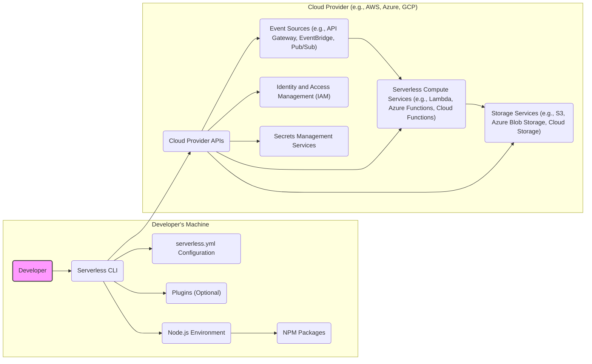
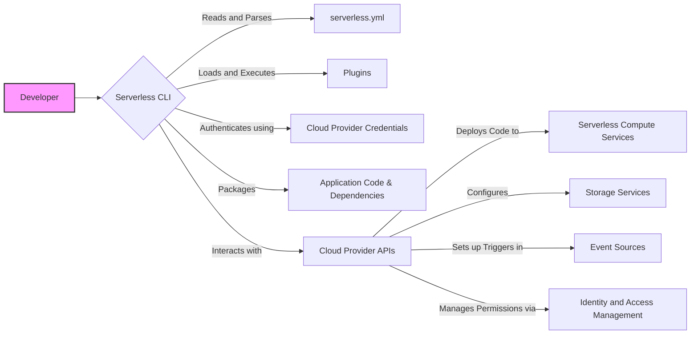

# Project Design Document: Serverless Framework

**Version:** 1.1
**Date:** October 26, 2023
**Author:** AI Software Architect

## 1. Introduction

This document provides a detailed architectural design of the Serverless Framework, an open-source command-line interface (CLI) tool that empowers developers to deploy and manage serverless applications across various cloud providers. This document aims to offer a comprehensive understanding of the framework's components, their interactions, and the data flows involved. This detailed design will serve as a robust foundation for subsequent threat modeling activities, enabling a thorough security analysis.

## 2. Goals and Objectives

The primary goals of the Serverless Framework are:

*   To simplify the deployment and lifecycle management of serverless applications.
*   To provide a consistent and unified developer experience irrespective of the underlying cloud provider.
*   To automate the provisioning and configuration of necessary infrastructure for serverless resources.
*   To enable developers to concentrate on application logic, minimizing the need for manual infrastructure management.
*   To offer broad support for diverse serverless technologies and a wide array of event sources.
*   To facilitate extensibility and customization through a well-defined plugin system.

## 3. High-Level Architecture

The Serverless Framework primarily operates within the developer's local environment, orchestrating interactions with cloud provider APIs. The fundamental components engaged in a typical development and deployment workflow are depicted below:

**Components:**

*   **Developer:** The individual utilizing the Serverless Framework to build and deploy applications.
*   **Serverless CLI:** The command-line interface, serving as the primary interaction point for developers.
*   **`serverless.yml` Configuration:** A YAML file that declaratively defines the serverless application's configuration, encompassing functions, event triggers, required resources, and cloud provider-specific settings.
*   **Plugins (Optional):**  Extend the core functionalities of the Serverless Framework, offering custom features and integrations.
*   **Node.js Environment:** The runtime environment necessary for executing the Serverless CLI and its associated plugins.
*   **NPM Packages:**  The collection of Node.js modules and libraries utilized by the Serverless CLI and plugins.
*   **Cloud Provider APIs:** The programmatic interfaces used to communicate with the target cloud platform (e.g., AWS SDK, Azure SDK, Google Cloud Client Libraries). These include APIs for compute, storage, identity, and more.
*   **Serverless Compute Services:** The platform-managed compute environments where the application code is executed (e.g., AWS Lambda, Azure Functions, Google Cloud Functions).
*   **Storage Services:** Services provided for storing application artifacts, deployment packages, and potentially application data (e.g., AWS S3, Azure Blob Storage, Google Cloud Storage).
*   **Event Sources:** Services that initiate the execution of serverless functions based on specific events (e.g., AWS API Gateway, Azure Event Grid, Google Cloud Pub/Sub).
*   **Identity and Access Management (IAM):** Cloud provider services responsible for managing authentication and authorization of users and services (e.g., AWS IAM, Azure Active Directory, Google Cloud IAM).
*   **Secrets Management Services:** Services for securely storing and managing sensitive information like API keys and database credentials (e.g., AWS Secrets Manager, Azure Key Vault, Google Cloud Secret Manager).

## 4. Detailed Component Description

This section provides a more granular examination of the key components within the Serverless Framework ecosystem.

### 4.1. Serverless CLI

*   **Purpose:**  Acts as the central command-line interface for developers to interact with the framework. It handles command parsing, configuration loading, plugin invocation, and communication with cloud provider APIs.
*   **Key Functionalities:**
    *   `serverless deploy`:  Packages and deploys the serverless application to the configured cloud provider, provisioning necessary resources.
    *   `serverless invoke`:  Manually triggers a deployed serverless function, often used for testing and debugging.
    *   `serverless logs`:  Retrieves and displays log output from deployed serverless functions.
    *   `serverless remove`:  Deletes the deployed serverless application and associated cloud resources.
    *   `serverless create`:  Scaffolds a new serverless project with basic configuration files.
    *   `serverless config`:  Manages the Serverless Framework's global and project-specific configurations.
    *   Plugin management (install, uninstall, list): Enables the management of framework extensions.
*   **Implementation Details:** Built using Node.js. Relies on various npm packages for tasks such as YAML parsing, making HTTP requests to cloud APIs, and interacting with cloud provider SDKs (e.g., AWS SDK, Azure SDK).
*   **Security Considerations:** The CLI handles sensitive cloud provider credentials. Secure storage and management of these credentials are paramount. It also executes plugins, which can introduce security risks if not carefully vetted.

### 4.2. `serverless.yml` Configuration

*   **Purpose:**  Serves as the declarative definition of the serverless application. This file is the single source of truth for the framework regarding the application's structure and configuration.
*   **Key Elements:**
    *   `service`:  A unique identifier for the serverless service.
    *   `provider`:  Specifies the target cloud provider and its associated configuration details (e.g., region, runtime environment, authentication methods, API keys - ideally referenced, not embedded).
    *   `functions`:  Defines the individual serverless functions, including their handler code location, event triggers, memory allocation, timeout settings, and resource configurations.
    *   `resources`:  Allows developers to define additional cloud infrastructure resources beyond the basic serverless function setup, using cloud-specific templating languages like CloudFormation (AWS), ARM Templates (Azure), or Deployment Manager (GCP).
    *   `plugins`:  Lists the plugins that should be loaded and utilized for the project.
    *   `package`:  Configuration options related to packaging the application code for deployment, including exclusion rules and custom packaging steps.
*   **Security Considerations:**  This file can contain or reference sensitive information, including cloud provider credentials or configuration details that could expose vulnerabilities if not properly secured. Access control and secure storage of this file are critical.

### 4.3. Plugins

*   **Purpose:**  To extend the core functionality of the Serverless Framework, allowing for customization and integration with other tools and services. Plugins can introduce new commands, modify existing workflows, or add entirely new features.
*   **Key Characteristics:**
    *   Developed by the Serverless Framework team, the community, or individual developers.
    *   Primarily written in Node.js.
    *   Can hook into various stages of the Serverless Framework's lifecycle, enabling them to intercept and modify behavior.
    *   Offer a wide array of functionalities, such as local serverless emulation, CI/CD pipeline integration, security scanning, and cost optimization tools.
*   **Security Considerations:**  Plugins execute within the same Node.js environment as the Serverless CLI and possess the same level of access to local resources and configured cloud credentials. Using untrusted or malicious plugins can introduce significant security risks, potentially leading to credential theft, unauthorized resource access, or code injection.

### 4.4. Node.js Environment

*   **Purpose:**  Provides the necessary runtime environment for the Serverless CLI and its associated plugins to execute.
*   **Key Dependencies:**  Includes the Node.js runtime itself and various npm packages that the CLI and plugins rely upon for their functionality.
*   **Security Considerations:**  Vulnerabilities present in the Node.js runtime or its dependencies (npm packages) can potentially be exploited by malicious actors. Maintaining an up-to-date Node.js environment and regularly auditing npm package dependencies for known vulnerabilities is crucial.

### 4.5. NPM Packages

*   **Purpose:**  Provide reusable modules and libraries that extend the capabilities of the Serverless CLI and its plugins.
*   **Key Examples:**  Libraries for interacting with cloud provider APIs (AWS SDK, Azure SDK), YAML parsing, HTTP requests, and various utility functions.
*   **Security Considerations:**  NPM packages can contain vulnerabilities. It's important to be aware of the dependencies being used and to regularly audit them for security issues using tools like `npm audit` or dedicated dependency scanning tools. Supply chain attacks targeting npm packages are a known threat.

### 4.6. Cloud Provider APIs

*   **Purpose:**  The programmatic interfaces through which the Serverless CLI interacts with the target cloud provider's services.
*   **Examples of API Categories:**
    *   **Compute (e.g., AWS Lambda, Azure Functions):** For deploying and managing serverless functions.
    *   **Storage (e.g., AWS S3, Azure Blob Storage):** For managing storage buckets and objects.
    *   **API Gateway (e.g., AWS API Gateway, Azure API Management):** For creating and managing HTTP endpoints.
    *   **IAM (e.g., AWS IAM, Azure Active Directory):** For managing identities and access permissions.
    *   **Secrets Management (e.g., AWS Secrets Manager, Azure Key Vault):** For securely storing and retrieving secrets.
*   **Key Interactions:**
    *   Authentication and authorization using configured credentials (API keys, access tokens, IAM roles).
    *   Provisioning and configuring serverless functions, API Gateways, storage buckets, and other necessary resources.
    *   Deploying application code packages to the serverless compute environment.
    *   Retrieving logs, monitoring data, and status information for deployed resources.
*   **Security Considerations:**  The security of these interactions relies heavily on the secure management of cloud provider credentials. The Serverless Framework leverages the security mechanisms provided by the cloud providers for API access, but misconfigurations or compromised credentials can lead to significant security breaches.

### 4.7. Serverless Compute Services (e.g., AWS Lambda)

*   **Purpose:**  The core compute environment where the application code is executed in response to specific events.
*   **Key Characteristics:**
    *   Scalable and automatically managed by the cloud provider, abstracting away the underlying infrastructure.
    *   Operates on a pay-per-use pricing model, where costs are incurred based on actual execution time and resource consumption.
    *   Event-driven execution, triggered by various sources such as API requests, database changes, or messages on a queue.
*   **Security Considerations:**  While the cloud provider manages the underlying infrastructure security, developers are responsible for securing their function code, dependencies, and configurations. This includes implementing proper input validation, secure coding practices, and adhering to the principle of least privilege when configuring function permissions.

### 4.8. Storage Services (e.g., AWS S3)

*   **Purpose:**  Utilized by the Serverless Framework to store deployment artifacts (e.g., zipped function code) and potentially for the application's data storage needs.
*   **Key Characteristics:**
    *   Highly durable and scalable object storage solutions.
    *   Offer various access control mechanisms (e.g., bucket policies, IAM roles) to manage who can access the stored data.
    *   Support encryption at rest and in transit to protect data confidentiality.
*   **Security Considerations:**  Incorrectly configured access policies on storage buckets can lead to data breaches. Ensuring proper encryption and access controls is crucial to protect sensitive deployment artifacts and application data.

### 4.9. Event Sources (e.g., AWS API Gateway)

*   **Purpose:**  Services that act as triggers, initiating the execution of serverless functions based on specific events.
*   **Examples:**  HTTP requests via API Gateway, messages on a message queue (e.g., SQS, Kafka), changes in a database (e.g., DynamoDB Streams), scheduled events (e.g., CloudWatch Events).
*   **Security Considerations:**  Securing event sources is paramount to prevent unauthorized access and invocation of serverless functions. This involves implementing authentication and authorization mechanisms (e.g., API keys, OAuth), validating input data to prevent injection attacks, and potentially rate limiting requests to prevent denial-of-service attacks.

## 5. Data Flow Diagrams

This section visually represents the key data flows within the Serverless Framework during the application deployment process.

**Data Flow Description (Deployment):**

1. The **Developer** initiates a deployment command through the **Serverless CLI**.
2. The **Serverless CLI** reads and parses the configuration from the **`serverless.yml`** file.
3. The **Serverless CLI** loads and executes any configured **Plugins**, which may modify the deployment process.
4. The **Serverless CLI** authenticates with the **Cloud Provider APIs** using the configured **Cloud Provider Credentials**.
5. The **Serverless CLI** packages the **Application Code & Dependencies** into a deployable artifact (e.g., a zip file).
6. The **Serverless CLI** interacts with the **Cloud Provider APIs** to perform the following actions:
    *   Deploys the packaged code to **Serverless Compute Services**.
    *   Configures necessary infrastructure resources within **Storage Services**.
    *   Sets up event triggers in **Event Sources** to invoke the deployed functions.
    *   Manages access permissions and roles through **Identity and Access Management**.

## 6. Security Considerations

This section outlines key security considerations relevant to the Serverless Framework. A dedicated threat model will provide a more in-depth analysis.

*   **Secure Credential Management:**  The secure storage, handling, and rotation of cloud provider credentials used by the CLI are paramount. Avoid embedding credentials directly in `serverless.yml`. Leverage environment variables, CLI profiles, or dedicated credential management solutions provided by cloud providers (e.g., AWS Secrets Manager, Azure Key Vault).
*   **Plugin Security and Trust:** Exercise caution when selecting and utilizing Serverless Framework plugins. Thoroughly evaluate the source and reputation of plugins before installation, as malicious plugins can compromise the developer's environment and cloud resources. Implement mechanisms to audit and manage plugin usage.
*   **`serverless.yml` Security:** Protect the `serverless.yml` file from unauthorized access and modification, as it contains sensitive configuration information that could be exploited. Employ appropriate access controls and consider encrypting sensitive data within the file if necessary.
*   **Dependency Vulnerability Management:**  Proactively manage dependencies within the Node.js environment and the application code. Regularly scan for and address known vulnerabilities in npm packages using tools like `npm audit` or dedicated software composition analysis (SCA) tools.
*   **Secure Defaults and Best Practices:**  Ensure that the default configurations generated by the framework promote secure practices. Educate developers on security best practices for serverless development, including the principle of least privilege, secure coding practices, and proper input validation.
*   **Least Privilege IAM Roles:**  Configure cloud provider IAM roles and permissions for deployed serverless functions with the principle of least privilege. Grant only the necessary permissions required for the function to perform its intended tasks, minimizing the potential impact of a security breach.
*   **Input Validation and Sanitization:** Implement robust input validation and sanitization within the serverless function code to prevent common web application vulnerabilities such as injection attacks (e.g., SQL injection, cross-site scripting).
*   **Secure Communication:**  Enforce the use of HTTPS for API Gateway endpoints and other communication channels to protect data in transit.
*   **Secrets Management within Functions:**  Avoid hardcoding secrets (API keys, database passwords) directly within function code. Utilize dedicated secrets management services provided by the cloud provider to securely store and access sensitive information within serverless functions.
*   **Regular Security Audits:** Conduct regular security audits of the Serverless Framework configurations, deployed applications, and associated infrastructure to identify and address potential vulnerabilities.

## 7. Deployment Considerations

*   The Serverless Framework is typically installed locally on the developer's machine using npm (`npm install -g serverless`).
*   It requires a properly configured Node.js environment (including npm).
*   Cloud provider credentials must be configured for the CLI to authenticate and interact with the target platform. This can be achieved through environment variables, CLI profiles (e.g., AWS profiles), or other provider-specific authentication mechanisms.
*   The framework supports the concept of deployment stages (e.g., development, staging, production), allowing for different configurations and resource deployments based on the environment. This is often managed through configuration profiles or environment variables.

## 8. Future Considerations

*   Enhanced integration with security scanning and vulnerability analysis tools directly within the CLI workflow.
*   Improved support for policy-as-code and infrastructure-as-code best practices to enforce security and compliance requirements.
*   Deeper integration with cloud provider security services for automated security assessments and remediation.
*   More granular control and auditing capabilities for plugin usage and permissions.
*   Strengthened mechanisms for managing and distributing secure serverless templates and components.

This document provides a detailed architectural design of the Serverless Framework, intended to serve as a comprehensive resource for understanding its components, interactions, and security considerations. This information is crucial for conducting thorough threat modeling and implementing appropriate security measures.