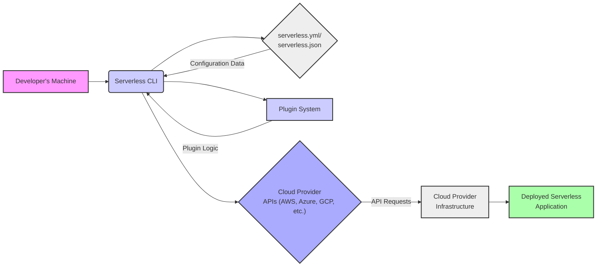

# Project Design Document: Serverless Framework

**Version:** 1.1
**Date:** October 26, 2023
**Author:** AI Software Architect

## 1. Introduction

This document provides a detailed architectural design of the Serverless Framework project. This document serves as a foundation for understanding the system's components, interactions, and data flow, which is crucial for subsequent threat modeling activities. The Serverless Framework is an open-source, command-line interface (CLI) tool that empowers developers to effortlessly deploy and manage serverless applications across a multitude of cloud providers. It abstracts away the intricate details of cloud infrastructure management, allowing developers to concentrate on crafting application logic.

## 2. Goals and Objectives

*   To significantly simplify the deployment and ongoing management of serverless applications.
*   To offer a consistent and intuitive developer experience, regardless of the underlying cloud provider.
*   To automate the complex processes of infrastructure provisioning and configuration specifically tailored for serverless deployments.
*   To facilitate rapid development cycles and encourage iterative improvements in serverless application development.
*   To provide broad support for a diverse range of serverless technologies and an expanding list of cloud providers.
*   To cultivate a thriving community through an extensible architecture that supports plugin development and contributions.

## 3. Target Audience

This document is primarily intended for:

*   Security engineers and architects tasked with performing comprehensive threat modeling of the Serverless Framework.
*   Developers actively contributing to the Serverless Framework codebase, requiring a deep understanding of its architecture.
*   Operations teams responsible for managing and maintaining deployments orchestrated by the Serverless Framework.
*   Anyone seeking an in-depth understanding of the Serverless Framework's internal architecture and operational mechanisms.

## 4. High-Level Architecture

The Serverless Framework primarily functions as a CLI tool that interacts with locally stored configuration files and communicates with cloud provider APIs to manage serverless deployments. The following diagram illustrates the core components and their interactions during a typical deployment process.

**Key Components:**

*   **Developer's Machine:** The local development environment where developers execute the Serverless CLI and manage application code and configuration.
*   **Serverless CLI:** The central command-line interface responsible for parsing user commands, interpreting configuration files, orchestrating plugin execution, and interacting with cloud providers.
*   **`serverless.yml` / `serverless.json`:**  Human-readable configuration files (YAML or JSON format) that declaratively define the serverless application's infrastructure, including functions, event triggers, and required cloud resources.
*   **Plugin System:** A modular and extensible architecture that allows developers to extend the core functionality of the Serverless Framework through custom plugins.
*   **Cloud Provider APIs:** The specific application programming interfaces exposed by various cloud providers (e.g., AWS, Azure, GCP) that the Serverless Framework interacts with to provision and manage serverless resources.
*   **Cloud Provider Infrastructure:** The underlying physical and virtual infrastructure managed by the cloud provider where the serverless application is ultimately deployed and executed.
*   **Deployed Serverless Application:** The collection of serverless functions and associated cloud resources that constitute the running application within the cloud environment.

## 5. Detailed Component Description

*   **Serverless CLI:**
    *   **Command Parser:**  Responsible for analyzing and interpreting commands entered by the user in the terminal, mapping them to specific framework actions.
    *   **Configuration Loader and Validator:** Reads the `serverless.yml` or `serverless.json` file, validates its syntax and semantic correctness, and makes the configuration available to other components.
    *   **Plugin Manager:**  Discovers, loads, and executes plugins based on the `plugins` section of the configuration file, allowing for extensible functionality.
    *   **Provider Abstraction Layer:**  Provides an abstraction layer over different cloud provider APIs, translating framework-agnostic commands into provider-specific API calls. This includes handling authentication and authorization with the respective cloud provider.
    *   **Deployment Orchestrator:**  Manages the complex sequence of API calls required to deploy the serverless application, including creating functions, configuring event triggers, and provisioning other necessary resources.
    *   **State Management:**  Maintains a record of deployed resources and their configurations, typically stored in a cloud provider's object storage service (e.g., AWS S3, Azure Blob Storage). This state is crucial for updates and rollbacks.
    *   **Logging and Error Reporting:** Provides feedback to the user on the progress of commands and reports any errors encountered during execution.

*   **`serverless.yml` / `serverless.json`:**
    *   **`service`:** Defines the name of the serverless service, acting as a logical grouping for the application's resources.
    *   **`provider`:** Specifies the target cloud provider (e.g., `aws`, `azure`, `gcp`) and relevant provider-specific configurations, such as region, runtime, and API keys (often referenced via environment variables or configured profiles).
    *   **`functions`:**  A collection of definitions for individual serverless functions, including:
        *   `handler`: The entry point for the function's code.
        *   `runtime`: The execution environment for the function (e.g., `nodejs18.x`, `python3.9`).
        *   `events`:  An array of event triggers that will invoke the function (e.g., `http`, `sqs`, `sns`).
        *   `memorySize`:  The amount of memory allocated to the function.
        *   `timeout`: The maximum execution duration for the function.
        *   `environment`:  Environment variables to be set for the function.
    *   **`resources`:**  Allows for the definition of additional cloud infrastructure resources required by the application using CloudFormation (for AWS) or similar Infrastructure-as-Code tools for other providers.
    *   **`plugins`:**  A list of plugins to be loaded and utilized by the Serverless Framework.
    *   **`package`:**  Configuration options related to packaging the application code for deployment, such as including or excluding specific files or directories.
    *   **`custom`:**  A section for arbitrary configuration values that can be accessed by plugins or the application code itself.

*   **Plugin System:**
    *   **Plugin Interface:** Defines a set of methods and lifecycle hooks that plugins can implement to interact with the Serverless Framework's core functionality.
    *   **Plugin Resolution and Loading:** The framework identifies and loads plugins specified in the `serverless.yml` or `serverless.json` file, typically from `node_modules`.
    *   **Lifecycle Event Hooks:**  Provides specific points in the framework's execution lifecycle where plugins can inject custom logic. Examples include `before:deploy:createDeploymentArtifacts`, `after:deploy:deploy`, etc.
    *   **Custom Commands:** Plugins can register new commands that become available through the Serverless CLI, extending its capabilities.
    *   **Inter-Plugin Communication:** Mechanisms for plugins to interact with each other and share data.

*   **Provider Abstraction Layer:**
    *   **Provider-Specific Implementations:**  Contains separate implementations for each supported cloud provider, encapsulating the logic for interacting with their respective APIs.
    *   **Credential Management:** Handles the retrieval and management of cloud provider credentials, often relying on environment variables, shared credentials files, or IAM roles.
    *   **API Request Construction and Execution:**  Builds and executes API requests to the cloud provider based on the desired actions.
    *   **Response Handling and Error Translation:**  Processes API responses and translates provider-specific error codes into more generic framework errors.

## 6. Data Flow

The primary data flow during a typical deployment process involves the following steps:

1. **The developer initiates a deployment by executing a Serverless CLI command**, such as `serverless deploy --stage prod`.
2. **The Serverless CLI parses the command** and identifies the intended action (deployment) and any specified options (e.g., deployment stage).
3. **The CLI loads the `serverless.yml` or `serverless.json` configuration file** from the current project directory.
4. **The Plugin Manager loads and initializes any plugins** specified in the configuration file, allowing them to execute their logic based on the current lifecycle event (e.g., `before:deploy`).
5. **The Provider Abstraction Layer identifies the target cloud provider** from the `provider` section of the configuration.
6. **The CLI retrieves the necessary cloud provider credentials** based on the configured authentication methods.
7. **The CLI uses the Provider Abstraction Layer to translate the application's configuration (functions, events, resources) into a series of cloud provider API calls.** For example, to deploy a Lambda function, it might involve calls to create an IAM role, create a deployment package, and create or update the function itself.
8. **The CLI makes authenticated API requests to the cloud provider's API endpoints** to provision and configure the necessary infrastructure.
9. **The cloud provider's API processes the requests**, creating or updating resources like API Gateways, Lambda functions, databases, and other specified services.
10. **The deployed serverless application code (handler functions) is packaged and uploaded** to the cloud provider's storage service (e.g., S3 for AWS Lambda).
11. **The Serverless Framework updates its state management information**, recording the deployed resources and their current configuration in the designated storage location.
12. **The CLI receives responses from the cloud provider's API** and provides feedback to the developer, indicating the success or failure of the deployment process. Plugins may also hook into these responses to perform post-deployment actions.

## 7. Key Interactions and Dependencies

*   **Serverless CLI <-> `serverless.yml` / `serverless.json`:** The CLI reads and validates the configuration file, which dictates the deployment process.
*   **Serverless CLI <-> Plugin System:** The CLI invokes plugins at various lifecycle stages, allowing them to modify or extend the default behavior.
*   **Serverless CLI <-> Cloud Provider APIs:** The CLI uses provider-specific SDKs or direct API calls to manage cloud resources. This interaction is mediated by the Provider Abstraction Layer.
*   **Plugin System <-> Cloud Provider APIs:** Plugins may directly interact with cloud provider APIs for custom resource provisioning or management tasks.
*   **Serverless CLI <-> State Management Storage (e.g., AWS S3):** The CLI reads and writes state information to track deployments and facilitate updates and rollbacks.
*   **Developer's Machine <-> Internet:**  Essential for downloading dependencies (npm packages), interacting with package managers, and communicating with cloud provider APIs.
*   **Plugins <-> External Services:** Plugins may depend on external services or APIs for their functionality.

## 8. Security Considerations (Initial)

This section highlights initial security considerations relevant to the Serverless Framework, which will be further analyzed during a dedicated threat modeling exercise.

*   **Credential Management:**
    *   **Threat:** Storing cloud provider credentials (API keys, access tokens) insecurely on the developer's machine (e.g., in plaintext files, committed to version control).
    *   **Threat:**  Exposure of credentials stored in the Serverless Framework's state management storage if the storage is not properly secured.
    *   **Threat:**  Unauthorized access to cloud resources if credentials are compromised.
*   **Plugin Security:**
    *   **Threat:**  Installation and execution of malicious or vulnerable plugins that could compromise the deployment process, inject malicious code into deployed functions, or exfiltrate sensitive data.
    *   **Threat:**  Plugins with overly broad permissions gaining access to sensitive resources or performing unauthorized actions.
*   **Configuration Security:**
    *   **Threat:**  Storing sensitive information (e.g., database passwords, API keys) directly in the `serverless.yml` or `serverless.json` file, making it vulnerable to exposure.
    *   **Threat:**  Misconfiguration of resources leading to security vulnerabilities (e.g., publicly accessible S3 buckets).
*   **State Management Security:**
    *   **Threat:**  Unauthorized access, modification, or deletion of state management data, potentially disrupting deployments or allowing for malicious manipulation of deployed resources.
    *   **Threat:**  Exposure of sensitive information stored in the state management data.
*   **Communication Security:**
    *   **Threat:**  Man-in-the-middle attacks intercepting communication between the Serverless CLI and cloud provider APIs if HTTPS is not enforced or certificates are not validated.
*   **Dependency Management:**
    *   **Threat:**  Vulnerabilities in dependencies used by the Serverless Framework or its plugins being exploited.
    *   **Threat:**  Supply chain attacks where malicious code is introduced through compromised dependencies.
*   **Input Validation:**
    *   **Threat:**  Injection attacks (e.g., command injection) if the Serverless CLI does not properly validate user input or data from configuration files.
*   **Permissions and Authorization:**
    *   **Threat:**  The Serverless Framework's execution role in the cloud provider having overly permissive access, violating the principle of least privilege.
    *   **Threat:**  Insufficiently restrictive IAM policies for deployed functions, allowing them to access resources they shouldn't.

## 9. Technology Stack

*   **Primary Language:** JavaScript (Node.js)
*   **Configuration Languages:** YAML, JSON
*   **Package Manager:** npm or yarn
*   **Cloud Provider SDKs:** AWS SDK for JavaScript, Azure SDK for Node.js, Google Cloud Client Libraries for Node.js, etc.
*   **HTTP Client:** Libraries like `axios` or the built-in `https` module for making API requests.
*   **Templating Engines:**  Potentially used for generating configuration files or CloudFormation templates.
*   **Testing Frameworks:** Jest, Mocha, or similar for unit and integration testing.

## 10. Deployment Model

The Serverless Framework itself is deployed as a command-line tool installed on a developer's local machine or within a CI/CD pipeline environment. It does not involve a continuously running server component. Its execution is triggered by explicit user commands. The framework relies on the underlying infrastructure provided by the chosen cloud provider for the deployment and execution of serverless applications.

This improved document provides a more detailed and nuanced understanding of the Serverless Framework's architecture, offering a stronger foundation for subsequent threat modeling activities. The expanded descriptions of components, data flow, and security considerations aim to facilitate a more comprehensive identification of potential vulnerabilities and the design of effective mitigation strategies.
