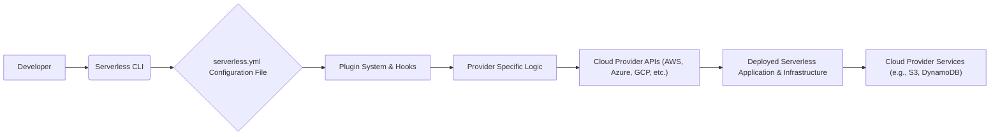
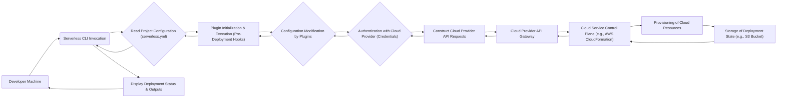

## Project Design Document: Serverless Framework (Improved)

**1. Introduction**

This document provides an enhanced and more detailed design overview of the Serverless Framework, an open-source framework designed to simplify the building, deploying, and operating of serverless applications. This improved document aims to provide a deeper understanding of the architectural components, data flows, and interactions within the Serverless Framework ecosystem, making it more suitable for subsequent threat modeling activities.

**2. Goals and Objectives**

The primary goals of the Serverless Framework are to:

* Significantly simplify the development and deployment process for serverless applications across a diverse range of cloud providers.
* Offer a consistent and unified command-line interface (CLI) for managing serverless infrastructure, regardless of the underlying cloud provider.
* Automate the often complex deployment and configuration of serverless resources, reducing manual effort and potential errors.
* Empower developers to concentrate on writing application logic rather than being bogged down by intricate infrastructure management tasks.
* Foster a vibrant and extensible ecosystem through a robust plugin architecture, enabling integration with various tools and services.

**3. High-Level Architecture**

The Serverless Framework's core functionality revolves around a command-line interface (CLI) that orchestrates interactions with cloud provider APIs based on declarative configuration. The key components involved in this architecture are:

* **"Developer":** The individual or team utilizing the Serverless Framework to build and deploy applications.
* **"Serverless CLI":** The command-line tool, the primary interface for interacting with the framework. It interprets commands, processes configurations, and orchestrates deployments.
* **"serverless.yml Configuration File":** The central YAML file defining the serverless application's components, functions, events, resources, and provider-specific settings in a declarative manner.
* **"Plugin System & Hooks":** The extensible architecture allowing developers to add custom functionality, modify the framework's behavior, and integrate with external tools through defined lifecycle hooks.
* **"Provider Specific Logic":** The abstraction layer within the framework (often implemented via plugins) that translates the generic `serverless.yml` configuration into specific API calls for the target cloud provider.
* **"Cloud Provider APIs (AWS, Azure, GCP, etc.)":** The programmatic interfaces exposed by cloud providers that the Serverless Framework interacts with to provision and manage serverless resources.
* **"Deployed Serverless Application & Infrastructure":** The actual serverless functions, API endpoints, and supporting infrastructure deployed within the cloud provider's environment.
* **"Cloud Provider Services (e.g., S3, DynamoDB)":**  Underlying cloud services that the deployed serverless application may utilize, and which might be provisioned and managed by the Serverless Framework.

**4. Detailed Design**

The Serverless Framework's operation can be further detailed into the following functional areas:

* **Configuration Parsing and Validation:**
    * The Serverless CLI parses the `serverless.yml` file, interpreting its YAML structure and directives.
    * It performs validation checks to ensure the configuration adheres to the framework's schema and provider-specific requirements.
    * This includes validating function definitions, event triggers, resource declarations, and provider settings.

* **Plugin Lifecycle Management:**
    * The framework manages the lifecycle of plugins, including loading, initialization, and execution.
    * It provides a set of lifecycle hooks (e.g., `before:deploy:createDeploymentArtifacts`, `after:deploy:deploy`) that plugins can subscribe to.
    * Plugins can modify the configuration, perform pre- or post-deployment tasks, or add entirely new commands to the CLI.

* **Provider Interaction and Abstraction:**
    * The framework utilizes provider-specific logic (often within plugins) to translate the abstract configuration into concrete API calls for the target cloud provider.
    * This involves mapping generic resource definitions (e.g., a "function") to provider-specific resources (e.g., an AWS Lambda function, an Azure Function).
    * It handles authentication and authorization with the cloud provider using configured credentials.

* **Deployment Orchestration:**
    * The `serverless deploy` command triggers a multi-stage deployment process.
    * This involves:
        * **Artifact Creation:** Packaging function code and dependencies into deployment artifacts (e.g., ZIP files).
        * **Infrastructure Provisioning:** Interacting with cloud provider APIs to create or update necessary infrastructure components (e.g., API Gateway endpoints, IAM roles, S3 buckets).
        * **Function Deployment:** Uploading function code and configuring runtime environments.
        * **State Management:** Persisting the current deployment state (often in an S3 bucket for AWS) to track deployed resources and enable updates.

* **Function Packaging and Dependency Management:**
    * The framework analyzes function code and identifies dependencies.
    * It packages the code and dependencies into deployment artifacts suitable for the target runtime environment (e.g., Node.js, Python).
    * It may utilize package managers (npm, pip) to install dependencies.

* **Monitoring and Logging Integration:**
    * The framework provides commands to access logs and metrics from deployed functions, often leveraging cloud provider monitoring services (e.g., AWS CloudWatch Logs, Azure Monitor).
    * It may offer features for tailing logs or retrieving specific log entries.

* **Local Development and Testing Capabilities:**
    * The framework (often through plugins like `serverless-offline`) enables local emulation of serverless environments for development and testing.
    * This allows developers to invoke functions and simulate events without deploying to the cloud.

**5. Data Flow (Detailed)**

A more granular view of the data flow during a typical deployment operation:

* **"Developer Machine":** The developer's local environment where the Serverless CLI is executed.
* **"Serverless CLI Invocation":** The developer runs a Serverless CLI command (e.g., `serverless deploy`).
* **"Read Project Configuration (serverless.yml)":** The CLI reads and parses the `serverless.yml` file.
* **"Plugin Initialization & Execution (Pre-Deployment Hooks)":**  Plugins are loaded and their pre-deployment lifecycle hooks are executed.
* **"Configuration Modification by Plugins":** Plugins may modify the configuration based on their logic.
* **"Authentication with Cloud Provider (Credentials)":** The CLI authenticates with the configured cloud provider using stored or provided credentials.
* **"Construct Cloud Provider API Requests":** The framework constructs API requests specific to the target cloud provider based on the configuration.
* **"Cloud Provider API Gateway":** The entry point for interacting with the cloud provider's services.
* **"Cloud Service Control Plane (e.g., AWS CloudFormation)":** The service responsible for provisioning and managing cloud resources.
* **"Provisioning of Cloud Resources":** Cloud resources (functions, APIs, etc.) are created or updated.
* **"Storage of Deployment State (e.g., S3 Bucket)":** Information about the deployed resources is stored for tracking and updates.
* **"Display Deployment Status & Outputs":** The CLI displays the progress and results of the deployment to the developer.

**6. Security Considerations (For Threat Modeling)**

Expanding on the initial security considerations, potential threats include:

* **Credential Exposure:**
    * Storing cloud provider credentials insecurely (e.g., in plain text in `serverless.yml` or version control).
    * Leaking credentials through compromised developer machines or CI/CD pipelines.
* **Insufficient IAM Permissions:**
    * Overly permissive IAM roles granted to the Serverless CLI, allowing for unintended actions on the cloud account.
    * Insufficiently scoped IAM roles for deployed functions, hindering their ability to access necessary resources.
* **Malicious Plugins:**
    * Installing and using untrusted or compromised third-party plugins that could inject malicious code or exfiltrate data.
    * Plugins with vulnerabilities that could be exploited.
* **Configuration Vulnerabilities:**
    * Injecting malicious code or configurations through insecurely managed `serverless.yml` files.
    * Exposing sensitive information (API keys, secrets) directly in the configuration.
* **State Management Tampering:**
    * Unauthorized modification of the deployment state, potentially leading to inconsistencies or rollbacks.
    * Accessing or deleting the state storage, disrupting future deployments.
* **Dependency Vulnerabilities:**
    * Using vulnerable dependencies in the Serverless Framework itself or in the deployed functions' code.
    * Supply chain attacks targeting dependencies.
* **Insecure Network Configurations:**
    * Deploying functions with overly permissive network access, increasing the attack surface.
    * Lack of proper network segmentation for deployed resources.
* **Secrets Management Issues:**
    * Hardcoding secrets within function code or environment variables.
    * Using insecure methods for managing and accessing secrets.
* **Supply Chain Attacks on Serverless CLI:**
    * Compromised installations of the Serverless CLI distributing malware.
    * Attacks targeting the framework's distribution channels.
* **Injection Attacks:**
    * Exploiting vulnerabilities in custom resources or provider integrations to inject malicious code or commands.

**7. Deployment Model**

The Serverless Framework is typically deployed and utilized through:

* **Local CLI Installation:** Developers install the Serverless CLI on their workstations using package managers like npm or yarn.
* **Project-Specific Configuration:**  A `serverless.yml` file is created and maintained within each serverless project's repository.
* **Cloud Provider Account Integration:** The framework interacts with a designated cloud provider account using securely configured credentials (often through environment variables, AWS profiles, or similar mechanisms).
* **CI/CD Pipeline Integration:** The Serverless CLI is frequently integrated into CI/CD pipelines for automated deployments.

**8. Key Components (Further Detail)**

* **`serverless.yml` (Configuration as Code):**
    * Serves as the single source of truth for the serverless application's infrastructure and configuration.
    * Supports features like variable resolution, environment-specific configurations, and custom resource definitions.
    * Its structure directly dictates the resources provisioned in the cloud.

* **Serverless CLI (The Orchestrator):**
    * Provides a consistent interface for managing serverless applications across different providers.
    * Handles authentication, authorization, and communication with cloud provider APIs.
    * Manages the plugin ecosystem and executes plugin commands.

* **Plugin System (Extensibility and Integration):**
    * Enables the framework to be extended with custom functionality and integrations.
    * Plugins can hook into various stages of the deployment lifecycle, providing flexibility and customization.
    * A vast ecosystem of community-developed plugins exists for various purposes.

* **Provider Integrations (Abstraction Layer):**
    * Abstract away the complexities of interacting with individual cloud provider APIs.
    * Translate the generic `serverless.yml` configuration into provider-specific resource definitions and API calls.
    * Handle provider-specific nuances and configurations.

**9. Interactions and Dependencies**

The Serverless Framework relies on interactions with:

* **Cloud Provider SDKs/APIs:** The fundamental dependency for managing cloud resources.
* **Node.js Runtime Environment:** The Serverless CLI is built on Node.js and requires it to run.
* **npm or yarn (Package Managers):** Used for installing the Serverless CLI and its plugins.
* **Git (Version Control):** Commonly used for managing the `serverless.yml` and application code.
* **IAM (Identity and Access Management) Services:** Crucial for authenticating and authorizing the Serverless CLI and deployed functions with cloud providers.

**10. Future Considerations**

Potential future enhancements and considerations include:

* **Enhanced Built-in Security Scans:** Integrating automated security checks into the deployment process.
* **Improved Observability and Debugging Tools:** Providing richer insights into application performance and behavior.
* **More Granular State Management Options:** Offering alternative state management solutions beyond cloud provider-specific options.
* **Further Abstraction and Simplification:** Making serverless development even more accessible and streamlined.
* **Strengthened Plugin Security Mechanisms:** Implementing stricter plugin vetting and security policies.

This improved design document provides a more detailed and comprehensive understanding of the Serverless Framework's architecture and operation, making it a more robust foundation for identifying and mitigating potential security threats through thorough threat modeling.