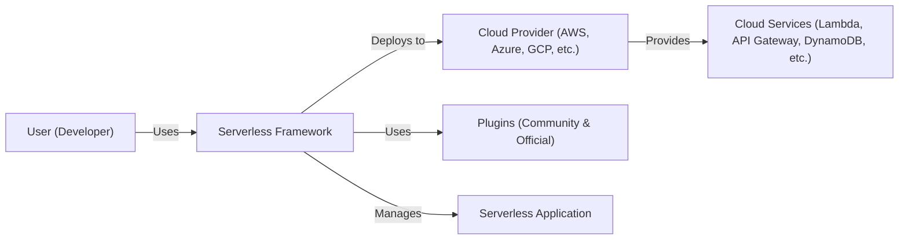
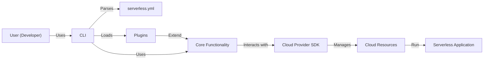
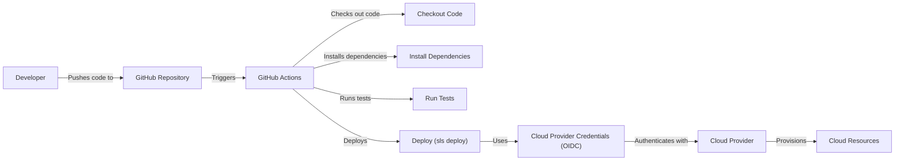
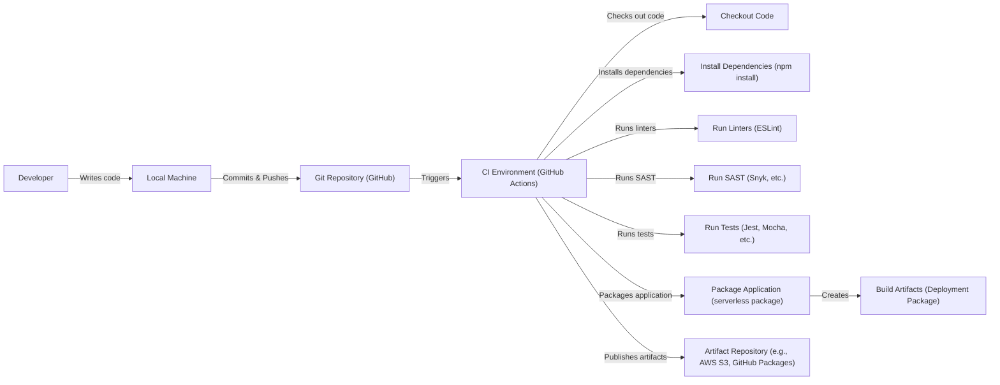

Okay, let's create a design document for the Serverless Framework (https://github.com/serverless/serverless).

# BUSINESS POSTURE

Business Priorities and Goals:

*   Enable developers to easily build and deploy serverless applications.
*   Abstract away the complexities of cloud infrastructure management.
*   Provide a consistent development experience across different cloud providers (AWS, Azure, GCP, etc.).
*   Foster a large and active open-source community.
*   Offer a plugin architecture for extensibility and customization.
*   Maintain a freemium model, with a free open-source core and paid enterprise features.

Most Important Business Risks:

*   Loss of developer trust due to security vulnerabilities in the framework or its plugins.
*   Inability to keep up with the rapid evolution of serverless technologies and cloud provider offerings.
*   Competition from other serverless frameworks and cloud provider-specific tools.
*   Failure to monetize the framework effectively, hindering long-term sustainability.
*   Reputational damage from security incidents involving applications built with the framework.
*   Supply chain attacks through compromised plugins or dependencies.

# SECURITY POSTURE

Existing Security Controls:

*   security control: Code reviews and pull request process for contributions to the framework. (Described in the contributing guidelines on GitHub).
*   security control: Use of linters and static analysis tools (implied, but not explicitly documented in the repository's root).
*   security control: Dependency management using package.json and npm/yarn (standard practice for Node.js projects).
*   security control: Plugin architecture allows for community-contributed security enhancements (but also introduces risk).
*   security control: Documentation on security best practices for serverless applications (available on the Serverless website and documentation).
*   security control: Regular releases and updates to address bug fixes and security vulnerabilities.
*   security control: Support for IAM roles and permissions for fine-grained access control in deployed applications (delegated to the cloud provider).
*   security control: Encryption at rest and in transit capabilities, provided by underlying cloud services.

Accepted Risks:

*   accepted risk: Reliance on third-party plugins, which may have varying levels of security and maintenance.
*   accepted risk: The framework's core functionality may have undiscovered vulnerabilities.
*   accepted risk: Users may misconfigure their serverless applications, leading to security issues.
*   accepted risk: The framework's complexity can make it difficult to fully understand and audit its security posture.
*   accepted risk: The rapid pace of change in the serverless ecosystem means that security best practices may evolve quickly.

Recommended Security Controls:

*   Implement a comprehensive Software Bill of Materials (SBOM) for the framework and its dependencies.
*   Introduce mandatory security reviews for all new plugins and updates to existing plugins.
*   Develop a vulnerability disclosure program to encourage responsible reporting of security issues.
*   Integrate dynamic application security testing (DAST) into the CI/CD pipeline.
*   Provide more explicit guidance on secure coding practices for serverless applications within the framework's documentation.
*   Implement automated security scanning of dependencies for known vulnerabilities.
*   Implement signing of released packages.

Security Requirements:

*   Authentication:
    *   The framework must support secure authentication mechanisms for accessing cloud provider APIs (e.g., using API keys, IAM roles, or other provider-specific methods).
    *   The framework should provide guidance on securely storing and managing credentials.
    *   The framework should support multi-factor authentication (MFA) where available.
*   Authorization:
    *   The framework must facilitate the implementation of least privilege access control for deployed serverless applications.
    *   The framework should integrate with cloud provider IAM systems to manage permissions.
    *   The framework should provide mechanisms for defining and enforcing fine-grained access control policies.
*   Input Validation:
    *   The framework should encourage and facilitate input validation in serverless functions to prevent injection attacks.
    *   The framework could provide helper libraries or plugins for common input validation tasks.
    *   Documentation should emphasize the importance of input validation and provide examples.
*   Cryptography:
    *   The framework should leverage cloud provider services for encryption at rest and in transit.
    *   The framework should provide guidance on securely managing cryptographic keys.
    *   The framework should support the use of secure protocols (e.g., HTTPS) for communication.
    *   The framework should not implement its own cryptographic primitives, but rely on well-vetted libraries and cloud provider services.

# DESIGN

## C4 CONTEXT

Element Descriptions:

*   Element:
    *   Name: User (Developer)
    *   Type: Person
    *   Description: A developer who uses the Serverless Framework to build and deploy serverless applications.
    *   Responsibilities: Writes code, configures the Serverless Framework, deploys applications, monitors applications.
    *   Security controls: Uses strong passwords, enables MFA where available, follows security best practices.

*   Element:
    *   Name: Serverless Framework
    *   Type: Software System
    *   Description: A CLI tool and framework for building and deploying serverless applications.
    *   Responsibilities: Manages deployments, abstracts cloud provider complexities, provides a consistent development experience, handles plugin integration.
    *   Security controls: Code reviews, static analysis, dependency management, plugin architecture, regular updates.

*   Element:
    *   Name: Cloud Provider (AWS, Azure, GCP, etc.)
    *   Type: External System
    *   Description: A cloud provider that hosts the serverless application and provides underlying services.
    *   Responsibilities: Provides compute, storage, networking, and other services, manages infrastructure security.
    *   Security controls: Provider-specific security controls (e.g., IAM, VPC, encryption).

*   Element:
    *   Name: Plugins (Community & Official)
    *   Type: Software System
    *   Description: Extensions to the Serverless Framework that add functionality or customize behavior.
    *   Responsibilities: Provide additional features, integrate with third-party services, customize deployments.
    *   Security controls: Varying levels of security, depending on the plugin author and maintenance.

*   Element:
    *   Name: Cloud Services (Lambda, API Gateway, DynamoDB, etc.)
    *   Type: External System
    *   Description: Specific services offered by the cloud provider that are used by the serverless application.
    *   Responsibilities: Provide specific functionalities (e.g., compute, API management, database).
    *   Security controls: Provider-specific security controls for each service.

*   Element:
    *   Name: Serverless Application
    *   Type: Software System
    *   Description: The application built and deployed using the Serverless Framework.
    *   Responsibilities: Provides the desired application functionality.
    *   Security controls: Application-specific security controls (e.g., input validation, authentication, authorization).

## C4 CONTAINER

Element Descriptions:

*   Element:
    *   Name: User (Developer)
    *   Type: Person
    *   Description: A developer who uses the Serverless Framework to build and deploy serverless applications.
    *   Responsibilities: Writes code, configures the Serverless Framework, deploys applications, monitors applications.
    *   Security controls: Uses strong passwords, enables MFA where available, follows security best practices.

*   Element:
    *   Name: CLI
    *   Type: Container: Command Line Interface
    *   Description: The command-line interface for interacting with the Serverless Framework.
    *   Responsibilities: Parses commands, loads configuration, executes actions, interacts with the user.
    *   Security controls: Input validation, command authorization.

*   Element:
    *   Name: serverless.yml
    *   Type: Container: Configuration File
    *   Description: The configuration file that defines the serverless application and its resources.
    *   Responsibilities: Specifies services, functions, events, resources, and provider settings.
    *   Security controls: Schema validation, secrets management (using variables or external sources).

*   Element:
    *   Name: Plugins
    *   Type: Container: Plugins
    *   Description: Extensions to the Serverless Framework that add functionality or customize behavior.
    *   Responsibilities: Provide additional features, integrate with third-party services, customize deployments.
    *   Security controls: Varying levels of security, depending on the plugin author and maintenance.

*   Element:
    *   Name: Core Functionality
    *   Type: Container: Code Library
    *   Description: The core logic of the Serverless Framework.
    *   Responsibilities: Manages deployments, handles lifecycle events, interacts with cloud provider SDKs.
    *   Security controls: Code reviews, static analysis, dependency management.

*   Element:
    *   Name: Cloud Provider SDK
    *   Type: Container: Library
    *   Description: The software development kit provided by the cloud provider for interacting with its services.
    *   Responsibilities: Provides APIs for creating, managing, and deleting cloud resources.
    *   Security controls: Provided by the cloud provider.

*   Element:
    *   Name: Cloud Resources
    *   Type: Container: Cloud Infrastructure
    *   Description: The actual cloud resources (e.g., Lambda functions, API Gateway endpoints, DynamoDB tables) that make up the serverless application.
    *   Responsibilities: Provide the infrastructure for running the application.
    *   Security controls: Provider-specific security controls for each resource.

*   Element:
    *   Name: Serverless Application
    *   Type: Software System
    *   Description: The application built and deployed using the Serverless Framework.
    *   Responsibilities: Provides the desired application functionality.
    *   Security controls: Application-specific security controls (e.g., input validation, authentication, authorization).

## DEPLOYMENT

Possible Deployment Solutions:

1.  Direct Deployment from Developer Machine: The developer runs `sls deploy` directly from their workstation, using their local credentials.
2.  CI/CD Pipeline Deployment: A CI/CD system (e.g., Jenkins, GitHub Actions, CircleCI) is used to automate the deployment process.
3.  Serverless Framework Dashboard Deployment: Using Serverless Framework's built-in deployment features.

Chosen Solution (for detailed description): CI/CD Pipeline Deployment (GitHub Actions)

Element Descriptions:

*   Element:
    *   Name: Developer
    *   Type: Person
    *   Description: A developer working on the serverless application.
    *   Responsibilities: Writes code, commits changes, pushes to the repository.
    *   Security controls: Uses strong passwords, enables MFA for GitHub account.

*   Element:
    *   Name: GitHub Repository
    *   Type: System
    *   Description: The Git repository hosted on GitHub that stores the application code and configuration.
    *   Responsibilities: Stores code, tracks changes, manages versions.
    *   Security controls: Branch protection rules, code review requirements, access controls.

*   Element:
    *   Name: GitHub Actions
    *   Type: System
    *   Description: The CI/CD system provided by GitHub.
    *   Responsibilities: Automates the build, test, and deployment process.
    *   Security controls: Secure environment variables, workflow permissions, audit logs.

*   Element:
    *   Name: Checkout Code
    *   Type: Action
    *   Description: Retrieves the application code from the GitHub repository.
    *   Responsibilities: Downloads the code to the build environment.
    *   Security controls: Uses secure protocols (HTTPS).

*   Element:
    *   Name: Install Dependencies
    *   Type: Action
    *   Description: Installs the project's dependencies (e.g., using npm or yarn).
    *   Responsibilities: Downloads and installs required packages.
    *   Security controls: Uses package-lock.json or yarn.lock to ensure consistent dependencies, scans for vulnerable dependencies.

*   Element:
    *   Name: Run Tests
    *   Type: Action
    *   Description: Executes the project's test suite.
    *   Responsibilities: Runs unit tests, integration tests, and other tests.
    *   Security controls: Includes security-focused tests (e.g., static analysis, vulnerability scanning).

*   Element:
    *   Name: Deploy (sls deploy)
    *   Type: Action
    *   Description: Executes the Serverless Framework deployment command.
    *   Responsibilities: Deploys the application to the cloud provider.
    *   Security controls: Uses secure credentials, follows least privilege principle.

*   Element:
    *   Name: Cloud Provider Credentials (OIDC)
    *   Type: Credentials
    *   Description: Credentials used to authenticate with the cloud provider, preferably using OpenID Connect (OIDC) for short-lived credentials.
    *   Responsibilities: Provides access to the cloud provider's APIs.
    *   Security controls: Stored securely (e.g., using GitHub Actions secrets), rotated regularly, uses OIDC for short-lived credentials.

*   Element:
    *   Name: Cloud Provider
    *   Type: External System
    *   Description: The cloud provider (e.g., AWS, Azure, GCP).
    *   Responsibilities: Provides the infrastructure and services for the serverless application.
    *   Security controls: Provider-specific security controls.

*   Element:
    *   Name: Cloud Resources
    *   Type: Infrastructure
    *   Description: The cloud resources provisioned by the Serverless Framework.
    *   Responsibilities: Run the serverless application.
    *   Security controls: Provider-specific security controls, least privilege access.

## BUILD

Build Process Description:

1.  Developer writes code on their local machine.
2.  Developer commits and pushes code changes to a Git repository (e.g., GitHub).
3.  The push triggers a CI/CD pipeline (e.g., GitHub Actions).
4.  The CI environment checks out the code.
5.  Dependencies are installed (e.g., using `npm install`).
6.  Linters (e.g., ESLint) are run to enforce code style and identify potential issues.
7.  Static Application Security Testing (SAST) tools (e.g., Snyk) are run to scan for vulnerabilities.
8.  Tests (e.g., unit tests, integration tests) are executed.
9.  The Serverless Framework packages the application into a deployment package (e.g., using `serverless package`).
10. Build artifacts (the deployment package) are created.
11. The artifacts are published to an artifact repository (e.g., AWS S3, GitHub Packages).

Security Controls in Build Process:

*   Code Reviews: All code changes are reviewed by another developer before merging.
*   Linters: Enforce code style and identify potential errors.
*   SAST: Scan for vulnerabilities in the application code and its dependencies.
*   Dependency Management: Use package-lock.json or yarn.lock to ensure consistent dependencies and prevent supply chain attacks.
*   Automated Tests: Include security-focused tests in the test suite.
*   Artifact Signing: Sign the build artifacts to ensure their integrity.
*   Least Privilege: The CI/CD pipeline should have only the necessary permissions to perform its tasks.
*   Secrets Management: Sensitive information (e.g., API keys, passwords) should be stored securely and not hardcoded in the repository.

# RISK ASSESSMENT

Critical Business Processes:

*   Serverless application deployment and management.
*   Plugin ecosystem management.
*   User data management (for Serverless Framework Dashboard users).
*   Continuous integration and continuous delivery (CI/CD) pipeline.

Data to Protect and Sensitivity:

*   Source Code: Contains the logic of the serverless application and potentially sensitive algorithms or business logic (High sensitivity).
*   Configuration Files (serverless.yml): Contains information about the application's infrastructure and resources, including potentially sensitive settings (High sensitivity).
*   Cloud Provider Credentials: Used to access cloud provider APIs and manage resources (Extremely high sensitivity).
*   User Data (for Serverless Framework Dashboard users): May include personal information, billing information, and application data (High sensitivity, depending on the specific data).
*   Plugin Code: Third-party code that may contain vulnerabilities or malicious code (High sensitivity).
*   Dependencies: Third-party libraries that may contain vulnerabilities (High sensitivity).
*   Build Artifacts: The packaged application code, which may contain vulnerabilities (High sensitivity).

# QUESTIONS & ASSUMPTIONS

Questions:

*   What specific cloud providers are the primary targets for this framework? (Impacts the specific security controls and configurations needed).
*   What is the expected level of security expertise of the target users? (Impacts the level of detail and guidance needed in documentation).
*   What is the process for handling security vulnerabilities discovered in the framework or its plugins?
*   Are there any specific compliance requirements (e.g., PCI DSS, HIPAA) that need to be considered?
*   What is the strategy for managing and securing third-party plugins?
*   What level of support is provided for different versions of Node.js and other runtime environments?
*   What mechanisms are in place to monitor the security of deployed serverless applications?

Assumptions:

*   BUSINESS POSTURE: The primary goal is to enable rapid development and deployment of serverless applications, with a balance between ease of use and security.
*   SECURITY POSTURE: The framework relies heavily on the security features provided by the underlying cloud providers. Users are expected to have a basic understanding of serverless security best practices.
*   DESIGN: The framework is designed to be modular and extensible, with a plugin architecture that allows for customization and integration with other tools. The CI/CD pipeline is the preferred method for deploying applications. The use of GitHub Actions is a common and recommended practice.