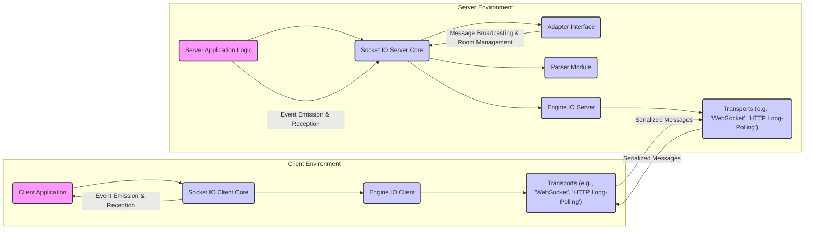

## Project Design Document: Socket.IO

**Version:** 1.1
**Date:** October 26, 2023
**Author:** AI Software Architect

### 1. Introduction

This document provides a detailed design overview of the Socket.IO project, a widely used JavaScript library enabling real-time, bidirectional, and event-based communication between web clients and servers. This document is specifically crafted to serve as a foundation for subsequent threat modeling activities, offering a comprehensive understanding of the system's architecture, components, and data flow from a security perspective.

### 2. Goals

The primary goals of this design document are:

* To provide a clear and concise description of the Socket.IO architecture and its core components.
* To meticulously outline the data flow within the Socket.IO system, highlighting potential points of interaction and modification.
* To explicitly identify potential areas of security concern and categorize them for future threat modeling exercises.
* To serve as a definitive reference for security engineers, developers, and DevOps engineers involved in building, securing, and maintaining applications leveraging Socket.IO.

### 3. Target Audience

This document is primarily intended for:

* Security engineers tasked with performing threat modeling, security assessments, and penetration testing of applications utilizing Socket.IO.
* Software developers building real-time applications with Socket.IO who require a deep understanding of its internal workings and security implications.
* DevOps engineers responsible for the secure deployment, configuration, and maintenance of Socket.IO-based applications.

### 4. Scope

This document focuses on the core architectural elements and functionalities of the Socket.IO library, encompassing both client-side and server-side aspects. It details the mechanisms for establishing connections, exchanging messages based on events, and managing communication channels through namespaces and rooms. While it touches upon transport mechanisms, the primary focus remains on the Socket.IO abstraction layer. Implementation details of specific underlying transport protocols are considered at a higher level of abstraction.

### 5. High-Level Architecture

Socket.IO employs a client-server architecture to facilitate real-time communication. Key characteristics of this architecture include:

* **Full-Duplex Communication:** Enables simultaneous data transmission in both directions between the client and the server.
* **Event-Driven Model:** Communication is structured around the emission and reception of named events, each potentially carrying associated data payloads.
* **Intelligent Transport Negotiation:** Socket.IO automatically selects the most suitable transport mechanism (e.g., WebSockets, HTTP long-polling) based on the capabilities of the client's browser and the network environment, presenting a consistent API to the developer.
* **Robust Connection Management:**  Handles the complexities of connection establishment, persistent connection maintenance, and automatic reconnection attempts in case of network interruptions.
* **Scalable Communication Channels:** Supports the organization of clients into logical "rooms" for targeted message broadcasting and the creation of isolated "namespaces" within a single connection for different application contexts.

### 6. Component Breakdown

This section details the key components that constitute the Socket.IO system:

* **Server-Side Components:**
    * **Socket.IO Server Core:** The central module responsible for managing incoming client connections, organizing them into namespaces and rooms, and routing messages based on events.
    * **Adapter Interface:** An abstraction layer defining how message broadcasting and room management are handled. Different adapter implementations cater to various deployment scenarios, such as single-server (in-memory) or multi-server (e.g., using Redis).
    * **Parser Module:** Responsible for the serialization (encoding) and deserialization (decoding) of messages exchanged between the client and the server. The default parser is `component-parser`.
    * **Transport Implementations:** Concrete implementations of various real-time communication protocols used for data transmission. Common transports include:
        * **WebSocket:** Provides a persistent, bidirectional communication channel over a single TCP connection. Favored for its efficiency and low latency.
        * **HTTP Long-Polling:** A fallback mechanism where the server holds an HTTP request open until it has data to send to the client, simulating a persistent connection.
        * **Other HTTP-based mechanisms:** Such as AJAX polling, used as further fallbacks.
    * **Engine.IO Layer:** The underlying transport engine upon which Socket.IO is built. It manages the initial transport negotiation process and handles transport-specific details.

* **Client-Side Components:**
    * **Socket.IO Client Library:** The JavaScript library integrated into the client-side application. It manages the connection lifecycle, facilitates the emission and reception of events, and handles reconnection logic transparently.
    * **Transport Implementations (Client-Side):** Corresponding implementations of the communication protocols used to establish a connection with the server. These mirror the server-side transport options.
    * **Parser Module (Client-Side):** The client-side counterpart to the server-side parser, responsible for encoding outgoing messages and decoding incoming messages.
    * **Engine.IO Client Library:** The client-side component of Engine.IO, responsible for initiating transport negotiation with the server and managing the chosen transport.

* **Core Concepts:**
    * **Socket Instance:** Represents a unique, persistent connection between a client and the server. Each connected client has a corresponding socket object on the server.
    * **Namespace:**  Provides a mechanism to segment a single underlying transport connection into multiple logical communication channels. Clients can connect to specific namespaces on the server.
    * **Room:** A logical grouping of connected sockets within a namespace. Servers can efficiently broadcast messages to all sockets within a specific room.
    * **Event Name:** A string identifier for a specific type of message being exchanged between the client and the server.
    * **Message Payload:** The actual data associated with an emitted event.

### 7. Data Flow

The typical data flow within a Socket.IO application follows these steps:

* **Connection Establishment Phase:**
    * The client-side application initiates a connection to the Socket.IO server endpoint.
    * The client's Engine.IO library attempts to establish a WebSocket connection with the server.
    * If the WebSocket connection fails or is not supported by the client's environment, Engine.IO automatically falls back to other available transports (e.g., HTTP long-polling).
    * Once a transport is successfully established, a Socket.IO connection is established on top of the Engine.IO transport.
    * The server emits a `connect` event to the newly connected client's socket instance.

* **Message Emission (Client Initiated):**
    * The client-side application invokes `socket.emit('event-name', data)`.
    * The client-side Socket.IO library serializes the event name and associated data using the configured parser.
    * The serialized message is transmitted to the server using the established transport mechanism.
    * The server-side Engine.IO component receives the incoming message.
    * The server-side Socket.IO library deserializes the message using the parser.
    * The server-side Socket.IO core routes the event to the appropriate handler based on the event name and the namespace of the receiving socket.

* **Message Emission (Server Initiated):**
    * The server-side application can emit messages to specific clients using `socket.emit('event-name', data)`, broadcast to all connected clients in the default namespace using `io.emit('event-name', data)`, or target clients within a specific room using `io.to('room-name').emit('event-name', data)`.
    * The server-side Socket.IO library serializes the event name and data.
    * The serialized message is sent to the intended client(s) via the established transport.
    * The client-side Engine.IO component receives the message.
    * The client-side Socket.IO library deserializes the message.
    * The client-side application receives the event and data through a registered event listener (`socket.on('event-name', function(data) {...})`).

* **Disconnection Phase:**
    * A disconnection can be initiated by either the client or the server.
    * The underlying Engine.IO transport connection is closed.
    * The server emits a `disconnect` event for the affected socket instance.
    * The client-side Socket.IO library may attempt to automatically reconnect to the server based on its configuration.

### 8. Security Considerations

This section outlines potential security considerations relevant to Socket.IO applications, categorized for clarity during threat modeling:

* **Transport Layer Security:**
    * **Man-in-the-Middle (MITM) Attacks:** Communication over insecure transports (e.g., plain HTTP) exposes data to eavesdropping and manipulation. Enforcing HTTPS and secure WebSockets (WSS) is paramount.
    * **Transport Downgrade Attacks:** Attackers might attempt to force the connection to use a less secure transport protocol. Server-side configuration should prioritize secure transports.

* **Message Security:**
    * **Input Validation Vulnerabilities:** Failure to validate and sanitize data within messages can lead to various injection attacks (e.g., Cross-Site Scripting (XSS), command injection) on both the client and server sides.
    * **Data Integrity Issues:**  Ensuring the integrity of messages during transit is crucial. While the underlying transports provide some guarantees, application-level checks might be necessary for sensitive data.

* **Authentication and Authorization:**
    * **Lack of Authentication:**  Unauthenticated access allows any client to connect and potentially interact with the application's real-time features. Implementing robust authentication mechanisms is essential.
    * **Insufficient Authorization:** Even with authentication, clients should only be able to access and manipulate data they are authorized for. Proper authorization checks are needed for event handling and room access.
    * **Session Hijacking:** Vulnerabilities in session management can allow attackers to impersonate legitimate users. Secure session handling practices are crucial.

* **Availability and Denial of Service (DoS):**
    * **Connection Exhaustion:** Attackers can flood the server with connection requests, overwhelming its resources and preventing legitimate clients from connecting.
    * **Message Flooding:** Sending a large volume of messages can consume server resources (CPU, memory, network bandwidth), leading to performance degradation or service disruption.

* **Code and Logic Vulnerabilities:**
    * **Server-Side Logic Flaws:** Vulnerabilities in custom event handlers or server-side application logic can be exploited by malicious clients.
    * **Client-Side Logic Flaws:**  Vulnerabilities in the client-side application code handling Socket.IO events can be exploited by a malicious server or other clients.

* **Namespace and Room Security:**
    * **Unauthorized Namespace Access:**  If namespaces are not properly secured, unauthorized clients might gain access to sensitive communication channels.
    * **Room Joining Vulnerabilities:**  Weaknesses in how clients join rooms could allow unauthorized access to room-specific data or communication.

* **Dependency Vulnerabilities:**
    * **Outdated Socket.IO Library:** Using outdated versions of the Socket.IO library or its dependencies can expose applications to known security vulnerabilities. Regular updates are crucial.

### 9. Deployment Considerations

The security posture of a Socket.IO application is also influenced by its deployment environment:

* **Single Server Deployment:** While simpler, it presents a single point of failure and might be less resilient to DoS attacks.
* **Multi-Server Deployment (with Sticky Sessions):**  Relies on load balancers to direct clients to the same server for the duration of their session. While easier to implement initially, it can limit scalability and introduce complexities.
* **Multi-Server Deployment (with Redis or other Adapters):**  Utilizes an external message broker (e.g., Redis) to synchronize state and message broadcasting across multiple server instances, enhancing scalability and resilience. Secure configuration of the message broker is critical.
* **Cloud Deployments (AWS, Azure, GCP):** Leveraging cloud services offers scalability and resilience but requires careful configuration of security groups, network policies, and access controls.

### 10. Diagrams

The data flow diagram in section 7 visually represents the interaction between the key components.

### 11. Conclusion

This document provides a detailed architectural overview of the Socket.IO project, specifically tailored to facilitate effective threat modeling. By outlining the core components, data flow, and potential security considerations, this document serves as a valuable resource for security engineers, developers, and DevOps teams involved in building and securing real-time applications with Socket.IO. This document is intended to be a living document and will be updated to reflect any significant changes in the Socket.IO architecture or identified security concerns.