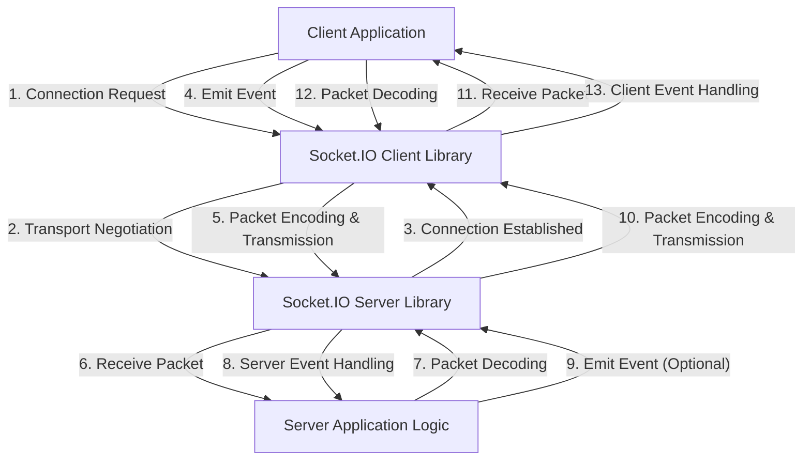

## Project Design Document: Socket.IO (Improved)

**1. Introduction**

This document provides an enhanced architectural design of the Socket.IO library. Socket.IO is a widely adopted open-source library facilitating real-time, bidirectional, and event-based communication between web clients and servers. This document aims to offer a clear and detailed understanding of its internal structure, functionalities, and data exchange processes. It serves as a foundational resource for subsequent threat modeling exercises. The design focuses on the core mechanisms of Socket.IO, informed by its codebase and official documentation.

**2. Goals and Objectives**

The primary objective of Socket.IO is to streamline the development of real-time web applications by offering a unified and dependable API for bidirectional communication. Key goals include:

*   **Transport Abstraction:** To provide a consistent programming interface that hides the complexities of underlying transport protocols (e.g., WebSockets, HTTP long-polling, etc.).
*   **Communication Reliability:** To offer features such as automatic reconnection attempts and message buffering to gracefully handle network interruptions.
*   **Event-Driven Paradigm:** To enable communication through the emission and handling of explicitly named events.
*   **Scalability Support:** To facilitate scaling to accommodate a large number of concurrent client connections.
*   **Logical Grouping (Rooms):** To provide mechanisms for organizing clients into logical groups (referred to as "rooms") for targeted message delivery.
*   **Communication Isolation (Namespaces):** To allow the creation of isolated communication channels within a single shared connection.

**3. High-Level Architecture**

The Socket.IO architecture comprises two fundamental components: the client-side library and the server-side library. These components collaborate to establish and maintain persistent, real-time connections.

**4. Detailed Component Descriptions**

*   **Client-Side Components:**
    *   **Client Application (Web Browser or Native App):** The application running on the user's device that leverages the Socket.IO client library to enable real-time communication features. It interacts with the library to initiate connections, emit custom events, and process incoming events from the server.
    *   **Socket.IO Client Library (JavaScript):** This library is integrated into the client-side application. Its core responsibilities are:
        *   **Connection Lifecycle Management:**  Initiating, maintaining, and re-establishing connections with the Socket.IO server, including handling disconnection and automatic reconnection attempts.
        *   **Transport Negotiation and Management:**  Automatically negotiating the optimal transport mechanism with the server (e.g., prioritizing WebSockets, falling back to HTTP long-polling if necessary) and managing the chosen transport.
        *   **Packet Encoding and Decoding:**  Serializing and deserializing messages into a standardized packet format suitable for transmission over the network.
        *   **Event Emission API:**  Providing a user-friendly API to emit named application-specific events with associated data to the server.
        *   **Event Handling API:**  Providing a mechanism to register listeners for specific events received from the server and execute associated callback functions.
        *   **Message Buffering:**  Temporarily storing outgoing messages when the connection is temporarily interrupted and automatically sending them upon reconnection.

*   **Server-Side Components:**
    *   **Server Application (Node.js):** The backend application, typically built using Node.js, that incorporates the Socket.IO server library to handle incoming client connections and manage real-time communication logic.
    *   **Socket.IO Server Library (Node.js):** This library is integrated into the server-side application. Its key responsibilities include:
        *   **Connection Acceptance and Management:**  Accepting incoming connection requests from clients and managing the lifecycle of each individual connection.
        *   **Transport Handling:**  Supporting and managing various transport mechanisms, adapting to the client's capabilities and network conditions.
        *   **Packet Encoding and Decoding:**  Serializing and deserializing messages received from clients into a usable format.
        *   **Event Emission API:**  Providing an API to emit named application-specific events to individual clients, groups of clients (rooms), or all connected clients.
        *   **Event Handling API:**  Providing a mechanism to register listeners for specific events received from clients and execute associated logic.
        *   **Room Management:**  Providing functionality to create, manage, and destroy rooms, allowing clients to join and leave these logical groups for targeted message broadcasting.
        *   **Namespace Management:**  Providing the ability to create isolated communication channels (namespaces) within a single physical connection, allowing for better organization and separation of concerns.
        *   **Adapter Interface:** An abstraction layer that facilitates the distribution of messages and management of connection state across multiple server instances in a horizontally scaled environment. Common implementations include:
            *   **In-Memory Adapter:** The default adapter, suitable for single-server deployments.
            *   **Redis Adapter:**  Utilizes Redis as a message broker to enable communication between multiple Socket.IO server instances.
            *   **Other Adapters:** Support for other message brokers or distributed systems can be implemented.

**5. Data Flow**

The typical flow of data within a Socket.IO application involves these steps:

1. **Client Initiates Connection:** The client application uses the Socket.IO client library to initiate a connection to the Socket.IO server's endpoint.
2. **Transport Negotiation:** The client and server engage in a negotiation process to determine the most suitable transport mechanism. This typically starts with an attempt to establish a WebSocket connection and falls back to other transports like HTTP long-polling if WebSockets are not available or fail.
3. **Connection Establishment:** A persistent, bidirectional connection is established between the client and the server using the agreed-upon transport.
4. **Client Emits Event:** The client application utilizes the Socket.IO client library's `emit` function to send a named event along with associated data to the server.
5. **Packet Encoding and Transmission (Client to Server):** The client library encodes the event name and data into a structured packet and transmits it to the server over the active transport connection.
6. **Server Receives Packet:** The Socket.IO server library receives the incoming packet from the client.
7. **Packet Decoding:** The server library decodes the packet to extract the event name and associated data.
8. **Server Event Handling:** The server-side application's event handler, registered for the received event name, is invoked, processing the received data.
9. **Server Emits Event (Optional):** The server application may process the received event and subsequently emit a new event, potentially targeted at the originating client, specific rooms, or all connected clients.
10. **Packet Encoding and Transmission (Server to Client(s)):** If the server emits an event, the server library encodes the event name and data into a packet and transmits it to the intended recipient(s) over their respective connections.
11. **Client Receives Packet:** The client's Socket.IO library receives the incoming packet from the server.
12. **Packet Decoding (Client):** The client library decodes the packet to extract the event name and data.
13. **Client Event Handling:** The client-side application's event handler, registered for the received event name, is invoked, processing the received data.

**6. Security Considerations**

This section outlines key security considerations relevant for threat modeling Socket.IO applications.

*   **Transport Layer Security:**
    *   **Encryption:** All communication should ideally occur over secure transports like WebSockets Secure (WSS) or HTTPS to ensure confidentiality and integrity of data in transit, protecting against eavesdropping and tampering.
    *   **Transport Downgrade Attacks:**  Care must be taken to prevent attackers from forcing the connection to use less secure transport mechanisms. Server-side configuration should enforce secure transports.

*   **Authentication and Authorization:**
    *   **Client Identification and Verification:** Robust mechanisms are essential to securely identify and authenticate clients connecting to the server. This might involve tokens, session IDs, or other authentication protocols.
    *   **Access Control and Permissions:**  Authorization mechanisms are crucial to control which clients have access to specific resources, can join particular rooms, or perform certain actions. This prevents unauthorized access and manipulation.

*   **Input Validation and Sanitization:**
    *   **Data Validation:** Both client and server applications must rigorously validate all data received through Socket.IO events to ensure it conforms to expected formats and constraints.
    *   **Data Sanitization:**  Data received from clients should be properly sanitized before being processed or stored to prevent injection attacks such as Cross-Site Scripting (XSS) and command injection vulnerabilities.

*   **Denial of Service (DoS) Prevention:**
    *   **Connection Rate Limiting:** Implement limits on the rate at which new connections can be established to prevent connection flooding attacks.
    *   **Message Rate Limiting:**  Limit the rate at which clients can send messages to prevent message flooding and resource exhaustion on the server.
    *   **Message Size Limits:**  Impose restrictions on the maximum size of messages to prevent the server from being overwhelmed by excessively large payloads.

*   **Cross-Site Scripting (XSS) Mitigation:**
    *   **Output Encoding:** When displaying data received through Socket.IO in the client application, ensure proper output encoding is applied to prevent the execution of malicious scripts injected by attackers.

*   **Man-in-the-Middle (MITM) Attack Prevention:**
    *   Enforcing the use of secure transports (WSS/HTTPS) is the primary defense against MITM attacks, ensuring that communication is encrypted and authenticated.

*   **Dependency Management:**
    *   Regularly audit and update the Socket.IO library and all its dependencies to patch known security vulnerabilities and ensure the application is running on secure versions of its components.

**7. Deployment Considerations**

*   **Single Server Deployment:** In a basic setup, the Socket.IO server and the application logic reside on a single server instance. This is suitable for smaller applications or development environments.
*   **Load Balancing for Scalability:** For applications with a large number of concurrent connections, multiple Socket.IO server instances can be deployed behind a load balancer to distribute the workload.
*   **Sticky Sessions (Affinity):** When using a load balancer without a distributed adapter, sticky sessions are often required to ensure that events for a specific client are consistently routed to the same server instance, maintaining connection state. However, this can limit scalability and resilience.
*   **Horizontal Scaling with Adapters:** To achieve true horizontal scalability and resilience, using a Socket.IO adapter (like the Redis adapter) is recommended. This allows different server instances to communicate and share connection information, enabling messages to be broadcast across all connected clients regardless of which server they are connected to.
*   **Stateless Server Design:** Designing the application logic to be as stateless as possible can simplify scaling and improve resilience in a distributed environment.

**8. Assumptions and Constraints**

*   This design document focuses on the core architectural principles and common deployment patterns of Socket.IO. Specific implementation details and configurations may vary depending on the application's specific requirements.
*   The security considerations outlined are intended as a starting point for threat modeling and may need to be further expanded based on the application's specific threat landscape.
*   The deployment considerations are general guidelines and the optimal deployment strategy will depend on factors such as application scale, performance requirements, and infrastructure limitations.
*   It is assumed that the underlying network infrastructure provides a reasonable level of reliability and performance.

This improved design document provides a more detailed and structured understanding of Socket.IO's architecture, serving as a valuable resource for comprehensive threat modeling and security analysis.